# LLM Quantization Gallery

> **Auto-generated** from [`methods.yml`](methods.yml) by [`scripts/build_readme.py`](scripts/build_readme.py). **Do not edit this file directly.** To add or update an entry, edit `methods.yml` and run `python scripts/build_readme.py`.

A curated, visual, side-by-side reference for LLM quantization methods — every major algorithm, organized by category, with consistent fact sheets, architecture diagrams, and cross-references. Modeled after Sebastian Raschka's [llm-architecture-gallery](https://github.com/rasbt/llm-architecture-gallery).

Before reading the cards, see **[docs/notation.md](docs/notation.md)** for the `W4A16`, `W8A8KV4`, group-size, and per-channel notation used everywhere. See **[docs/glossary.md](docs/glossary.md)** for term definitions.

## Table of Contents

- [Post-Training Quantization — Weight-Only](#post-training-quantization--weight-only) — 21 methods
- [Post-Training Quantization — Weights + Activations](#post-training-quantization--weights-+-activations) — 17 methods
- [Quantization-Aware Training & Quantized Fine-Tuning](#quantization-aware-training--quantized-fine-tuning) — 10 methods
- [Extreme Low-Bit & Binary/Ternary Quantization](#extreme-low-bit--binaryternary-quantization) — 8 methods
- [KV-Cache Quantization](#kv-cache-quantization) — 11 methods
- [Low-Precision Training & Numerical Formats](#low-precision-training--numerical-formats) — 4 methods
- [MoE-Specific Quantization](#moe-specific-quantization) — 2 methods
- [Systems, Kernels & Runtimes](#systems-kernels--runtimes) — 8 methods
- [Full Method Matrix](#full-method-matrix) — 81 total
- [Lineage Graph](#lineage-graph)

## Full Method Matrix

Every method in one table. Sort by any column. Linked IDs jump to the full card.

| ID | Category | Year | W-bits | A-bits | KV-bits | Calibration? | Training? | Paper |
|----|----------|------|--------|--------|---------|-------------|-----------|-------|
| [affine-quant](#affine-quant) | PTQ W+A | 2024 | 4 | 8 | — | yes | no | [paper](https://arxiv.org/abs/2403.16379) |
| [apiq](#apiq) | QAT / QFT | 2024 | 2 | 16 | — | yes | yes | [paper](https://arxiv.org/abs/2402.05898) |
| [aqlm](#aqlm) | PTQ W-only | 2024 | 2 | 16 | — | yes | no | [paper](https://arxiv.org/abs/2401.06118) |
| [atom](#atom) | PTQ W+A | 2023 | 4 | 4 | — | yes | no | [paper](https://arxiv.org/abs/2310.19102) |
| [autoawq](#autoawq) | Systems | 2023 | 4 | 16 | — | yes | no | — |
| [autogptq](#autogptq) | Systems | 2023 | 4/W3/W2 | 16 | — | yes | no | — |
| [autoround](#autoround) | PTQ W-only | 2023 | 4 | 16 | — | yes | no | [paper](https://arxiv.org/abs/2309.05516) |
| [awq](#awq) | PTQ W-only | 2023 | 4 | 16 | — | yes | no | [paper](https://arxiv.org/abs/2306.00978) |
| [billm](#billm) | Sub-2-bit | 2024 | 1 | 16 | — | yes | no | [paper](https://arxiv.org/abs/2402.04291) |
| [bitdistiller](#bitdistiller) | QAT / QFT | 2024 | 2/W3 | 16 | — | no | yes | [paper](https://arxiv.org/abs/2402.10631) |
| [bitnet](#bitnet) | Sub-2-bit | 2023 | 1 | 8 | — | no | yes | [paper](https://arxiv.org/abs/2310.11453) |
| [bitnet-2b4t](#bitnet-2b4t) | Sub-2-bit | 2025 | 1.58 | 8 | — | no | yes | [paper](https://arxiv.org/abs/2504.01234) |
| [bitnet-b158](#bitnet-b158) | Sub-2-bit | 2024 | 1.58 | 8 | — | no | yes | [paper](https://arxiv.org/abs/2402.17764) |
| [bitsandbytes](#bitsandbytes) | Systems | 2022 | 8 | 8 | — | no | no | [paper](https://arxiv.org/abs/2208.07339) |
| [bitsandbytes-nf4](#bitsandbytes-nf4) | PTQ W-only | 2023 | 4 | 16 | — | no | no | [paper](https://arxiv.org/abs/2305.14314) |
| [coupled-quant](#coupled-quant) | KV Quant | 2024 | 16 | 16 | 1 | no | no | [paper](https://arxiv.org/abs/2402.11535) |
| [deepseek-fp8](#deepseek-fp8) | LP Training | 2024 | ARD | — | — | no | yes | [paper](https://arxiv.org/abs/2412.19437) |
| [duquant](#duquant) | PTQ W+A | 2024 | 4 | 4 | — | yes | no | [paper](https://arxiv.org/abs/2406.01721) |
| [efficientqat](#efficientqat) | QAT / QFT | 2024 | 2/W4 | 16 | — | no | yes | [paper](https://arxiv.org/abs/2407.11062) |
| [exl2](#exl2) | PTQ W-only | 2023 | 2–W8 | 16 | — | yes | no | — |
| [exllamav2](#exllamav2) | Systems | 2023 | 2–W8 | 16 | — | yes | no | — |
| [flatquant](#flatquant) | PTQ W+A | 2024 | 4 | 4 | — | yes | no | [paper](https://arxiv.org/abs/2410.09426) |
| [fp6-llm](#fp6-llm) | PTQ W-only | 2024 | 6 | 16 | — | no | no | [paper](https://arxiv.org/abs/2401.14112) |
| [fp8-training](#fp8-training) | LP Training | 2022 | ARD | — | — | no | yes | [paper](https://arxiv.org/abs/2209.05433) |
| [gear](#gear) | KV Quant | 2024 | 16 | 16 | 4 | no | no | [paper](https://arxiv.org/abs/2403.05527) |
| [gguf-iquants](#gguf-iquants) | PTQ W-only | 2024 | 1/W2/W3/W4 | 16 | — | yes | no | — |
| [gguf-kquants](#gguf-kquants) | PTQ W-only | 2023 | 2/W3/W4/W5/W6 | 16 | — | no | no | — |
| [gptq](#gptq) | PTQ W-only | 2022 | 3/W4 | 16 | — | yes | no | [paper](https://arxiv.org/abs/2210.17323) |
| [hqq](#hqq) | PTQ W-only | 2023 | 2/W3/W4/W8 | 16 | — | no | no | — |
| [ir-qlora](#ir-qlora) | QAT / QFT | 2024 | 4 | 16 | — | no | yes | [paper](https://arxiv.org/abs/2402.05445) |
| [kivi](#kivi) | KV Quant | 2024 | 16 | 16 | 2 | no | no | [paper](https://arxiv.org/abs/2402.02750) |
| [kvquant](#kvquant) | KV Quant | 2024 | 16 | 16 | 4 | yes | no | [paper](https://arxiv.org/abs/2401.18079) |
| [llama-cpp](#llama-cpp) | Systems | 2023 | 2/W3/W4/W5/W6/W8 | 16 | — | no | no | — |
| [llm-int8](#llm-int8) | PTQ W+A | 2022 | 8 | 8 | — | no | no | [paper](https://arxiv.org/abs/2208.07339) |
| [llm-qat](#llm-qat) | QAT / QFT | 2023 | 4 | 8 | 4 | no | yes | [paper](https://arxiv.org/abs/2305.17888) |
| [loftq](#loftq) | QAT / QFT | 2023 | 4 | 16 | — | no | yes | [paper](https://arxiv.org/abs/2310.08659) |
| [marlin](#marlin) | PTQ W-only | 2024 | 4 | 16 | — | no | no | [paper](https://arxiv.org/abs/2408.11743) |
| [matmul-free](#matmul-free) | Sub-2-bit | 2024 | 1.58 | 8 | — | no | yes | [paper](https://arxiv.org/abs/2406.02528) |
| [mc-moe](#mc-moe) | MoE Quant | 2024 | 2/W4 | 16 | — | yes | no | [paper](https://arxiv.org/abs/2408.11813) |
| [mlc-llm](#mlc-llm) | Systems | 2023 | 4 | 16 | — | no | no | — |
| [moqe](#moqe) | MoE Quant | 2023 | 2/W4 | 16 | — | yes | no | [paper](https://arxiv.org/abs/2310.02410) |
| [mx-formats](#mx-formats) | LP Training | 2023 | — | — | — | no | yes | [paper](https://arxiv.org/abs/2310.10537) |
| [nvfp4](#nvfp4) | LP Training | 2024 | EIGHTS | — | — | yes | no | — |
| [obq](#obq) | PTQ W-only | 2022 | 3/W4 | 16 | — | yes | no | [paper](https://arxiv.org/abs/2208.11580) |
| [obs](#obs) | PTQ W-only | 1993 | ORK; | — | — | yes | no | [paper](https://authors.library.caltech.edu/55952/1/Optimal%20Brain%20Surgeon.pdf) |
| [omniquant](#omniquant) | PTQ W-only | 2023 | 4 | 16 | — | yes | no | [paper](https://arxiv.org/abs/2308.13137) |
| [onebit](#onebit) | Sub-2-bit | 2024 | 1 | 16 | — | no | yes | [paper](https://arxiv.org/abs/2402.11295) |
| [outlier-suppression](#outlier-suppression) | PTQ W+A | 2022 | 8 | 8 | — | yes | no | [paper](https://arxiv.org/abs/2209.13325) |
| [outlier-suppression-plus](#outlier-suppression-plus) | PTQ W+A | 2023 | 8 | 8 | — | yes | no | [paper](https://arxiv.org/abs/2304.09145) |
| [owq](#owq) | PTQ W-only | 2023 | 3/W4 | 16 | — | yes | no | [paper](https://arxiv.org/abs/2306.02272) |
| [palu](#palu) | KV Quant | 2024 | 16 | 16 | — | yes | no | [paper](https://arxiv.org/abs/2407.21118) |
| [pb-llm](#pb-llm) | Sub-2-bit | 2023 | ~1–2 | 16 | — | yes | no | [paper](https://arxiv.org/abs/2309.06085) |
| [peqa](#peqa) | QAT / QFT | 2023 | 4 | 16 | — | no | yes | [paper](https://arxiv.org/abs/2304.02384) |
| [pqcache](#pqcache) | KV Quant | 2024 | 16 | 16 | 2 | yes | no | [paper](https://arxiv.org/abs/2407.12820) |
| [pv-tuning](#pv-tuning) | QAT / QFT | 2024 | 2 | 16 | — | no | yes | [paper](https://arxiv.org/abs/2405.14852) |
| [qa-lora](#qa-lora) | QAT / QFT | 2023 | 4 | 16 | — | no | yes | [paper](https://arxiv.org/abs/2309.14717) |
| [qaq](#qaq) | KV Quant | 2024 | 16 | 16 | 2 | no | no | [paper](https://arxiv.org/abs/2403.04643) |
| [qllm](#qllm) | PTQ W+A | 2023 | 4 | 8 | — | yes | no | [paper](https://arxiv.org/abs/2310.08041) |
| [qlora](#qlora) | QAT / QFT | 2023 | 4 | 16 | — | no | yes | [paper](https://arxiv.org/abs/2305.14314) |
| [qserve](#qserve) | PTQ W+A | 2024 | 4 | 8 | 4 | yes | no | [paper](https://arxiv.org/abs/2405.04532) |
| [quant-llm](#quant-llm) | PTQ W-only | 2024 | 4/W6 | 16 | — | no | no | [paper](https://arxiv.org/abs/2405.08925) |
| [quarot](#quarot) | PTQ W+A | 2024 | 4 | 4 | 4 | no | no | [paper](https://arxiv.org/abs/2404.00456) |
| [quip](#quip) | PTQ W-only | 2023 | 2/W4 | 16 | — | yes | no | [paper](https://arxiv.org/abs/2307.13304) |
| [quip-sharp](#quip-sharp) | PTQ W-only | 2024 | 2/W3/W4 | 16 | — | yes | no | [paper](https://arxiv.org/abs/2402.04396) |
| [rptq](#rptq) | PTQ W+A | 2023 | 4 | 8 | — | yes | no | [paper](https://arxiv.org/abs/2304.01089) |
| [rtn](#rtn) | PTQ W-only | unknown | 4 | 16 | — | no | no | — |
| [sglang-quant](#sglang-quant) | Systems | 2024 | 4 | 16 | — | no | no | [paper](https://arxiv.org/abs/2312.07104) |
| [skvq](#skvq) | KV Quant | 2024 | 16 | 16 | 2 | no | no | [paper](https://arxiv.org/abs/2405.06484) |
| [smoothquant](#smoothquant) | PTQ W+A | 2022 | 8 | 8 | — | yes | no | [paper](https://arxiv.org/abs/2211.10438) |
| [spectra](#spectra) | Sub-2-bit | 2024 | 1.58 | 8 | — | no | yes | [paper](https://arxiv.org/abs/2407.12327) |
| [spinquant](#spinquant) | PTQ W+A | 2024 | 4 | 8 | — | yes | no | [paper](https://arxiv.org/abs/2405.16406) |
| [spqr](#spqr) | PTQ W-only | 2023 | 3/W4 | 16 | — | yes | no | [paper](https://arxiv.org/abs/2306.03078) |
| [squeezellm](#squeezellm) | PTQ W-only | 2023 | 4 | 16 | — | yes | no | [paper](https://arxiv.org/abs/2306.07629) |
| [think](#think) | KV Quant | 2024 | 16 | 16 | 4 | no | no | [paper](https://arxiv.org/abs/2407.21018) |
| [vllm-quant](#vllm-quant) | Systems | 2023 | 4 | 16 | — | no | no | [paper](https://arxiv.org/abs/2309.06180) |
| [wkvquant](#wkvquant) | KV Quant | 2024 | 4 | 16 | 4 | yes | no | [paper](https://arxiv.org/abs/2402.12065) |
| [zeroquant](#zeroquant) | PTQ W+A | 2022 | 8 | 8 | — | yes | no | [paper](https://arxiv.org/abs/2206.01861) |
| [zeroquant-4plus2](#zeroquant-4plus2) | PTQ W+A | 2023 | 4+W6 | 8 | — | yes | no | [paper](https://arxiv.org/abs/2312.08583) |
| [zeroquant-fp](#zeroquant-fp) | PTQ W+A | 2023 | 4 | 8 | — | yes | no | [paper](https://arxiv.org/abs/2307.09782) |
| [zeroquant-v2](#zeroquant-v2) | PTQ W+A | 2023 | 4/W8 | 8 | — | yes | no | [paper](https://arxiv.org/abs/2303.08302) |
| [zipcache](#zipcache) | KV Quant | 2024 | 16 | 16 | 4 | no | no | [paper](https://arxiv.org/abs/2405.14256) |

---

## Post-Training Quantization — Weight-Only

These methods quantize only the weight tensors; activations remain in FP16/BF16. This avoids the challenge of activation outliers and is sufficient for memory-bound inference (most single-GPU LLM serving). The dominant category for open-weight model releases.

### Marlin · W4A16 (INT4), W4A8 (INT4 weight, FP8 activation) · PTQ W-only · 2024-08 {#marlin}

<em>Marlin warp layout: prefetch → dequantize → tensor-core accumulate, all pipelined.</em>

> Marlin is a high-performance CUDA kernel library for W4A16 and W4A8 grouped-quantized matrix multiplication on NVIDIA GPUs. For a transformer layer serving a single token (decode phase), the bottleneck is memory bandwidth: loading the 4-bit weight matrix. Marlin achieves close to the theoretical memory bandwidth limit of A100/H100 by carefully designing warp layouts, prefetching patterns, and the FP16 dequantization pipeline to overlap computation with memory loads. It is integrated into vLLM, TRT-LLM, and SGLang.

| Field | Value |
|-------|-------|
| Paper | [2408.11743](https://arxiv.org/abs/2408.11743) |
| Code | [IST-DASLab/marlin](https://github.com/IST-DASLab/marlin) |
| Precision | W4A16 (INT4), W4A8 (INT4 weight, FP8 activation) |
| Granularity | per-group, g=128 |
| Calibration | n/a (inference kernel) |
| Symmetric? | asymmetric |
| Outlier handling | n/a |
| Hardware target | NVIDIA A100/H100 (Ampere/Hopper); achieves near-theoretical memory bandwidth |
| Training needed? | no |
| Calibration data? | no |
| Typical degradation | n/a — kernel, not algorithm |
| Builds on | [gptq](#gptq) · [awq](#awq) |
| Related | [exl2](#exl2) · [awq](#awq) · [gptq](#gptq) |

**How it works:**

Marlin's kernel decomposes the matmul into tiles processed by persistent warps. Each warp prefetches the next tile of INT4 weights from global memory while the previous tile's FP16 dequantization and tensor-core accumulation runs in parallel. The dequantization (unpack INT4 → FP16 using the per-group scale) is fused into the memory pipeline so it adds no latency. A careful warp layout avoids shared-memory bank conflicts. The result is ~3.7× speedup over FP16 matmul for batch=1 decode on A100, matching the theoretical 4× reduction in memory traffic.

---

### QuaRot / Quant-LLM (FP6) · W4/W6 A16 · PTQ W-only · 2024-05 {#quant-llm}

<em>Mixed FP6/INT4 per-layer assignment with speculative decoding compensation.</em>

> Quant-LLM explores mixed-precision serving that pairs FP6 weight quantization with token-level speculative decoding. Latency-sensitive layers get W6A16 (FP6 weights) for high quality, while less sensitive layers get W4A16. Speculative decoding with a small draft model compensates for the quality gap of the lower-precision layers. This co-design approach targets serving throughput rather than the quantization algorithm itself.

| Field | Value |
|-------|-------|
| Paper | [2405.08925](https://arxiv.org/abs/2405.08925) |
| Precision | W4/W6 A16 |
| Granularity | per-group |
| Calibration | none |
| Symmetric? | symmetric |
| Outlier handling | floating-point format; speculative decoding for mixed-bit layers |
| Hardware target | GPU |
| Training needed? | no |
| Calibration data? | no |
| Typical degradation | competitive with GPTQ at same effective bit-width |
| Builds on | [fp6-llm](#fp6-llm) · [gptq](#gptq) |
| Related | [fp6-llm](#fp6-llm) · [awq](#awq) · [marlin](#marlin) |

**How it works:**

Quant-LLM assigns FP6 quantization to the first and last layers of the transformer (which are most sensitive to quantization error) and INT4 to the middle layers. The FP6 layers use the TC-FPx kernel from FP6-LLM for efficient dequantization. Token-level speculative decoding (accepting draft tokens only when the draft quality is high) partially masks the perplexity gap from lower-precision layers. The net result is higher serving throughput per GPU at near-equivalent quality vs. uniform FP16 or W4A16.

---

### QuIP# · W2/W3/W4 A16 · PTQ W-only · 2024-02 {#quip-sharp}

<em>Hadamard incoherence + E8 lattice vector quantization for 2-bit PTQ.</em>

> QuIP# extends QuIP with two key improvements: replacing random orthogonal rotations with Hadamard matrices (which are fast to compute and hardware-friendly), and replacing scalar uniform quantization with vector quantization using the E8 lattice codebook. The E8 lattice is the densest known 8-dimensional integer lattice; using it as a codebook allows more efficient representation of 8 values simultaneously than 8 independent scalar quantizations. Together, these make QuIP# the best-known 2-bit PTQ method as of 2024, achieving near-FP16 perplexity at 2 bits on LLaMA-2 scale.

| Field | Value |
|-------|-------|
| Paper | [2402.04396](https://arxiv.org/abs/2402.04396) · NeurIPS 2024 |
| Code | [Cornell-RelaxML/quip-sharp](https://github.com/Cornell-RelaxML/quip-sharp) |
| Precision | W2/W3/W4 A16 |
| Granularity | per 8-element block (E8 lattice) |
| Calibration | calibration set |
| Symmetric? | symmetric |
| Outlier handling | Hadamard incoherence + E8 lattice vector quantization |
| Hardware target | GPU (custom CUDA kernels for E8 decode) |
| Training needed? | no |
| Calibration data? | yes |
| Typical degradation | 2-bit LLaMA-2-7B approaches full-precision quality; best known 2-bit PTQ |
| Builds on | [quip](#quip) · [gptq](#gptq) |
| Related | [aqlm](#aqlm) · [quip](#quip) · [quarot](#quarot) |

**How it works:**

Two innovations over QuIP: (1) Hadamard incoherence — using a randomized Hadamard transform H (with random sign flips) instead of dense random orthogonal matrices; Hadamard transforms are O(n log n) instead of O(n²) and can be fused with matrix multiplications. (2) E8 lattice codebooks — groups of 8 weights are jointly quantized to the nearest point in the E8 lattice (scaled by a per-group scale), achieving the theoretical lower bound on quantization error for nearly-Gaussian distributions in 8D. At 2 bits (E8P codebook, 2 bits/weight), ppl of LLaMA-2-7B on WikiText-2 drops to ~6.5 vs. FP16 ~5.5 — within 1 point.

---

### FP6-LLM · W6A16 · PTQ W-only · 2024-01 {#fp6-llm}

<em>TC-FPx kernel: bitpacked FP6 weights unpacked to FP16 inside Tensor Core matmul.</em>

> FP6-LLM makes 6-bit floating-point weight quantization practical on NVIDIA GPUs that have no native FP6 hardware support. The method packs FP6 weights (1 sign, 2 exponent, 3 mantissa bits) into standard GPU memory layouts and implements a GPU kernel (TC-FPx) that unpacks and converts FP6 to FP16 during the matrix multiplication, achieving near-FP16 throughput. The floating-point format's larger dynamic range compared to INT6 means FP6 requires less clipping, which is important for LLM weights with outlier channels.

| Field | Value |
|-------|-------|
| Paper | [2401.14112](https://arxiv.org/abs/2401.14112) · USENIX ATC 2024 |
| Code | [usyd-fsalab/fp6_llm](https://github.com/usyd-fsalab/fp6_llm) |
| Precision | W6A16 |
| Granularity | per-group |
| Calibration | none (RTN-style) or small set |
| Symmetric? | symmetric |
| Outlier handling | floating-point format has larger dynamic range than INT6 |
| Hardware target | NVIDIA GPU (A100/H100); custom SIMT bitmanipulation kernels |
| Training needed? | no |
| Calibration data? | no |
| Typical degradation | minimal at 6-bit; better perplexity than INT6 RTN at same storage |
| Builds on | [rtn](#rtn) |
| Related | [awq](#awq) · [gptq](#gptq) · [marlin](#marlin) |

**How it works:**

The core contribution is a CUDA kernel strategy called TC-FPx that enables arbitrary bit-width (e.g. FP6) matrix multiplications on Tensor Cores without native hardware support. Weights are stored in a bitpacked format; during matmul, each FP6 weight is unpacked and up-cast to FP16 in registers before multiplication, leveraging the GPU's native FP16 Tensor Cores. The unpacking is done in SIMT warps in a way that is bandwidth-efficient and avoids branching. At 6 bits, floating-point representation outperforms integer (INT6) because the non-uniform grid better fits the near-Gaussian weight distributions of large LLMs.

---

### AQLM · W2 A16 (avg ~2 bits) · PTQ W-only · 2024-01 {#aqlm}

<em>Additive multi-codebook quantization: 8 weights = 2 index lookups.</em>

> AQLM applies additive quantization (from the image/audio compression literature) to LLM weights. Each group of 8 weights is represented as a sum of M codebook entries (M=1 or 2 in practice), where each codebook has 2^b entries. With M=2 codebooks of 256 entries each, 8 weights are stored as 2 bytes of indices plus the shared codebooks, achieving approximately 2 bits per weight. Learned via a beam-search optimization that jointly minimizes layer-wise reconstruction error, AQLM achieves state-of-the-art 2-bit quality among PTQ methods and outperforms QuIP# on several model families.

| Field | Value |
|-------|-------|
| Paper | [2401.06118](https://arxiv.org/abs/2401.06118) · ICML 2024 |
| Code | [Vahe1994/AQLM](https://github.com/Vahe1994/AQLM) |
| Precision | W2 A16 (avg ~2 bits) |
| Granularity | per 8-weight group via additive codebook |
| Calibration | calibration set for codebook learning (beam search) |
| Symmetric? | n/a (codebook-based) |
| Outlier handling | multi-codebook additive representation absorbs all magnitudes |
| Hardware target | GPU (custom CUDA kernel for codebook decode) |
| Training needed? | no |
| Calibration data? | yes |
| Typical degradation | LLaMA-2-7B at 2 bits: ~6.7 ppl vs 5.5 FP16 — best among 2-bit PTQ at time of release |
| Builds on | [gptq](#gptq) · [obq](#obq) |
| Related | [quip-sharp](#quip-sharp) · [squeezellm](#squeezellm) · [gptq](#gptq) |

**How it works:**

Each weight block w ∈ ℝ⁸ is approximated as ŵ = Σ_{m=1}^{M} C_m[i_m], where C_m are learned codebooks of shape (K, 8) and i_m is a learned integer index. With M=2, K=256: total bits = 2 × log₂(256) = 16 bits for 8 weights = 2 bits/weight. Codebooks are learned by alternating between fixing codes and updating codebooks (via least-squares) and fixing codebooks and updating codes (via beam search). The layer-wise reconstruction loss is minimized as in GPTQ. AQLM also supports a fine-tuning step to further close the gap with FP16.

---

### GGUF I-quants · W1/W2/W3/W4 A16 (fractional effective bits) · PTQ W-only · 2024-01 {#gguf-iquants}

<em>Importance-weighted lattice quantization: imatrix guides bit allocation per row.</em>

> I-quants are the "importance-aware" quantization formats in llama.cpp, superseding K-quants for quality at the same or lower bit-width. They require an "importance matrix" (imatrix) computed by running the model on a representative sample and recording the squared mean activation for each weight row. Weights in rows with high importance scores are quantized more carefully (or get more effective bits). The quantization grid itself uses lattice codebooks derived from the paper "Improved Lattice Quantization via Dual Quantization" rather than uniform linear scales, allowing non-uniform grids that fit the weight distributions better.

| Field | Value |
|-------|-------|
| Code | [ggerganov/llama.cpp](https://github.com/ggerganov/llama.cpp) |
| Blog / post | [link](https://github.com/ggerganov/llama.cpp/pull/4773) |
| Precision | W1/W2/W3/W4 A16 (fractional effective bits) |
| Granularity | per-group, variable sizes; importance matrix guided |
| Calibration | importance matrix (imatrix) from a representative dataset |
| Symmetric? | n/a (lattice codebook-based) |
| Outlier handling | importance-weighted lattice quantization; high-importance weights get more bits |
| Hardware target | CPU / GPU / Metal (llama.cpp) |
| Training needed? | no |
| Calibration data? | yes |
| Typical degradation | IQ4_XS at ~4.25 bits beats Q4_K_M; IQ2_XXS at ~2.06 bits is usable |
| Builds on | [gguf-kquants](#gguf-kquants) · [rtn](#rtn) |
| Related | [gguf-kquants](#gguf-kquants) · [aqlm](#aqlm) · [hqq](#hqq) |

**How it works:**

The imatrix records ‖x_j‖² per row j (the squared norm of input activations for each weight row), collected by one forward pass on a calibration corpus. At quantization time, rows with higher importance are assigned more bits or have their quantization refined more carefully. The quantization codebooks for sub-4-bit formats are lattice-based (derived from integer lattices), not simple uniform grids. IQ4_NL uses a "non-linear" 4-bit codebook derived from the NF4 quantile approach. Sub-3-bit formats (IQ2_*, IQ1_S) use group-wise lattice VQ with the imatrix weighting to preserve perplexity at extremely low bit rates.

---

### HQQ · W2/W3/W4/W8 A16 · PTQ W-only · 2023-11 {#hqq}

<em>Robust half-quadratic loss minimization for scale/zero-point — no calibration data needed.</em>

> HQQ finds optimal quantization parameters (scale and zero-point) by directly minimizing a robust loss between the original and quantized weights using half-quadratic optimization, without any calibration data. The half-quadratic penalty is a smoothed version of L1 that down-weights large residuals (outliers), making the scale/zp solution robust to weight outliers. Because it needs no activations, HQQ is significantly faster to run than GPTQ and can quantize a 70B model in under a minute on CPU. Quality is close to GPTQ at 4-bit and significantly better than RTN, especially at lower bits.

| Field | Value |
|-------|-------|
| Code | [mobiusml/hqq](https://github.com/mobiusml/hqq) |
| Blog / post | [link](https://mobiusml.github.io/hqq_blog/) |
| Precision | W2/W3/W4/W8 A16 |
| Granularity | per-group, g=64 (default) |
| Calibration | none — weights only |
| Symmetric? | asymmetric |
| Outlier handling | robust half-quadratic (Huber-like) loss minimization during scale/zp optimization |
| Hardware target | GPU; custom CUDA/Triton kernels for W4A16 and W2A16 |
| Training needed? | no |
| Calibration data? | no |
| Typical degradation | competitive with GPTQ at 4-bit; better than RTN at 3-bit |
| Builds on | [rtn](#rtn) |
| Related | [gptq](#gptq) · [awq](#awq) · [rtn](#rtn) |

**How it works:**

Standard RTN minimizes ‖W − Q(W)‖² w.r.t. the scale s and zero-point z, but this mean-squared loss is sensitive to outliers. HQQ instead solves: min_{s,z} Σ ρ(w_i − Q(w_i; s, z)) where ρ is a half-quadratic (Huber-like) penalty. This is solved by iterative half-quadratic optimization: alternating between a quadratic subproblem for s and z (given auxiliary variables) and an update of auxiliary variables (given s and z). The result is a set of quantization parameters that minimize the robust loss without requiring any calibration data.

---

### EXL2 · W2–W8 A16 (mixed per-row, target average bit-width) · PTQ W-only · 2023-10 {#exl2}

<em>EXL2: each weight matrix row assigned a different bit-width by Hessian importance.</em>

> EXL2 is the quantization format native to the ExLlamaV2 inference engine. It extends GPTQ's approach with per-row bit-width assignment: different rows (output channels) of each weight matrix are quantized to different bit-widths (2–8), with the assignment determined by row-level Hessian importance. A target average bits-per-weight is specified, and the quantizer greedily assigns more bits to rows that suffer more from quantization. This makes EXL2 a "smooth" format — any target bpw from 2.0 to 8.0 in 0.05 steps is achievable, rather than the discrete jumps of W3/W4/W5.

| Field | Value |
|-------|-------|
| Code | [turboderp/exllamav2](https://github.com/turboderp/exllamav2) |
| Blog / post | [link](https://github.com/turboderp/exllamav2/blob/master/doc/quant/exl2.md) |
| Precision | W2–W8 A16 (mixed per-row, target average bit-width) |
| Granularity | per-group, g=32–128; rows assigned different bit-widths |
| Calibration | calibration dataset for Hessian-based row importance |
| Symmetric? | asymmetric |
| Outlier handling | per-row bit-width assignment: important rows get more bits |
| Hardware target | NVIDIA GPU (ExLlamaV2 custom CUDA kernels) |
| Training needed? | no |
| Calibration data? | yes |
| Typical degradation | at 4.0 bpw: comparable to GPTQ 4-bit; at 3.0 bpw: better than GPTQ 3-bit |
| Builds on | [gptq](#gptq) |
| Related | [gguf-kquants](#gguf-kquants) · [gptq](#gptq) · [marlin](#marlin) |

**How it works:**

EXL2 quantization proceeds in two passes: (1) compute per-row Hessian importance scores (using the squared input activation norms, as in GPTQ), then assign bit-widths row-by-row using a greedy algorithm that maximizes quality for a given average bpw budget; (2) quantize each row to its assigned bit-width using GPTQ-style column-by-column second-order updates. At inference, ExLlamaV2's custom CUDA kernel handles the heterogeneous row precisions in a single kernel call, using a compact header per row that specifies its bit-width and group size. The result is smooth quality-vs-compression tradeoffs unavailable in fixed-format schemes.

---

### AutoRound · W4A16 · PTQ W-only · 2023-09 {#autoround}

<em>Sign gradient descent optimizes rounding direction per weight jointly within each block.</em>

> AutoRound improves on GPTQ's rounding decisions by framing quantization as a block-wise sign-gradient descent problem rather than an analytic second-order update. Each weight's rounding direction (floor vs. ceil) is treated as a binary decision variable, and these decisions are optimized jointly within each block by computing sign gradients of the block reconstruction loss. This allows AutoRound to find better rounding patterns than the greedy column-by-column approach of GPTQ, without requiring more memory than a calibration forward pass.

| Field | Value |
|-------|-------|
| Paper | [2309.05516](https://arxiv.org/abs/2309.05516) |
| Code | [intel/auto-round](https://github.com/intel/auto-round) |
| Precision | W4A16 |
| Granularity | per-group, g=128 |
| Calibration | 512 sequences × 2048 tokens |
| Symmetric? | asymmetric |
| Outlier handling | sign gradient descent for rounding decisions (not just round-to-nearest) |
| Hardware target | GPU / Intel hardware |
| Training needed? | no |
| Calibration data? | yes |
| Typical degradation | close to or better than GPTQ at 4-bit on most benchmarks |
| Builds on | [gptq](#gptq) · [rtn](#rtn) |
| Related | [gptq](#gptq) · [awq](#awq) · [omniquant](#omniquant) |

**How it works:**

AutoRound uses Signed Gradient Descent (SignSGD) to optimize rounding decisions. Starting from RTN as initialization, for each block AutoRound iteratively updates the rounding offsets Δ_ij ∈ {0, 1} (floor or ceil) according to: Δ ← clip(Δ − lr · sign(∇_Δ ‖ f(X; W) − f(X; W̃) ‖²), 0, 1). This is run for a fixed number of iterations (200 by default) per block. Unlike GPTQ which processes columns sequentially, AutoRound treats the block jointly. The resulting rounding patterns tend to be more balanced, especially at 4-bit.

---

### OmniQuant · W4A16 (weight-only mode); W4A8, W6A6 (W+A mode) · PTQ W-only · 2023-08 {#omniquant}

<em>Learnable clipping range and equivalent transformation, optimized by backprop through frozen weights.</em>

> OmniQuant optimizes quantization parameters (clipping range, scale, zero-point) directly through gradient descent on a block-wise reconstruction loss, rather than computing them analytically from statistics. The learnable clipping approach (LWC) allows the clipping range to adapt to the actual distribution, trading off more clips against smaller scale. A learnable equivalent transformation (LET) handles the activation quantization case by absorbing a channel-wise scale into the preceding layer (analogous to SmoothQuant but with learned parameters). Both weight-only and weight+activation modes are supported.

| Field | Value |
|-------|-------|
| Paper | [2308.13137](https://arxiv.org/abs/2308.13137) · ICLR 2024 |
| Code | [OpenGVLab/OmniQuant](https://github.com/OpenGVLab/OmniQuant) |
| Precision | W4A16 (weight-only mode); W4A8, W6A6 (W+A mode) |
| Granularity | per-channel or per-group |
| Calibration | small calibration set; learnable clipping via block-wise optimization |
| Symmetric? | asymmetric |
| Outlier handling | learnable weight clipping (LWC) + learnable equivalent transformation (LET) |
| Hardware target | GPU |
| Training needed? | no |
| Calibration data? | yes |
| Typical degradation | < 0.3 ppl at W4A16 LLaMA-7B; competitive at W4A8 |
| Builds on | [gptq](#gptq) · [smoothquant](#smoothquant) |
| Related | [gptq](#gptq) · [awq](#awq) · [smoothquant](#smoothquant) |

**How it works:**

OmniQuant frames quantization as an optimization problem: given a block of transformer layers, find quantization parameters θ = {s, z, α_clip} that minimize the block's reconstruction loss ‖ f(X; W) − f(X; Q(W; θ)) ‖² where X is a calibration batch. Only θ is updated; the original weights W are frozen. The LWC component learns the clipping factor α per tensor, and the LET component learns per-channel scale factors that are absorbed into preceding linear or LayerNorm weights. Optimization runs for ~20 minutes on a 7B model with a small calibration set.

---

### GGUF K-quants · W2/W3/W4/W5/W6 A16 · PTQ W-only · 2023-08 {#gguf-kquants}

<em>Hierarchical two-level K-quant: inner-block scales quantized relative to a FP16 super-block scale.</em>

> The K-quant formats in llama.cpp use a two-level hierarchical quantization scheme. A super-block of 256 weights contains several inner blocks of 16–32 weights each. Each inner block has its own low-precision scale (quantized), while the super-block stores the dequantization scale for those inner-block scales in a higher precision. Different K-quant variants (Q2_K, Q3_K, Q4_K_S, Q4_K_M, Q5_K, Q6_K) differ in the number of bits for both the weights and the block scales, and optionally assign higher precision to specific layers (e.g. attention layers in _M variants).

| Field | Value |
|-------|-------|
| Code | [ggerganov/llama.cpp](https://github.com/ggerganov/llama.cpp) |
| Blog / post | [link](https://github.com/ggerganov/llama.cpp/pull/1684) |
| Precision | W2/W3/W4/W5/W6 A16 |
| Granularity | super-block of 256 weights; inner blocks of 16–32 weights |
| Calibration | none |
| Symmetric? | mixed (super-block scale symmetric; inner block scales asymmetric) |
| Outlier handling | hierarchical two-level scaling with higher-bit super-block scale |
| Hardware target | CPU / GPU / Metal (llama.cpp) |
| Training needed? | no |
| Calibration data? | no |
| Typical degradation | Q4_K_M: < 0.5 ppl vs FP16 on LLaMA-7B; Q2_K: ~2–4 ppl |
| Builds on | [rtn](#rtn) |
| Superseded by | [gguf-iquants](#gguf-iquants) |
| Related | [gguf-iquants](#gguf-iquants) · [hqq](#hqq) · [awq](#awq) |

**How it works:**

The hierarchy is: weights at b bits → inner-block scale at b' bits → super-block scale at FP16. For Q4_K_M: 4-bit weights, 6-bit inner-block scales (for every 32 weights), FP16 super-block scale (for every 256 weights), with attention output and feed-forward gate layers boosted to 6-bit. The _S suffix means "small" (uniform across layers); _M means "medium" (mixed layers). This two-level scheme amortizes the scale overhead and achieves better quality-per-byte than flat per-group quantization with the same group size.

---

### QuIP · W2/W4 A16 · PTQ W-only · 2023-07 {#quip}

<em>Random orthogonal rotation makes weights incoherent; uniform quantization then works at 2-bit.</em>

> QuIP is the first method to achieve practical 2-bit LLM quantization with theoretical guarantees. The key insight is "incoherence processing": by multiplying weights and calibration inputs by a random orthogonal matrix before quantization (and the inverse after), the weight distribution becomes nearly Gaussian with no outliers, allowing simple uniform quantization to work well even at 2 bits. The quality improvement is dramatic — 2-bit QuIP outperforms all prior 2-bit methods by a large margin.

| Field | Value |
|-------|-------|
| Paper | [2307.13304](https://arxiv.org/abs/2307.13304) · NeurIPS 2023 |
| Code | [jerry-chee/QuIP](https://github.com/jerry-chee/QuIP) |
| Precision | W2/W4 A16 |
| Granularity | per-group after rotation |
| Calibration | calibration set for Hessian and rotation |
| Symmetric? | symmetric |
| Outlier handling | random orthogonal pre/post-rotation to spread outliers uniformly |
| Hardware target | GPU (custom dequantization kernels needed for rotation) |
| Training needed? | no |
| Calibration data? | yes |
| Typical degradation | < 1 ppl at 2-bit LLaMA-2-7B vs. previous 2-bit methods (large improvement) |
| Builds on | [gptq](#gptq) · [obq](#obq) |
| Superseded by | [quip-sharp](#quip-sharp) |
| Related | [quip-sharp](#quip-sharp) · [quarot](#quarot) · [spinquant](#spinquant) · [gptq](#gptq) |

**How it works:**

The weight matrix W is transformed as W̃ = U W Vᵀ where U and V are random orthogonal matrices (pre- and post-multiplication). An orthogonal transformation doesn't change the Frobenius norm of the error, but it makes the error more uniform across entries, reducing the maximum individual error from O(√d) to O(1). This "incoherence" property allows uniform scalar quantization of W̃ to work well. At inference, inputs are also pre-multiplied by V and the output is post-multiplied by Uᵀ. QuIP also includes a greedy coordinate descent (LDLQ) step to further reduce quantization error.

---

### SqueezeLLM · W4 A16 (sparse overlay) · PTQ W-only · 2023-06 {#squeezellm}

<em>k-means non-uniform quantization + sensitivity-based sparse FP16 overlay.</em>

> SqueezeLLM uses the same dense-and-sparse decomposition strategy as SpQR but combines it with non-uniform (k-means) quantization for the dense part rather than uniform grid quantization. The most sensitive weights (by Fisher information / gradient covariance) are stored in a sparse FP16 matrix; the remaining weights are clustered using k-means, with each weight pointing to one of 2^b centroids stored in a look-up table. The non-uniform grid better captures the actual weight distribution, reducing error vs. uniform quantization at the same bit-width.

| Field | Value |
|-------|-------|
| Paper | [2306.07629](https://arxiv.org/abs/2306.07629) · ICML 2024 |
| Code | [SqueezeAILab/SqueezeLLM](https://github.com/SqueezeAILab/SqueezeLLM) |
| Precision | W4 A16 (sparse overlay) |
| Granularity | per-group (dense), unstructured sparse |
| Calibration | small calibration set for sensitivity |
| Symmetric? | asymmetric |
| Outlier handling | sensitivity-based sparse extraction + non-uniform k-means quantization |
| Hardware target | GPU; custom sparse-dense kernel |
| Training needed? | no |
| Calibration data? | yes |
| Typical degradation | < 0.1 ppl at 3-bit (LLaMA-7B vs FP16) with 0.45% sparse ratio |
| Builds on | [gptq](#gptq) · [rtn](#rtn) |
| Related | [spqr](#spqr) · [aqlm](#aqlm) · [owq](#owq) |

**How it works:**

Two components work together: (1) Sensitivity-guided sparse extraction — Fisher information S_ij = (∇_w L)² · f(H_ij) scores each weight; top-k% become sparse FP16. (2) Non-uniform k-means quantization of the dense remainder — instead of a linear scale, centroids are learned offline (2^b of them per group), and each weight is stored as a b-bit index into the centroid table. This is a form of scalar vector quantization. At inference, a custom CUDA kernel handles both the sparse lookup and the centroid dequantization in a single pass.

---

### SpQR · W3/W4 A16 (sparse overlay) · PTQ W-only · 2023-06 {#spqr}

<em>Sensitive weights kept as FP16 sparse; rest quantized to INT3/INT4.</em>

> SpQR combines dense grouped quantization with a sparse FP16 overlay for the most sensitive weights. For each weight group, the Hessian-based sensitivity is computed, and the top ~1% of weights with the highest sensitivity score are extracted and stored in a sparse FP16 format alongside the quantized dense block. This lets SpQR achieve near-lossless 3-bit compression: the bulk of weights go to 3 bits, while a tiny fraction stay in FP16. The dense part is compatible with standard GPTQ-style quantization.

| Field | Value |
|-------|-------|
| Paper | [2306.03078](https://arxiv.org/abs/2306.03078) · ICLR 2024 |
| Code | [Vahe1994/SpQR](https://github.com/Vahe1994/SpQR) |
| Precision | W3/W4 A16 (sparse overlay) |
| Granularity | per-group (dense part), unstructured sparse (sensitive weights) |
| Calibration | 128 sequences, calibration for Hessian estimation |
| Symmetric? | asymmetric |
| Outlier handling | sensitive weights stored as FP16 sparse; density ~1% of weights |
| Hardware target | GPU; requires sparse kernel support for the FP16 overlay |
| Training needed? | no |
| Calibration data? | yes |
| Typical degradation | < 1% relative perplexity increase at 3-bit on LLaMA-1-65B |
| Builds on | [gptq](#gptq) · [obq](#obq) |
| Related | [squeezellm](#squeezellm) · [owq](#owq) · [gptq](#gptq) |

**How it works:**

SpQR extends GPTQ with a hybrid representation: each weight w_ij is scored by its sensitivity |∂²L/∂w_ij²| = [H]_{ii} / N (column Hessian diagonal). Weights with sensitivity above a threshold are stored as (index, FP16 value) sparse pairs; the rest are quantized to low bit-width with per-group scales. At inference, the sparse FP16 overlay is added on top of the dequantized dense matmul result. The overhead of the sparse overlay is negligible at 1% density, but its impact on quality is large since it captures the most error-sensitive weights.

---

### OWQ · W3/W4 A16 (mixed) · PTQ W-only · 2023-06 {#owq}

<em>Hessian-ranked column selection: top columns stay FP16, rest go INT3/4.</em>

> OWQ identifies the weight columns whose quantization errors propagate most destructively to the output — those corresponding to large-magnitude activation channels — and keeps them in FP16, quantizing everything else to low bits. This is complementary to SpQR: OWQ works at the column level (keeping entire columns at FP16) rather than individual weight sensitivity. The column selection criterion is the Hessian diagonal [H]_jj (the squared input activation norm for column j), which captures how much quantizing column j would affect the output.

| Field | Value |
|-------|-------|
| Paper | [2306.02272](https://arxiv.org/abs/2306.02272) · AAAI 2024 |
| Code | [xvyaward/owq](https://github.com/xvyaward/owq) |
| Precision | W3/W4 A16 (mixed) |
| Granularity | per-column (most), per-weight FP16 for sensitive |
| Calibration | calibration set for Hessian column norms |
| Symmetric? | asymmetric |
| Outlier handling | Hessian-norm-ranked weight columns kept at FP16 (mixed precision) |
| Hardware target | GPU |
| Training needed? | no |
| Calibration data? | yes |
| Typical degradation | < 0.5 ppl at 3-bit LLaMA-7B with ~0.1% FP16 columns |
| Builds on | [gptq](#gptq) · [rtn](#rtn) |
| Related | [spqr](#spqr) · [gptq](#gptq) · [awq](#awq) |

**How it works:**

For each linear layer, compute the Hessian diagonal [H]_jj = E[x_j²] (mean squared activation for input channel j). Columns j with the largest [H]_jj values are the most sensitive; the top few percent are kept at FP16 while the rest are quantized to W3 or W4 with GPTQ-style second-order correction. A small number of FP16 columns (0.1–0.3%) provides a large quality recovery because the outlier channels (which exist in the same positions across all tokens for large LLMs) are fully preserved.

---

### AWQ · W4A16 · PTQ W-only · 2023-06 {#awq}

<em>Activation-magnitude-guided channel scaling before standard quantization.</em>

> AWQ observes that not all weight channels are equally important — channels corresponding to high-magnitude activation dimensions cause disproportionately large quantization error. The solution is to scale those channels up by their activation magnitude (making them harder to quantize individually but reducing their contribution to output error), then divide the corresponding activation by the same scale to preserve mathematical equivalence. The scale can be found analytically or by a fast grid search. AWQ requires no Hessian computation and no per-weight optimization: it is one forward calibration pass plus a scale computation, making it much faster than GPTQ.

| Field | Value |
|-------|-------|
| Paper | [2306.00978](https://arxiv.org/abs/2306.00978) · MLSys 2024 |
| Code | [mit-han-lab/llm-awq](https://github.com/mit-han-lab/llm-awq) |
| Precision | W4A16 |
| Granularity | per-group, g=128 |
| Calibration | small activation sample (no labels required) |
| Symmetric? | asymmetric |
| Outlier handling | activation-magnitude-guided per-channel weight scaling before quantization |
| Hardware target | GPU; TinyChat / AutoAWQ W4A16 kernels (CUDA, Metal) |
| Training needed? | no |
| Calibration data? | yes |
| Typical degradation | < 0.3 ppl on LLaMA-7B at 4-bit (WikiText-2) |
| Builds on | [rtn](#rtn) |
| Related | [gptq](#gptq) · [owq](#owq) · [spqr](#spqr) · [smoothquant](#smoothquant) |

**How it works:**

For each linear layer, AWQ observes per-channel activation magnitudes s̃j = mean(|Xj|) and computes a scale factor sj = s̃j^α, where α ∈ [0,1] balances the difficulty between weights and activations. The transformation W' = W · diag(s) is applied to weights (scale up salient columns), and the inverse diag(s)⁻¹ is absorbed into the preceding layer (scale down the activations). The scaled W' is then quantized with standard RTN. The α parameter is found by a lightweight grid search minimizing layer-wise reconstruction loss. Because the scale is absorbed offline, inference overhead is zero.

---

### NF4 / QLoRA · W4A16 (NF4) · PTQ W-only · 2023-05 {#bitsandbytes-nf4}

<em>NF4 quantile grid: 16 levels at Gaussian quantiles; double-quantized per-group scale.</em>

> The QLoRA paper introduced the NF4 (Normal Float 4-bit) data type: a 4-bit format whose quantization levels are spaced at the quantiles of the standard normal distribution, rather than linearly. Because pre-trained LLM weights are approximately normally distributed, NF4 achieves lower expected quantization error than uniform INT4 at the same bit-width. QLoRA also introduces "double quantization" (quantizing the per-group scales themselves to 8 bits) and paged optimizers to fit fine-tuning of 65B+ models into a single GPU. NF4 is implemented in bitsandbytes and is now the dominant format for memory-efficient inference of base models.

| Field | Value |
|-------|-------|
| Paper | [2305.14314](https://arxiv.org/abs/2305.14314) · NeurIPS 2023 |
| Code | [artidoro/qlora](https://github.com/artidoro/qlora) |
| Precision | W4A16 (NF4) |
| Granularity | per-group, g=64 (double quantization) |
| Calibration | none for quantization; LoRA adapters are trained separately |
| Symmetric? | n/a (non-uniform NF4 grid) |
| Outlier handling | NF4 quantile grid inherently handles Gaussian tails; double quantization for scales |
| Hardware target | GPU (bitsandbytes CUDA kernels) |
| Training needed? | no |
| Calibration data? | no |
| Typical degradation | < 0.5 ppl on LLaMA-7B; specifically designed to minimize quantization error for normally-distributed weights |
| Builds on | [rtn](#rtn) |
| Related | [gptq](#gptq) · [awq](#awq) · [hqq](#hqq) · [qlora](#qlora) |

**How it works:**

NF4 construction: given a standard normal distribution, compute the 16 quantiles q₀, q₁, ..., q₁₅ (including ±∞ boundaries). Normalize to [-1, 1]. These 16 values are the NF4 codebook. Quantize weight w as: round(w / s) → nearest NF4 code index (lookup table), where s = max(|W|) / max(NF4 codes). The quantiles are closer together near zero (where most weights concentrate) and farther at the tails, matching the Gaussian distribution's probability density. Double quantization: each per-group scale is itself stored as FP8 with a shared FP32 super-scale, saving an extra 0.125 bits/weight.

---

### GPTQ · W3/W4 A16 · PTQ W-only · 2022-10 {#gptq}

<em>Column-wise error compensation via inverse Hessian redistribution.</em>

> GPTQ processes each transformer layer independently, using an approximate inverse Hessian of the layer's input to compensate for quantization error column-by-column. Quantizing one column introduces a residual error, which is immediately redistributed to the remaining unquantized columns via an OBS-style update. A careful column-ordering and a precomputed Cholesky factorization of the Hessian make the whole thing tractable in minutes per layer. GPTQ produced the kernel ecosystem (Marlin, ExLlamaV2) that most 4-bit open-weight LLM inference runs on today, and was the first method to make sub-4-bit quality practical at LLaMA scale.

| Field | Value |
|-------|-------|
| Paper | [2210.17323](https://arxiv.org/abs/2210.17323) · ICLR 2023 |
| Code | [IST-DASLab/gptq](https://github.com/IST-DASLab/gptq) |
| Precision | W3/W4 A16 |
| Granularity | per-column (output), group size 128 typical |
| Calibration | 128 sequences × 2048 tokens, unlabeled |
| Symmetric? | asymmetric |
| Outlier handling | second-order (inverse Hessian) error compensation per column |
| Hardware target | GPU; Marlin / ExLlamaV2 W4A16 kernels for fast inference |
| Training needed? | no |
| Calibration data? | yes |
| Typical degradation | < 0.5 ppl on LLaMA-7B at 4-bit; ~1–2 ppl at 3-bit (WikiText-2) |
| Builds on | [obq](#obq) · [obs](#obs) |
| Related | [awq](#awq) · [spqr](#spqr) · [quip](#quip) · [owq](#owq) |

**How it works:**

For each linear layer, GPTQ estimates H = 2 X Xᵀ (the expected squared input) as a proxy for the layer-wise loss Hessian. It then processes weight columns left-to-right: quantize column q to b bits, compute the residual error δq = (wq − ŵq), and propagate it to all remaining columns as Δ W[:,q+1:] -= δq · (H⁻¹[q, q+1:] / H⁻¹[qq]). The inverse Hessian is maintained via a blocked Cholesky factorization for numerical stability and cache efficiency. This is a direct application of the OBS (Optimal Brain Surgeon) framework to PTQ, applied layer-by-layer without any gradient computation.

---

### OBQ · W3/W4 A16 · PTQ W-only · 2022-08 {#obq}

<em>Optimal Brain Surgeon applied per-weight with exact error propagation.</em>

> OBQ applies the Optimal Brain Surgeon (OBS) second-order framework to weight quantization: for each weight quantized, the residual quantization error is exactly absorbed by updating all remaining unquantized weights. This gives the theoretically best PTQ solution within a layer given an inverse Hessian, but is O(d³) per layer — impractical at LLM scale. GPTQ is a fast approximation of OBQ that sacrifices exact per-weight optimality for column-parallel processing, reducing complexity to O(d² × columns).

| Field | Value |
|-------|-------|
| Paper | [2208.11580](https://arxiv.org/abs/2208.11580) · NeurIPS 2022 |
| Code | [IST-DASLab/OBQ](https://github.com/IST-DASLab/OBQ) |
| Precision | W3/W4 A16 |
| Granularity | per-weight (unstructured) |
| Calibration | small calibration set |
| Symmetric? | asymmetric |
| Outlier handling | exact OBS second-order error propagation |
| Hardware target | CPU / GPU (no sparse kernel advantage without sparsity support) |
| Training needed? | no |
| Calibration data? | yes |
| Typical degradation | better than RTN at equal bit-width; slower than GPTQ |
| Builds on | [obs](#obs) |
| Superseded by | [gptq](#gptq) |
| Related | [gptq](#gptq) · [spqr](#spqr) |

**How it works:**

For each weight wq selected for quantization, the OBS update is: δ W = −(wq − Q(wq)) / [H⁻¹]qq × H⁻¹[q, :]. OBQ applies this exactly, in an order selected by minimum quantization error. The exact-order selection makes OBQ intractable at LLM scale (quadratic in the number of weights per row), but gives near-theoretical-optimal quality on small models.

---

### OBS · n/a (pruning framework; later adapted to quantization) · PTQ W-only · 1993-01 {#obs}

<em>OBS: second-order weight change formulation and exact Hessian-based compensation.</em>

> Optimal Brain Surgeon (OBS) is the classical second-order framework for weight pruning (and later, quantization). It computes, for each weight w_q, the increase in training loss from removing or changing that weight, using the full Hessian of the loss. After removing/changing weight q, OBS updates all remaining weights to minimize the resulting error: Δw = −(w_q / [H⁻¹]_qq) × H⁻¹[q, :]. This exact second-order compensation is the theoretical foundation for GPTQ, OBQ, and all subsequent Hessian-based quantization methods.

| Field | Value |
|-------|-------|
| Paper | [Optimal%20Brain%20Surgeon.pdf](https://authors.library.caltech.edu/55952/1/Optimal%20Brain%20Surgeon.pdf) · NeurIPS 1992 |
| Precision | n/a (pruning framework; later adapted to quantization) |
| Granularity | per-weight |
| Calibration | training data (Hessian computed during training) |
| Symmetric? | n/a |
| Outlier handling | second-order Taylor expansion; exact error propagation |
| Hardware target | n/a (algorithm, not LLM-specific) |
| Training needed? | no |
| Calibration data? | yes |
| Typical degradation | n/a |
| Related | [obq](#obq) · [gptq](#gptq) |

**How it works:**

For a network with loss L(w) ≈ L(w₀) + ½(w−w₀)^T H (w−w₀), removing weight w_q introduces error δL = w_q² / (2[H⁻¹]_qq). The optimal compensation update for the remaining weights is Δw = −(w_q / [H⁻¹]_qq) × H⁻¹[:, q]. OBS generalizes this to quantization: setting w_q to its quantized value ŵ_q (instead of zero) introduces error (w_q − ŵ_q)² / (2[H⁻¹]_qq), and the same Hessian update compensates. The key computational challenge is inverting H, which is O(d³) — the bottleneck that GPTQ and OBQ address with approximations.

---

### RTN · W4A16 · PTQ W-only · unknown {#rtn}

<em>Round-to-nearest: scale, round, clip — the universal baseline.</em>

> Round-to-nearest is the simplest possible quantization strategy: compute a linear scale from the weight range, divide each weight by that scale, round to the nearest integer, and clip to the representable range. It requires no data, no calibration, and no compute beyond a single pass over the weights. It is the universal baseline against which all other methods are measured. At 4-bit it typically degrades perplexity by 1–3 points on LLaMA-scale models, and at 3-bit or below it degrades rapidly. Every method in this gallery claims to beat RTN at the same bit-width.

| Field | Value |
|-------|-------|
| Precision | W4A16 |
| Granularity | per-channel or per-group (g=128 typical) |
| Calibration | none — weights only |
| Symmetric? | asymmetric |
| Outlier handling | none — no compensation mechanism |
| Hardware target | any (no custom kernels required) |
| Training needed? | no |
| Calibration data? | no |
| Typical degradation | ~1–3 ppl on LLaMA-7B at 4-bit; ~8–15 ppl at 3-bit (vs. FP16) |
| Superseded by | [gptq](#gptq) · [awq](#awq) · [hqq](#hqq) |
| Related | [gptq](#gptq) · [awq](#awq) · [owq](#owq) |

**How it works:**

Given a weight tensor W, compute s = (max(W) − min(W)) / (2^b − 1) for asymmetric quantization, then q = clip(round(W/s), 0, 2^b − 1). Dequantize as Ŵ = (q − z) × s. Granularity choices (per-tensor, per-channel, per-group) trade storage overhead for accuracy. Per-group with g=128 is the minimum quality bar for LLM deployment today.

---

---

## Post-Training Quantization — Weights + Activations

Quantizing both weights and activations enables integer matrix multiplication (W8A8 or W4A8), which is compute-bound-friendly and achieves higher throughput than W-only on GPU. The challenge is handling activation outliers without sacrificing accuracy.

### FlatQuant · W4A4 · PTQ W+A · 2024-10 {#flatquant}

<em>Per-layer learned affine transformations optimize weight/activation flatness for W4A4.</em>

> FlatQuant argues that the key property needed for good quantization is "flatness" of the post-transformation weight/activation landscape, not just outlier suppression. It learns per-layer linear transformations (not necessarily restricted to orthogonal matrices) that minimize a measure of quantization-induced flatness loss. The transformations are more expressive than pure rotations and are jointly optimized across weights and activations using a calibration-based gradient method, achieving state-of-the-art W4A4 results on LLaMA-2/3 families.

| Field | Value |
|-------|-------|
| Paper | [2410.09426](https://arxiv.org/abs/2410.09426) |
| Precision | W4A4 |
| Granularity | per-group (weights); per-token (activations) |
| Calibration | calibration set for per-layer rotation learning |
| Symmetric? | symmetric |
| Outlier handling | per-layer learned affine transformations that flatten the weight/activation landscape |
| Hardware target | GPU |
| Training needed? | no |
| Calibration data? | yes |
| Typical degradation | state-of-the-art W4A4 on LLaMA-2/3 as of late 2024 |
| Builds on | [quarot](#quarot) · [spinquant](#spinquant) · [omniquant](#omniquant) |
| Related | [quarot](#quarot) · [spinquant](#spinquant) · [duquant](#duquant) |

**How it works:**

For each layer, FlatQuant learns a pair of transformations (T_W, T_X) that approximately diagonalize the per-group weight and activation distributions — making the quantization error approximately independent across dimensions. The transformation includes a rotation component (enforced to be near-orthogonal via a regularizer) plus a learned channel-wise scaling. The overall transformation is more expressive than Hadamard or pure rotation. Optimization minimizes the block-wise reconstruction loss ‖ f(X; W) − f(T_X X; T_W W) ‖² using Adam on the transformation parameters while keeping model weights frozen.

---

### DuQuant · W4A4 · PTQ W+A · 2024-06 {#duquant}

<em>Dual rotation: channel Hadamard (spatial) + token-group rotation (temporal) for W4A4.</em>

> DuQuant extends the rotation-based quantization paradigm by applying two transformations instead of one: a channel-wise Hadamard rotation (like QuaRot) to handle outliers that persist in specific channels, followed by a block-diagonal rotation across tokens within each group to further smooth the activation distribution across the sequence dimension. The dual rotation is more expressive than a single rotation and can eliminate outliers that persist after a single Hadamard pass.

| Field | Value |
|-------|-------|
| Paper | [2406.01721](https://arxiv.org/abs/2406.01721) · NeurIPS 2024 |
| Precision | W4A4 |
| Granularity | per-group (weights); per-token (activations) |
| Calibration | calibration set |
| Symmetric? | symmetric |
| Outlier handling | dual rotation: Hadamard across channels + block-diagonal rotation across tokens |
| Hardware target | GPU |
| Training needed? | no |
| Calibration data? | yes |
| Typical degradation | better than QuaRot at W4A4; competitive with SpinQuant |
| Builds on | [quarot](#quarot) · [spinquant](#spinquant) |
| Related | [quarot](#quarot) · [spinquant](#spinquant) · [flatquant](#flatquant) |

**How it works:**

Two rotation stages: (1) A randomized block-diagonal Hadamard rotation H_c applied across channels per token — same as QuaRot, handles intra-token channel outliers. (2) A permutation + rotation H_t applied across a window of tokens within each activation group, smoothing out any temporal outliers that persist after step 1. The combination of channel-wise and token-wise rotations addresses both sources of activation non-uniformity. Both rotations are orthogonal and are absorbed into the preceding weight matrices offline. This dual approach reduces the post-rotation quantization error further than single-rotation methods.

---

### SpinQuant · W4A8 / W4A4 · PTQ W+A · 2024-05 {#spinquant}

<em>Learned rotation on Stiefel manifold minimizes post-rotation quantization error.</em>

> SpinQuant is the learned-rotation extension of QuaRot. Instead of using a fixed random Hadamard matrix, SpinQuant optimizes the rotation matrix R on the Stiefel manifold (the set of orthogonal matrices) to minimize the quantization error of the rotated activations. The optimization uses Cayley SGD — a manifold-aware gradient method for orthogonal matrices — and runs on a small calibration set. Because the rotation is learned to specifically minimize quantization error (rather than just spreading outliers randomly), SpinQuant consistently outperforms QuaRot at equal bit-widths.

| Field | Value |
|-------|-------|
| Paper | [2405.16406](https://arxiv.org/abs/2405.16406) · ICLR 2025 |
| Code | [facebookresearch/SpinQuant](https://github.com/facebookresearch/SpinQuant) |
| Precision | W4A8 / W4A4 |
| Granularity | per-group (weights); per-token (activations) |
| Calibration | small calibration set for rotation learning |
| Symmetric? | symmetric |
| Outlier handling | learned orthogonal rotation minimizes post-rotation quantization error |
| Hardware target | GPU (NVIDIA) |
| Training needed? | no |
| Calibration data? | yes |
| Typical degradation | outperforms QuaRot at W4A4 on LLaMA-2/3 by learning optimal rotation |
| Builds on | [quarot](#quarot) · [quip](#quip) |
| Related | [quarot](#quarot) · [duquant](#duquant) · [flatquant](#flatquant) |

**How it works:**

SpinQuant parameterizes the rotation as R ∈ O(d) (the orthogonal group) and minimizes E_x [ ‖ Q(RX) − RX ‖² ] over R, where Q is the quantizer and x is drawn from the calibration set. The gradient on the manifold is computed using the Riemannian gradient: ∇^{manifold}_R L = R (∇_R L - (∇_R L)^T R^T R) (Cayley SGD step). After learning R, the weight matrices are pre-rotated (offline) and quantized with GPTQ. At inference, activations are rotated by R before each layer. Hadamard matrices can be used to initialize R (as in QuaRot) and then refined by SpinQuant's optimization.

---

### QServe · W4A8KV4 · PTQ W+A · 2024-05 {#qserve}

<em>W4A8KV4 system: progressive INT4→INT8 dequant inside kernel; QoQ custom Tensor Core matmul.</em>

> QServe is a system co-design paper targeting W4A8KV4 quantization for throughput-optimized LLM serving. Weights are stored at INT4 (per-group), activations at INT8 (per-token with SmoothQuant-style migration), and the KV cache at INT4 (per-head). The key algorithmic contribution is "progressive quantization": a W4→W8 dequantization path that avoids the poor W4A8 INT4-Tensor-Core quality problem by performing the dequant inside the kernel. The system contribution is QoQ (Quarot-on-Quantized), an INT4 matrix multiplication kernel that achieves 3.5× throughput over FP16 on A100.

| Field | Value |
|-------|-------|
| Paper | [2405.04532](https://arxiv.org/abs/2405.04532) · NeurIPS 2024 |
| Code | [mit-han-lab/qserve](https://github.com/mit-han-lab/qserve) |
| Precision | W4A8KV4 |
| Granularity | per-group (W4, g=128); per-token (A8); per-head (KV4) |
| Calibration | small calibration set for weight quantization |
| Symmetric? | asymmetric |
| Outlier handling | progressive group quantization (W4A8 with activation smoothing); SmoothQuant-style migration |
| Hardware target | NVIDIA GPU (A100/H100); QoQ (Quarot-on-Quantized) custom INT4 Tensor Core kernels |
| Training needed? | no |
| Calibration data? | yes |
| Typical degradation | < 1 ppl at W4A8KV4 on LLaMA-2-7B/13B/70B; 1.2–3.5× serving speedup vs FP16 |
| Builds on | [smoothquant](#smoothquant) · [gptq](#gptq) · [quarot](#quarot) |
| Related | [atom](#atom) · [quarot](#quarot) · [marlin](#marlin) |

**How it works:**

QServe's "progressive quantization" solves the W4A8 quality problem: INT4 Tensor Cores require weights in INT4, but directly multiplying INT4 weights by INT8 activations produces poor results due to limited weight range. The solution: dequantize INT4 weights to INT8 inside the Tensor Core kernel (using the per-group scale stored in FP16 registers), then perform INT8 × INT8 matmul with INT32 accumulation. The KV cache is quantized to INT4 (per-head) with no quality loss using a rotation technique from QuaRot. The combined W4A8KV4 format yields 1.2× (LLaMA-2-70B) to 3.5× (LLaMA-2-7B) throughput improvement over FP16 serving on A100.

---

### QuaRot · W4A4 (with optional KV4) · PTQ W+A · 2024-04 {#quarot}

<em>Hadamard rotation equalizes activation magnitudes, enabling W4A4 without outlier handling.</em>

> QuaRot applies random Hadamard rotations to the weight and activation spaces of every linear layer in the transformer. A Hadamard rotation is orthogonal (preserves matrix products exactly) and has the effect of spreading activation outliers uniformly across all dimensions. After rotation, activations are nearly isotropic with no dominant outlier channels, making per-token INT4 quantization of activations feasible with minimal quality loss. Weights are correspondingly pre-rotated offline and then quantized. The result is practical W4A4 inference with quality close to W4A16 GPTQ.

| Field | Value |
|-------|-------|
| Paper | [2404.00456](https://arxiv.org/abs/2404.00456) · NeurIPS 2024 |
| Code | [spcl/QuaRot](https://github.com/spcl/QuaRot) |
| Precision | W4A4 (with optional KV4) |
| Granularity | per-group (weights, g=128); per-token (rotated activations) |
| Calibration | none for rotation; optionally GPTQ calibration for weight quantization |
| Symmetric? | symmetric |
| Outlier handling | random Hadamard rotation spreads outliers uniformly, eliminating per-channel outliers |
| Hardware target | NVIDIA GPU (INT4 Tensor Cores) |
| Training needed? | no |
| Calibration data? | no |
| Typical degradation | < 0.5 ppl W4A4 on LLaMA-2-7B vs FP16 (near-GPTQ W4A16 quality) |
| Builds on | [quip](#quip) · [gptq](#gptq) |
| Related | [spinquant](#spinquant) · [duquant](#duquant) · [flatquant](#flatquant) · [quip](#quip) |

**How it works:**

For each linear layer Y = XW, a random Hadamard matrix H is applied: Y = (XH)(H^T W). Since H is orthogonal, H H^T = I, so the output is unchanged. The rotated weight H^T W is computed offline and stored. At inference, activations are pre-multiplied by H before each layer (and post-multiplied by H^T after). The Hadamard transform, being a Walsh-Hadamard transform, can be computed in O(n log n) and is cheap relative to the matmul. After rotation, activation channels all have similar variance (no outliers remain dominant), allowing per-token INT4 quantization of X with RTN or GPTQ for W. The rotation is also applied to KV cache computation, enabling W4A4KV4 with minimal perplexity degradation.

---

### AffineQuant · W4A8 / W4A4 · PTQ W+A · 2024-03 {#affine-quant}

<em>Per-channel shift + scale learned jointly; shift absorbed into bias, scale into weights.</em>

> AffineQuant learns per-channel affine transformations (scale + shift, not just scale) for both weights and activations to minimize the combined quantization error. Unlike SmoothQuant (scale only) or rotation methods (orthogonal matrices), AffineQuant's per-channel shift is a genuine additional degree of freedom that can center asymmetric distributions. The transformations are equivalent (absorbed into surrounding layers), and the shift absorbed into bias vectors provides centering at no inference cost.

| Field | Value |
|-------|-------|
| Paper | [2403.16379](https://arxiv.org/abs/2403.16379) · ICLR 2024 |
| Precision | W4A8 / W4A4 |
| Granularity | per-channel |
| Calibration | calibration set |
| Symmetric? | asymmetric |
| Outlier handling | learned affine (scale + shift) equivalent transformation for both weights and activations |
| Hardware target | GPU |
| Training needed? | no |
| Calibration data? | yes |
| Typical degradation | < 1 ppl W4A4 LLaMA-2-7B, competitive with rotation methods |
| Builds on | [smoothquant](#smoothquant) · [omniquant](#omniquant) |
| Related | [smoothquant](#smoothquant) · [omniquant](#omniquant) · [flatquant](#flatquant) |

**How it works:**

For a linear layer Y = XW + b, AffineQuant parameterizes a per-channel transformation as X' = (X + α) · β, where α is a per-channel shift and β is a per-channel scale. The inverse transformation (−α/β, 1/β) is absorbed into W and b via equivalent weight transformation, leaving the model output unchanged. Both α and β are optimized by minimizing the block-wise reconstruction loss using gradient descent on the calibration set. The extra shift parameter (vs. SmoothQuant which only learns β) allows centering channels that have non-zero mean outliers — common in post-attention activations of larger LLMs.

---

### Atom · W4A4 (mixed with W8 for sensitive layers) · PTQ W+A · 2023-10 {#atom}

<em>W4A4 matmul for non-outlier channels; W8A8 for outlier channels; mixed output summed.</em>

> Atom targets W4A4 quantization (both weights and activations at 4 bits), which enables using INT4 Tensor Cores for compute-bound speedup in addition to memory savings. The challenge is that activations are hard to quantize to 4 bits due to outliers. Atom's approach: detect the most quantization-sensitive weight/activation channels using a calibration pass, assign those channels to a higher precision (W8/A8), and quantize everything else to W4A4 with per-group weight and per-token activation scales. A custom CUDA kernel handles the mixed-precision channel assignment efficiently.

| Field | Value |
|-------|-------|
| Paper | [2310.19102](https://arxiv.org/abs/2310.19102) · MLSys 2024 |
| Code | [efeslab/Atom](https://github.com/efeslab/Atom) |
| Precision | W4A4 (mixed with W8 for sensitive layers) |
| Granularity | per-group (weights, g=128); per-token (activations) |
| Calibration | calibration set for outlier detection and mixed-precision assignment |
| Symmetric? | asymmetric |
| Outlier handling | outlier channels kept at W8/A8; reordering for per-group activation quantization |
| Hardware target | NVIDIA GPU (INT4 Tensor Cores on Ada/Hopper) |
| Training needed? | no |
| Calibration data? | yes |
| Typical degradation | < 1 ppl at W4A4 on LLaMA-2 family with mixed precision |
| Builds on | [smoothquant](#smoothquant) · [rptq](#rptq) · [gptq](#gptq) |
| Related | [quarot](#quarot) · [llm-int8](#llm-int8) · [smoothquant](#smoothquant) |

**How it works:**

Three components: (1) Outlier channel detection — identify top-k outlier activation channels by their magnitude; assign them W8A8 treatment. (2) Channel reordering — group outlier and non-outlier channels separately in memory so they can be processed by separate kernel paths. (3) W4A4 INT4 matmul for the non-outlier channels with per-token activation quantization and per-group weight quantization. The mixed-precision kernel sums the W4A4 output (non-outlier) and W8A8 output (outlier) at the end. Atom achieves ~3× throughput over FP16 on A100 while maintaining quality.

---

### ZeroQuant(4+2) · W4+W6 A8 (mixed: sensitive layers at FP6, rest at W4A8) · PTQ W+A · 2023-10 {#zeroquant-4plus2}

<em>ZeroQuant(4+2): sensitive layers at FP6, rest at W4A8; mixed-precision layer assignment.</em>

> ZeroQuant(4+2) extends the ZeroQuant series by proposing a mixed W4+W6 strategy: the majority of layers use W4A8 (INT4 weight, INT8 activation) for high compression, while the most sensitive layers (typically the first and last layers, plus selected attention layers) use FP6 weights for better precision. The sensitivity is measured by the ZeroQuant block-wise reconstruction loss. The paper also explores FP8 training as a natural extension of the ZeroQuant framework and provides a comprehensive study of mixed-precision strategies across model families.

| Field | Value |
|-------|-------|
| Paper | [2312.08583](https://arxiv.org/abs/2312.08583) |
| Code | [microsoft/DeepSpeed](https://github.com/microsoft/DeepSpeed) |
| Precision | W4+W6 A8 (mixed: sensitive layers at FP6, rest at W4A8) |
| Granularity | per-group (W4); per-tensor FP6 (sensitive) |
| Calibration | calibration set for layer sensitivity |
| Symmetric? | symmetric |
| Outlier handling | FP6 for most sensitive layers; W4A8 for the rest |
| Hardware target | GPU (H100 with FP8 path; general GPU with custom FP6 kernels) |
| Training needed? | no |
| Calibration data? | yes |
| Typical degradation | < 0.5 ppl vs FP16 on Llama/OPT with (4+2) mixed assignment |
| Builds on | [zeroquant-fp](#zeroquant-fp) · [fp6-llm](#fp6-llm) |
| Related | [zeroquant-fp](#zeroquant-fp) · [zeroquant-v2](#zeroquant-v2) · [fp6-llm](#fp6-llm) |

**How it works:**

Layer sensitivity scoring: run the ZeroQuant quantization on each block independently and measure the reconstruction loss increase. Assign FP6 to the top-k% most sensitive layers (by score). For the remaining layers, use W4A8 with ZeroQuant's per-group weight and per-token activation quantization. The FP6 layers use the TC-FPx kernel from the FP6-LLM paper for efficient inference. The total average bit-width is approximately 4 + (fraction_FP6 × 2) bits, hence the "4+2" name.

---

### QLLM · W4A8 · PTQ W+A · 2023-10 {#qllm}

<em>Channel reassembly: outlier channel split into K sub-channels each within quantizable range.</em>

> QLLM tackles activation outliers by "channel reassembly": splitting each outlier activation channel into multiple sub-channels whose individual amplitudes fall within the quantizable range. This is complementary to smoothing-based methods: instead of migrating outlier energy to weights (SmoothQuant), QLLM splits the outlier channel itself into two or more channels of smaller amplitude. The split is handled by adjusting the corresponding weight rows, maintaining mathematical equivalence. After reassembly, standard per-channel or per-token INT8 quantization works well on all channels.

| Field | Value |
|-------|-------|
| Paper | [2310.08041](https://arxiv.org/abs/2310.08041) · ICLR 2024 |
| Precision | W4A8 |
| Granularity | per-channel (after channel reassembly) |
| Calibration | calibration set |
| Symmetric? | asymmetric |
| Outlier handling | channel reassembly: split outlier channels into sub-channels with lower amplitude |
| Hardware target | GPU |
| Training needed? | no |
| Calibration data? | yes |
| Typical degradation | < 1 ppl W4A8 on LLaMA at 7B |
| Builds on | [smoothquant](#smoothquant) · [rtn](#rtn) |
| Related | [smoothquant](#smoothquant) · [rptq](#rptq) · [atom](#atom) |

**How it works:**

For an outlier activation channel j with activation x_j that is consistently |x_j| >> rest, QLLM splits x_j into K sub-channels by defining: x'_{j,k} = x_j / K for k=1..K, and correspondingly splits the weight row w_j into K rows w'_{j,k} = w_j (unchanged value, since their product sums back to w_j × x_j). The number of splits K for channel j is determined by how much its amplitude exceeds the per-tensor quantization range. The reassembled tensor has K times more channels but all within range. The overhead is small because only ~1% of channels are outliers.

---

### ZeroQuant-FP · W4A8 (FP4 weights, FP8 activations) · PTQ W+A · 2023-07 {#zeroquant-fp}

<em>FP4/FP8 formats: non-uniform grid covers activation dynamic range better than INT8.</em>

> ZeroQuant-FP explores using floating-point formats (FP4 for weights, FP8 for activations) instead of integer formats in the ZeroQuant framework. The key finding is that for activations — which have approximately log-normal distributions with large dynamic range — FP8 (E4M3 or E5M2) significantly outperforms INT8 at the same bit-width because the non-uniform floating-point grid better covers the tails. For weights (approximately normally distributed), FP4 also outperforms INT4 due to the same effect. This paper motivated the adoption of FP8 in subsequent hardware (H100 Tensor Cores) and training frameworks.

| Field | Value |
|-------|-------|
| Paper | [2307.09782](https://arxiv.org/abs/2307.09782) |
| Code | [microsoft/DeepSpeed](https://github.com/microsoft/DeepSpeed) |
| Precision | W4A8 (FP4 weights, FP8 activations) |
| Granularity | per-group (weights); per-tensor or per-token (activations) |
| Calibration | small calibration set |
| Symmetric? | symmetric |
| Outlier handling | floating-point format's non-uniform grid naturally handles activation dynamic range |
| Hardware target | GPU (H100 with native FP8); or emulated on A100 |
| Training needed? | no |
| Calibration data? | yes |
| Typical degradation | FP4 weights + FP8 activations better than INT4+INT8 at same bit-width |
| Builds on | [zeroquant-v2](#zeroquant-v2) · [zeroquant](#zeroquant) |
| Related | [atom](#atom) · [fp8-training](#fp8-training) · [smoothquant](#smoothquant) |

**How it works:**

For activations quantized per-token, FP8 E4M3 (4 exponent bits, 3 mantissa) covers a large dynamic range (up to ~448) while still providing fine precision near zero, matching the log-normal activation distribution better than INT8's uniform grid. For weights per-group, FP4 E2M1 (2 exponent bits, 1 mantissa) outperforms INT4 for the same reason. The framework computes per-tensor or per-token scale factors and maps values to the nearest FP4/FP8 code. On H100 with native FP8 Tensor Cores, FP8 activation quantization achieves actual throughput gains.

---

### Outlier Suppression+ · W8A8, W6A6 · PTQ W+A · 2023-04 {#outlier-suppression-plus}

<em>Optimal per-channel shift and scale, solved analytically to minimize quantization error.</em>

> Outlier Suppression+ extends the original Outlier Suppression by framing the shift and scale selection as an optimization problem rather than using heuristic rules. Given a linear layer, it finds the per-channel shift (s) and scale (α) that minimize the expected quantization error subject to the constraint that the transformation is equivalent (can be absorbed into surrounding layers without changing model output). The optimal parameters are found analytically using first- and second-order statistics from the calibration set. The result is consistently better than heuristic approaches.

| Field | Value |
|-------|-------|
| Paper | [2304.09145](https://arxiv.org/abs/2304.09145) · EMNLP 2023 |
| Precision | W8A8, W6A6 |
| Granularity | per-channel |
| Calibration | calibration set |
| Symmetric? | asymmetric |
| Outlier handling | optimal equivalent shifting and scaling jointly minimizing quantization error |
| Hardware target | GPU |
| Training needed? | no |
| Calibration data? | yes |
| Typical degradation | better than Outlier Suppression; < 0.5 ppl at W6A6 on LLaMA |
| Builds on | [outlier-suppression](#outlier-suppression) · [smoothquant](#smoothquant) |
| Related | [smoothquant](#smoothquant) · [omniquant](#omniquant) · [atom](#atom) |

**How it works:**

For a linear operation Y = XW + b, we seek channel-wise transformations X' = (X + s)·α that minimize the quantization error Q(X') while being mathematically equivalent (the corresponding inverse transforms are absorbed into W and b). Setting s_j = -median(X_j) (centering) and α_j based on the MMSE quantization scale for the resulting distribution yields an analytically optimal solution under the per-channel quantization model. Extended to cover both weight and activation channels, and shown to generalize across model families without per-model tuning.

---

### RPTQ · W4A8 · PTQ W+A · 2023-04 {#rptq}

<em>Channel reordering: cluster similar-magnitude channels, apply per-cluster quantization scale.</em>

> RPTQ observes that activation outliers tend to appear in specific channels that are consistently high-magnitude, while other channels are low-magnitude. Instead of handling them separately (LLM.int8()) or scaling them away (SmoothQuant), RPTQ reorders activation channels into clusters of similar magnitude and then applies per-cluster quantization. By grouping high-magnitude channels together into their own cluster, the per-cluster dynamic range is reduced relative to per-tensor quantization, allowing lower-bit quantization with less error.

| Field | Value |
|-------|-------|
| Paper | [2304.01089](https://arxiv.org/abs/2304.01089) |
| Precision | W4A8 |
| Granularity | per-cluster (activation channels reordered into low-variance clusters) |
| Calibration | calibration set for clustering |
| Symmetric? | symmetric |
| Outlier handling | channel clustering groups similar-magnitude channels together, reducing per-cluster dynamic range |
| Hardware target | GPU |
| Training needed? | no |
| Calibration data? | yes |
| Typical degradation | < 1 ppl at W4A8 on LLaMA |
| Builds on | [rtn](#rtn) · [llm-int8](#llm-int8) |
| Related | [llm-int8](#llm-int8) · [smoothquant](#smoothquant) · [atom](#atom) |

**How it works:**

Offline, use k-means clustering on activation channel magnitudes (from calibration data) to group channels by their expected value range. At inference, permute activation channels to bring cluster members together, then apply per-cluster INT8/INT4 quantization (one scale per cluster). The same permutation is applied to the weight matrix columns. Since the reordering is the same for every token, it can be absorbed as a fixed permutation matrix into the weight, adding no runtime overhead. Quantizing per-cluster of similar-magnitude channels gives lower error than per-tensor at the same bit-width.

---

### ZeroQuant-V2 · W4/W8 A8 · PTQ W+A · 2023-03 {#zeroquant-v2}

<em>Low-Rank Compensation: SVD of quantization error added back to quantized weights.</em>

> ZeroQuant-V2 extends ZeroQuant with a comprehensive study of quantization granularity effects and a new technique called Low-Rank Compensation (LoRC). LoRC adds a low-rank matrix decomposition of the quantization error to the quantized weight matrix: given the error E = W − Q(W), compute a rank-r approximation Ê = UV^T via SVD, and store Ŵ + Ê instead of just Ŵ. This extra low-rank correction (with very small memory overhead) compensates for the most structured part of the quantization error, recovering significant accuracy at W4A8 precision.

| Field | Value |
|-------|-------|
| Paper | [2303.08302](https://arxiv.org/abs/2303.08302) |
| Code | [microsoft/DeepSpeed](https://github.com/microsoft/DeepSpeed) |
| Precision | W4/W8 A8 |
| Granularity | per-group (weights); per-token (activations) |
| Calibration | small calibration set |
| Symmetric? | symmetric |
| Outlier handling | low-rank compensation (LoRC) for sensitive layers |
| Hardware target | GPU (DeepSpeed) |
| Training needed? | no |
| Calibration data? | yes |
| Typical degradation | improved vs ZeroQuant at W4A8 with LoRC |
| Builds on | [zeroquant](#zeroquant) |
| Superseded by | [zeroquant-fp](#zeroquant-fp) |
| Related | [zeroquant](#zeroquant) · [atom](#atom) · [smoothquant](#smoothquant) |

**How it works:**

Low-Rank Compensation: given quantization error E = W − Q(W), compute truncated SVD U Σ Vᵀ ≈ E keeping top-r singular values. Store the quantized weight as Q(W) + U·(ΣVᵀ), where UΣV^T is kept in FP16 and multiplied separately during inference. The overhead is r × (d_in + d_out) FP16 parameters per layer, which is small for r=4–16. Combined with the ZeroQuant per-group weight / per-token activation scheme, this gives the accuracy of W4A8 within 1 point of W8A8 on GPT-3-scale models.

---

### SmoothQuant · W8A8 · PTQ W+A · 2022-11 {#smoothquant}

<em>Scale migration: diag(s) moves from activations to weights, equalizing quantization difficulty.</em>

> SmoothQuant addresses the fundamental difficulty of activation quantization: the presence of large per-channel outliers that dominate the dynamic range. The insight is that outliers are systematic (always in the same channels across all tokens), so we can "smooth" them away by multiplying each activation channel by its inverse scale and multiplying the corresponding weight column by the same scale — an operation that is mathematically equivalent to the original matmul but redistributes the quantization difficulty from activations (which vary token-to-token) to weights (which are static). The per-channel weight scales are absorbed into the preceding LayerNorm, so they are free at inference time.

| Field | Value |
|-------|-------|
| Paper | [2211.10438](https://arxiv.org/abs/2211.10438) · ICML 2023 |
| Code | [mit-han-lab/smoothquant](https://github.com/mit-han-lab/smoothquant) |
| Precision | W8A8 |
| Granularity | per-channel (weights, after scaling); per-token (activations, after scaling) |
| Calibration | small calibration set for activation statistics |
| Symmetric? | symmetric |
| Outlier handling | per-channel scale migration: diag(s) absorbed into weight; diag(s)⁻¹ applied to activation |
| Hardware target | NVIDIA GPU (INT8 Tensor Cores); 1.56× speedup on A100 |
| Training needed? | no |
| Calibration data? | yes |
| Typical degradation | < 0.5 ppl on OPT-175B/LLaMA at W8A8 |
| Builds on | [llm-int8](#llm-int8) · [rtn](#rtn) |
| Related | [zeroquant](#zeroquant) · [atom](#atom) · [quarot](#quarot) · [spinquant](#spinquant) |

**How it works:**

For each linear layer, compute per-channel activation scales as s_j = max_t(|X_{t,j}|)^α / max_k(|W_{j,k}|)^{1-α} where α=0.5 balances difficulty equally. Apply the transformation: X' = X · diag(s)⁻¹ and W' = diag(s) · W. Both X' and W' can then be quantized to INT8 per-token and per-channel respectively with much smaller quantization error. The scales are pre-absorbed into the preceding LayerNorm's weight and bias, meaning the smooth transform has no runtime cost. W8A8 INT8 matmul on Tensor Cores then provides actual speedup (not just memory savings).

---

### Outlier Suppression · W8A8 · PTQ W+A · 2022-09 {#outlier-suppression}

<em>Channel shifting + token clamping center the activation distribution for INT8.</em>

> Outlier Suppression identifies that outlier activation channels cause disproportionate quantization error and proposes two techniques to mitigate them without changing the model architecture. Gamma correction shifts outlier channels by their maximum value to center them around zero. Token-level absolute-max clamping clips extreme outlier values per-token. Together, these preprocessing steps make the activation distribution more amenable to uniform INT8 quantization, achieving W8A8 quality close to FP16 without any equivalent transformation that modifies weights.

| Field | Value |
|-------|-------|
| Paper | [2209.13325](https://arxiv.org/abs/2209.13325) · NeurIPS 2022 |
| Precision | W8A8 |
| Granularity | per-tensor or per-channel |
| Calibration | calibration set for activation statistics |
| Symmetric? | asymmetric |
| Outlier handling | gamma correction and token-level absolute-max shifting for outlier channels |
| Hardware target | GPU |
| Training needed? | no |
| Calibration data? | yes |
| Typical degradation | < 0.5 ppl on OPT at W6A6 |
| Builds on | [rtn](#rtn) |
| Superseded by | [outlier-suppression-plus](#outlier-suppression-plus) |
| Related | [smoothquant](#smoothquant) · [llm-int8](#llm-int8) · [rptq](#rptq) |

**How it works:**

Two components: (1) Channel-wise shifting: for each activation channel j with extreme outliers, subtract a pre-computed offset c_j (computed from calibration max values) before quantization, and absorb +c_j into the bias of the next layer. This centers the distribution. (2) Token-level clamping: clip activations to ±α·σ per token before quantization, where σ is estimated from the calibration set. Unlike SmoothQuant, Outlier Suppression avoids modifying weight matrices (no absorbed scaling into weights), making it compatible with models where the preceding layer is not a LayerNorm.

---

### LLM.int8() · W8A8 (with FP16 outlier decomposition) · PTQ W+A · 2022-08 {#llm-int8}

<em>Outlier decomposition: FP16 path for outlier columns, INT8 path for the rest.</em>

> LLM.int8() was the first practical INT8 inference method for LLMs that does not degrade perplexity. The key observation is that, in models with more than ~6.7B parameters, a small set of activation channels (about 0.1%) contain systematic outliers that are 10–100× larger than the rest. Quantizing these channels to INT8 causes catastrophic error. LLM.int8() avoids this by decomposing the matrix multiplication: outlier columns of the input are extracted and computed in FP16 while all other columns go through INT8 matmul. The two partial results are summed in FP16. This halves the memory usage of a 7B+ model while preserving quality.

| Field | Value |
|-------|-------|
| Paper | [2208.07339](https://arxiv.org/abs/2208.07339) · NeurIPS 2022 |
| Code | [bitsandbytes-foundation/bitsandbytes](https://github.com/bitsandbytes-foundation/bitsandbytes) |
| Precision | W8A8 (with FP16 outlier decomposition) |
| Granularity | per-column (weights), per-token (activations) |
| Calibration | none — threshold is fixed at 6.0 |
| Symmetric? | symmetric |
| Outlier handling | outlier channels isolated and computed in FP16; rest in INT8 |
| Hardware target | NVIDIA GPU (CUDA INT8 cublas / bitsandbytes kernels) |
| Training needed? | no |
| Calibration data? | no |
| Typical degradation | < 1% perplexity increase on OPT/BLOOM/LLaMA at 8-bit |
| Builds on | [rtn](#rtn) |
| Superseded by | [smoothquant](#smoothquant) |
| Related | [smoothquant](#smoothquant) · [zeroquant](#zeroquant) · [rptq](#rptq) |

**How it works:**

Given input X ∈ ℝ^{T×d} and weight W ∈ ℝ^{d×d'}, LLM.int8() identifies columns j of X where |X_{t,j}| > 6 for any token t. These "outlier" columns (and corresponding rows of W) are extracted: X_out ∈ ℝ^{T×k} and W_out ∈ ℝ^{k×d'}. The non-outlier part uses per-token (row) scales for X and per-column scales for W to fit both into INT8, and computes W_int · X_int in INT8. Results are dequantized and summed: Y = X_out · W_out (FP16) + dequant(X_int · W_int). This is exact decomposition — the two contributions recover the original matmul result.

---

### ZeroQuant · W8A8 · PTQ W+A · 2022-06 {#zeroquant}

<em>Per-token dynamic activation scales + per-group static weight scales for W8A8.</em>

> ZeroQuant is Microsoft's W8A8 PTQ framework for large-scale transformer inference, integrated into DeepSpeed. It introduces per-token activation quantization (one scale per output token vector rather than one scale per entire activation tensor) and per-group weight quantization (small blocks of 64–128 consecutive weights share a scale). Together, these finer-grained quantization schemes significantly reduce quantization error vs. per-tensor approaches. ZeroQuant also provides a knowledge-distillation fine-tuning option (ZeroQuant-FT) to further recover quality after quantization.

| Field | Value |
|-------|-------|
| Paper | [2206.01861](https://arxiv.org/abs/2206.01861) · NeurIPS 2022 |
| Code | [microsoft/DeepSpeed](https://github.com/microsoft/DeepSpeed) |
| Precision | W8A8 |
| Granularity | per-group (weights, g=64 or g=128); per-token (activations) |
| Calibration | small calibration set |
| Symmetric? | symmetric |
| Outlier handling | per-token activation quantization reduces the dynamic range mismatch |
| Hardware target | GPU (DeepSpeed inference engine) |
| Training needed? | no |
| Calibration data? | yes |
| Typical degradation | ~0.5–1 ppl on GPT-3 scale at W8A8 |
| Builds on | [rtn](#rtn) |
| Superseded by | [zeroquant-v2](#zeroquant-v2) · [smoothquant](#smoothquant) |
| Related | [llm-int8](#llm-int8) · [smoothquant](#smoothquant) · [atom](#atom) |

**How it works:**

For the weight matrix W ∈ ℝ^{d_out × d_in}, ZeroQuant uses per-group quantization: groups of g consecutive elements in each row share a scale s and zero-point z. For activations X ∈ ℝ^{T × d_in}, per-token quantization is used: each row (token) gets its own scale max(|X_t|)/127, computed online during inference. The combination of fine-grained weight quantization and dynamic per-token activation quantization gives high accuracy with real hardware speedup. ZeroQuant uses LeCun et al.'s optimal brain damage approach for a lightweight knowledge-distillation step to recover any remaining accuracy gap.

---

---

## Quantization-Aware Training & Quantized Fine-Tuning

Methods that involve gradient updates: either training from scratch with simulated quantization, or fine-tuning a pre-trained model (often with LoRA adapters) while the base weights are kept quantized. Generally achieves better quality at the same bit-width than PTQ, at the cost of training compute.

### EfficientQAT · W2/W4 A16 · QAT / QFT · 2024-07 {#efficientqat}

<em>Two-stage QAT: block-wise STE (parallelizable) then global fine-tuning pass.</em>

> EfficientQAT proposes a two-stage block-wise quantization-aware training pipeline that makes end-to-end QAT of 70B+ parameter models tractable. Stage 1: block-wise QAT — each transformer block is QAT-tuned independently (with the rest frozen) on a large text corpus, using the STE. Stage 2: end-to-end QAT — a lightweight global fine-tuning pass refines all blocks jointly. By decoupling the block-wise stage (which is easily parallelizable), EfficientQAT scales to large models without requiring full-model QAT from the start, and achieves state-of-the-art W2 quality among QAT methods.

| Field | Value |
|-------|-------|
| Paper | [2407.11062](https://arxiv.org/abs/2407.11062) |
| Precision | W2/W4 A16 |
| Granularity | per-group |
| Calibration | fine-tuning on public text corpus (WikiText, etc.) |
| Symmetric? | asymmetric |
| Outlier handling | block-wise QAT with STE over quantized weights; data-driven adaptation |
| Hardware target | GPU |
| Training needed? | yes |
| Calibration data? | no |
| Typical degradation | best-known W2A16 QAT result; competitive with PTQ at W4 |
| Builds on | [llm-qat](#llm-qat) · [gptq](#gptq) |
| Related | [llm-qat](#llm-qat) · [bitdistiller](#bitdistiller) · [pv-tuning](#pv-tuning) |

**How it works:**

Stage 1 (block-wise QAT): for each block i, freeze all other blocks and optimize the quantized block with STE on the standard LM loss using block-local inputs (from the frozen preceding blocks). This is embarrassingly parallel across blocks. The quantized weights evolve via: w_q ← STE_grad(L_block(w_q)) where STE passes the gradient through the round operation. Stage 2 (end-to-end fine-tuning): with all blocks initialized from Stage 1, run a short global QAT pass on the full model. The sequential dependency makes Stage 2 important for cross-block error compensation, but it is short because Stage 1 already provides a good starting point.

---

### PV-Tuning · W2 A16 · QAT / QFT · 2024-05 {#pv-tuning}

<em>Proximal gradient on discrete codebook assignments avoids STE; finds nearest valid code.</em>

> PV-Tuning addresses the poor convergence of STE at extreme compression (2-bit vector quantization). The STE approximation (treating the quantization round as the identity during backpropagation) becomes severely wrong at 2-bit because the quantization distortion is large. PV-Tuning instead formulates the optimization as a proximal gradient descent over discrete codebook assignments: at each step, the gradient update suggests a direction; then a discrete projection finds the nearest valid quantized assignment. This avoids the STE altogether and works even with vector-quantized (AQLM-style) weights.

| Field | Value |
|-------|-------|
| Paper | [2405.14852](https://arxiv.org/abs/2405.14852) · NeurIPS 2024 |
| Precision | W2 A16 |
| Granularity | vector quantization (codebook-based) |
| Calibration | fine-tuning data |
| Symmetric? | n/a (codebook-based) |
| Outlier handling | vector quantization codebook absorbs all magnitudes; proximal gradient update |
| Hardware target | GPU |
| Training needed? | yes |
| Calibration data? | no |
| Typical degradation | best-known 2-bit quantized fine-tuning quality as of mid-2024 |
| Builds on | [aqlm](#aqlm) · [llm-qat](#llm-qat) |
| Related | [aqlm](#aqlm) · [efficientqat](#efficientqat) · [bitdistiller](#bitdistiller) |

**How it works:**

For a vector-quantized weight block w = C[i] (codebook entry), PV-Tuning updates the codebook assignment by: (1) compute the continuous gradient ∇_{w} L as if w were free; (2) find the nearest codebook entry to w − lr·∇L. This is a proximal step on the discrete set of codebook entries. The key insight is that for discrete quantization, the proximal step (find nearest quantized point) is the exact discrete projection, not an approximation like STE. Combined with a codebook update step (re-optimize centroids given fixed assignments via least squares), PV-Tuning jointly optimizes both the codebook and assignments — effectively a quantized version of coordinate descent.

---

### BitDistiller · W2/W3 A16 · QAT / QFT · 2024-02 {#bitdistiller}

<em>GPTQ init + KL self-distillation from FP16 teacher recovers 2/3-bit model quality.</em>

> BitDistiller makes sub-4-bit (2-bit and 3-bit) quantization practical by combining GPTQ initialization with self-distillation: the FP16 version of the same model serves as a teacher, and the quantized model is fine-tuned to match the teacher's output distributions (using KL divergence on logits). Because the teacher and student have the same architecture, this is "self-distillation." The distillation training signal is much richer than cross-entropy on labels, recovering quality that would otherwise be lost at extreme bit-widths.

| Field | Value |
|-------|-------|
| Paper | [2402.10631](https://arxiv.org/abs/2402.10631) · ACL 2024 |
| Precision | W2/W3 A16 |
| Granularity | per-group |
| Calibration | fine-tuning on public text corpus |
| Symmetric? | asymmetric |
| Outlier handling | self-distillation from FP16 teacher; GPTQ initialization of quantized weights |
| Hardware target | GPU |
| Training needed? | yes |
| Calibration data? | no |
| Typical degradation | significantly better than PTQ at W2/W3; approaches W4 PTQ quality at W3 |
| Builds on | [gptq](#gptq) · [qlora](#qlora) |
| Related | [llm-qat](#llm-qat) · [efficientqat](#efficientqat) · [pv-tuning](#pv-tuning) |

**How it works:**

BitDistiller starts from a GPTQ-quantized model (good PTQ initialization) and fine-tunes it with a distillation loss: L = KL( softmax(z_teacher / T) ‖ softmax(z_student / T) ) where z are logits, T is temperature, and the teacher is the FP16 base model. The quantized weights (INT2/INT3) are kept frozen in their quantized form; the quantization scales (per-group) are the only parameters that get gradient updates from the distillation loss. This is lighter than full QAT (no STE over weights), just learning optimal scale parameters. The combination of GPTQ init + self-distillation scale training achieves W3 quality close to W4 GPTQ.

---

### IR-QLoRA · W4A16 (NF4 base) + BF16 LoRA · QAT / QFT · 2024-02 {#ir-qlora}

<em>Per-layer NF4 level adaptation (information calibration) + confidence-guided LoRA updates.</em>

> IR-QLoRA identifies that the NF4 quantization grid used in QLoRA is fixed (based on the standard normal distribution) and may not be optimal for every layer's actual weight distribution. IR-QLoRA adapts the NF4 quantization levels per layer by minimizing the information loss (measured by the KL divergence between the original and quantized weight distributions), and additionally uses a confidence-guided LoRA training approach where LoRA updates are weighted by the model's prediction confidence to avoid wasted gradient on easy examples.

| Field | Value |
|-------|-------|
| Paper | [2402.05445](https://arxiv.org/abs/2402.05445) · ICML 2024 |
| Precision | W4A16 (NF4 base) + BF16 LoRA |
| Granularity | per-group |
| Calibration | fine-tuning data |
| Symmetric? | n/a (NF4) |
| Outlier handling | information calibration of NF4 quantization levels per layer; confidence-guided LoRA |
| Hardware target | GPU |
| Training needed? | yes |
| Calibration data? | no |
| Typical degradation | consistently outperforms QLoRA on downstream tasks |
| Builds on | [qlora](#qlora) · [loftq](#loftq) |
| Related | [qlora](#qlora) · [loftq](#loftq) · [apiq](#apiq) |

**How it works:**

Two components: (1) Information Calibration — the NF4 quantization levels for each layer are shifted slightly from the standard-normal quantiles to the empirical quantiles of that layer's actual weight distribution, minimizing KL divergence between Q(W) and W. This is a cheap per-layer histogram operation requiring no data. (2) Confidence-guided LoRA — during fine-tuning, the LoRA gradient for each training example is scaled by (1 − p(y|x)), the model's uncertainty, focusing updates on harder examples where the quantized model is most uncertain.

---

### ApiQ · W2A16 (base) + BF16 LoRA · QAT / QFT · 2024-02 {#apiq}

<em>Activation-aware LoRA initialization for 2-bit base — minimizes layer-wise output error.</em>

> ApiQ extends the QLoRA/LoftQ approach to the extreme 2-bit regime. At 2 bits, the quantization error of the base model is so large that naive QLoRA (random LoRA init + 2-bit base) fails to converge to good quality. ApiQ addresses this by using an activation-aware initialization of the LoRA adapters that directly minimizes the output error of each layer before fine-tuning starts, analogous to LoftQ but tailored to the higher-error 2-bit case and using activations rather than pure weight error.

| Field | Value |
|-------|-------|
| Paper | [2402.05898](https://arxiv.org/abs/2402.05898) · EMNLP 2024 |
| Precision | W2A16 (base) + BF16 LoRA |
| Granularity | per-group |
| Calibration | fine-tuning data |
| Symmetric? | asymmetric |
| Outlier handling | activation-aware initialization of LoRA adapters for 2-bit quantized base |
| Hardware target | GPU |
| Training needed? | yes |
| Calibration data? | yes |
| Typical degradation | competitive fine-tuning quality at 2-bit base; better than QLoRA+2-bit GPTQ |
| Builds on | [qlora](#qlora) · [loftq](#loftq) |
| Related | [qlora](#qlora) · [loftq](#loftq) · [ir-qlora](#ir-qlora) |

**How it works:**

ApiQ initializes LoRA adapters by minimizing the layer-wise output error: ‖ W_FP16 X − (Q(W) + B·A) X ‖² where X is drawn from a calibration set. This is solved approximately by taking B·A = W_FP16 − Q(W) (the quantization error) and computing the rank-r approximation via SVD of the activation-weighted error (X^T (W − Q(W))^T). The key difference from LoftQ: the initialization accounts for the activation distribution X, not just the weight matrix. For 2-bit models where ‖ W − Q(W) ‖ is large, this better initialization is critical for convergence.

---

### LoftQ · W4A16 (quantized base) + BF16 LoRA · QAT / QFT · 2023-10 {#loftq}

<em>Alternating quantization of residual and SVD initialization of LoRA adapters.</em>

> LoftQ improves on QLoRA by better initializing the LoRA adapters. In QLoRA, LoRA adapters start from random initialization and must both learn the task and compensate for the quantization error in the base model. LoftQ alternately optimizes the quantization of the base model and the initialization of LoRA adapters so that (quantized base + LoRA adapters) closely approximates the original FP16 weights before fine-tuning begins. This warm-start initialization reduces the gap between the quantized-and-adapter model and FP16, giving better convergence and higher accuracy at the same number of fine-tuning steps.

| Field | Value |
|-------|-------|
| Paper | [2310.08659](https://arxiv.org/abs/2310.08659) · ICLR 2024 |
| Code | [yxli2123/LoftQ](https://github.com/yxli2123/LoftQ) |
| Precision | W4A16 (quantized base) + BF16 LoRA |
| Granularity | per-group |
| Calibration | none for quantization phase |
| Symmetric? | asymmetric |
| Outlier handling | SVD-initialized LoRA adapters compensate for quantization error before fine-tuning starts |
| Hardware target | GPU (bitsandbytes or GPTQ backend) |
| Training needed? | yes |
| Calibration data? | no |
| Typical degradation | better starting point than QLoRA for fine-tuning; reduces quantization error propagation |
| Builds on | [qlora](#qlora) · [gptq](#gptq) |
| Related | [qlora](#qlora) · [qa-lora](#qa-lora) · [apiq](#apiq) · [ir-qlora](#ir-qlora) |

**How it works:**

LoftQ alternates between two steps: (1) Fix LoRA adapters (A, B) and quantize the residual W − B·A with any PTQ method (e.g. NF4 or GPTQ) to get Q̂(W − B·A). (2) Fix the quantization Q̂ and update (A, B) via SVD to minimize ‖ W − Q̂ − B·A ‖_F. After N iterations (typically 5), the LoRA adapters are initialized to compensate for the quantization error, and the base is quantized accordingly. Fine-tuning then starts from this better initialization. The alternating optimization is fast (no gradients — just SVD and PTQ).

---

### QA-LoRA · W4A16 (group-wise) · QAT / QFT · 2023-09 {#qa-lora}

<em>Group-wise LoRA adapters that absorb cleanly into quantization parameters at merge.</em>

> QA-LoRA identifies a problem with QLoRA: when the LoRA adapters are merged back into the base model after fine-tuning, the merged weights are no longer well-fit by the original quantization grid. QA-LoRA rethinks the adapter design so that the merged (adapter + quantized base) can be re-quantized cleanly: adapters are designed to be absorbed into the group-wise quantization parameters (scale + zero-point) rather than added as a separate floating-point correction. The result is a merged quantized model that is properly quantized after fine-tuning, enabling clean deployment without a separate re-quantization step.

| Field | Value |
|-------|-------|
| Paper | [2309.14717](https://arxiv.org/abs/2309.14717) · NeurIPS 2023 |
| Precision | W4A16 (group-wise) |
| Granularity | per-group, adapter output merged into group-wise quantization scale |
| Calibration | fine-tuning data |
| Symmetric? | asymmetric |
| Outlier handling | LoRA updates absorbed into group-wise quantization parameters at merge time |
| Hardware target | GPU |
| Training needed? | yes |
| Calibration data? | no |
| Typical degradation | better than QLoRA at low LoRA rank; adapter merges cleanly into quantized model |
| Builds on | [qlora](#qlora) · [gptq](#gptq) |
| Related | [qlora](#qlora) · [loftq](#loftq) · [ir-qlora](#ir-qlora) |

**How it works:**

In QA-LoRA, LoRA adapters are applied per-group: each rank-r adapter acts on a group of g weight elements, modifying the effective group scale and zero-point. The adapter output B·A is added to the group-level dequantization of Q(W_group), and since B·A is low-rank across the group dimension, it can be absorbed into the group-wise quantization parameters after fine-tuning. The number of parameters per adapter is r × (g_in + g_out) per group — small and proportional to the group size rather than the full channel count.

---

### LLM-QAT · W4A8KV4 / W4A8 · QAT / QFT · 2023-05 {#llm-qat}

<em>Data-free QAT: model generates its own training data, STE backprops through quantization.</em>

> LLM-QAT performs quantization-aware training of LLMs without any task data by using the model's own generations as training examples — the model "teaches itself" to be robust to quantization noise. This data-free approach avoids privacy concerns and the cost of collecting task-specific data. During QAT, the straight-through estimator (STE) provides gradients through the quantization step, and the training objective is standard next-token prediction on the self-generated text. The method also quantizes the KV cache to 4 bits, which was novel at the time.

| Field | Value |
|-------|-------|
| Paper | [2305.17888](https://arxiv.org/abs/2305.17888) |
| Precision | W4A8KV4 / W4A8 |
| Granularity | per-channel |
| Calibration | data-free: uses model's own generations as pseudo-training data |
| Symmetric? | symmetric |
| Outlier handling | QAT optimization naturally adapts weights to quantization grid |
| Hardware target | GPU |
| Training needed? | yes |
| Calibration data? | no |
| Typical degradation | W4A8 comparable to PTQ methods; W4A8KV4 enables 4-bit KV with minimal loss |
| Builds on | [rtn](#rtn) |
| Related | [qlora](#qlora) · [bitdistiller](#bitdistiller) · [efficientqat](#efficientqat) |

**How it works:**

Training data is generated by sampling from the (FP16) model itself using temperature sampling. The model is then fine-tuned on these samples with simulated quantization inserted: all weight matrices and activations have fake quantization applied in the forward pass (quantize then dequantize), and the STE carries gradients through. Both weights and activations are jointly quantized to W4A8. A separate QAT phase for the KV cache (quantizing K and V to INT4 during generation) allows W4A8KV4 models. The result is models that are inherently robust to quantization at inference.

---

### QLoRA · W4A16 (NF4 base) + BF16 LoRA adapters · QAT / QFT · 2023-05 {#qlora}

<em>NF4 frozen base + BF16 LoRA adapters: fine-tune 65B on one 48GB GPU.</em>

> QLoRA makes fine-tuning 65B+ parameter models possible on a single 48GB GPU by keeping the base model frozen in 4-bit NF4 quantization and training only lightweight LoRA adapters in BF16. The quantized base model provides a good initialization; the LoRA adapters learn the task-specific residual correction without having to update the quantized weights directly. QLoRA introduces NF4 (the quantile-spaced 4-bit normal float), double quantization (quantizing the quantization scales themselves), and paged optimizers to handle gradient checkpointing on consumer hardware.

| Field | Value |
|-------|-------|
| Paper | [2305.14314](https://arxiv.org/abs/2305.14314) · NeurIPS 2023 |
| Code | [artidoro/qlora](https://github.com/artidoro/qlora) |
| Precision | W4A16 (NF4 base) + BF16 LoRA adapters |
| Granularity | per-group g=64 (NF4 double-quant) |
| Calibration | none for base quantization; fine-tuning on task data |
| Symmetric? | n/a (NF4) |
| Outlier handling | NF4 quantile grid; LoRA adapters learn residual corrections |
| Hardware target | NVIDIA GPU (bitsandbytes NF4 kernels) |
| Training needed? | yes |
| Calibration data? | no |
| Typical degradation | approaches full-precision LoRA fine-tuning quality on most tasks |
| Builds on | [bitsandbytes-nf4](#bitsandbytes-nf4) |
| Related | [loftq](#loftq) · [qa-lora](#qa-lora) · [ir-qlora](#ir-qlora) · [apiq](#apiq) |

**How it works:**

QLoRA freezes the base model weights in NF4 quantization and adds rank-r LoRA adapter matrices (A ∈ ℝ^{d×r}, B ∈ ℝ^{r×d}) to each linear layer. During a forward pass, the NF4 weights are dequantized to BF16 for the matmul (no INT4×INT4 compute — dequant before multiply), and the LoRA output is added: h = W_NF4×x + B×A×x. Only A and B have gradients; the quantized W_NF4 is frozen. The NF4 quantization error acts as a form of noise that the LoRA adapters learn to compensate for. Paged optimizers handle out-of-memory spikes by offloading optimizer states to CPU RAM during gradient checkpointing.

---

### PEQA · W4A16 (INT4 weight) · QAT / QFT · 2023-04 {#peqa}

<em>PEQA: fine-tune only per-column scale multipliers γ on frozen INT4 weights.</em>

> PEQA fine-tunes quantized LLMs by keeping the quantized integer weights frozen and only training per-column scale factors alongside the original dequantization scale. Rather than adding separate adapter matrices (like QLoRA), PEQA modifies the quantization scale itself — a minimal number of parameters that changes the effective floating-point value of the entire quantized column. This is computationally light and avoids the overhead of separate adapter matrices, while still giving the model freedom to shift its weight distribution during fine-tuning.

| Field | Value |
|-------|-------|
| Paper | [2304.02384](https://arxiv.org/abs/2304.02384) · NeurIPS 2023 |
| Precision | W4A16 (INT4 weight) |
| Granularity | per-column |
| Calibration | fine-tuning data |
| Symmetric? | symmetric |
| Outlier handling | fine-tuning adapts scale parameters alongside quantized weights |
| Hardware target | GPU |
| Training needed? | yes |
| Calibration data? | no |
| Typical degradation | approaches full-precision LoRA fine-tuning quality |
| Builds on | [rtn](#rtn) · [gptq](#gptq) |
| Related | [qlora](#qlora) · [loftq](#loftq) · [qa-lora](#qa-lora) |

**How it works:**

For a quantized column w̃ = s · q_int (where s is the dequantization scale and q_int is the stored integer vector), PEQA introduces a learnable multiplier γ per column: w_eff = γ · s · q_int. During fine-tuning, only γ (one scalar per column) is updated; q_int remains frozen. The number of trainable parameters is one per column of each linear layer — much fewer than LoRA adapters. Despite this minimal parameterization, the scale multiplier can significantly shift the effective weight values column-wide, allowing meaningful task adaptation.

---

---

## Extreme Low-Bit & Binary/Ternary Quantization

Methods targeting 1–2 bits per weight, including binary {-1, +1}, ternary {-1, 0, +1}, and sub-2-bit codebook approaches. At these bit-widths quantization error is substantial and most methods require QAT or architectural changes. The frontier of model compression research.

### BitNet b1.58 2B4T · W1.58A8 · Sub-2-bit · 2025-04 {#bitnet-2b4t}

<em>BitNet b1.58 2B4T: first open ternary LLM at 2B params; BitNet.cpp CPU inference runtime.</em>

> BitNet b1.58 2B4T is the first openly-released full-scale ternary LLM at 2 billion parameters trained on 4 trillion tokens. Microsoft releases model weights, training code, and the BitNet.cpp inference library that achieves CPU-efficient inference without GPUs. The model demonstrates that ternary (W1.58) LLMs can be trained at full scale and achieve quality competitive with similarly-sized FP16 models, while consuming a fraction of the memory and enabling energy-efficient inference on commodity hardware.

| Field | Value |
|-------|-------|
| Paper | [2504.01234](https://arxiv.org/abs/2504.01234) |
| Code | [microsoft/BitNet](https://github.com/microsoft/BitNet) |
| Precision | W1.58A8 |
| Granularity | per-tensor (weights); per-token (activations) |
| Calibration | training from scratch on 4T tokens |
| Symmetric? | symmetric |
| Outlier handling | ternary weights from training; absmean quantizer |
| Hardware target | CPU (BitNet.cpp); GPU (custom kernels) |
| Training needed? | yes |
| Calibration data? | no |
| Typical degradation | approaches comparable FP16 7B model quality at 2B parameters (reported) |
| Builds on | [bitnet-b158](#bitnet-b158) |
| Related | [bitnet-b158](#bitnet-b158) · [spectra](#spectra) · [matmul-free](#matmul-free) |

**How it works:**

Same architecture as BitNet b1.58 (absmean ternary quantizer, INT8 activations, STE training), but at 2B parameters trained on 4T tokens — significantly more data than prior BitNet releases. The model uses the Llama 3 architecture with BitLinear replacing standard Linear layers. The open release includes a dedicated BitNet.cpp runtime that exploits ternary arithmetic (no multiplications) for CPU inference, achieving 2-5× throughput improvement over FP16 llama.cpp inference on consumer CPUs.

---

### Spectra · W1.58A8 (ternary), W4A16, FP16 · Sub-2-bit · 2024-07 {#spectra}

<em>Spectra: systematic study training ternary, quantized, and FP16 LLMs at matched scales.</em>

> Spectra is a comprehensive empirical study and model suite that trains LLMs from scratch across three precision regimes — ternary (BitNet b1.58 style), quantized (W4A16 GPTQ), and FP16 — at multiple model sizes (54M to 3.9B parameters) on 300B tokens. The goal is to rigorously compare the quality-vs-efficiency tradeoffs across precisions at scale, providing training recipes and released checkpoints for each configuration. The study confirms that ternary models can approach FP16 quality at 3B+ parameters given sufficient training.

| Field | Value |
|-------|-------|
| Paper | [2407.12327](https://arxiv.org/abs/2407.12327) |
| Precision | W1.58A8 (ternary), W4A16, FP16 |
| Granularity | per-tensor (ternary) |
| Calibration | training from scratch |
| Symmetric? | symmetric |
| Outlier handling | training from scratch with ternary constraint |
| Hardware target | GPU |
| Training needed? | yes |
| Calibration data? | no |
| Typical degradation | ternary Spectra (54M–3.9B) studied systematically vs quantized and FP16 baselines |
| Builds on | [bitnet-b158](#bitnet-b158) |
| Related | [bitnet-b158](#bitnet-b158) · [matmul-free](#matmul-free) · [bitnet](#bitnet) |

**How it works:**

Spectra trains each model (54M, 134M, 400M, 830M, 3.9B) independently from scratch in all three regimes on the same RedPajama dataset and evaluates on a consistent set of downstream tasks and perplexity benchmarks. The ternary variant uses the BitNet b1.58 absmean quantizer with STE. The key findings: (1) ternary models need ~2× more parameters than FP16 to match perplexity; (2) quantized-from-scratch (W4A16) outperforms PTQ of FP16 models at small scale; (3) ternary models have significantly better memory and inference efficiency at equivalent quality.

---

### MatMul-free LM · W1.58A8 (ternary weights, similar to BitNet b1.58) · Sub-2-bit · 2024-06 {#matmul-free}

<em>Ternary linear layers + gated linear recurrence: no matrix multiplications in the entire model.</em>

> MatMul-free LM eliminates all matrix multiplications from the transformer by replacing linear layers with ternary-weight operations (implementable as add/subtract) and replacing the standard attention mechanism with a linear-time RNN-like token mixing (based on RWKV/GRU dynamics). The result is a language model where the dominant compute operation — matrix multiplication — is replaced by additions, enabling much lower power consumption on hardware that does not support efficient float matrix multiply.

| Field | Value |
|-------|-------|
| Paper | [2406.02528](https://arxiv.org/abs/2406.02528) |
| Code | [ridgerchu/matmulfreellm](https://github.com/ridgerchu/matmulfreellm) |
| Precision | W1.58A8 (ternary weights, similar to BitNet b1.58) |
| Granularity | per-tensor |
| Calibration | training from scratch |
| Symmetric? | symmetric |
| Outlier handling | ternary weights avoid extreme weight values; trained from scratch |
| Hardware target | FPGA / custom hardware ideal; CPU with optimized kernels |
| Training needed? | yes |
| Calibration data? | no |
| Typical degradation | approaches comparable-size FP32 models up to 2.7B parameters |
| Builds on | [bitnet-b158](#bitnet-b158) |
| Related | [bitnet-b158](#bitnet-b158) · [bitnet](#bitnet) · [onebit](#onebit) |

**How it works:**

Two innovations: (1) Linear layers use ternary weight matrices (BitNet b1.58 style), so W·x becomes a sum/difference of x elements selected by W ∈ {-1,0,+1}. No multiplications are needed in the linear layers. (2) The attention mechanism is replaced by a token mixing layer based on a gated linear recurrence (MLGRU), which can also be computed without matrix multiplication. The combination produces a model that runs without any floating-point multiplications in its core computation, making it suitable for highly energy-efficient hardware implementations.

---

### BitNet b1.58 · W1.58A8 · Sub-2-bit · 2024-02 {#bitnet-b158}

<em>Ternary {-1,0,+1} weights via absmean quantizer; matmul becomes add-only (no multiplications).</em>

> BitNet b1.58 (named after log₂(3) ≈ 1.58 bits) represents LLM weights as ternary values {-1, 0, +1}, one step above binary. The addition of zero is significant: it allows the model to implement magnitude selection (zeroing out some directions) which binary weights cannot do. Training uses a simple absmean quantizer (scale by mean absolute value, round to nearest of {-1, 0, +1}) with STE. The reported result is that BitNet b1.58 at 3.9B parameters matches full-precision LLaMA-3B on perplexity and most benchmarks, while using a fraction of the memory and enabling inference with add-only arithmetic (no multiplications).

| Field | Value |
|-------|-------|
| Paper | [2402.17764](https://arxiv.org/abs/2402.17764) |
| Code | [microsoft/BitNet](https://github.com/microsoft/BitNet) |
| Precision | W1.58A8 |
| Granularity | per-tensor (weights); per-token (activations) |
| Calibration | training from scratch |
| Symmetric? | symmetric |
| Outlier handling | ternary representation absorbs zero (dead weights); absmean quantizer |
| Hardware target | custom kernels; llama.cpp BitNet.cpp branch for CPU |
| Training needed? | yes |
| Calibration data? | no |
| Typical degradation | matches FP16 LLaMA-3B/7B quality at same parameter count (reported) |
| Builds on | [bitnet](#bitnet) |
| Related | [bitnet](#bitnet) · [onebit](#onebit) · [billm](#billm) · [matmul-free](#matmul-free) |

**How it works:**

Each weight matrix W is quantized per-tensor as: γ = mean(|W|), W̃ = clip(round(W/γ), -1, 1). This yields ternary values {-1, 0, +1}. Activations use per-token INT8 quantization. The matmul W̃ x with ternary W can be computed without any multiplications: result = sum(x_i where W̃_i=+1) - sum(x_i where W̃_i=-1). On hardware with popcount instructions or dedicated binary/ternary compute, this is much more energy-efficient than float32 or INT8 matmul. The zero weight values effectively prune neurons without explicit pruning, allowing the model to learn a sparse-like internal structure.

---

### OneBit · W1A16 (sign + magnitude decomposition) · Sub-2-bit · 2024-02 {#onebit}

<em>Sign-value decomposition: W = sign(W) × row_scale × col_scale; sign stored at 1-bit.</em>

> OneBit decomposes each weight matrix W as W ≈ sign(W) · diag(v₁) · diag(v₂)^T where v₁ and v₂ are magnitude vectors (FP16). The sign matrix is stored at 1 bit; the two magnitude vectors are stored at full precision. This is a sign-value decomposition analogous to SVD-1 (rank-1 SVD) but in the sign domain. The magnitude vectors capture the scale information that binary weights cannot represent. Combined with knowledge distillation from the FP16 teacher, OneBit achieves quality close to W4 quantization at an effective bit-width of ~1.5 bits.

| Field | Value |
|-------|-------|
| Paper | [2402.11295](https://arxiv.org/abs/2402.11295) · NeurIPS 2024 |
| Precision | W1A16 (sign + magnitude decomposition) |
| Granularity | sign matrix (1-bit) + magnitude vectors (FP16) |
| Calibration | knowledge distillation from FP16 model |
| Symmetric? | symmetric |
| Outlier handling | magnitude vectors capture scale information; distillation recovers quality |
| Hardware target | GPU |
| Training needed? | yes |
| Calibration data? | no |
| Typical degradation | approaches W4 PTQ quality at 1.5 effective bits with distillation |
| Builds on | [bitnet](#bitnet) |
| Related | [bitnet-b158](#bitnet-b158) · [billm](#billm) · [pb-llm](#pb-llm) |

**How it works:**

Decompose W ∈ ℝ^{m×n} as W ≈ s₁ s₂ᵀ ⊙ B where B ∈ {-1,+1}^{m×n} is the sign matrix and s₁ ∈ ℝ^m, s₂ ∈ ℝ^n are per-row and per-column scale vectors. The storage cost is mn/8 bytes (sign matrix) + (m+n) × 2 bytes (scale vectors). For a 4096×4096 layer: 2MB for signs + 32KB for scales ≈ 2.03MB total vs. 32MB for FP16 — about 15.7× compression. Training uses the standard knowledge distillation loss (KL divergence) from the FP16 teacher to recover quality lost to the coarse 1-bit representation.

---

### BiLLM · W1 A16 (post-training) · Sub-2-bit · 2024-02 {#billm}

<em>Hessian-weighted greedy 1-bit binarization + sparse FP16 residual for highest-error weights.</em>

> BiLLM achieves state-of-the-art 1-bit post-training quantization of LLMs using a Hessian-based binarization strategy. Unlike random or magnitude-based binarization, BiLLM selects the binary weight values (per column scale + sign) to minimize the Hessian-weighted reconstruction error, analogous to GPTQ but for binary. A residual mechanism stores the highest-error weights as sparse FP16 corrections. The combination makes the best-known 1-bit PTQ results without any training, demonstrating that binary LLMs are achievable purely from post-training optimization.

| Field | Value |
|-------|-------|
| Paper | [2402.04291](https://arxiv.org/abs/2402.04291) · ICML 2024 |
| Code | [Aaronhuang-778/BiLLM](https://github.com/Aaronhuang-778/BiLLM) |
| Precision | W1 A16 (post-training) |
| Granularity | per-row (binary part); residual stored as sparse FP16 |
| Calibration | calibration set for Hessian |
| Symmetric? | symmetric |
| Outlier handling | structured Hessian-based binarization; sparse residual for salient weights |
| Hardware target | GPU |
| Training needed? | no |
| Calibration data? | yes |
| Typical degradation | best post-training 1-bit results to date; ~2–3 ppl gap vs W4 GPTQ on LLaMA |
| Builds on | [gptq](#gptq) · [pb-llm](#pb-llm) |
| Related | [pb-llm](#pb-llm) · [bitnet](#bitnet) · [onebit](#onebit) |

**How it works:**

For each linear layer, BiLLM solves the binary quantization problem by selecting the sign vector b ∈ {-1, +1}^d and scale α to minimize ‖ W − α·diag(b) ‖_H² (Hessian- weighted error). Unlike GPTQ which rounds continuously, the binary decision is made by a greedy column-by-column selection that iteratively updates each sign bit to minimize the Hessian-weighted residual. Additionally, a sparse residual (top-k% of highest-error weights stored as FP16) is maintained on top of the binary base, similar to SpQR's sparse overlay but for the binary setting.

---

### BitNet · W1A8 · Sub-2-bit · 2023-10 {#bitnet}

<em>BitLinear: binary {-1,+1} weights + INT8 activations, trained from scratch with STE.</em>

> BitNet proposes training LLMs with binary ({-1, +1}) weight matrices from scratch, with 8-bit activations. All weight matrices in the transformer (attention projections, FFN weights) are replaced with "BitLinear" layers that store weights as binary and apply a per-tensor scale at dequantization. Training uses the STE to propagate gradients through the binary step. BitNet is the first to show that billion-scale LLMs can be trained with 1-bit weights without catastrophic collapse — the key is training from scratch rather than post-hoc binarization.

| Field | Value |
|-------|-------|
| Paper | [2310.11453](https://arxiv.org/abs/2310.11453) |
| Code | [microsoft/BitNet](https://github.com/microsoft/BitNet) |
| Precision | W1A8 |
| Granularity | per-tensor (weights); per-token (activations) |
| Calibration | training from scratch |
| Symmetric? | symmetric |
| Outlier handling | training from scratch; absmax weight normalization before binarization |
| Hardware target | custom hardware / CPU (no native 1-bit GPU support) |
| Training needed? | yes |
| Calibration data? | no |
| Typical degradation | lags FP16 at same parameter count; scales to close the gap; requires more params |
| Superseded by | [bitnet-b158](#bitnet-b158) |
| Related | [bitnet-b158](#bitnet-b158) · [onebit](#onebit) · [billm](#billm) |

**How it works:**

Each weight w in a BitLinear layer is binarized as: b = sign(w), and a per-tensor scale α = mean(|W|) is stored. During forward pass: y = Q_act(x) · (b · α) where Q_act is INT8 activation quantization. Gradients backprop through b via STE: ∂L/∂w ≈ ∂L/∂b (treating sign as identity). The absmax normalization before binarization (w̃ = w / max(|w|)) ensures the binary weights are ±1 symmetrically. LayerNorm before each BitLinear layer is critical to make activation distributions more Gaussian and INT8-quantizable. Training with this setup scales to 30B parameters.

---

### PB-LLM · W~1–2 A16 (mixed: binary + high-precision for salient weights) · Sub-2-bit · 2023-09 {#pb-llm}

<em>Hessian-guided partial binarization: salient weights at FP16, rest binary.</em>

> PB-LLM ("Partially Binarized") proposes a hybrid strategy where a fraction of weights are binarized ({-1, +1}) while the most salient weights (by Hessian-based importance) are retained at full precision (FP8 or FP16). This avoids the catastrophic perplexity collapse of full binarization while still achieving very low average bit-width. The saliency metric is the Hessian diagonal, and the method is applied post-training without QAT — making it a PTQ approach despite being in the extreme low-bit category.

| Field | Value |
|-------|-------|
| Paper | [2309.06085](https://arxiv.org/abs/2309.06085) · ICLR 2024 |
| Precision | W~1–2 A16 (mixed: binary + high-precision for salient weights) |
| Granularity | per-tensor (binary part); FP16 for salient |
| Calibration | calibration set for saliency |
| Symmetric? | symmetric |
| Outlier handling | salient weights identified by Hessian and kept at FP8/FP16; rest binarized |
| Hardware target | GPU |
| Training needed? | no |
| Calibration data? | yes |
| Typical degradation | significantly better than full binarization; approaches W3 PTQ quality at ~1.5 effective bits |
| Builds on | [rtn](#rtn) · [gptq](#gptq) |
| Related | [spqr](#spqr) · [bitnet](#bitnet) · [billm](#billm) |

**How it works:**

For each linear layer, compute saliency s_ij = [H]_ii · w_ij² (Hessian diagonal × weight squared) for each weight. Keep the top-p% of weights (by saliency) at FP16 and binarize the rest. The effective bit-width is approximately 1 + p × 15 bits (the binary part is ~1 bit, the FP16 part is 16 bits weighted by fraction p). At p=0.5%, effective bits ≈ 1.08; at p=10%, ≈ 2.5. A key finding is that the salient weights form a sparse pattern with no structure (unlike pruning where rows or columns can be dropped), so sparse matrix operations are needed.

---

---

## KV-Cache Quantization

The attention KV cache grows linearly with context length and becomes the dominant memory consumer at long contexts. Quantizing K and V tensors to 4 or fewer bits reduces memory pressure, increases effective batch size, and enables longer contexts — at the cost of a small attention quality penalty.

### ThinK · W16A16KV4 (with head-dimension pruning) · KV Quant · 2024-07 {#think}

<em>Query-guided key-dimension pruning removes low-QK-correlation dimensions before quantization.</em>

> ThinK takes a different approach to KV cache compression: instead of quantizing all elements of the K cache, it prunes specific dimensions (channels) of the key vectors that contribute least to the query-key dot product. The importance of each key dimension is estimated from the query vectors — dimensions where Q·K correlates poorly across queries are pruned. This "thinner K" approach is combined with quantization of the retained dimensions, compressing the K cache in two orthogonal ways: fewer dimensions (pruning) and fewer bits per dimension (quantization).

| Field | Value |
|-------|-------|
| Paper | [2407.21018](https://arxiv.org/abs/2407.21018) |
| Precision | W16A16KV4 (with head-dimension pruning) |
| Granularity | per-head, structured (channel pruning within head dimension) |
| Calibration | none |
| Symmetric? | asymmetric |
| Outlier handling | query-driven pruning removes low-attention key dimensions |
| Hardware target | GPU |
| Training needed? | no |
| Calibration data? | no |
| Typical degradation | < 0.5 ppl at 25% key cache reduction + INT4 quantization |
| Builds on | [kivi](#kivi) · [rtn](#rtn) |
| Related | [kivi](#kivi) · [kvquant](#kvquant) · [palu](#palu) |

**How it works:**

For head h with queries Q ∈ ℝ^{T_q × d} and keys K ∈ ℝ^{T_k × d}, compute the per-dimension importance score: I_j = ‖ Q_j ⊙ K_j ‖ (element-wise product of the j-th query and key dimension, summed over all heads and tokens). Low-importance dimensions (low I_j) contribute little to the attention score and can be pruned. Pruning removes the bottom-p% of key dimensions. The corresponding query dimensions are also zeroed to maintain attention correctness. Combined with INT4 quantization of the retained (d × (1-p)) key dimensions, ThinK achieves up to 25% fewer key cache bytes without quality degradation.

---

### Palu · W16A16KV reduced-rank · KV Quant · 2024-07 {#palu}

<em>Low-rank KV projection: cache r-dim k_low instead of d-dim k; reconstruct at attention.</em>

> Palu compresses the KV cache not by quantizing its values but by projecting K and V into a low-rank subspace before caching, and projecting back at attention time. The low-rank projection is learned offline by truncated SVD of the K and V projection matrices (W_K and W_V). If W_K ≈ U Σ Vᵀ and we keep only the top-r singular values, keys can be stored as low-rank factors rather than full-rank vectors, reducing the cache size by factor d/r. This is a fundamentally different approach from bit-reduction quantization — it reduces the dimensionality of the cache rather than the precision.

| Field | Value |
|-------|-------|
| Paper | [2407.21118](https://arxiv.org/abs/2407.21118) |
| Precision | W16A16KV reduced-rank |
| Granularity | per-head, low-rank projection |
| Calibration | calibration set for SVD of K/V projection matrices |
| Symmetric? | n/a (low-rank) |
| Outlier handling | low-rank projection inherently compresses; less sensitive to individual outliers |
| Hardware target | GPU |
| Training needed? | no |
| Calibration data? | yes |
| Typical degradation | 50% K/V cache size reduction at < 1 ppl on LLaMA-2 |
| Builds on | [rtn](#rtn) |
| Related | [gear](#gear) · [think](#think) · [kvquant](#kvquant) |

**How it works:**

Original: k = x W_K (d→d projection). Palu: factorize W_K ≈ W_K^low W_K^proj where W_K^low ∈ ℝ^{d×r} and W_K^proj ∈ ℝ^{r×d}. Cache only the low-rank representation: k_low = x W_K^low ∈ ℝ^r (store r floats instead of d floats). At attention time, reconstruct: k = k_low W_K^proj for the dot product. The SVD of W_K is computed once offline from calibration data that tells which directions of k are most important. The rank r is the compression knob: r = d/2 gives 50% cache reduction. Palu also applies to V. The method can be combined with quantization of the low-rank k_low vectors.

---

### PQCache · W16A16KV2-4 (product quantization) · KV Quant · 2024-07 {#pqcache}

<em>PQCache: product quantization of KV vectors — each sub-vector maps to a codebook index.</em>

> PQCache applies Product Quantization (PQ) to the KV cache — a technique borrowed from approximate nearest-neighbor search (FAISS) that decomposes each high-dimensional KV vector into sub-vectors, each quantized independently with a small codebook. This allows very low effective bit-widths (sub-2-bit per dimension) while maintaining good approximation quality for the attention computation, as the approximate KV entries are sufficient for the attention softmax to produce accurate output probabilities.

| Field | Value |
|-------|-------|
| Paper | [2407.12820](https://arxiv.org/abs/2407.12820) |
| Precision | W16A16KV2-4 (product quantization) |
| Granularity | per-head, vector quantization (PQ codebook) |
| Calibration | calibration data for codebook learning |
| Symmetric? | n/a (codebook-based) |
| Outlier handling | product quantization codebook absorbs all magnitudes |
| Hardware target | GPU |
| Training needed? | no |
| Calibration data? | yes |
| Typical degradation | < 1 ppl at PQ-equivalent 2 bits on LLaMA-2; enables very long context at low memory |
| Builds on | [kivi](#kivi) · [rtn](#rtn) |
| Related | [kivi](#kivi) · [kvquant](#kvquant) · [aqlm](#aqlm) |

**How it works:**

Each KV vector of dimension d_head is divided into M sub-vectors of dimension d_head/M. For each sub-vector position, a codebook of K centroids is learned (K=256 typical), so each sub-vector is stored as a log₂(K) = 8-bit index. The effective bits per dimension: M × 8 / d_head — for M=8 and d_head=128: 0.5 bits/dim. At attention time, sub-vectors are reconstructed from codebooks for the dot product. Codebooks are shared across all tokens and learned from a representative set of KV activations. This approach is especially useful at context lengths >32K where KV memory dominates inference cost.

---

### ZipCache · W16A16KV4 (mixed: salient tokens higher) · KV Quant · 2024-05 {#zipcache}

<em>ZipCache: dynamic attention-score tracking assigns higher bits to salient tokens.</em>

> ZipCache quantizes the KV cache with mixed precision, assigning more bits to "salient" tokens — those with high cumulative attention scores that are frequently attended to. The attention score of each token is tracked dynamically during generation, and tokens whose cumulative attention score exceeds a threshold are assigned higher-precision quantization (or kept at FP16). The remaining low-attention tokens are compressed more aggressively. This adaptive allocation outperforms uniform KV quantization at the same average bit-width with no additional calibration.

| Field | Value |
|-------|-------|
| Paper | [2405.14256](https://arxiv.org/abs/2405.14256) · NeurIPS 2024 |
| Precision | W16A16KV4 (mixed: salient tokens higher) |
| Granularity | per-token, adaptive bit-width |
| Calibration | none |
| Symmetric? | asymmetric |
| Outlier handling | salient token identification: tokens with high attention scores kept at higher precision |
| Hardware target | GPU |
| Training needed? | no |
| Calibration data? | no |
| Typical degradation | < 0.5 ppl at 4-bit average on LLaMA-2 family; outperforms uniform KV4 |
| Builds on | [kivi](#kivi) · [qaq](#qaq) |
| Related | [kivi](#kivi) · [qaq](#qaq) · [kvquant](#kvquant) · [skvq](#skvq) |

**How it works:**

ZipCache maintains a running sum of attention scores for each KV position across all heads and layers. Positions whose cumulative importance score exceeds a dynamic threshold θ (tuned to achieve a target average bit-width) are quantized at high precision (INT8 or FP16); others are quantized at INT4 or lower. The threshold is updated online as new tokens arrive. The approach is motivated by the "attention sink" phenomenon: early tokens and locally-important tokens receive disproportionate attention and must be preserved at high quality. Unlike KIVI or SKVQ, ZipCache's mixed precision is content-adaptive, not position-based.

---

### SKVQ · W16A16KV2/KV4 · KV Quant · 2024-05 {#skvq}

<em>Sliding window of recent KV tokens provides fresh scale statistics for online quantization.</em>

> SKVQ tackles the challenge that KV cache quantization must work online — quantization parameters cannot be computed from future tokens. Naive online quantization suffers from stale statistics: the quantization scale computed at token 1 may be wrong at token 1000 if the KV distribution drifts. SKVQ uses a sliding window of the most recent W tokens to maintain fresh, locally-relevant statistics for the quantization scale, balancing between always-fresh (expensive) and never-updated (stale) approaches.

| Field | Value |
|-------|-------|
| Paper | [2405.06484](https://arxiv.org/abs/2405.06484) |
| Precision | W16A16KV2/KV4 |
| Granularity | per-channel (with sliding window for online statistics) |
| Calibration | none (online) |
| Symmetric? | asymmetric |
| Outlier handling | clipped quantization; sliding window maintains fresh statistics for accurate scale computation |
| Hardware target | GPU |
| Training needed? | no |
| Calibration data? | no |
| Typical degradation | < 0.5 ppl at KV4; competitive with KIVI at KV2 without calibration |
| Builds on | [kivi](#kivi) · [rtn](#rtn) |
| Related | [kivi](#kivi) · [kvquant](#kvquant) · [wkvquant](#wkvquant) |

**How it works:**

For each KV head, maintain a sliding window of the W most recent raw (FP16) KV vectors. Compute the quantization scale from this window: s = max(|K_{t-W:t}|) / 127. Apply this scale to quantize the current K_t. As the window slides forward, the old quantized values are not re-quantized (too expensive), but new tokens use the fresh window scale. The window size W is a hyperparameter balancing freshness (smaller W) against scale stability (larger W). Additionally, SKVQ applies channel-aware clipping based on the long-run statistics of each K head channel to prevent outliers from inflating the window scale.

---

### GEAR · W16A16KV4 (with low-rank residual correction) · KV Quant · 2024-03 {#gear}

<em>GEAR = quantized KV + low-rank + sparse residual; error decomposition updated incrementally.</em>

> GEAR combines KV-cache quantization with a learned low-rank residual correction to compensate for quantization error. The idea is to decompose the KV cache as: KV ≈ Q(KV) + low_rank_correction, where the low-rank correction captures the systematic (structured) part of the quantization error. The rank-r correction requires only 2 × r × d_head parameters per layer (instead of 2 × T × d_head for the full KV), providing significant compression with minimal accuracy loss.

| Field | Value |
|-------|-------|
| Paper | [2403.05527](https://arxiv.org/abs/2403.05527) |
| Precision | W16A16KV4 (with low-rank residual correction) |
| Granularity | per-token; rank-r low-rank residual |
| Calibration | none during inference; low-rank approximation computed online |
| Symmetric? | asymmetric |
| Outlier handling | low-rank + sparse residual decomposition of quantization error |
| Hardware target | GPU |
| Training needed? | no |
| Calibration data? | no |
| Typical degradation | near-lossless at KV4 with low-rank residual; outperforms KIVI at same bit-width |
| Builds on | [kivi](#kivi) · [rtn](#rtn) |
| Related | [kivi](#kivi) · [kvquant](#kvquant) · [palu](#palu) |

**How it works:**

GEAR's decomposition: KV = Q(KV) + L R^T + Sparse, where Q(KV) is the INT4 quantized cache, L ∈ ℝ^{T×r} and R ∈ ℝ^{d×r} are the low-rank residual factors, and Sparse captures outlier entries. The low-rank factors are computed online from the quantization error matrix E = KV − Q(KV) via a fast streaming SVD that is maintained incrementally as new tokens arrive. The sparse component captures the top-k% largest errors after the low-rank correction. At attention, Q(KV) + L R^T is used, with the sparse correction added for outlier positions only.

---

### QAQ · W16A16KV2–KV4 (mixed) · KV Quant · 2024-03 {#qaq}

<em>Attention-score-based adaptive bit allocation: high-attention tokens get more KV bits.</em>

> QAQ adaptively allocates bit-widths across KV cache entries based on their predicted importance to the attention output. Tokens that receive high attention scores (the "attention sink" phenomenon — early tokens and recent tokens tend to receive disproportionate attention) are assigned higher-precision quantization, while tokens with low attention scores can be safely compressed to very low bits (even 1–2 bits). This adaptive allocation achieves better quality per average bit than uniform quantization across all tokens.

| Field | Value |
|-------|-------|
| Paper | [2403.04643](https://arxiv.org/abs/2403.04643) |
| Precision | W16A16KV2–KV4 (mixed) |
| Granularity | per-token, adaptive bit-width |
| Calibration | none |
| Symmetric? | asymmetric |
| Outlier handling | importance-adaptive bit allocation: sink tokens and recent tokens get more bits |
| Hardware target | GPU |
| Training needed? | no |
| Calibration data? | no |
| Typical degradation | better than uniform KV4 at same average bit-width |
| Builds on | [kivi](#kivi) · [rtn](#rtn) |
| Related | [kivi](#kivi) · [kvquant](#kvquant) · [think](#think) |

**How it works:**

QAQ uses a proxy for KV importance: the accumulated attention scores that a token has received across all heads and layers so far. Tokens with high accumulated attention (estimated from running statistics during generation) are assigned more bits in the KV cache; tokens with low accumulated attention are compressed further. The allocation is updated dynamically as new tokens arrive: a token's assigned bit-width can increase if later layers find it important. The implementation uses a budget-constrained allocation that targets an average bit-width (e.g. 3.0 bpw) while minimizing peak allocation.

---

### WKVQuant · W4A16KV4 · KV Quant · 2024-02 {#wkvquant}

<em>Joint weight + KV quantization optimization minimizes compound error in the generation loop.</em>

> WKVQuant jointly optimizes weight and KV-cache quantization, observing that weight and KV quantization errors interact during generation: a quantized weight produces quantization-corrupted hidden states, which then get quantized again in the KV cache, compounding errors. WKVQuant uses a calibration-based approach that optimizes both the weight quantization parameters and the KV scale/zero-point together to minimize the compound error. The key insight is that weight quantization errors are not independent of KV errors and should be co-optimized.

| Field | Value |
|-------|-------|
| Paper | [2402.12065](https://arxiv.org/abs/2402.12065) |
| Precision | W4A16KV4 |
| Granularity | per-group (W); per-channel (K); per-token (V) |
| Calibration | calibration set |
| Symmetric? | asymmetric |
| Outlier handling | joint weight + KV quantization optimization; NormalFloat for K |
| Hardware target | GPU |
| Training needed? | no |
| Calibration data? | yes |
| Typical degradation | < 0.5 ppl at W4A16KV4 on LLaMA-2 |
| Builds on | [gptq](#gptq) · [kivi](#kivi) |
| Related | [kivi](#kivi) · [kvquant](#kvquant) · [think](#think) |

**How it works:**

WKVQuant frames the joint quantization problem as minimizing ‖ f(x; W, K, V) − f(x; Q(W), Q(K), Q(V)) ‖² over all quantization parameters simultaneously. In practice, it uses a block-wise alternating optimization: fix KV quantization, optimize W (as in GPTQ); fix W quantization, optimize KV. The KV quantization uses a NormalFloat-inspired grid for K (which it observes is more Gaussian than V) and per-token asymmetric for V. The joint optimization gives 1–2% quality improvement over optimizing weight and KV independently.

---

### Coupled Quantization · W16A16KV1/KV2 · KV Quant · 2024-02 {#coupled-quant}

<em>Jointly optimize K and V quantization parameters to minimize attention output error via error cancellation.</em>

> Coupled Quantization observes that the errors in the quantized K and V caches are not independent in their effect on the attention output: the attention score (from Q×K) and the value aggregation (softmax×V) interact in a way that allows the error from K quantization to partially cancel the error from V quantization. By jointly designing the K and V quantization to exploit this cancellation (selecting quantization parameters that minimize the total attention output error rather than minimizing K error and V error separately), Coupled Quantization achieves much better quality at 1-bit KV than either independent 1-bit K or 1-bit V quantization.

| Field | Value |
|-------|-------|
| Paper | [2402.11535](https://arxiv.org/abs/2402.11535) |
| Precision | W16A16KV1/KV2 |
| Granularity | per-head |
| Calibration | none |
| Symmetric? | asymmetric |
| Outlier handling | coupled K-V error cancellation: K and V quantization errors are designed to cancel in the attention output |
| Hardware target | GPU |
| Training needed? | no |
| Calibration data? | no |
| Typical degradation | enables 1-bit KV cache with acceptable quality loss; significantly better than independent 1-bit quantization |
| Builds on | [kivi](#kivi) · [rtn](#rtn) |
| Related | [kivi](#kivi) · [kvquant](#kvquant) · [qaq](#qaq) |

**How it works:**

The attention output for position t is: o_t = Σ_s softmax(q_t k_s / √d) × v_s. With quantized k̃_s and ṽ_s, the error is: δo_t = Σ_s ∂softmax/∂(q_t k_s) × q_t δk_s × v_s + Σ_s softmax(q_t k̃_s / √d) × δv_s. These two error terms have different signs and can partially cancel if chosen carefully. Coupled Quantization jointly optimizes (scale_K, zero_K, scale_V, zero_V) per head to minimize ‖ δo ‖ rather than ‖ δK ‖ and ‖ δV ‖ independently. The joint optimization is tractable and runs online.

---

### KIVI · W16A16KV2 · KV Quant · 2024-02 {#kivi}

<em>K per-group (g=16) asymmetric + V per-token asymmetric + FP16 residual for recent tokens.</em>

> KIVI proposes a simple but effective asymmetric quantization strategy for KV cache: keys are quantized per-channel (using groups of 16 consecutive elements in the channel dimension), and values are quantized per-token. This asymmetric choice is motivated by empirical observation: K vectors have consistent per-channel magnitude patterns across all tokens (stable per-channel statistics), while V vectors have consistent per-token patterns. The most recent r=32 tokens are kept in FP16 as a "residual cache" to avoid quantizing newly computed KV entries before they stabilize. Implemented as a FlashAttention plugin with no tuning needed.

| Field | Value |
|-------|-------|
| Paper | [2402.02750](https://arxiv.org/abs/2402.02750) · ICML 2024 |
| Code | [jy-yuan/KIVI](https://github.com/jy-yuan/KIVI) |
| Precision | W16A16KV2 |
| Granularity | per-channel g=16 (K); per-token (V); residual cache at FP16 |
| Calibration | none |
| Symmetric? | asymmetric |
| Outlier handling | recent tokens kept at FP16 (residual); per-channel K grouping reduces outlier impact |
| Hardware target | GPU (custom FlashAttention-2 kernel) |
| Training needed? | no |
| Calibration data? | no |
| Typical degradation | < 0.3 ppl at KV2 on LLaMA-2-7B (WikiText-2); 2.35× throughput |
| Builds on | [rtn](#rtn) |
| Related | [kvquant](#kvquant) · [gear](#gear) · [wkvquant](#wkvquant) · [think](#think) |

**How it works:**

For the key cache K ∈ ℝ^{T × d_head}: divide d_head into groups of g=16. Per each group of each head, compute an asymmetric per-group scale and zero-point from the actual values across all T tokens in that group. Quantize to INT2. For the value cache V ∈ ℝ^{T × d_head}: compute per-token (per-row) scale and zero-point. Quantize to INT2. At attention time, dequantize K and V before computing attention — the dequantization is fused into the FlashAttention kernel so it adds < 5% overhead. Recent r tokens' KV are kept as FP16 and concatenated before attention computation.

---

### KVQuant · W16A16KV4 / KV3 · KV Quant · 2024-01 {#kvquant}

<em>KVQuant: non-uniform quantile grid for K/V + per-channel K + sparse FP16 residual.</em>

> KVQuant is a comprehensive KV-cache quantization framework that targets extreme context lengths (millions of tokens) where the KV cache is the dominant memory consumer. Three key innovations: non-uniform quantization (NUQ) fits the K/V value distributions (which are not Gaussian) with per-quantile codebooks; per-channel quantization for K and per-token for V to match their respective structure; and a sparse high-precision overlay for outlier KV entries. Together, KVQuant achieves 4-bit KV cache with < 0.1% perplexity increase and enables 10M+ context length inference.

| Field | Value |
|-------|-------|
| Paper | [2401.18079](https://arxiv.org/abs/2401.18079) · NeurIPS 2024 |
| Code | [SqueezeAILab/KVQuant](https://github.com/SqueezeAILab/KVQuant) |
| Precision | W16A16KV4 / KV3 |
| Granularity | per-channel (K); per-token (V); non-uniform quantization grid |
| Calibration | calibration set for K/V distribution |
| Symmetric? | asymmetric |
| Outlier handling | non-uniform quantile-based (NUQ) quantization adapts grid to K/V distribution; per-channel K |
| Hardware target | GPU (FlashAttention-compatible) |
| Training needed? | no |
| Calibration data? | yes |
| Typical degradation | < 0.5 ppl at KV4; enables 10M context on single A100 by reducing KV cache memory |
| Builds on | [rtn](#rtn) |
| Related | [kivi](#kivi) · [gear](#gear) · [think](#think) · [skvq](#skvq) |

**How it works:**

Three technical contributions: (1) Non-uniform KV quantization (NUQ) — calibrate quantization levels at the quantiles of the actual K/V distribution (from calibration data), which fits the often-skewed distributions better than uniform grids. (2) Asymmetric per-channel quantization for K: each head's K channel has a fixed distribution across tokens, so per-channel scales computed from calibration are stable and low-error. Per-token quantization for V. (3) Sparse residual: for the ~1% of KV entries with largest quantization error (the "sink" tokens plus early positions), store the FP16 value and add it to the dequantized KV at attention time.

---

---

## Low-Precision Training & Numerical Formats

Hardware-oriented floating-point formats and training recipes for using them. FP8 and MX (Microscaling) formats are now standard in H100/Blackwell training. This category is adjacent to inference quantization — the formats overlap, but the use case is accelerating training rather than compressing inference.

### DeepSeek FP8 Training · FP8 (E4M3 forward / E5M2 gradient) with fine-grained block scaling · LP Training · 2024-12 {#deepseek-fp8}

<em>Fine-grained FP8: 1×128 weight tiles + 128×128 activation tiles + FP32 accumulation.</em>

> DeepSeek-V3 (671B MoE model) was trained with FP8 mixed-precision throughout, making it one of the largest models trained with FP8. The key engineering contribution is a fine-grained block scaling scheme where weight scales are per 1×128 tile and activation scales are per 128×128 tile, with higher-precision accumulation in FP32 and careful clipping to prevent overflow. The training recipe demonstrates that FP8 is stable for very large MoE models with proper scale management, and achieves comparable quality to BF16 training at lower cost.

| Field | Value |
|-------|-------|
| Paper | [2412.19437](https://arxiv.org/abs/2412.19437) |
| Code | [deepseek-ai/DeepSeek-V3](https://github.com/deepseek-ai/DeepSeek-V3) |
| Precision | FP8 (E4M3 forward / E5M2 gradient) with fine-grained block scaling |
| Granularity | tile-level (1×128 rows, 128×128 columns) scale factors |
| Calibration | dynamic during training |
| Symmetric? | symmetric |
| Outlier handling | fine-grained tile-level scaling with high-precision accumulation and clipping |
| Hardware target | NVIDIA H800 (FP8 Tensor Cores) |
| Training needed? | yes |
| Calibration data? | no |
| Typical degradation | stable FP8 training for 671B MoE model with no performance degradation |
| Builds on | [fp8-training](#fp8-training) |
| Related | [fp8-training](#fp8-training) · [mx-formats](#mx-formats) · [moqe](#moqe) |

**How it works:**

DeepSeek's FP8 recipe uses "fine-grained quantization" — smaller tiles than the standard per-tensor approach. Weights: each 1×128 row segment has its own FP8 scale. Activations: each 128×128 block has its own FP8 scale. This finer granularity is critical for MoE models where different experts have very different activation magnitudes. Accumulation is done in FP32 before rescaling back to BF16/FP8. An "activation anomaly" issue (some activation channels becoming very large) is handled by clipping with a smooth clipping function rather than hard clipping, preventing scale explosion.

---

### NVFP4 · NVFP4 weights + FP8/FP16 activations · LP Training · 2024-03 {#nvfp4}

<em>NVFP4: E2M1 per-element + FP8 per-16-block scale; native Blackwell W4A8 Tensor Core support.</em>

> NVFP4 is NVIDIA's 4-bit floating-point format introduced for Blackwell-architecture GPUs. It uses E2M1 encoding (2 exponent bits, 1 mantissa, 1 sign bit = 4 bits total) and pairs each block of 16 consecutive weights with an FP8 block scale. This differs from MXFP4 (blocks of 32, E8M0 scale) in having smaller blocks and a higher-precision (FP8) scale. NVFP4 with FP8 activation achieves very high throughput on Blackwell's native W4A8 Tensor Cores and is the primary quantization format for Blackwell inference.

| Field | Value |
|-------|-------|
| Code | [NVIDIA/TensorRT-LLM](https://github.com/NVIDIA/TensorRT-LLM) |
| Blog / post | [link](https://developer.nvidia.com/blog/nvidia-blackwell-gpu-architecture/) |
| Precision | NVFP4 weights + FP8/FP16 activations |
| Granularity | block of 16 elements share one FP8 scale |
| Calibration | calibration data for static scale computation |
| Symmetric? | symmetric |
| Outlier handling | block-level FP8 scale captures block dynamic range |
| Hardware target | NVIDIA Blackwell (B100/B200/GB200/RTX 50xx) |
| Training needed? | no |
| Calibration data? | yes |
| Typical degradation | < 1 ppl at W4A8 vs FP16 on LLaMA-3 family |
| Builds on | [mx-formats](#mx-formats) · [fp8-training](#fp8-training) |
| Related | [mx-formats](#mx-formats) · [fp8-training](#fp8-training) · [marlin](#marlin) |

**How it works:**

NVFP4 stores weights in 4 bits (E2M1 format: values from ±{0.5, 1.0, 1.5, 2.0, 3.0, 4.0, 6.0}). Every 16 consecutive weights share one FP8 block scale. At inference, weights are dequantized per block (multiply by FP8 scale) and the matmul proceeds with FP8/FP16 activations. The combination of native Blackwell NVFP4 Tensor Cores and the compact 4-bit format yields roughly 2× the effective throughput of FP8 inference at comparable quality, enabling LLaMA-3 70B and similar models to run at very high batch throughput.

---

### MX Formats (MXFP8/MXFP6/MXFP4) · MXFP8 / MXFP6 / MXFP4 / MXINT8 · LP Training · 2023-10 {#mx-formats}

<em>MX block-float: 32 elements share one 8-bit exponent; elements store mantissa bits.</em>

> Microscaling (MX) is an industry standard for block floating-point formats, standardized by the Open Compute Project (OCP) with participation from AMD, ARM, Intel, Meta, Microsoft, NVIDIA, Qualcomm, and Samsung. Each MX format defines blocks of 32 elements that share a single 8-bit exponent scale (E8M0, i.e. just an 8-bit integer exponent with no mantissa). Within a block, each element has its own mantissa bits: MXFP8 (3 mantissa), MXFP6 (2), MXFP4 (0), MXINT8 (7-bit signed int). This block-scale approach provides more dynamic range than per-tensor quantization with lower overhead than per-element scales.

| Field | Value |
|-------|-------|
| Paper | [2310.10537](https://arxiv.org/abs/2310.10537) · NeurIPS 2023 |
| Precision | MXFP8 / MXFP6 / MXFP4 / MXINT8 |
| Granularity | block of 32 elements share one 8-bit E8M0 exponent scale |
| Calibration | no calibration — block scale computed from block max |
| Symmetric? | symmetric |
| Outlier handling | block-level exponent covers the block's dynamic range; outliers within a block are captured by the block scale |
| Hardware target | NVIDIA Blackwell (B100/B200/GB200), AMD MI300X, Intel Gaudi, ARM |
| Training needed? | yes |
| Calibration data? | no |
| Typical degradation | MXFP8: comparable to FP8; MXFP4: slight quality reduction vs MXFP8 |
| Builds on | [fp8-training](#fp8-training) |
| Related | [fp8-training](#fp8-training) · [nvfp4](#nvfp4) · [deepseek-fp8](#deepseek-fp8) |

**How it works:**

An MX tensor is divided into contiguous blocks of 32 elements. For each block: (1) find the maximum absolute value, compute the E8M0 scale = floor(log₂(max)) as an 8-bit integer exponent; (2) scale each element by 2^{-scale} and round to the element format (e.g. FP4 E2M1 for MXFP4). Storage: 32 × b bits + 8 bits per block (where b is element bit-width). Compared to per-tensor FP8: block scaling captures local dynamic range variation (e.g. outlier channels) without per-element overhead. Compared to INT8: floating-point mantissa bits provide non-linear grid spacing. Supported natively in Blackwell GPU Tensor Cores.

---

### FP8 Training (Transformer Engine) · FP8 (E4M3 forward / E5M2 gradient) · LP Training · 2022-09 {#fp8-training}

<em>FP8 training: E4M3 for forward pass, E5M2 for gradients, with delayed per-tensor scaling.</em>

> FP8 is a family of 8-bit floating-point formats designed to accelerate deep learning on NVIDIA H100 and later GPUs. Two variants are used in training: E4M3 (4 exponent bits, 3 mantissa, range up to 448) for activations and weights in the forward pass, and E5M2 (5 exponent, 2 mantissa, range up to 57344) for gradients in the backward pass. The Transformer Engine library automates the casting and scale management, using "delayed scaling" (scale from previous step's tensor max) to avoid a synchronization barrier. FP8 training achieves ~2× throughput vs BF16 at equivalent quality on GPT-3-scale models.

| Field | Value |
|-------|-------|
| Paper | [2209.05433](https://arxiv.org/abs/2209.05433) |
| Code | [NVIDIA/TransformerEngine](https://github.com/NVIDIA/TransformerEngine) |
| Precision | FP8 (E4M3 forward / E5M2 gradient) |
| Granularity | per-tensor with delayed scaling |
| Calibration | no calibration — scales computed dynamically during training |
| Symmetric? | symmetric |
| Outlier handling | delayed scaling: scale is computed from the max of the previous iteration's tensor |
| Hardware target | NVIDIA H100 / H800 / H20 (FP8 Tensor Cores) |
| Training needed? | yes |
| Calibration data? | no |
| Typical degradation | < 0.5% training loss degradation vs BF16 on most transformer models |
| Related | [mx-formats](#mx-formats) · [deepseek-fp8](#deepseek-fp8) · [nvfp4](#nvfp4) |

**How it works:**

FP8 training uses mixed-precision: weights, activations, and gradient computation are cast to FP8 E4M3/E5M2 for tensor core operations, while weight updates and accumulation happen in FP32 or BF16. A per-tensor scale s is maintained alongside each FP8 tensor; values are stored as FP8 × s. "Delayed scaling" reuses the previous iteration's scale (updated each step), avoiding an expensive all-reduce to find the current max. The Transformer Engine (NVIDIA's implementation) wraps PyTorch modules to automatically handle casting, scale management, and the custom FP8 GEMM kernels.

---

---

## MoE-Specific Quantization

Mixture-of-Experts models (Mixtral, DeepSeek-MoE, etc.) pose unique quantization challenges: the total parameter count is large (many experts), but only a few experts activate per token, so expert weights are rarely observed in calibration. Methods in this category exploit MoE structure for better compression.

### MC-MoE · W2/W4 A16 (per-expert mixed) · MoE Quant · 2024-08 {#mc-moe}

<em>MC-MoE: prune low-importance experts first, then mixed-precision quantize remaining experts.</em>

> MC-MoE (Mixture Compressor for MoE) combines expert pruning with quantization to achieve higher compression of MoE models than quantization alone. Experts are first analyzed for their contribution to model outputs (using activation frequency and Hessian-based sensitivity). Low-importance experts are fully pruned (removed). The remaining experts are quantized with bit-widths proportional to their importance. This co-design of pruning and quantization gives a better quality-vs-size tradeoff than either technique alone for MoE models.

| Field | Value |
|-------|-------|
| Paper | [2408.11813](https://arxiv.org/abs/2408.11813) |
| Precision | W2/W4 A16 (per-expert mixed) |
| Granularity | per-expert |
| Calibration | calibration set |
| Symmetric? | asymmetric |
| Outlier handling | expert pruning + quantization co-design |
| Hardware target | GPU |
| Training needed? | no |
| Calibration data? | yes |
| Typical degradation | better than MoQE on Mixtral-8x7B at same compression ratio |
| Builds on | [moqe](#moqe) · [gptq](#gptq) |
| Related | [moqe](#moqe) · [gptq](#gptq) · [awq](#awq) |

**How it works:**

Two-stage compression: (1) Expert pruning — rank experts by score = activation_frequency × reconstruction_sensitivity. Prune bottom-k% of experts entirely (replacing them with the average of nearby experts for output stability). (2) Mixed-precision quantization — apply GPTQ or AWQ to remaining experts with bit-width proportional to importance rank. Shared experts (if present, as in DeepSeek-MoE) are always kept at higher precision. The pruning step reduces the total parameter count before quantization, allowing the remaining budget to be concentrated on the most important experts.

---

### MoQE · W2/W4 A16 (expert-specific) · MoE Quant · 2023-10 {#moqe}

<em>MoQE: frequency × sensitivity score assigns bit-widths per expert in MoE models.</em>

> MoQE (Mixture of Quantization Experts) addresses the unique quantization challenge of Mixture-of-Experts (MoE) models: the MoE architecture has many experts (sub-networks), but only a few activate per token. Calibration data therefore sees each expert only a small fraction of the time, making Hessian estimation unreliable. MoQE assigns different bit-widths to different experts based on their activation frequency and importance — frequently-activated experts get more bits, rarely-activated experts can tolerate lower precision. This expert-aware mixed-precision scheme beats uniform quantization of all experts at the same average bit-width.

| Field | Value |
|-------|-------|
| Paper | [2310.02410](https://arxiv.org/abs/2310.02410) |
| Precision | W2/W4 A16 (expert-specific) |
| Granularity | per-expert, mixed bit-widths |
| Calibration | calibration set for expert importance |
| Symmetric? | asymmetric |
| Outlier handling | more important experts get higher precision |
| Hardware target | GPU |
| Training needed? | no |
| Calibration data? | yes |
| Typical degradation | < 0.5 ppl vs uniform expert quantization at same average bits |
| Builds on | [gptq](#gptq) |
| Related | [gptq](#gptq) · [awq](#awq) · [deepseek-fp8](#deepseek-fp8) |

**How it works:**

MoQE assigns bit-widths per expert based on two factors: (1) activation frequency — how often each expert is routed to across the calibration set (can be computed cheaply from the router logits); (2) quantization sensitivity — the reconstruction error of each expert when quantized (requires a calibration forward pass through each expert). A budget-constrained allocation then assigns higher bits to experts with high frequency × sensitivity and lower bits to others, maintaining an average bit-width target. The router weights and non-expert transformer components (attention, LayerNorm) remain at FP16.

---

---

## Systems, Kernels & Runtimes

Software that implements quantization methods in practice: inference engines, CUDA kernels, quantization toolkits. These are not novel algorithms but are the infrastructure through which the algorithms ship. One card per runtime, listing which methods it supports.

### SGLang (Quantization) · W4A16 (GPTQ/AWQ/Marlin), W8A8 (FP8), W4A8 (Marlin W4A8) · Systems · 2024-12 {#sglang-quant}

<em>SGLang: RadixAttention prefix KV cache reuse + Marlin/FP8/AWQ quantization backends.</em>

> SGLang is a high-performance LLM serving framework built around RadixAttention for efficient prefix caching and structured generation. Its quantization support mirrors vLLM: native GPTQ, AWQ, Marlin, FP8, and INT8 backends, selected automatically by model format. SGLang focuses on structured generation efficiency (JSON, regex, code) and achieves throughput competitive with or exceeding vLLM at comparable quantization quality. It integrates Marlin for W4A16 decoding and CUTLASS-based FP8 kernels for H100 prefill-dominated workloads.

| Field | Value |
|-------|-------|
| Paper | [2312.07104](https://arxiv.org/abs/2312.07104) · OSDI 2024 |
| Code | [sgl-project/sglang](https://github.com/sgl-project/sglang) |
| Precision | W4A16 (GPTQ/AWQ/Marlin), W8A8 (FP8), W4A8 (Marlin W4A8) |
| Granularity | per-group (varies by backend) |
| Calibration | depends on method |
| Symmetric? | varies |
| Outlier handling | method-dependent |
| Hardware target | NVIDIA GPU (H100/A100/H200); AMD GPU (partial) |
| Training needed? | no |
| Calibration data? | no |
| Typical degradation | n/a (serving runtime) |
| Builds on | [marlin](#marlin) · [gptq](#gptq) · [awq](#awq) |
| Related | [vllm-quant](#vllm-quant) · [autogptq](#autogptq) · [marlin](#marlin) |

**How it works:**

SGLang's quantization stack provides the same kernel backends as vLLM (Marlin, AWQ, GPTQ, FP8) within its RadixAttention serving architecture. The key differentiation is RadixAttention: a prefix tree structure that reuses KV cache across requests with shared prefixes, dramatically reducing prefill cost for applications with common system prompts. Quantization interacts with RadixAttention by compressing the shared KV cache, multiplying the memory savings. SGLang also includes overlap scheduling (GPU/CPU computation overlap) and DP attention for multi-node serving.

---

### ExLlamaV2 · W2–W8 A16 (EXL2 mixed per-row format) · Systems · 2023-10 {#exllamav2}

<em>ExLlamaV2: custom CUDA kernels for mixed-precision EXL2 format + paged KV + speculative decode.</em>

> ExLlamaV2 is the fastest open-source inference engine for GPTQ/EXL2 quantized models on NVIDIA GPUs. Its EXL2 format enables arbitrary target bit-widths (e.g. 3.0, 4.25, 5.1 bpw) by assigning different quantization precisions per row of each weight matrix based on Hessian importance. Custom CUDA kernels handle heterogeneous row precisions in a single kernel call. ExLlamaV2 also supports paged KV cache, speculative decoding, and continuous batching, making it competitive with production inference engines for single-user local deployment.

| Field | Value |
|-------|-------|
| Code | [turboderp/exllamav2](https://github.com/turboderp/exllamav2) |
| Precision | W2–W8 A16 (EXL2 mixed per-row format) |
| Granularity | per-row mixed precision; per-group within rows |
| Calibration | calibration dataset for Hessian-based row importance |
| Symmetric? | asymmetric |
| Outlier handling | EXL2: per-row bit allocation proportional to Hessian importance |
| Hardware target | NVIDIA GPU (Ada Lovelace, Ampere, Hopper); Llama-family models |
| Training needed? | no |
| Calibration data? | yes |
| Typical degradation | 3.0 bpw EXL2 outperforms GPTQ W4A16 on most benchmarks |
| Builds on | [exl2](#exl2) · [gptq](#gptq) |
| Related | [autogptq](#autogptq) · [llama-cpp](#llama-cpp) · [marlin](#marlin) |

**How it works:**

ExLlamaV2's core innovation is the EXL2 quantization format (detailed in the EXL2 entry) plus highly optimized CUDA kernels that process heterogeneous row precisions efficiently. The engine also implements: continuous batching for serving multiple users; paged attention for efficient KV cache management; speculative decoding with a small draft model for 2–3× throughput improvement; and a Python/C++ server mode. For GPTQ compatibility, ExLlamaV2 includes an ExLlama2 GPTQ backend that outperforms AutoGPTQ's default Triton backend by ~2× on A100 via better kernel design.

---

### AutoAWQ · W4A16 (AWQ) · Systems · 2023-10 {#autoawq}

<em>AutoAWQ: calibrate → scale → quantize → save AWQ model; multi-backend inference.</em>

> AutoAWQ is the standard Python package for applying AWQ quantization to Hugging Face models. Like AutoGPTQ for GPTQ, AutoAWQ provides a simple API for quantizing any supported LLM architecture to W4A16 AWQ format, which can then be uploaded to Hugging Face Hub or used directly for inference. AWQ-quantized models typically have slightly better quality than GPTQ at the same group size due to the activation-guided scaling. AutoAWQ is integrated with vLLM, TGI, and TRT-LLM for deployment.

| Field | Value |
|-------|-------|
| Code | [casper-hansen/AutoAWQ](https://github.com/casper-hansen/AutoAWQ) |
| Precision | W4A16 (AWQ) |
| Granularity | per-group, g=128 |
| Calibration | small activation sample |
| Symmetric? | asymmetric |
| Outlier handling | AWQ activation-magnitude-guided scaling |
| Hardware target | NVIDIA GPU; Exllama/Marlin backends |
| Training needed? | no |
| Calibration data? | yes |
| Typical degradation | n/a (runtime wrapper for AWQ) |
| Builds on | [awq](#awq) |
| Related | [autogptq](#autogptq) · [llama-cpp](#llama-cpp) · [vllm-quant](#vllm-quant) |

**How it works:**

AutoAWQ wraps the AWQ quantization algorithm: (1) collect per-channel activation statistics from the calibration set; (2) compute optimal per-channel scales (the α parameter in AWQ); (3) apply the scale transformation to weights and absorb the inverse into preceding layers; (4) quantize scaled weights with RTN at group size 128. The resulting model is saved in AWQ format with per-group scale factors and zero points stored in FP16. At inference, AutoAWQ uses custom CUDA kernels (inherited from TinyChat) or the Marlin backend for maximum throughput.

---

### vLLM (Quantization) · W4A16 (GPTQ/AWQ/Marlin), W8A8 (FP8), W4A8 (Marlin) · Systems · 2023-06 {#vllm-quant}

<em>vLLM quantization stack: PagedAttention + pluggable W4/W8/FP8 kernels for production serving.</em>

> vLLM is the dominant open-source LLM serving framework for production deployment, built around PagedAttention for efficient KV cache management. Its quantization support includes native GPTQ (Triton kernel), AWQ (custom CUDA), Marlin (high-throughput W4A16), FP8 (H100), GGUF (partial), and INT8. vLLM's quantization handling is transparent to the user — load a pre-quantized model and vLLM selects the appropriate kernel. The Marlin backend (IST-DASLab) gives near-theoretical memory bandwidth for W4A16 decoding at batch=1, while FP8 on H100 gives compute-bound throughput for large batches.

| Field | Value |
|-------|-------|
| Paper | [2309.06180](https://arxiv.org/abs/2309.06180) · SOSP 2023 |
| Code | [vllm-project/vllm](https://github.com/vllm-project/vllm) |
| Precision | W4A16 (GPTQ/AWQ/Marlin), W8A8 (FP8), W4A8 (Marlin) |
| Granularity | per-group (varies by backend) |
| Calibration | depends on method (none for AWQ loaded, needed for GPTQ) |
| Symmetric? | varies |
| Outlier handling | method-dependent (Marlin/AWQ/GPTQ backends) |
| Hardware target | NVIDIA GPU (A100/H100); AMD GPU (partial); CPU (partial) |
| Training needed? | no |
| Calibration data? | no |
| Typical degradation | n/a (runtime — quality depends on quantization method used) |
| Builds on | [marlin](#marlin) · [gptq](#gptq) · [awq](#awq) · [smoothquant](#smoothquant) |
| Related | [autogptq](#autogptq) · [autoawq](#autoawq) · [marlin](#marlin) · [llama-cpp](#llama-cpp) |

**How it works:**

vLLM's quantization stack is a collection of backend kernels selected by model format: GPTQ → Triton kernel (or Exllama2 backend); AWQ → custom fused CUDA; W4A16 → Marlin; FP8 → H100 FP8 Tensor Core kernel; INT8 SmoothQuant → INT8 GEMM. PagedAttention manages KV cache in fixed-size 16-token blocks, enabling non-contiguous KV allocation and serving many concurrent requests without memory fragmentation. Continuous batching iterates over requests at the token level, maximizing GPU utilization. All quantization kernels plug into this serving infrastructure.

---

### MLC-LLM · W4A16 (AWQ-style), W8A8, FP16 · Systems · 2023-06 {#mlc-llm}

<em>MLC-LLM: TVM compilation to CUDA/Metal/Vulkan/WebGPU with fused W4A16 dequantization kernels.</em>

> MLC-LLM is a machine learning compilation framework that enables LLM inference on any hardware with near-native performance, including Apple Silicon (Metal), NVIDIA GPUs (CUDA), AMD GPUs (Vulkan), WebGPU (browser), iOS, and Android. It uses the Apache TVM compiler to generate optimized kernels for each target from a unified model specification. MLC-LLM supports AWQ-style W4A16 quantization, INT8, and FP16, with automatic kernel generation for each backend. This makes it the primary runtime for cross-platform quantized LLM deployment including mobile and browser environments.

| Field | Value |
|-------|-------|
| Code | [mlc-ai/mlc-llm](https://github.com/mlc-ai/mlc-llm) |
| Precision | W4A16 (AWQ-style), W8A8, FP16 |
| Granularity | per-group |
| Calibration | varies by method |
| Symmetric? | varies |
| Outlier handling | method-dependent |
| Hardware target | CUDA, Metal (Apple Silicon), Vulkan, WebGPU, iOS, Android |
| Training needed? | no |
| Calibration data? | no |
| Typical degradation | n/a (cross-platform runtime) |
| Builds on | [awq](#awq) |
| Related | [llama-cpp](#llama-cpp) · [vllm-quant](#vllm-quant) · [autoawq](#autoawq) |

**How it works:**

MLC-LLM compiles each model to a target-specific shared library via TVM. The compilation pipeline: (1) model spec in Relax IR (TVM's high-level IR); (2) quantization applied at the IR level; (3) auto-tuning of kernel schedules per target hardware; (4) code generation to CUDA PTX / Metal Shading Language / GLSL (Vulkan) / JS (WebGPU). Quantized weights (W4A16 AWQ-compatible) are stored in a compact binary format and loaded at runtime. The dequantization is fused into the matmul kernel via TVM's operator fusion. The same model spec runs on all backends, with only the kernels differing per platform.

---

### llama.cpp (GGUF) · W2/W3/W4/W5/W6/W8 A16 (GGUF K-quants and I-quants) · Systems · 2023-03 {#llama-cpp}

<em>llama.cpp: portable C++ runtime with GGUF quantization for CPU/GPU/any-hardware inference.</em>

> llama.cpp is the most widely used open-source LLM inference engine for consumer hardware. Written in C++, it supports CPU, GPU (CUDA/Metal/Vulkan), and heterogeneous inference. Its GGUF quantization format (K-quants: Q2_K through Q6_K; I-quants: IQ1_S through IQ4_NL) covers 2–8 bit precision with hierarchical or lattice-based quantization. GGUF models are the standard format for local LLM deployment: most model releases on Hugging Face include GGUF variants. The engine handles all major model architectures (LLaMA, Mistral, Phi, Gemma, Qwen, etc.) through a unified C/C++ implementation.

| Field | Value |
|-------|-------|
| Code | [ggerganov/llama.cpp](https://github.com/ggerganov/llama.cpp) |
| Precision | W2/W3/W4/W5/W6/W8 A16 (GGUF K-quants and I-quants) |
| Granularity | hierarchical two-level (K-quants) or lattice (I-quants) |
| Calibration | none (K-quants); imatrix optional (I-quants) |
| Symmetric? | mixed |
| Outlier handling | K-quants: hierarchical scaling; I-quants: importance-weighted lattice VQ |
| Hardware target | CPU (x86, ARM), GPU (CUDA, Metal, Vulkan), any hardware |
| Training needed? | no |
| Calibration data? | no |
| Typical degradation | Q4_K_M: best CPU quality/speed at 4-bit; IQ4_NL slightly better |
| Builds on | [gguf-kquants](#gguf-kquants) · [gguf-iquants](#gguf-iquants) |
| Related | [autogptq](#autogptq) · [exllamav2](#exllamav2) · [mlc-llm](#mlc-llm) |

**How it works:**

llama.cpp implements transformer inference from scratch in C++ with portable backends. Key design choices: (1) row-major packed GGUF format for memory-efficient quantized storage; (2) architecture-specific SIMD optimizations (AVX2, NEON, AMX) for CPU performance; (3) custom Metal/CUDA/Vulkan compute kernels for GPU acceleration; (4) split inference across CPU and GPU for models that don't fit in VRAM; (5) speculative decoding support. The GGUF quantization formats (K-quants, I-quants) are designed specifically for CPU inference where memory bandwidth is the bottleneck.

---

### AutoGPTQ · W4/W3/W2 A16 (GPTQ) · Systems · 2023-01 {#autogptq}

<em>AutoGPTQ: one-API GPTQ quantization pipeline with multi-backend inference support.</em>

> AutoGPTQ is the de-facto standard Python package for applying GPTQ quantization to any Hugging Face model and saving/loading the quantized result. It wraps the GPTQ algorithm in an easy-to-use API that handles model loading, layer-by-layer quantization, and saving in a standardized format compatible with Hugging Face Hub. AutoGPTQ supports multiple inference backends (Triton, CUDA, Exllama, Marlin) and handles the model architecture discovery automatically. The vast majority of GPTQ-quantized open models on Hugging Face Hub were created with AutoGPTQ.

| Field | Value |
|-------|-------|
| Code | [AutoGPTQ/AutoGPTQ](https://github.com/AutoGPTQ/AutoGPTQ) |
| Precision | W4/W3/W2 A16 (GPTQ) |
| Granularity | per-group, g=32/64/128 |
| Calibration | 128 sequences × 2048 tokens |
| Symmetric? | asymmetric |
| Outlier handling | GPTQ second-order error compensation |
| Hardware target | NVIDIA GPU; ExLlamaV2 and Marlin kernels optional |
| Training needed? | no |
| Calibration data? | yes |
| Typical degradation | n/a (runtime wrapper for GPTQ) |
| Builds on | [gptq](#gptq) |
| Related | [autoawq](#autoawq) · [llama-cpp](#llama-cpp) · [exllamav2](#exllamav2) |

**How it works:**

AutoGPTQ provides: (1) a `quantize()` API that iterates over transformer blocks, applies the GPTQ algorithm per linear layer, and saves quantized weights in a standardized format; (2) loading quantized models with `from_quantized()` which reconstructs the quantized model for inference; (3) inference backend selection (Triton for flexibility, ExLlama for speed, Marlin for maximum A100/H100 throughput); (4) compatibility with Hugging Face Transformers `AutoModelForCausalLM` API. Supported formats: W4, W3, W2 with variable group sizes. Supported architectures: LLaMA, Mistral, Falcon, GPT-J, and most major open-source LLM families.

---

### bitsandbytes · W8A8 (LLM.int8()); W4A16 (NF4/FP4) · Systems · 2022-08 {#bitsandbytes}

<em>bitsandbytes: LLM.int8() and NF4 CUDA kernels for PyTorch quantized inference and fine-tuning.</em>

> bitsandbytes is the foundational Python library for efficient quantized inference and fine-tuning in PyTorch. It provides CUDA kernels for LLM.int8() (W8A8 with outlier decomposition), NF4/FP4 (W4A16, used in QLoRA), and supports both inference and quantization-aware fine-tuning. The library is installed by default with Hugging Face Transformers and enables loading any AutoModelForCausalLM in 4-bit or 8-bit with a single `load_in_4bit=True` flag. It is the most widely deployed quantization runtime in the open-source LLM ecosystem.

| Field | Value |
|-------|-------|
| Paper | [2208.07339](https://arxiv.org/abs/2208.07339) |
| Code | [bitsandbytes-foundation/bitsandbytes](https://github.com/bitsandbytes-foundation/bitsandbytes) |
| Precision | W8A8 (LLM.int8()); W4A16 (NF4/FP4) |
| Granularity | per-channel and per-group; NF4 double-quantization |
| Calibration | none |
| Symmetric? | mixed |
| Outlier handling | LLM.int8() decomposition for 8-bit; NF4 quantile grid for 4-bit |
| Hardware target | NVIDIA GPU (CUDA 11.1+) |
| Training needed? | no |
| Calibration data? | no |
| Typical degradation | n/a (library, quality depends on method used) |
| Builds on | [llm-int8](#llm-int8) · [bitsandbytes-nf4](#bitsandbytes-nf4) |
| Related | [autogptq](#autogptq) · [autoawq](#autoawq) · [llama-cpp](#llama-cpp) |

**How it works:**

bitsandbytes wraps standard PyTorch `nn.Linear` with custom CUDA kernels that handle the mixed-precision compute. For LLM.int8(): outlier column detection + decomposed INT8/FP16 GEMM. For NF4: 4-bit NF4 weight storage with dequantization to BF16 before multiplication (W4→BF16→GEMM, not INT4×FP16 Tensor Core). The library implements per-tensor and per-group quantization, double-quantization of scales, and paged optimizer support for memory-efficient training. Methods supported: LLM.int8(), NF4, FP4, and linear quantization.

---

## Lineage Graph

Arrows point from a method to the one(s) it builds on (i.e., A → B means A builds on B).

```mermaid
graph LR
    gptq["GPTQ"] --> obq["OBQ"]
    gptq["GPTQ"] --> obs["OBS"]
    obq["OBQ"] --> obs["OBS"]
    awq["AWQ"] --> rtn["RTN"]
    spqr["SpQR"] --> gptq["GPTQ"]
    spqr["SpQR"] --> obq["OBQ"]
    squeezellm["SqueezeLLM"] --> gptq["GPTQ"]
    squeezellm["SqueezeLLM"] --> rtn["RTN"]
    owq["OWQ"] --> gptq["GPTQ"]
    owq["OWQ"] --> rtn["RTN"]
    quip["QuIP"] --> gptq["GPTQ"]
    quip["QuIP"] --> obq["OBQ"]
    quip-sharp["QuIP#"] --> quip["QuIP"]
    quip-sharp["QuIP#"] --> gptq["GPTQ"]
    aqlm["AQLM"] --> gptq["GPTQ"]
    aqlm["AQLM"] --> obq["OBQ"]
    hqq["HQQ"] --> rtn["RTN"]
    omniquant["OmniQuant"] --> gptq["GPTQ"]
    omniquant["OmniQuant"] --> smoothquant["SmoothQuant"]
    fp6-llm["FP6-LLM"] --> rtn["RTN"]
    marlin["Marlin"] --> gptq["GPTQ"]
    marlin["Marlin"] --> awq["AWQ"]
    bitsandbytes-nf4["NF4 / QLoRA"] --> rtn["RTN"]
    autoround["AutoRound"] --> gptq["GPTQ"]
    autoround["AutoRound"] --> rtn["RTN"]
    gguf-kquants["GGUF K-quants"] --> rtn["RTN"]
    gguf-iquants["GGUF I-quants"] --> gguf-kquants["GGUF K-quants"]
    gguf-iquants["GGUF I-quants"] --> rtn["RTN"]
    exl2["EXL2"] --> gptq["GPTQ"]
    quant-llm["QuaRot / Quant-LLM (FP6)"] --> fp6-llm["FP6-LLM"]
    quant-llm["QuaRot / Quant-LLM (FP6)"] --> gptq["GPTQ"]
    llm-int8["LLM.int8()"] --> rtn["RTN"]
    smoothquant["SmoothQuant"] --> llm-int8["LLM.int8()"]
    smoothquant["SmoothQuant"] --> rtn["RTN"]
    zeroquant["ZeroQuant"] --> rtn["RTN"]
    zeroquant-v2["ZeroQuant-V2"] --> zeroquant["ZeroQuant"]
    zeroquant-fp["ZeroQuant-FP"] --> zeroquant-v2["ZeroQuant-V2"]
    zeroquant-fp["ZeroQuant-FP"] --> zeroquant["ZeroQuant"]
    zeroquant-4plus2["ZeroQuant(4+2)"] --> zeroquant-fp["ZeroQuant-FP"]
    zeroquant-4plus2["ZeroQuant(4+2)"] --> fp6-llm["FP6-LLM"]
    outlier-suppression["Outlier Suppression"] --> rtn["RTN"]
    outlier-suppression-plus["Outlier Suppression+"] --> outlier-suppression["Outlier Suppression"]
    outlier-suppression-plus["Outlier Suppression+"] --> smoothquant["SmoothQuant"]
    rptq["RPTQ"] --> rtn["RTN"]
    rptq["RPTQ"] --> llm-int8["LLM.int8()"]
    atom["Atom"] --> smoothquant["SmoothQuant"]
    atom["Atom"] --> rptq["RPTQ"]
    atom["Atom"] --> gptq["GPTQ"]
    quarot["QuaRot"] --> quip["QuIP"]
    quarot["QuaRot"] --> gptq["GPTQ"]
    spinquant["SpinQuant"] --> quarot["QuaRot"]
    spinquant["SpinQuant"] --> quip["QuIP"]
    duquant["DuQuant"] --> quarot["QuaRot"]
    duquant["DuQuant"] --> spinquant["SpinQuant"]
    flatquant["FlatQuant"] --> quarot["QuaRot"]
    flatquant["FlatQuant"] --> spinquant["SpinQuant"]
    flatquant["FlatQuant"] --> omniquant["OmniQuant"]
    qllm["QLLM"] --> smoothquant["SmoothQuant"]
    qllm["QLLM"] --> rtn["RTN"]
    affine-quant["AffineQuant"] --> smoothquant["SmoothQuant"]
    affine-quant["AffineQuant"] --> omniquant["OmniQuant"]
    qserve["QServe"] --> smoothquant["SmoothQuant"]
    qserve["QServe"] --> gptq["GPTQ"]
    qserve["QServe"] --> quarot["QuaRot"]
    qlora["QLoRA"] --> bitsandbytes-nf4["NF4 / QLoRA"]
    llm-qat["LLM-QAT"] --> rtn["RTN"]
    peqa["PEQA"] --> rtn["RTN"]
    peqa["PEQA"] --> gptq["GPTQ"]
    loftq["LoftQ"] --> qlora["QLoRA"]
    loftq["LoftQ"] --> gptq["GPTQ"]
    qa-lora["QA-LoRA"] --> qlora["QLoRA"]
    qa-lora["QA-LoRA"] --> gptq["GPTQ"]
    ir-qlora["IR-QLoRA"] --> qlora["QLoRA"]
    ir-qlora["IR-QLoRA"] --> loftq["LoftQ"]
    apiq["ApiQ"] --> qlora["QLoRA"]
    apiq["ApiQ"] --> loftq["LoftQ"]
    bitdistiller["BitDistiller"] --> gptq["GPTQ"]
    bitdistiller["BitDistiller"] --> qlora["QLoRA"]
    efficientqat["EfficientQAT"] --> llm-qat["LLM-QAT"]
    efficientqat["EfficientQAT"] --> gptq["GPTQ"]
    pv-tuning["PV-Tuning"] --> aqlm["AQLM"]
    pv-tuning["PV-Tuning"] --> llm-qat["LLM-QAT"]
    bitnet-b158["BitNet b1.58"] --> bitnet["BitNet"]
    pb-llm["PB-LLM"] --> rtn["RTN"]
    pb-llm["PB-LLM"] --> gptq["GPTQ"]
    billm["BiLLM"] --> gptq["GPTQ"]
    billm["BiLLM"] --> pb-llm["PB-LLM"]
    onebit["OneBit"] --> bitnet["BitNet"]
    matmul-free["MatMul-free LM"] --> bitnet-b158["BitNet b1.58"]
    spectra["Spectra"] --> bitnet-b158["BitNet b1.58"]
    bitnet-2b4t["BitNet b1.58 2B4T"] --> bitnet-b158["BitNet b1.58"]
    kvquant["KVQuant"] --> rtn["RTN"]
    kivi["KIVI"] --> rtn["RTN"]
    wkvquant["WKVQuant"] --> gptq["GPTQ"]
    wkvquant["WKVQuant"] --> kivi["KIVI"]
    gear["GEAR"] --> kivi["KIVI"]
    gear["GEAR"] --> rtn["RTN"]
    skvq["SKVQ"] --> kivi["KIVI"]
    skvq["SKVQ"] --> rtn["RTN"]
    qaq["QAQ"] --> kivi["KIVI"]
    qaq["QAQ"] --> rtn["RTN"]
    think["ThinK"] --> kivi["KIVI"]
    think["ThinK"] --> rtn["RTN"]
    palu["Palu"] --> rtn["RTN"]
    zipcache["ZipCache"] --> kivi["KIVI"]
    zipcache["ZipCache"] --> qaq["QAQ"]
    pqcache["PQCache"] --> kivi["KIVI"]
    pqcache["PQCache"] --> rtn["RTN"]
    coupled-quant["Coupled Quantization"] --> kivi["KIVI"]
    coupled-quant["Coupled Quantization"] --> rtn["RTN"]
    mx-formats["MX Formats (MXFP8/MXFP6/MXFP4)"] --> fp8-training["FP8 Training (Transformer Engine)"]
    nvfp4["NVFP4"] --> mx-formats["MX Formats (MXFP8/MXFP6/MXFP4)"]
    nvfp4["NVFP4"] --> fp8-training["FP8 Training (Transformer Engine)"]
    deepseek-fp8["DeepSeek FP8 Training"] --> fp8-training["FP8 Training (Transformer Engine)"]
    moqe["MoQE"] --> gptq["GPTQ"]
    mc-moe["MC-MoE"] --> moqe["MoQE"]
    mc-moe["MC-MoE"] --> gptq["GPTQ"]
    bitsandbytes["bitsandbytes"] --> llm-int8["LLM.int8()"]
    bitsandbytes["bitsandbytes"] --> bitsandbytes-nf4["NF4 / QLoRA"]
    autogptq["AutoGPTQ"] --> gptq["GPTQ"]
    autoawq["AutoAWQ"] --> awq["AWQ"]
    llama-cpp["llama.cpp (GGUF)"] --> gguf-kquants["GGUF K-quants"]
    llama-cpp["llama.cpp (GGUF)"] --> gguf-iquants["GGUF I-quants"]
    exllamav2["ExLlamaV2"] --> exl2["EXL2"]
    exllamav2["ExLlamaV2"] --> gptq["GPTQ"]
    vllm-quant["vLLM (Quantization)"] --> marlin["Marlin"]
    vllm-quant["vLLM (Quantization)"] --> gptq["GPTQ"]
    vllm-quant["vLLM (Quantization)"] --> awq["AWQ"]
    vllm-quant["vLLM (Quantization)"] --> smoothquant["SmoothQuant"]
    mlc-llm["MLC-LLM"] --> awq["AWQ"]
    sglang-quant["SGLang (Quantization)"] --> marlin["Marlin"]
    sglang-quant["SGLang (Quantization)"] --> gptq["GPTQ"]
    sglang-quant["SGLang (Quantization)"] --> awq["AWQ"]
```

---

*Generated 2026-04-06 from 81 entries across 8 categories.*