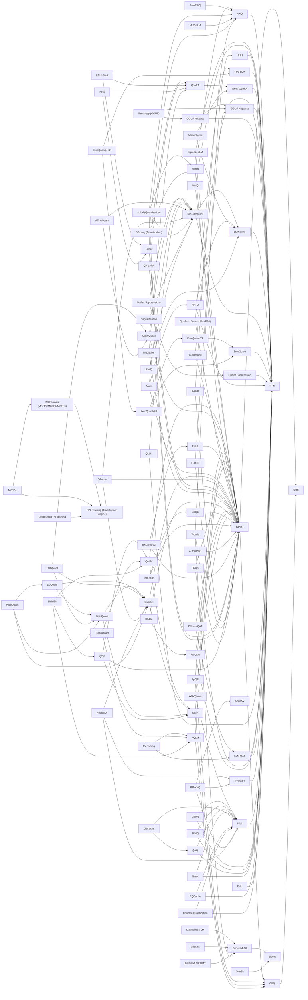

> Auto-generated by `scripts/build_readme.py`. Do not edit directly.

# Lineage Graph

Arrows point from a method to the one(s) it builds on (i.e., A → B means A builds on B).

```mermaid
graph LR
    gptq["GPTQ"] --> obq["OBQ"]
    gptq["GPTQ"] --> obs["OBS"]
    obq["OBQ"] --> obs["OBS"]
    awq["AWQ"] --> rtn["RTN"]
    spqr["SpQR"] --> gptq["GPTQ"]
    spqr["SpQR"] --> obq["OBQ"]
    squeezellm["SqueezeLLM"] --> gptq["GPTQ"]
    squeezellm["SqueezeLLM"] --> rtn["RTN"]
    owq["OWQ"] --> gptq["GPTQ"]
    owq["OWQ"] --> rtn["RTN"]
    quip["QuIP"] --> gptq["GPTQ"]
    quip["QuIP"] --> obq["OBQ"]
    quip-sharp["QuIP#"] --> quip["QuIP"]
    quip-sharp["QuIP#"] --> gptq["GPTQ"]
    aqlm["AQLM"] --> gptq["GPTQ"]
    aqlm["AQLM"] --> obq["OBQ"]
    hqq["HQQ"] --> rtn["RTN"]
    omniquant["OmniQuant"] --> gptq["GPTQ"]
    omniquant["OmniQuant"] --> smoothquant["SmoothQuant"]
    fp6-llm["FP6-LLM"] --> rtn["RTN"]
    marlin["Marlin"] --> gptq["GPTQ"]
    marlin["Marlin"] --> awq["AWQ"]
    bitsandbytes-nf4["NF4 / QLoRA"] --> rtn["RTN"]
    autoround["AutoRound"] --> gptq["GPTQ"]
    autoround["AutoRound"] --> rtn["RTN"]
    gguf-kquants["GGUF K-quants"] --> rtn["RTN"]
    gguf-iquants["GGUF I-quants"] --> gguf-kquants["GGUF K-quants"]
    gguf-iquants["GGUF I-quants"] --> rtn["RTN"]
    exl2["EXL2"] --> gptq["GPTQ"]
    quant-llm["QuaRot / Quant-LLM (FP6)"] --> fp6-llm["FP6-LLM"]
    quant-llm["QuaRot / Quant-LLM (FP6)"] --> gptq["GPTQ"]
    llm-int8["LLM.int8()"] --> rtn["RTN"]
    smoothquant["SmoothQuant"] --> llm-int8["LLM.int8()"]
    smoothquant["SmoothQuant"] --> rtn["RTN"]
    zeroquant["ZeroQuant"] --> rtn["RTN"]
    zeroquant-v2["ZeroQuant-V2"] --> zeroquant["ZeroQuant"]
    zeroquant-fp["ZeroQuant-FP"] --> zeroquant-v2["ZeroQuant-V2"]
    zeroquant-fp["ZeroQuant-FP"] --> zeroquant["ZeroQuant"]
    zeroquant-4plus2["ZeroQuant(4+2)"] --> zeroquant-fp["ZeroQuant-FP"]
    zeroquant-4plus2["ZeroQuant(4+2)"] --> fp6-llm["FP6-LLM"]
    outlier-suppression["Outlier Suppression"] --> rtn["RTN"]
    outlier-suppression-plus["Outlier Suppression+"] --> outlier-suppression["Outlier Suppression"]
    outlier-suppression-plus["Outlier Suppression+"] --> smoothquant["SmoothQuant"]
    rptq["RPTQ"] --> rtn["RTN"]
    rptq["RPTQ"] --> llm-int8["LLM.int8()"]
    atom["Atom"] --> smoothquant["SmoothQuant"]
    atom["Atom"] --> rptq["RPTQ"]
    atom["Atom"] --> gptq["GPTQ"]
    quarot["QuaRot"] --> quip["QuIP"]
    quarot["QuaRot"] --> gptq["GPTQ"]
    spinquant["SpinQuant"] --> quarot["QuaRot"]
    spinquant["SpinQuant"] --> quip["QuIP"]
    duquant["DuQuant"] --> quarot["QuaRot"]
    duquant["DuQuant"] --> spinquant["SpinQuant"]
    flatquant["FlatQuant"] --> quarot["QuaRot"]
    flatquant["FlatQuant"] --> spinquant["SpinQuant"]
    flatquant["FlatQuant"] --> omniquant["OmniQuant"]
    qllm["QLLM"] --> smoothquant["SmoothQuant"]
    qllm["QLLM"] --> rtn["RTN"]
    affine-quant["AffineQuant"] --> smoothquant["SmoothQuant"]
    affine-quant["AffineQuant"] --> omniquant["OmniQuant"]
    qserve["QServe"] --> smoothquant["SmoothQuant"]
    qserve["QServe"] --> gptq["GPTQ"]
    qserve["QServe"] --> quarot["QuaRot"]
    qlora["QLoRA"] --> bitsandbytes-nf4["NF4 / QLoRA"]
    llm-qat["LLM-QAT"] --> rtn["RTN"]
    peqa["PEQA"] --> rtn["RTN"]
    peqa["PEQA"] --> gptq["GPTQ"]
    loftq["LoftQ"] --> qlora["QLoRA"]
    loftq["LoftQ"] --> gptq["GPTQ"]
    qa-lora["QA-LoRA"] --> qlora["QLoRA"]
    qa-lora["QA-LoRA"] --> gptq["GPTQ"]
    ir-qlora["IR-QLoRA"] --> qlora["QLoRA"]
    ir-qlora["IR-QLoRA"] --> loftq["LoftQ"]
    apiq["ApiQ"] --> qlora["QLoRA"]
    apiq["ApiQ"] --> loftq["LoftQ"]
    bitdistiller["BitDistiller"] --> gptq["GPTQ"]
    bitdistiller["BitDistiller"] --> qlora["QLoRA"]
    efficientqat["EfficientQAT"] --> llm-qat["LLM-QAT"]
    efficientqat["EfficientQAT"] --> gptq["GPTQ"]
    pv-tuning["PV-Tuning"] --> aqlm["AQLM"]
    pv-tuning["PV-Tuning"] --> llm-qat["LLM-QAT"]
    bitnet-b158["BitNet b1.58"] --> bitnet["BitNet"]
    pb-llm["PB-LLM"] --> rtn["RTN"]
    pb-llm["PB-LLM"] --> gptq["GPTQ"]
    billm["BiLLM"] --> gptq["GPTQ"]
    billm["BiLLM"] --> pb-llm["PB-LLM"]
    onebit["OneBit"] --> bitnet["BitNet"]
    matmul-free["MatMul-free LM"] --> bitnet-b158["BitNet b1.58"]
    spectra["Spectra"] --> bitnet-b158["BitNet b1.58"]
    bitnet-2b4t["BitNet b1.58 2B4T"] --> bitnet-b158["BitNet b1.58"]
    kvquant["KVQuant"] --> rtn["RTN"]
    kivi["KIVI"] --> rtn["RTN"]
    wkvquant["WKVQuant"] --> gptq["GPTQ"]
    wkvquant["WKVQuant"] --> kivi["KIVI"]
    gear["GEAR"] --> kivi["KIVI"]
    gear["GEAR"] --> rtn["RTN"]
    skvq["SKVQ"] --> kivi["KIVI"]
    skvq["SKVQ"] --> rtn["RTN"]
    qaq["QAQ"] --> kivi["KIVI"]
    qaq["QAQ"] --> rtn["RTN"]
    think["ThinK"] --> kivi["KIVI"]
    think["ThinK"] --> rtn["RTN"]
    palu["Palu"] --> rtn["RTN"]
    zipcache["ZipCache"] --> kivi["KIVI"]
    zipcache["ZipCache"] --> qaq["QAQ"]
    pqcache["PQCache"] --> kivi["KIVI"]
    pqcache["PQCache"] --> rtn["RTN"]
    coupled-quant["Coupled Quantization"] --> kivi["KIVI"]
    coupled-quant["Coupled Quantization"] --> rtn["RTN"]
    mx-formats["MX Formats (MXFP8/MXFP6/MXFP4)"] --> fp8-training["FP8 Training (Transformer Engine)"]
    nvfp4["NVFP4"] --> mx-formats["MX Formats (MXFP8/MXFP6/MXFP4)"]
    nvfp4["NVFP4"] --> fp8-training["FP8 Training (Transformer Engine)"]
    deepseek-fp8["DeepSeek FP8 Training"] --> fp8-training["FP8 Training (Transformer Engine)"]
    moqe["MoQE"] --> gptq["GPTQ"]
    mc-moe["MC-MoE"] --> moqe["MoQE"]
    mc-moe["MC-MoE"] --> gptq["GPTQ"]
    bitsandbytes["bitsandbytes"] --> llm-int8["LLM.int8()"]
    bitsandbytes["bitsandbytes"] --> bitsandbytes-nf4["NF4 / QLoRA"]
    autogptq["AutoGPTQ"] --> gptq["GPTQ"]
    autoawq["AutoAWQ"] --> awq["AWQ"]
    llama-cpp["llama.cpp (GGUF)"] --> gguf-kquants["GGUF K-quants"]
    llama-cpp["llama.cpp (GGUF)"] --> gguf-iquants["GGUF I-quants"]
    exllamav2["ExLlamaV2"] --> exl2["EXL2"]
    exllamav2["ExLlamaV2"] --> gptq["GPTQ"]
    vllm-quant["vLLM (Quantization)"] --> marlin["Marlin"]
    vllm-quant["vLLM (Quantization)"] --> gptq["GPTQ"]
    vllm-quant["vLLM (Quantization)"] --> awq["AWQ"]
    vllm-quant["vLLM (Quantization)"] --> smoothquant["SmoothQuant"]
    mlc-llm["MLC-LLM"] --> awq["AWQ"]
    sglang-quant["SGLang (Quantization)"] --> marlin["Marlin"]
    sglang-quant["SGLang (Quantization)"] --> gptq["GPTQ"]
    sglang-quant["SGLang (Quantization)"] --> awq["AWQ"]
    qtip["QTIP"] --> quip-sharp["QuIP#"]
    qtip["QTIP"] --> quip["QuIP"]
    qtip["QTIP"] --> gptq["GPTQ"]
    sageattention["SageAttention"] --> smoothquant["SmoothQuant"]
    flute["FLUTE"] --> gptq["GPTQ"]
    flute["FLUTE"] --> gguf-kquants["GGUF K-quants"]
    turboqu["TurboQuant"] --> aqlm["AQLM"]
    turboqu["TurboQuant"] --> quip-sharp["QuIP#"]
    ramp["RAMP"] --> gptq["GPTQ"]
    ramp["RAMP"] --> awq["AWQ"]
    resq["ResQ"] --> llm-int8["LLM.int8()"]
    resq["ResQ"] --> smoothquant["SmoothQuant"]
    rotatekv["RotateKV"] --> quarot["QuaRot"]
    rotatekv["RotateKV"] --> kivi["KIVI"]
    rotatekv["RotateKV"] --> kvquant["KVQuant"]
    littlebit["LittleBit"] --> aqlm["AQLM"]
    littlebit["LittleBit"] --> quip-sharp["QuIP#"]
    littlebit["LittleBit"] --> qtip["QTIP"]
    tequila["Tequila"] --> bitnet-b158["BitNet b1.58"]
    tequila["Tequila"] --> hqq["HQQ"]
    tequila["Tequila"] --> gptq["GPTQ"]
    pmkvq["PM-KVQ"] --> kivi["KIVI"]
    pmkvq["PM-KVQ"] --> kvquant["KVQuant"]
    pmkvq["PM-KVQ"] --> snapkv["SnapKV"]
    paroquant["ParoQuant"] --> quarot["QuaRot"]
    paroquant["ParoQuant"] --> spinquant["SpinQuant"]
    paroquant["ParoQuant"] --> duquant["DuQuant"]
```