# LLM Quantization Gallery - Method Details

> Auto-generated by `scripts/build_readme.py`. Do not edit directly. Edit `methods.yml` and re-run the script.

See **[docs/notation.md](notation.md)** for the `W4A16`, `W8A8KV4`, group-size, and per-channel notation used everywhere. See **[docs/glossary.md](glossary.md)** for term definitions.

## Table of Contents

- [Post-Training Quantization - Weight-Only](#post-training-quantization---weight-only) - 35 methods
- [Post-Training Quantization - Weights + Activations](#post-training-quantization---weights-+-activations) - 35 methods
- [Quantization-Aware Training & Quantized Fine-Tuning](#quantization-aware-training--quantized-fine-tuning) - 15 methods
- [Extreme Low-Bit & Binary/Ternary Quantization](#extreme-low-bit--binaryternary-quantization) - 15 methods
- [KV-Cache Quantization](#kv-cache-quantization) - 28 methods
- [Low-Precision Training & Numerical Formats](#low-precision-training--numerical-formats) - 9 methods
- [MoE-Specific Quantization](#moe-specific-quantization) - 7 methods
- [Systems, Kernels & Runtimes](#systems-kernels--runtimes) - 12 methods
- [Full Method Matrix](#full-method-matrix) - 156 total
- [Chronological Overview](#chronological-overview)

## Full Method Matrix

Every method in one table. Sort by any column. Linked IDs jump to the full card.

| ID | Category | Year | Published at | W-bits | A-bits | KV-bits | Calibration? | Training? | Paper |
|----|----------|------|--------------|--------|--------|---------|-------------|-----------|-------|
| [admm-q](#admm-q) | PTQ W-only | 2026 | arXiv | 2 | 16 | 4 | yes | no | [paper](https://arxiv.org/abs/2605.11222) |
| [affine-quant](#affine-quant) | PTQ W+A | 2024 | ICLR 2024 | 4 | 8 | - | yes | no | [paper](https://arxiv.org/abs/2403.16379) |
| [agoq](#agoq) | LP Training | 2026 | arXiv | 16 | 4 | - | no | yes | [paper](https://arxiv.org/abs/2605.00539) |
| [alphaq](#alphaq) | MoE Quant | 2026 | arXiv | 3.5 | 16 | - | no | no | [paper](https://arxiv.org/abs/2606.04980) |
| [apiq](#apiq) | QAT / QFT | 2024 | EMNLP 2024 | 2 | 16 | - | yes | yes | [paper](https://arxiv.org/abs/2402.05898) |
| [aqlm](#aqlm) | PTQ W-only | 2024 | ICML 2024 | 2 | 16 | - | yes | no | [paper](https://arxiv.org/abs/2401.06118) |
| [atom](#atom) | PTQ W+A | 2023 | MLSys 2024 | 4 | 4 | - | yes | no | [paper](https://arxiv.org/abs/2310.19102) |
| [autoawq](#autoawq) | Systems | 2023 | n/a | 4 | 16 | - | yes | no | - |
| [autogptq](#autogptq) | Systems | 2023 | n/a | 4/3/2 | 16 | - | yes | no | - |
| [autoround](#autoround) | PTQ W-only | 2023 | arXiv | 4 | 16 | - | yes | no | [paper](https://arxiv.org/abs/2309.05516) |
| [awq](#awq) | PTQ W-only | 2023 | MLSys 2024 | 4 | 16 | - | yes | no | [paper](https://arxiv.org/abs/2306.00978) |
| [billm](#billm) | Sub-2-bit | 2024 | ICML 2024 | 1 | 16 | - | yes | no | [paper](https://arxiv.org/abs/2402.04291) |
| [bit-by-bit](#bit-by-bit) | QAT / QFT | 2026 | arXiv | 2 | 2 | - | yes | yes | [paper](https://arxiv.org/abs/2604.07888) |
| [bitdistiller](#bitdistiller) | QAT / QFT | 2024 | ACL 2024 | 2/3 | 16 | - | no | yes | [paper](https://arxiv.org/abs/2402.10631) |
| [bitnet](#bitnet) | Sub-2-bit | 2023 | arXiv | 1 | 8 | - | no | yes | [paper](https://arxiv.org/abs/2310.11453) |
| [bitnet-2b4t](#bitnet-2b4t) | Sub-2-bit | 2025 | arXiv | 1.58 | 8 | - | no | yes | [paper](https://arxiv.org/abs/2504.12285) |
| [bitnet-b158](#bitnet-b158) | Sub-2-bit | 2024 | arXiv | 1.58 | 8 | - | no | yes | [paper](https://arxiv.org/abs/2402.17764) |
| [bitsandbytes](#bitsandbytes) | Systems | 2022 | arXiv | 8 | 8 | - | no | no | [paper](https://arxiv.org/abs/2208.07339) |
| [bitsandbytes-nf4](#bitsandbytes-nf4) | PTQ W-only | 2023 | NeurIPS 2023 | 4 | 16 | - | no | no | [paper](https://arxiv.org/abs/2305.14314) |
| [bwla](#bwla) | Sub-2-bit | 2026 | ACL 2026 | 1 | 6 | - | yes | no | [paper](https://arxiv.org/abs/2605.00422) |
| [cae-rescomp](#cae-rescomp) | PTQ W-only | 2026 | ICLR 2026 | 2/3 | 16 | - | yes | no | [paper](https://arxiv.org/abs/2604.07955) |
| [cka-qad](#cka-qad) | QAT / QFT | 2026 | arXiv | 4 | 4 | - | yes | yes | [paper](https://arxiv.org/abs/2606.05682) |
| [conqur](#conqur) | PTQ W+A | 2026 | arXiv | 4 | 4 | - | yes | no | [paper](https://arxiv.org/abs/2605.10793) |
| [coupled-quant](#coupled-quant) | KV Quant | 2024 | arXiv | 16 | 16 | 1 | no | no | [paper](https://arxiv.org/abs/2402.11535) |
| [dash-q](#dash-q) | PTQ W-only | 2026 | EuroMLSys 2026 | 2 | 16 | - | yes | no | [paper](https://arxiv.org/abs/2604.13806) |
| [deepseek-fp8](#deepseek-fp8) | LP Training | 2024 | arXiv | 8 | 8 | - | no | yes | [paper](https://arxiv.org/abs/2412.19437) |
| [dirotq](#dirotq) | PTQ W+A | 2026 | arXiv | 4 | 4 | - | yes | no | [paper](https://arxiv.org/abs/2605.16732) |
| [dont-waste-bits](#dont-waste-bits) | KV Quant | 2026 | CVPR 2026 | 16 | 16 | 2 | yes | yes | [paper](https://arxiv.org/abs/2604.04722) |
| [drop-by-drop](#drop-by-drop) | PTQ W-only | 2026 | arXiv | 3/4/5 | 16 | - | yes | no | [paper](https://arxiv.org/abs/2606.12876) |
| [duquant](#duquant) | PTQ W+A | 2024 | NeurIPS 2024 | 4 | 4 | - | yes | no | [paper](https://arxiv.org/abs/2406.01721) |
| [efficientqat](#efficientqat) | QAT / QFT | 2024 | arXiv | 2/4 | 16 | - | no | yes | [paper](https://arxiv.org/abs/2407.11062) |
| [exl2](#exl2) | PTQ W-only | 2023 | n/a | 2–8 | 16 | - | yes | no | - |
| [exllamav2](#exllamav2) | Systems | 2023 | n/a | 2–8 | 16 | - | yes | no | - |
| [expert-router-norm-mpq](#expert-router-norm-mpq) | MoE Quant | 2026 | ICLR 2026 | 1/2/3 | 16 | - | no | no | [paper](https://arxiv.org/abs/2604.06515) |
| [fair-calib](#fair-calib) | PTQ W+A | 2026 | ICML 2026 | 4 | 4 | - | yes | no | [paper](https://arxiv.org/abs/2606.06547) |
| [fibquant](#fibquant) | KV Quant | 2026 | arXiv | <1 | - | - | no | no | [paper](https://arxiv.org/abs/2605.11478) |
| [flatquant](#flatquant) | PTQ W+A | 2024 | arXiv | 4 | 4 | - | yes | no | [paper](https://arxiv.org/abs/2410.09426) |
| [flute](#flute) | Systems | 2024 | NeurIPS 2024 | 3/4 | 16 | - | yes | no | [paper](https://arxiv.org/abs/2407.10960) |
| [fp6-llm](#fp6-llm) | PTQ W-only | 2024 | USENIX ATC 2024 | 6 | 16 | - | no | no | [paper](https://arxiv.org/abs/2401.14112) |
| [fp8-training](#fp8-training) | LP Training | 2022 | arXiv | 8 | 8 | - | no | yes | [paper](https://arxiv.org/abs/2209.05433) |
| [gear](#gear) | KV Quant | 2024 | arXiv | 16 | 16 | 4 | no | no | [paper](https://arxiv.org/abs/2403.05527) |
| [gemq](#gemq) | MoE Quant | 2026 | ICML 2026 | 1.5/2/2.5/3 | 16 | - | yes | yes | [paper](https://arxiv.org/abs/2605.23078) |
| [gguf-iquants](#gguf-iquants) | PTQ W-only | 2024 | n/a | 1/2/3/4 | 16 | - | yes | no | - |
| [gguf-kquants](#gguf-kquants) | PTQ W-only | 2023 | n/a | 2/3/4/5/6 | 16 | - | no | no | - |
| [gptq](#gptq) | PTQ W-only | 2022 | ICLR 2023 | 3/4 | 16 | - | yes | no | [paper](https://arxiv.org/abs/2210.17323) |
| [gsq](#gsq) | PTQ W-only | 2026 | arXiv | 2/3 | 16 | - | yes | no | [paper](https://arxiv.org/abs/2604.18556) |
| [harp](#harp) | PTQ W-only | 2026 | arXiv | 2/3/4 | 16 | - | yes | no | [paper](https://arxiv.org/abs/2605.29843) |
| [hqmq](#hqmq) | KV Quant | 2026 | arXiv | 16 | 16 | 4 | no | no | [paper](https://arxiv.org/abs/2605.27646) |
| [hqq](#hqq) | PTQ W-only | 2023 | n/a | 2/3/4/8 | 16 | - | no | no | - |
| [infoquant](#infoquant) | PTQ W+A | 2026 | arXiv | 4 | 4 | 4 | yes | no | [paper](https://arxiv.org/abs/2605.26175) |
| [ir-qlora](#ir-qlora) | QAT / QFT | 2024 | ICML 2024 | 4 | 16 | - | no | yes | [paper](https://arxiv.org/abs/2402.05445) |
| [joint-nas-quant](#joint-nas-quant) | QAT / QFT | 2026 | arXiv | 2/4/8 | 2 | - | yes | yes | [paper](https://arxiv.org/abs/2606.04063) |
| [kivi](#kivi) | KV Quant | 2024 | ICML 2024 | 16 | 16 | 2 | no | no | [paper](https://arxiv.org/abs/2402.02750) |
| [kvarn](#kvarn) | KV Quant | 2026 | arXiv | 16 | 16 | 2 | no | no | [paper](https://arxiv.org/abs/2606.03458) |
| [kvquant](#kvquant) | KV Quant | 2024 | NeurIPS 2024 | 16 | 16 | 4 | yes | no | [paper](https://arxiv.org/abs/2401.18079) |
| [laquant](#laquant) | QAT / QFT | 2026 | arXiv | 3 | 16 | - | yes | yes | [paper](https://arxiv.org/abs/2605.08755) |
| [lbllm](#lbllm) | Sub-2-bit | 2026 | arXiv | - | - | - | yes | yes | [paper](https://arxiv.org/abs/2604.19167) |
| [lc-qat](#lc-qat) | QAT / QFT | 2026 | ICML 2026 | 2 | 16 | - | yes | yes | [paper](https://arxiv.org/abs/2606.10531) |
| [lfq](#lfq) | PTQ W-only | 2026 | ICML 2026 | 4 | 16 | - | yes | no | [paper](https://arxiv.org/abs/2605.29756) |
| [liftquant](#liftquant) | PTQ W-only | 2026 | ICML 2026 | 2.4 | 16 | - | yes | no | [paper](https://arxiv.org/abs/2606.04050) |
| [littlebit](#littlebit) | Sub-2-bit | 2025 | NeurIPS 2025 | <1 | - | - | yes | no | [paper](https://arxiv.org/abs/2506.13771) |
| [llama-cpp](#llama-cpp) | Systems | 2023 | n/a | 2/3/4/5/6/8 | 16 | - | no | no | - |
| [llamaweb](#llamaweb) | Systems | 2026 | arXiv | 2/4/8 | 16 | - | no | no | [paper](https://arxiv.org/abs/2605.20706) |
| [llm-int8](#llm-int8) | PTQ W+A | 2022 | NeurIPS 2022 | 8 | 8 | - | no | no | [paper](https://arxiv.org/abs/2208.07339) |
| [llm-qat](#llm-qat) | QAT / QFT | 2023 | arXiv | 4 | 8 | 4 | no | yes | [paper](https://arxiv.org/abs/2305.17888) |
| [loftq](#loftq) | QAT / QFT | 2023 | ICLR 2024 | 4 | 16 | - | no | yes | [paper](https://arxiv.org/abs/2310.08659) |
| [loraq](#loraq) | PTQ W+A | 2026 | arXiv | 4 | 8 | - | no | no | [paper](https://arxiv.org/abs/2604.18117) |
| [marlin](#marlin) | Systems | 2024 | arXiv | 4 | 16 | - | no | no | [paper](https://arxiv.org/abs/2408.11743) |
| [matmul-free](#matmul-free) | Sub-2-bit | 2024 | arXiv | 1.58 | 8 | - | no | yes | [paper](https://arxiv.org/abs/2406.02528) |
| [mc-moe](#mc-moe) | MoE Quant | 2024 | arXiv | 2/4 | 16 | - | yes | no | [paper](https://arxiv.org/abs/2408.11813) |
| [mixfp4](#mixfp4) | LP Training | 2026 | arXiv | 4 | 8 | - | yes | no | [paper](https://arxiv.org/abs/2605.31035) |
| [mlc-llm](#mlc-llm) | Systems | 2023 | n/a | 4 | 16 | - | no | no | - |
| [mobie](#mobie) | MoE Quant | 2026 | arXiv | 1 | 16 | - | yes | no | [paper](https://arxiv.org/abs/2604.06798v3) |
| [moqe](#moqe) | MoE Quant | 2023 | arXiv | 2/4 | 16 | - | yes | no | [paper](https://arxiv.org/abs/2310.02410) |
| [morphoquant](#morphoquant) | PTQ W+A | 2026 | arXiv | 4 | 4 | - | yes | no | [paper](https://arxiv.org/abs/2606.04349) |
| [mosaicquant](#mosaicquant) | PTQ W+A | 2026 | arXiv | 4 | 8 | - | yes | no | [paper](https://arxiv.org/abs/2606.15652) |
| [mx-formats](#mx-formats) | LP Training | 2023 | NeurIPS 2023 | 4/6/8 | 4/6/8 | - | no | yes | [paper](https://arxiv.org/abs/2310.10537) |
| [mxfp4-pretraining](#mxfp4-pretraining) | LP Training | 2026 | arXiv | 32/4 | 32/4 | - | no | yes | [paper](https://arxiv.org/abs/2605.09825) |
| [mxfp4-rl-error-decomposition](#mxfp4-rl-error-decomposition) | LP Training | 2026 | arXiv | 4 | 4 | - | no | yes | [paper](https://arxiv.org/abs/2605.20402) |
| [nvfp4](#nvfp4) | LP Training | 2024 | arXiv | 4 | 8 | - | yes | no | [paper](https://arxiv.org/abs/2509.25149) |
| [oa-em](#oa-em) | PTQ W-only | 2026 | arXiv | 2 | 16 | - | yes | no | [paper](https://arxiv.org/abs/2604.08118) |
| [obq](#obq) | PTQ W-only | 2022 | NeurIPS 2022 | 3/4 | 16 | - | yes | no | [paper](https://arxiv.org/abs/2208.11580) |
| [obs](#obs) | PTQ W-only | 1993 | NeurIPS 1992 | - | - | - | yes | no | [paper](https://proceedings.neurips.cc/paper_files/paper/1992/file/303ed4c69846ab36c2904d3ba8573050-Paper.pdf) |
| [offq](#offq) | PTQ W+A | 2026 | arXiv | 4 | 4 | 4 | yes | no | [paper](https://arxiv.org/abs/2606.07116) |
| [omniquant](#omniquant) | PTQ W+A | 2023 | ICLR 2024 | 4 | 16 | - | yes | no | [paper](https://arxiv.org/abs/2308.13137) |
| [onebit](#onebit) | Sub-2-bit | 2024 | NeurIPS 2024 | 1 | 16 | - | no | yes | [paper](https://arxiv.org/abs/2402.11295) |
| [osaq](#osaq) | PTQ W-only | 2026 | ICML 2026 | 2/3/4 | 16 | - | yes | no | [paper](https://arxiv.org/abs/2605.04738) |
| [osc](#osc) | PTQ W+A | 2026 | arXiv | 4 | 4 | - | yes | no | [paper](https://arxiv.org/abs/2604.12782) |
| [oscar](#oscar) | KV Quant | 2026 | arXiv | 16 | 16 | 2 | yes | no | [paper](https://arxiv.org/abs/2605.17757) |
| [outlier-suppression](#outlier-suppression) | PTQ W+A | 2022 | NeurIPS 2022 | 8 | 8 | - | yes | no | [paper](https://arxiv.org/abs/2209.13325) |
| [outlier-suppression-plus](#outlier-suppression-plus) | PTQ W+A | 2023 | EMNLP 2023 | 8 | 8 | - | yes | no | [paper](https://arxiv.org/abs/2304.09145) |
| [owq](#owq) | PTQ W-only | 2023 | AAAI 2024 | 3/4 | 16 | - | yes | no | [paper](https://arxiv.org/abs/2306.02272) |
| [palu](#palu) | KV Quant | 2024 | arXiv | 16 | 16 | - | yes | no | [paper](https://arxiv.org/abs/2407.21118) |
| [paroquant](#paroquant) | PTQ W+A | 2025 | ICLR 2026 | 4 | 8 | - | yes | no | [paper](https://arxiv.org/abs/2511.10645) |
| [pb-llm](#pb-llm) | Sub-2-bit | 2023 | ICLR 2024 | 1/16 | 16 | - | yes | no | [paper](https://arxiv.org/abs/2310.00034) |
| [peqa](#peqa) | QAT / QFT | 2023 | NeurIPS 2023 | 4 | 16 | - | no | yes | [paper](https://arxiv.org/abs/2304.02384) |
| [pmkvq](#pmkvq) | KV Quant | 2025 | ICLR 2026 | - | - | 2 | yes | no | [paper](https://arxiv.org/abs/2505.18610) |
| [pqcache](#pqcache) | KV Quant | 2024 | arXiv | 16 | 16 | 2-4 | yes | no | [paper](https://arxiv.org/abs/2407.12820) |
| [pv-tuning](#pv-tuning) | QAT / QFT | 2024 | NeurIPS 2024 | 2 | 16 | - | no | yes | [paper](https://arxiv.org/abs/2405.14852) |
| [qa-lora](#qa-lora) | QAT / QFT | 2023 | NeurIPS 2023 | 4 | 16 | - | no | yes | [paper](https://arxiv.org/abs/2309.14717) |
| [qam-w](#qam-w) | PTQ W-only | 2026 | arXiv | 5.5 | 16 | - | yes | no | [paper](https://arxiv.org/abs/2605.26339) |
| [qaq](#qaq) | KV Quant | 2024 | arXiv | 16 | 16 | 2 | no | no | [paper](https://arxiv.org/abs/2403.04643) |
| [qllm](#qllm) | PTQ W+A | 2023 | ICLR 2024 | 4 | 8 | - | yes | no | [paper](https://arxiv.org/abs/2310.08041) |
| [qlora](#qlora) | QAT / QFT | 2023 | NeurIPS 2023 | 4 | 16 | - | no | yes | [paper](https://arxiv.org/abs/2305.14314) |
| [qserve](#qserve) | PTQ W+A | 2024 | NeurIPS 2024 | 4 | 8 | 4 | yes | no | [paper](https://arxiv.org/abs/2405.04532) |
| [qtip](#qtip) | PTQ W-only | 2024 | NeurIPS 2024 | 2 | 16 | - | yes | no | [paper](https://arxiv.org/abs/2406.11811) |
| [quant-llm](#quant-llm) | PTQ W-only | 2024 | arXiv | 4/6 | 16 | - | no | no | [paper](https://arxiv.org/abs/2405.08925) |
| [quantized-keys-steal-attention](#quantized-keys-steal-attention) | KV Quant | 2026 | ICML 2026 Workshops | 16 | 16 | 2 | no | no | [paper](https://arxiv.org/abs/2605.26266) |
| [quarot](#quarot) | PTQ W+A | 2024 | NeurIPS 2024 | 4 | 4 | 4 | no | no | [paper](https://arxiv.org/abs/2404.00456) |
| [quip](#quip) | PTQ W-only | 2023 | NeurIPS 2023 | 2/4 | 16 | - | yes | no | [paper](https://arxiv.org/abs/2307.13304) |
| [quip-sharp](#quip-sharp) | PTQ W-only | 2024 | NeurIPS 2024 | 2/3/4 | 16 | - | yes | no | [paper](https://arxiv.org/abs/2402.04396) |
| [ramp](#ramp) | PTQ W-only | 2026 | arXiv | 2-8 | 16 | - | yes | no | [paper](https://arxiv.org/abs/2603.17891) |
| [ratequant](#ratequant) | KV Quant | 2026 | arXiv | 16 | 16 | 2-8 | yes | no | [paper](https://arxiv.org/abs/2605.06675) |
| [rcbeqa](#rcbeqa) | KV Quant | 2026 | arXiv | 16 | 16 | 8 | no | no | [paper](https://arxiv.org/abs/2605.20868) |
| [respinquant](#respinquant) | PTQ W+A | 2026 | ICML 2026 | 4 | 4 | 4 | yes | no | [paper](https://arxiv.org/abs/2604.11080) |
| [resq](#resq) | PTQ W+A | 2025 | ICLR 2025 | 4 | 8 | - | yes | no | [paper](https://arxiv.org/abs/2407.08563) |
| [rotatekv](#rotatekv) | KV Quant | 2025 | IJCAI 2025 | - | - | 2 | no | no | [paper](https://www.ijcai.org/proceedings/2025/0690.pdf) |
| [rptq](#rptq) | PTQ W+A | 2023 | arXiv | 4 | 8 | - | yes | no | [paper](https://arxiv.org/abs/2304.01089) |
| [rtn](#rtn) | PTQ W-only | unknown | n/a | 4 | 16 | - | no | no | - |
| [sage-ptq](#sage-ptq) | Sub-2-bit | 2026 | arXiv | 1 | 16 | - | yes | no | [paper](https://arxiv.org/abs/2606.05429) |
| [sageattention](#sageattention) | KV Quant | 2024 | ICLR 2025 | - | - | - | no | no | [paper](https://arxiv.org/abs/2410.02367) |
| [saw-int4](#saw-int4) | KV Quant | 2026 | arXiv | 16 | 16 | 4 | no | no | [paper](https://arxiv.org/abs/2604.19157) |
| [scalesweep](#scalesweep) | LP Training | 2026 | arXiv | 4 | 4 | 4 | yes | no | [paper](https://arxiv.org/abs/2606.07618) |
| [sglang-quant](#sglang-quant) | Systems | 2024 | OSDI 2024 | 4 | 16 | - | no | no | [paper](https://arxiv.org/abs/2312.07104) |
| [shift-and-sum](#shift-and-sum) | PTQ W+A | 2026 | ICLR 2026 | 4 | 4 | - | yes | no | [paper](https://arxiv.org/abs/2606.16131) |
| [skvq](#skvq) | KV Quant | 2024 | arXiv | 16 | 16 | 2 | no | no | [paper](https://arxiv.org/abs/2405.06484) |
| [slq](#slq) | PTQ W-only | 2026 | arXiv | 3.3-6.6 | 16 | - | yes | no | [paper](https://arxiv.org/abs/2605.02404) |
| [smoothquant](#smoothquant) | PTQ W+A | 2022 | ICML 2023 | 8 | 8 | - | yes | no | [paper](https://arxiv.org/abs/2211.10438) |
| [snapkv](#snapkv) | KV Quant | 2024 | NeurIPS 2024 | - | - | - | no | no | [paper](https://arxiv.org/abs/2404.14469) |
| [spectra](#spectra) | Sub-2-bit | 2024 | arXiv | 1.58 | 8 | - | no | yes | [paper](https://arxiv.org/abs/2407.12327) |
| [spectral-llm](#spectral-llm) | Sub-2-bit | 2026 | arXiv | 2 | 16 | - | yes | no | [paper](https://arxiv.org/abs/2605.25203) |
| [spinquant](#spinquant) | PTQ W+A | 2024 | ICLR 2025 | 4 | 8 | - | yes | no | [paper](https://arxiv.org/abs/2405.16406) |
| [splitq](#splitq) | PTQ W+A | 2026 | arXiv | 4 | 8 | - | yes | no | [paper](https://arxiv.org/abs/2605.19929) |
| [spqr](#spqr) | PTQ W-only | 2023 | ICLR 2024 | 3/4 | 16 | - | yes | no | [paper](https://arxiv.org/abs/2306.03078) |
| [squeezellm](#squeezellm) | PTQ W-only | 2023 | ICML 2024 | 4 | 16 | - | yes | no | [paper](https://arxiv.org/abs/2306.07629) |
| [star-quant](#star-quant) | PTQ W+A | 2026 | arXiv | 4 | 4 | - | yes | no | [paper](https://arxiv.org/abs/2606.04945) |
| [tequila](#tequila) | Sub-2-bit | 2025 | ICLR 2026 | 1.58 | 16 | - | yes | no | [paper](https://arxiv.org/abs/2509.23809) |
| [think](#think) | KV Quant | 2024 | arXiv | 16 | 16 | 4 | no | no | [paper](https://arxiv.org/abs/2407.21018) |
| [tilefuse](#tilefuse) | Systems | 2026 | arXiv | 4 | 16 | - | no | no | [paper](https://arxiv.org/abs/2606.11357) |
| [tileq](#tileq) | MoE Quant | 2026 | arXiv | 2/3 | 16 | - | yes | no | [paper](https://arxiv.org/abs/2605.09281) |
| [torq](#torq) | PTQ W+A | 2026 | arXiv | 4 | 4 | - | yes | no | [paper](https://arxiv.org/abs/2605.19561) |
| [trainable-smooth-rotation](#trainable-smooth-rotation) | PTQ W+A | 2026 | arXiv | 4 | 4 | - | yes | no | [paper](https://arxiv.org/abs/2606.09927) |
| [triaxialkv](#triaxialkv) | KV Quant | 2026 | arXiv | 16 | 16 | 2 | yes | no | [paper](https://arxiv.org/abs/2605.17170) |
| [turboqu](#turboqu) | KV Quant | 2025 | ICLR 2026 | 16 | 16 | 2.5 | no | no | [paper](https://arxiv.org/abs/2504.19874) |
| [twla](#twla) | Sub-2-bit | 2026 | ICML 2026 | 1.58 | 4 | - | yes | no | [paper](https://arxiv.org/abs/2606.13054) |
| [vericache](#vericache) | KV Quant | 2026 | arXiv | 16 | 16 | 2 | no | no | [paper](https://arxiv.org/abs/2605.17613) |
| [vllm-quant](#vllm-quant) | Systems | 2023 | SOSP 2023 | 4 | 16 | - | no | no | [paper](https://arxiv.org/abs/2309.06180) |
| [windowquant](#windowquant) | KV Quant | 2026 | ACM TACO | 16 | 16 | 2 | yes | no | [paper](https://arxiv.org/abs/2605.02262) |
| [windquant](#windquant) | PTQ W-only | 2026 | arXiv | - | 16 | - | yes | no | [paper](https://arxiv.org/abs/2605.26660) |
| [wkvquant](#wkvquant) | KV Quant | 2024 | arXiv | 4 | 16 | 4 | yes | no | [paper](https://arxiv.org/abs/2402.12065) |
| [xfp](#xfp) | PTQ W-only | 2026 | arXiv | 3-4 | 16 | - | no | no | [paper](https://arxiv.org/abs/2605.14844) |
| [zeroquant](#zeroquant) | PTQ W+A | 2022 | NeurIPS 2022 | 8 | 8 | - | yes | no | [paper](https://arxiv.org/abs/2206.01861) |
| [zeroquant-4plus2](#zeroquant-4plus2) | PTQ W+A | 2023 | arXiv | 4 | 8 | - | yes | no | [paper](https://arxiv.org/abs/2312.08583) |
| [zeroquant-fp](#zeroquant-fp) | PTQ W+A | 2023 | arXiv | 4 | 8 | - | yes | no | [paper](https://arxiv.org/abs/2307.09782) |
| [zeroquant-v2](#zeroquant-v2) | PTQ W+A | 2023 | arXiv | 4/8 | 8 | - | yes | no | [paper](https://arxiv.org/abs/2303.08302) |
| [zipcache](#zipcache) | KV Quant | 2024 | NeurIPS 2024 | 16 | 16 | 4 | no | no | [paper](https://arxiv.org/abs/2405.14256) |

---

## Post-Training Quantization - Weight-Only

These methods quantize only the weight tensors; activations remain in FP16/BF16. This avoids the challenge of activation outliers and is sufficient for memory-bound inference (most single-GPU LLM serving). The dominant category for open-weight model releases.

### Drop-by-Drop · W3/W4/W5 A16 (one checkpoint, bit-width selectable at inference) · PTQ W-only · 2026-06

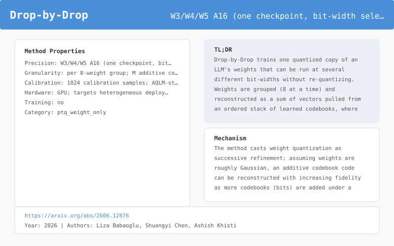

<em>Weights are grouped and encoded as a sum of vectors from an ordered stack of learned codebooks; Matryoshka-style supervision makes each codebook prefix a valid lower-bit reconstruction, so dropping trailing codebooks at inference selects a lower precision from one checkpoint.</em>

```mermaid
flowchart LR
    A[FP16 Weights] --> B[Calibration data:\nyes]
    B --> C[Compute scale\nand zero-point]
    C --> D[Quantize weights\nto W3/W4/W5 A16 one checkpoint, bit-width selectable at inference]
    D --> E[Outlier handling:\nadditive multi-codebook repres]
    E --> F[Quantized model\nW3/W4/W5 A16 one checkpoint, bit-width selectable at inference]
```

> Drop-by-Drop trains one quantized copy of an LLM's weights that can be run at several different bit-widths without re-quantizing. Weights are grouped (8 at a time) and reconstructed as a sum of vectors pulled from an ordered stack of learned codebooks, where each codebook adds roughly one bit. During training the codebooks are supervised so that the first few alone already give a usable reconstruction, the way nesting works in Matryoshka representations, so you can keep or drop trailing codebooks at inference to trade quality for memory. This means a single stored checkpoint covers 3-, 4-, and 5-bit operating points, and you pick the precision at load time based on the hardware budget.

| Field | Value |
|-------|-------|
| Published at | arXiv (preprint) |
| Paper | [2606.12876](https://arxiv.org/abs/2606.12876) |
| Precision | W3/W4/W5 A16 (one checkpoint, bit-width selectable at inference) |
| Granularity | per 8-weight group; M additive codebooks of 2^8 entries each, M in {3,4,5} giving 3/4/5 bits per weight |
| Calibration | 1024 calibration samples; AQLM-style codebook training (residual K-means init, beam search over codes + gradient descent on codebooks) |
| Symmetric? | n/a (codebook-based) |
| Outlier handling | additive multi-codebook representation absorbs all weight magnitudes (no separate outlier path) |
| Hardware target | GPU; targets heterogeneous deployment where a single checkpoint serves multiple bit-widths |
| Training needed? | no |
| Calibration data? | yes |
| Typical degradation | Competitive WikiText-2/C4 perplexity and zero-shot accuracy (ARC-e/c, HellaSwag, Winogrande, PIQA) on Qwen-7B, LLaMA-8B, Gemma-2B, Mistral-7B; e.g. Qwen-7B ~72-74% mean zero-shot accuracy across the 3/4/5-codebook (3/4/5-bit) settings, with graceful degradation as codebooks are dropped |
| Builds on | [aqlm](#aqlm) |
| Related | [gptq](#gptq) · [quip-sharp](#quip-sharp) · [qtip](#qtip) |

**How it works:**

The method casts weight quantization as successive refinement: assuming weights are roughly Gaussian, an additive codebook code can be reconstructed with increasing fidelity as more codebooks (bits) are added under a weighted-MSE distortion tied to the LLM loss. Building on AQLM's additive-quantization pipeline, it injects Matryoshka-style supervision into the codebook-update objective so that ordered prefixes of the codebook set each minimize loss at their own bit-width. The result is nested, 'droppable' codebooks: at inference any prefix of length M yields a valid M-bit model, letting one trained checkpoint serve 3/4/5-bit precisions on demand.

---

### LiftQuant · W2.4 A16 · PTQ W-only · 2026-06

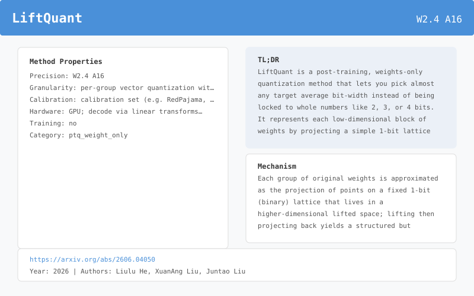

<em>LiftQuant: lift weights into a higher-dimensional 1-bit lattice, project back, and set average bit-width by the lift-to-original dimension ratio.</em>

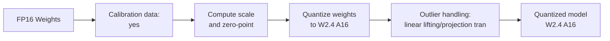
```mermaid
flowchart LR
    A[FP16 Weights] --> B[Calibration data:\nyes]
    B --> C[Compute scale\nand zero-point]
    C --> D[Quantize weights\nto W2.4 A16]
    D --> E[Outlier handling:\nlinear lifting/projection tran]
    E --> F[Quantized model\nW2.4 A16]
```

> LiftQuant is a post-training, weights-only quantization method that lets you pick almost any target average bit-width instead of being locked to whole numbers like 2, 3, or 4 bits. It represents each low-dimensional block of weights by projecting a simple 1-bit lattice down from a higher-dimensional 'lifted' space, so the bit budget is just the ratio between the lifted dimension and the original dimension and can be dialed in finely. A small calibration set drives an intra-block correction step that compensates for the projection error. This makes it possible to size a model exactly to a memory budget, for example squeezing a 70B model into 2.4 bits so it fits in a 24GB GPU.

| Field | Value |
|-------|-------|
| Published at | **ICML 2026** |
| Paper | [2606.04050](https://arxiv.org/abs/2606.04050) |
| Code | [Heliulu/LiftQuant](https://github.com/Heliulu/LiftQuant) |
| Precision | W2.4 A16 |
| Granularity | per-group vector quantization with lifted 1-bit lattice codebook |
| Calibration | calibration set (e.g. RedPajama, ~4096 samples) for intra-block correction |
| Symmetric? | symmetric |
| Outlier handling | linear lifting/projection transform plus intra-block error correction over the calibration set |
| Hardware target | GPU; decode via linear transforms and 1-bit uniform quantizers (e.g. fitting a 70B model into a 24GB GPU) |
| Training needed? | no |
| Calibration data? | yes |
| Typical degradation | 70B LLM compressed to 2.4 bits to fit a 24GB GPU, reported to surpass prior state-of-the-art 2-bit models on the same device; released checkpoints include Llama-2 and Qwen models at 2.5-bit and 3-bit |
| Builds on | [aqlm](#aqlm) · [quip-sharp](#quip-sharp) · [qtip](#qtip) |
| Related | [qtip](#qtip) · [aqlm](#aqlm) · [exl2](#exl2) · [quip-sharp](#quip-sharp) |

**How it works:**

Each group of original weights is approximated as the projection of points on a fixed 1-bit (binary) lattice that lives in a higher-dimensional lifted space; lifting then projecting back yields a structured but non-uniform codebook. Because the effective bit-width equals the ratio of the lifted dimension to the original dimension, varying that ratio gives quasi- continuous control over the average bits per weight rather than only integer levels. Decoding stays cheap since it only requires linear transformations and 1-bit uniform quantizers, and an intra-block correction pass over calibration data reduces the reconstruction error from projection.

---

### HARP · W2/W3/W4 A16 · PTQ W-only · 2026-05

<em>Learned butterfly block-orthogonal rotation (initialized from a randomized Hadamard transform) adapts the incoherence basis per layer for 2-4 bit weight-only PTQ.</em>

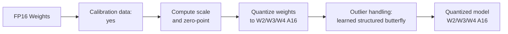
```mermaid
flowchart LR
    A[FP16 Weights] --> B[Calibration data:\nyes]
    B --> C[Compute scale\nand zero-point]
    C --> D[Quantize weights\nto W2/W3/W4 A16]
    D --> E[Outlier handling:\nlearned structured butterfly ]
    E --> F[Quantized model\nW2/W3/W4 A16]
```

> HARP targets the rotation step used by incoherence-based weight-only quantizers. Methods like QuIP# and QTIP multiply weights and inputs by a fixed randomized Hadamard transform to smear out outliers before low-bit quantization, but that fixed transform cannot adjust to a particular layer, calibration distribution, or quantizer. HARP instead learns the orthogonal transform while keeping it cheap to apply: it builds each rotation from a chain of sparse butterfly-style block-orthogonal stages, can handle dimensions that are not powers of two through a mixed-radix schedule, and starts from the randomized Hadamard transform so it never does worse than the fixed baseline. The transform is fit on calibration data only (no end-to-end retraining) and the original full-precision computation is preserved exactly, so it slots into existing 2-4 bit pipelines and reportedly improves perplexity and zero-shot accuracy from 1B to 70B models while staying faster than FP16 at inference.

| Field | Value |
|-------|-------|
| Published at | arXiv (preprint) |
| Paper | [2605.29843](https://arxiv.org/abs/2605.29843) |
| Precision | W2/W3/W4 A16 |
| Granularity | per-group after learned two-sided rotation |
| Calibration | calibration set (rotation fitted on calibration data only) |
| Symmetric? | symmetric |
| Outlier handling | learned structured (butterfly block-orthogonal) rotation that adapts the incoherence basis per layer/quantizer, initialized from a randomized Hadamard transform |
| Hardware target | GPU (structured sparse butterfly rotation kept fast; ~128 tok/s vs 61 tok/s FP16) |
| Training needed? | no |
| Calibration data? | yes |
| Typical degradation | Improves perplexity and zero-shot accuracy over fixed randomized Hadamard transforms across 2-4 bit settings on models from 1B to 70B parameters (exact numbers not given in abstract) |
| Builds on | [quip-sharp](#quip-sharp) · [qtip](#qtip) · [quip](#quip) |
| Related | [quarot](#quarot) · [spinquant](#spinquant) · [flatquant](#flatquant) · [aqlm](#aqlm) |

**How it works:**

HARP replaces the fixed randomized Hadamard transform (RHT) used in incoherence processing with a learnable two-sided structured orthogonal operator. Each rotation is parameterized as a product of sparse butterfly-like block-orthogonal stages, which keeps the cost near O(n log n) like a Hadamard transform while giving the transform enough free parameters to adapt the rotated basis to each layer, the calibration distribution, and the quantizer. Mixed- radix schedules let it operate on non-power-of-two dimensions, and initializing to the RHT (up to a fixed permutation) guarantees it starts at the fixed-Hadamard baseline and only improves from there. The processor is fit using only calibration data while exactly preserving the full-precision linear map, so quantized models keep their original outputs up to quantization error.

---

### LFQ · W4A16 / W3A16 · PTQ W-only · 2026-05

<em>LFQ: standard MSE block reconstruction for early blocks, then logit-aligned (cross-entropy) joint optimization of the final block plus the LM head.</em>

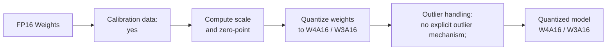
```mermaid
flowchart LR
    A[FP16 Weights] --> B[Calibration data:\nyes]
    B --> C[Compute scale\nand zero-point]
    C --> D[Quantize weights\nto W4A16 / W3A16]
    D --> E[Outlier handling:\nno explicit outlier mechanism;]
    E --> F[Quantized model\nW4A16 / W3A16]
```

> LFQ is an add-on for block-wise weight-only post-training quantization that targets the quality drop low-bit LLMs suffer on open-ended generation and long chain-of-thought tasks. The authors observe that standard block reconstruction has two blind spots: it never optimizes the final unembedding (LM head) layer, and it uses a mean-squared-error objective that does not directly preserve the model's output token distribution. LFQ fixes this by treating the last transformer block together with the LM head as one unit and tuning its quantized weights to match the full-precision logits via a cross-entropy objective instead of MSE. The change keeps perplexity and multiple-choice accuracy roughly unchanged while recovering accuracy on generation-heavy benchmarks.

| Field | Value |
|-------|-------|
| Published at | **ICML 2026** |
| Paper | [2605.29756](https://arxiv.org/abs/2605.29756) |
| Precision | W4A16 / W3A16 |
| Granularity | per-channel (4-bit) and group-wise group size 128 (3-bit) |
| Calibration | C4 samples (~400-800 sequences of length 2048-4096), single-GPU |
| Symmetric? | asymmetric |
| Outlier handling | no explicit outlier mechanism; aligns output token distributions instead |
| Hardware target | GPU (weight-only low-bit inference) |
| Training needed? | no |
| Calibration data? | yes |
| Typical degradation | Qwen2.5-7B-Instruct W4 per-channel: WikiText2 ppl FP 6.85 -> FlexRound+LFQ 7.21; IFEval FP 70.79 -> FlexRound+LFQ 71.35; MATH500 FP 74.2 -> FlexRound+LFQ 73.4 |
| Builds on | [omniquant](#omniquant) · [efficientqat](#efficientqat) |
| Related | [gptq](#gptq) · [autoround](#autoround) |

**How it works:**

For all transformer blocks except the last, LFQ keeps the usual per-block MSE reconstruction used by the chosen base method (FlexRound, OmniQuant, or Block-AP). For the final block it switches the objective: the quantized final block and the (also quantized) LM head are jointly optimized by minimizing the cross-entropy / KL divergence between the full-precision and quantized output token probability distributions over calibration sequences. This pulls the unembedding layer into the optimization, which block-wise PTQ normally omits, and aligns the soft output distribution rather than intermediate activations, which matters most for autoregressive generation where small per-token probability errors compound over long outputs.

---

### WINDQuant · W~2 (mixed, effective 1.96-2.02) A16 · PTQ W-only · 2026-05

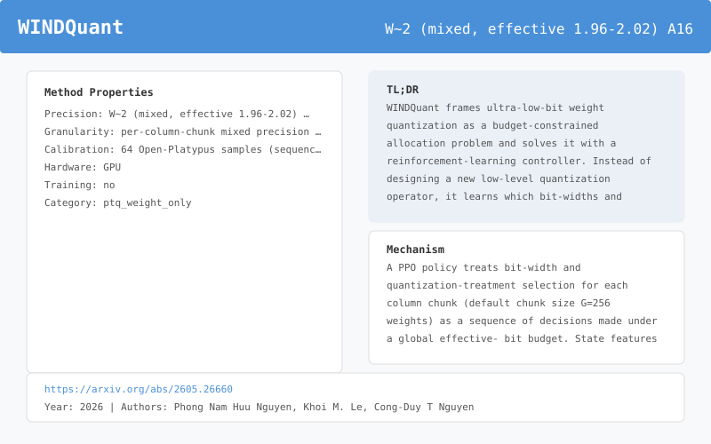

<em>WINDQuant: a PPO controller assigns per-column-chunk bit-widths under a global storage budget, giving sensitive chunks more bits and robust chunks fewer at ~2-bit average.</em>

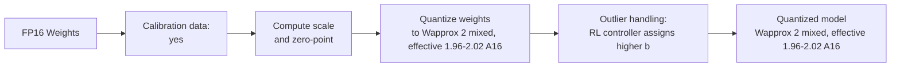
```mermaid
flowchart LR
    A[FP16 Weights] --> B[Calibration data:\nyes]
    B --> C[Compute scale\nand zero-point]
    C --> D[Quantize weights\nto Wapprox 2 mixed, effective 1.96-2.02 A16]
    D --> E[Outlier handling:\nRL controller assigns higher b]
    E --> F[Quantized model\nWapprox 2 mixed, effective 1.96-2.02 A16]
```

> WINDQuant frames ultra-low-bit weight quantization as a budget-constrained allocation problem and solves it with a reinforcement-learning controller. Instead of designing a new low-level quantization operator, it learns which bit-widths and quantization treatments to give to fine-grained column chunks of each weight matrix, subject to a single global storage budget. The controller is trained with PPO using activation-aware calibration, and each chosen chunk is fit with a lightweight per-unit quantizer. This lets precision vary inside a layer so that more sensitive chunks keep more bits while robust chunks are squeezed harder, reaching roughly 2-bit average storage on LLaMA models without retraining the network itself.

| Field | Value |
|-------|-------|
| Published at | arXiv (preprint) |
| Paper | [2605.26660](https://arxiv.org/abs/2605.26660) |
| Precision | W~2 (mixed, effective 1.96-2.02) A16 |
| Granularity | per-column-chunk mixed precision (chunk size G=256 weights) |
| Calibration | 64 Open-Platypus samples (sequence length 256), activation-aware |
| Symmetric? | mixed |
| Outlier handling | RL controller assigns higher bit-width and quantization treatment to sensitive column chunks |
| Hardware target | GPU |
| Training needed? | no |
| Calibration data? | yes |
| Typical degradation | LLaMA-3.1-8B WikiText-2 perplexity 7.90 at 1.96-bit avg (vs 5.56 FP16); LLaMA-3-70B 5.10 at 2.02-bit avg (vs 2.53 FP16) |
| Builds on | [gptq](#gptq) · [awq](#awq) |
| Related | [ramp](#ramp) · [gptq](#gptq) · [awq](#awq) · [omniquant](#omniquant) · [spinquant](#spinquant) · [aqlm](#aqlm) · [efficientqat](#efficientqat) · [llm-qat](#llm-qat) · [squeezellm](#squeezellm) · [spqr](#spqr) |

**How it works:**

A PPO policy treats bit-width and quantization-treatment selection for each column chunk (default chunk size G=256 weights) as a sequence of decisions made under a global effective- bit budget. State features capture weight statistics and activation-aware sensitivity from a small calibration set; the action assigns a per-chunk plan whose cost is tracked by explicit effective-bit accounting so the total stays within the target average bit-width. The reward combines an episode-end quality penalty, per-step budget shaping, and perplexity-ratio penalties, steering the controller toward allocations that minimize accuracy loss at the budget. After the plan is decided, each unit is fit with a lightweight local quantizer rather than retraining model weights, keeping optimization cost far below QAT.

---

### QAM-W · W5.5A16 · PTQ W-only · 2026-05

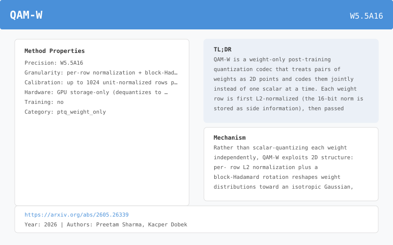

<em>QAM-W: row-normalize -> block-Hadamard rotate -> pair into 2D coordinates -> joint Lloyd-Max codebook quantization with activation-aware per-channel scaling.</em>

```mermaid
flowchart LR
    A[FP16 Weights] --> B[Calibration data:\nyes]
    B --> C[Compute scale\nand zero-point]
    C --> D[Quantize weights\nto W5.5A16]
    D --> E[Outlier handling:\nrow L2-normalization and block]
    E --> F[Quantized model\nW5.5A16]
```

> QAM-W is a weight-only post-training quantization codec that treats pairs of weights as 2D points and codes them jointly instead of one scalar at a time. Each weight row is first L2-normalized (the 16-bit norm is stored as side information), then passed through a block- Hadamard rotation so the coordinates look like samples from a circular Gaussian. Adjacent coordinates are grouped into 2D pairs and quantized against a single Lloyd-Max codebook trained on that unit circular Gaussian, with an AWQ-style per-channel scale applied so that channels feeding large activations get finer resolution. At roughly 5.5 bits per weight the activation-aware variant stays within about 0.4% of BF16 WikiText-2 perplexity on five models from 1.1B to 13B parameters, reaching SmoothQuant W8A8 quality at around 32% fewer weight bits. The current implementation only reduces storage, dequantizing to BF16 before the matmul.

| Field | Value |
|-------|-------|
| Published at | arXiv (preprint) |
| Paper | [2605.26339](https://arxiv.org/abs/2605.26339) |
| Precision | W5.5A16 |
| Granularity | per-row normalization + block-Hadamard rotation, then 2D-pair codebook; per-channel activation-aware scaling |
| Calibration | up to 1024 unit-normalized rows per weight matrix for pair-scale (sigma_k) estimation; AWQ-style per-channel scale from layer-input RMS statistics |
| Symmetric? | symmetric |
| Outlier handling | row L2-normalization and block-Hadamard rotation to Gaussianize/spread coordinates, plus AWQ-style activation-aware per-channel scaling |
| Hardware target | GPU storage-only (dequantizes to BF16 before matmul; no fused dequant-matmul kernel yet) |
| Training needed? | no |
| Calibration data? | yes |
| Typical degradation | within +-0.4% of BF16 WikiText-2 perplexity at ~5.5 bpw across five models; e.g. Llama-2-7B +0.29% (4.7664 vs 4.7527 BF16), Mistral-7B +0.1%, Qwen2.5-3B +0.3%, TinyLlama-1.1B +0.4% |
| Builds on | [awq](#awq) · [quip-sharp](#quip-sharp) · [quarot](#quarot) · [squeezellm](#squeezellm) |
| Related | [qtip](#qtip) · [aqlm](#aqlm) · [smoothquant](#smoothquant) · [quip](#quip) |

**How it works:**

Rather than scalar-quantizing each weight independently, QAM-W exploits 2D structure: per- row L2 normalization plus a block-Hadamard rotation reshapes weight distributions toward an isotropic Gaussian, after which consecutive coordinates are paired into 2D points and quantized with a shared Lloyd-Max codebook optimized for the unit circular Gaussian. A per- pair scale sigma_k (estimated from up to 1024 calibration rows) plus an AWQ-style per- channel activation-aware scale (exponent alpha=0.3, grid-tuned not learned) allocate codebook resolution to the channels that matter most for layer output. Joint 2D coding beats polar (amplitude x phase) coding by 2-15 perplexity points at equal bitrate. Bits-per-weight follows bpw = B/2 + 16/d_in, where B is bits per pair and 16 bits/row store the norm.

---

### XFP · W3-W4 (~3.4 effective bits) A16 · PTQ W-only · 2026-05

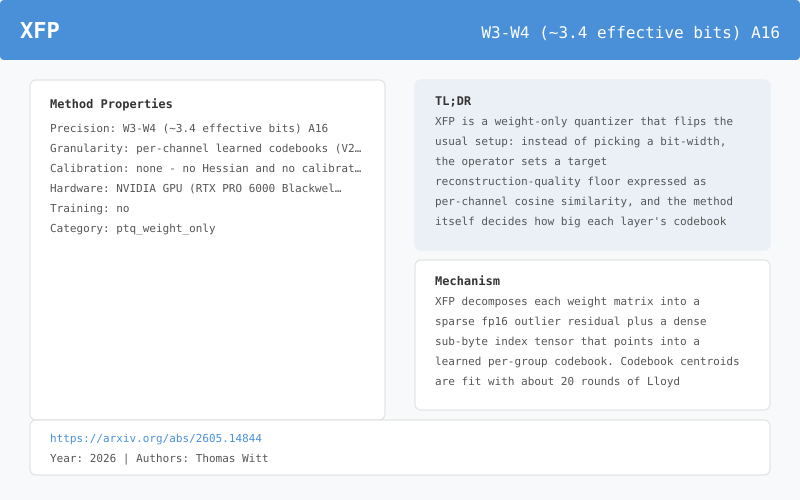

<em>XFP: split weights into sparse fp16 outliers plus sub-byte indices into a Lloyd-learned codebook, sized automatically to meet a per-channel cosine-similarity quality floor.</em>

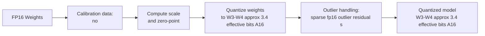
```mermaid
flowchart LR
    A[FP16 Weights] --> B[Calibration data:\nno]
    B --> C[Compute scale\nand zero-point]
    C --> D[Quantize weights\nto W3-W4 approx 3.4 effective bits A16]
    D --> E[Outlier handling:\nsparse fp16 outlier residual s]
    E --> F[Quantized model\nW3-W4 approx 3.4 effective bits A16]
```

> XFP is a weight-only quantizer that flips the usual setup: instead of picking a bit-width, the operator sets a target reconstruction-quality floor expressed as per-channel cosine similarity, and the method itself decides how big each layer's codebook should be, how many outliers to keep in full precision, and how to pack the result. Each weight matrix is split into a sparse fp16 residual that holds the largest outliers and a dense tensor of sub-byte indices into a per-group codebook learned by Lloyd iteration on the remaining bulk weights. Because no Hessian or calibration data is used, quantization runs without any forward passes over sample text. It is built mainly for Mixture-of-Experts models, using a stricter quality floor for attention and shared experts and a looser one for routed experts, and an outer loop adjusts those two thresholds until a model just fits a given memory budget while still producing usable output.

| Field | Value |
|-------|-------|
| Published at | arXiv (preprint) |
| Paper | [2605.14844](https://arxiv.org/abs/2605.14844) |
| Code | [tree/multiquant](https://github.com/flash7777/vllm/tree/multiquant) |
| Precision | W3-W4 (~3.4 effective bits) A16 |
| Granularity | per-channel learned codebooks (V2) or 32 shared codebooks per layer (V2a); per-group indices |
| Calibration | none - no Hessian and no calibration data; quality floors drive an iterative search |
| Symmetric? | asymmetric |
| Outlier handling | sparse fp16 outlier residual separated from the dense codebook-indexed bulk, with an auto-determined per-layer outlier budget |
| Hardware target | NVIDIA GPU (RTX PRO 6000 Blackwell workstation); unified decode kernel in a vLLM branch |
| Training needed? | no |
| Calibration data? | no |
| Typical degradation | 94.49% GSM8K strict-match on Qwen3.5-122B-A10B (V2, INT4-equivalent); 66.72% GSM8K on Qwen3.5-397B-A17B at ~3.4 effective bits |
| Builds on | [squeezellm](#squeezellm) · [spqr](#spqr) · [aqlm](#aqlm) |
| Related | [squeezellm](#squeezellm) · [spqr](#spqr) · [aqlm](#aqlm) · [marlin](#marlin) · [vllm-quant](#vllm-quant) |

**How it works:**

XFP decomposes each weight matrix into a sparse fp16 outlier residual plus a dense sub-byte index tensor that points into a learned per-group codebook. Codebook centroids are fit with about 20 rounds of Lloyd assignment-and-update on the outlier-cleaned bulk distribution, offered in a per-channel mode (V2) and a mode that shares a library of 32 codebooks per layer (V2a) behind a common decode kernel. The user specifies two per-channel cosine- similarity floors (strict for attention/shared experts, lazy for routed MoE experts) and the system automatically selects codebook size, outlier budget, and packing per layer to meet them. An outer H-Process iterates over the two thresholds to find the operating point where a model just fits the available hardware memory while still producing sensible output.

---

### ADMM-Q · W2A16/W3A16/W4A16 (also composes to W4A8, W2A4KV4, W4A4KV4) · PTQ W-only · 2026-05

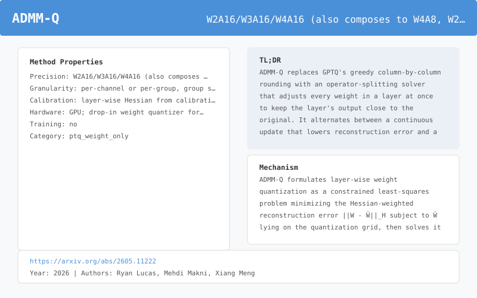

<em>ADMM operator splitting: alternate continuous Hessian-weighted updates with projection onto the quantization grid, annealing the dual penalty until weights land on the grid.</em>

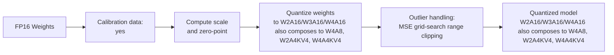
```mermaid
flowchart LR
    A[FP16 Weights] --> B[Calibration data:\nyes]
    B --> C[Compute scale\nand zero-point]
    C --> D[Quantize weights\nto W2A16/W3A16/W4A16 also composes to W4A8, W2A4KV4, W4A4KV4]
    D --> E[Outlier handling:\nMSE grid-search range clipping]
    E --> F[Quantized model\nW2A16/W3A16/W4A16 also composes to W4A8, W2A4KV4, W4A4KV4]
```

> ADMM-Q replaces GPTQ's greedy column-by-column rounding with an operator-splitting solver that adjusts every weight in a layer at once to keep the layer's output close to the original. It alternates between a continuous update that lowers reconstruction error and a step that nudges weights toward the nearest allowed quantized values, gradually tightening the quantization constraint until the weights actually land on the grid. Extra tricks (a penalty schedule, preconditioning, and a final local-search pass that flips individual weights) make it run efficiently and converge reliably. Because it only changes how the weights are picked, it slots into existing pipelines and stacks with clipping, rotations, and activation scaling, with the biggest gains showing up at aggressive sub-4-bit settings.

| Field | Value |
|-------|-------|
| Published at | arXiv (preprint) |
| Paper | [2605.11222](https://arxiv.org/abs/2605.11222) |
| Precision | W2A16/W3A16/W4A16 (also composes to W4A8, W2A4KV4, W4A4KV4) |
| Granularity | per-channel or per-group, group size 128 tested |
| Calibration | layer-wise Hessian from calibration-sample input activations (unlabeled) |
| Symmetric? | mixed |
| Outlier handling | MSE grid-search range clipping (100 grid points, max shrink 0.8); composable with SmoothQuant per-channel scaling and SpinQuant rotations |
| Hardware target | GPU; drop-in weight quantizer for existing W4A16/W4A8/W4A4 inference pipelines |
| Training needed? | no |
| Calibration data? | yes |
| Typical degradation | Qwen3-8B WikiText-2 ppl vs GPTQ: W3A16 10.06 vs 12.85; W4A8 (SmoothQuant) 8.68 vs 9.29; W2A4KV4 (SpinQuant) 19.42 vs 66.11. LLaMA-3-8B W4A4KV4 (SpinQuant) 7.26 vs GPTQ 7.34 |
| Builds on | [gptq](#gptq) · [obs](#obs) |
| Related | [spqr](#spqr) · [quip](#quip) · [smoothquant](#smoothquant) · [spinquant](#spinquant) · [quarot](#quarot) · [awq](#awq) |

**How it works:**

ADMM-Q formulates layer-wise weight quantization as a constrained least-squares problem minimizing the Hessian-weighted reconstruction error ||W - Ŵ||_H subject to Ŵ lying on the quantization grid, then solves it with a combinatorial variant of the Alternating Direction Method of Multipliers. It splits the problem into a continuous primal variable and a discrete (quantized) copy linked by a dual variable: one block solves a Hessian-regularized continuous update, the other projects onto the discrete codebook, and the dual penalty is annealed on a schedule so the continuous solution is steadily pulled onto the grid with convergence guarantees. Preconditioning accelerates the continuous solves and a local-search post-processing step greedily flips individual quantized weights to escape poor local minima. Unlike GPTQ's one-pass greedy error feedback, all weights in the layer are optimized jointly and iteratively.

---

### OSAQ · W2/W3/W4 A16 · PTQ W-only · 2026-05

<em>OSAQ estimates the layer Hessian from calibration data, extracts its stable null space (directions of vanishing curvature), and adds a closed-form null-space combination to the weights to suppress outliers without changing the layer output; the transformed weights are then quantized (e.g. with GPTQ) at 2-4 bits with no inference overhead.</em>

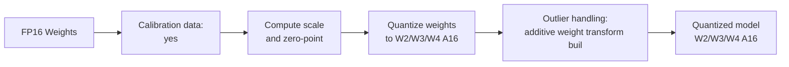
```mermaid
flowchart LR
    A[FP16 Weights] --> B[Calibration data:\nyes]
    B --> C[Compute scale\nand zero-point]
    C --> D[Quantize weights\nto W2/W3/W4 A16]
    D --> E[Outlier handling:\nadditive weight transform buil]
    E --> F[Quantized model\nW2/W3/W4 A16]
```

> OSAQ is a preprocessing step for weight-only LLM quantization that reshapes a layer's weights so they are easier to round to very low bit-widths. The authors notice that the layer's Hessian (which measures how much each weight direction affects the loss) is consistently low-rank across different inputs, meaning some directions barely matter. They build an additive correction out of those flat directions and add it to the weights to flatten out large outlier values, which leaves the layer's output essentially unchanged. Because the correction is computed in closed form and folded directly into the weights ahead of time, it adds no training cost and no inference cost, and it can be stacked in front of an existing quantizer like GPTQ.

| Field | Value |
|-------|-------|
| Published at | **ICML 2026** |
| Paper | [2605.04738](https://arxiv.org/abs/2605.04738) |
| Precision | W2/W3/W4 A16 |
| Granularity | per-channel and per-group (group size 128) |
| Calibration | 128 sequences x 2048 tokens, unlabeled (to estimate the Hessian) |
| Symmetric? | asymmetric |
| Outlier handling | additive weight transform built from the stable null space of the layer Hessian; outliers are absorbed into directions of vanishing curvature so task loss is unchanged |
| Hardware target | GPU; absorbed into weights offline so existing W4A16/W2A16 inference kernels apply with no added overhead |
| Training needed? | no |
| Calibration data? | yes |
| Typical degradation | LLaMA2-13B W2A16 g128: WikiText-2 perplexity 28.1 (GPTQ) -> 13.4 (OSAQ+GPTQ), over 40% lower; tested up to LLaMA-3.1-405B |
| Builds on | [gptq](#gptq) |
| Related | [quip](#quip) · [quarot](#quarot) · [spinquant](#spinquant) · [duquant](#duquant) · [owq](#owq) · [spqr](#spqr) |

**How it works:**

OSAQ observes that the layer-wise Hessian H exhibits low-rank consistency across calibration inputs, so a stable set of directions have vanishing curvature (the Hessian null space). It constructs an additive weight transform W' = W + delta, where delta is a linear combination of vectors spanning this null space, chosen to minimize the magnitude of weight outliers. Because delta lies in the null space, the change to the task loss is (to second order) zero, so accuracy is preserved while the weight distribution becomes flatter and easier to quantize. The optimal coefficients are obtained by a closed-form least-squares solution, and delta is absorbed into the weights offline, requiring no inter-layer transforms (unlike rotation methods) and adding no inference overhead; it is applied as a front-end to standard quantizers such as GPTQ.

---

### SLQ · W3.3-W6.6 A16 (per-layer mixed; ~3.3-4.7 bits task-lossless, ~5-6.6 bits distribution-lossless) · PTQ W-only · 2026-05

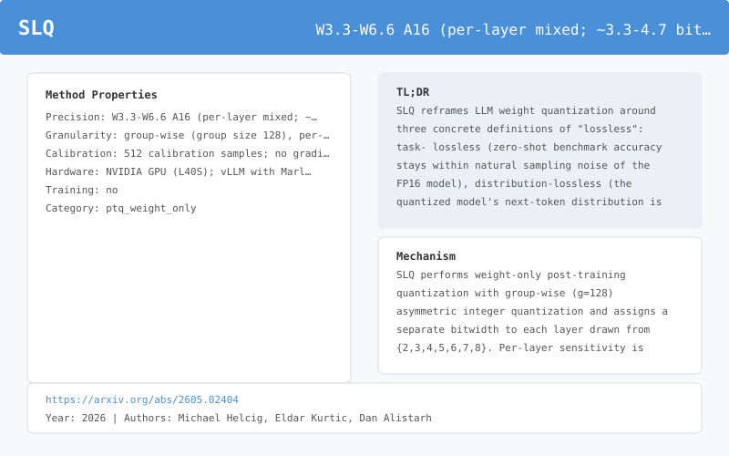

<em>SLQ: per-layer Shapley sensitivity scoring feeds an ILP that allocates bitwidths {2..8} to meet a task- or distribution-lossless target under group-wise asymmetric quantization.</em>

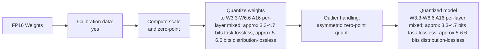
```mermaid
flowchart LR
    A[FP16 Weights] --> B[Calibration data:\nyes]
    B --> C[Compute scale\nand zero-point]
    C --> D[Quantize weights\nto W3.3-W6.6 A16 per-layer mixed; approx 3.3-4.7 bits task-lossless, approx 5-6.6 bits distribution-lossless]
    D --> E[Outlier handling:\nasymmetric zero-point quanti]
    E --> F[Quantized model\nW3.3-W6.6 A16 per-layer mixed; approx 3.3-4.7 bits task-lossless, approx 5-6.6 bits distribution-lossless]
```

> SLQ reframes LLM weight quantization around three concrete definitions of "lossless": task- lossless (zero-shot benchmark accuracy stays within natural sampling noise of the FP16 model), distribution-lossless (the quantized model's next-token distribution is practically interchangeable with the original), and a theoretical argument that asymmetric integer quantization injects less error than symmetric. To hit a chosen losslessness target at the fewest bits, it scores how much each layer is hurt by each candidate bitwidth and then solves an integer program that hands out bits per layer, so easy layers go low and sensitive ones stay high. The result is post-training, calibration-only (no fine-tuning), and reaches roughly 3.3 bits per parameter while preserving benchmark accuracy, with measured 1.7-3.6x throughput gains over FP16 using optimized mixed-bitwidth kernels.

| Field | Value |
|-------|-------|
| Published at | arXiv (preprint) |
| Paper | [2605.02404](https://arxiv.org/abs/2605.02404) |
| Code | [IST-DASLab/SLQ](https://github.com/IST-DASLab/SLQ) |
| Precision | W3.3-W6.6 A16 (per-layer mixed; ~3.3-4.7 bits task-lossless, ~5-6.6 bits distribution-lossless) |
| Granularity | group-wise (group size 128), per-layer bitwidth from {2,3,4,5,6,7,8} |
| Calibration | 512 calibration samples; no gradient updates |
| Symmetric? | asymmetric |
| Outlier handling | asymmetric (zero-point) quantization plus GPTQ-style second-order error compensation; higher per-layer bitwidths allocated to sensitive layers |
| Hardware target | NVIDIA GPU (L40S); vLLM with Marlin-based mixed-bitwidth kernels for 4-8 bit weight-only inference |
| Training needed? | no |
| Calibration data? | yes |
| Typical degradation | task-lossless at ~3.3 bits (e.g. Qwen3.5-27B at 3.30 bits, ~0.991 avg accuracy recovery vs FP16 across ARC-Challenge, GSM8K, GSM8K-CoT, IFEval, MMLU-CoT, MMLU-Pro); also evaluated on Qwen3-8B, Qwen3-32B, Llama-3.3-70B-Instruct |
| Builds on | [gptq](#gptq) · [owq](#owq) · [spqr](#spqr) |
| Related | [awq](#awq) · [squeezellm](#squeezellm) · [marlin](#marlin) · [autoround](#autoround) |

**How it works:**

SLQ performs weight-only post-training quantization with group-wise (g=128) asymmetric integer quantization and assigns a separate bitwidth to each layer drawn from {2,3,4,5,6,7,8}. Per-layer sensitivity is estimated with a multi-bitwidth Shapley-style attribution over calibration data, and an integer linear program then allocates bits across layers to minimize predicted degradation under a fidelity constraint. Two fidelity targets are defined: task-lossless (accuracy within sampling variance) and distribution-lossless, the latter measured by Expected Acceptance Rate (EAR), the average of sum_k min(p(k), q(k)) between original and quantized token distributions, which equals the maximum token-agreement probability under optimal coupling. A gamma-squared variance law motivates using asymmetric over symmetric quantization to reduce noise variance.

---

### GSQ · W2/W3 A16 · PTQ W-only · 2026-04

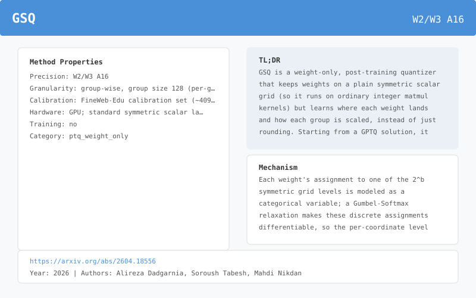

<em>GSQ: Gumbel-Softmax relaxation of discrete scalar-grid assignments, jointly learned with per-group scales, warm-started from GPTQ.</em>

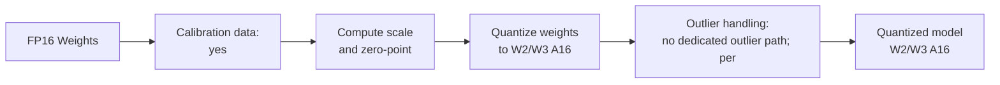
```mermaid
flowchart LR
    A[FP16 Weights] --> B[Calibration data:\nyes]
    B --> C[Compute scale\nand zero-point]
    C --> D[Quantize weights\nto W2/W3 A16]
    D --> E[Outlier handling:\nno dedicated outlier path; per]
    E --> F[Quantized model\nW2/W3 A16]
```

> GSQ is a weight-only, post-training quantizer that keeps weights on a plain symmetric scalar grid (so it runs on ordinary integer matmul kernels) but learns where each weight lands and how each group is scaled, instead of just rounding. Starting from a GPTQ solution, it treats the choice of grid point for each weight as a discrete decision and relaxes that decision with a Gumbel-Softmax so it can be tuned by gradient descent against calibration data, jointly with the per-group scales. The goal is to get close to the accuracy of much heavier vector- and trellis-quantized methods at 2 and 3 bits while staying simple to deploy. The authors show it holds up on Llama-3.1-8B/70B and even scales to a trillion-parameter Mixture-of-Experts model (Kimi-K2.5) where vector quantization is hard to apply.

| Field | Value |
|-------|-------|
| Published at | arXiv (preprint) |
| Paper | [2604.18556](https://arxiv.org/abs/2604.18556) |
| Code | [IST-DASLab/GSQ](https://github.com/IST-DASLab/GSQ) |
| Precision | W2/W3 A16 |
| Granularity | group-wise, group size 128 (per-group scale) |
| Calibration | FineWeb-Edu calibration set (~4096 sequences of length 4096); warm-started from a GPTQ solution |
| Symmetric? | symmetric |
| Outlier handling | no dedicated outlier path; per-group scales plus learned grid assignments absorb in-group dynamic range |
| Hardware target | GPU; standard symmetric scalar layers compatible with existing scalar inference kernels (e.g. Humming kernels on NVIDIA L40s, up to ~6.2x speedup over BF16 at 2-bit) |
| Training needed? | no |
| Calibration data? | yes |
| Typical degradation | On Llama-3.1-70B-Instruct at 2-bit, ~75.6% average zero-shot accuracy across ARC-C/ARC-E/HellaSwag/PIQA/WinoGrande, vs ~77.3% for QTIP (vector quant) and ~71.4% for EfficientQAT (scalar); closes most of the scalar-to-VQ gap at 2-3 bits |
| Builds on | [gptq](#gptq) |
| Related | [qtip](#qtip) · [aqlm](#aqlm) · [quip-sharp](#quip-sharp) · [pv-tuning](#pv-tuning) · [efficientqat](#efficientqat) · [awq](#awq) |

**How it works:**

Each weight's assignment to one of the 2^b symmetric grid levels is modeled as a categorical variable; a Gumbel-Softmax relaxation makes these discrete assignments differentiable, so the per-coordinate level choices and the per-group scales are optimized jointly by gradient descent on a calibration objective. Optimization is warm-started from a GPTQ solution and a temperature schedule anneals the soft assignments toward hard (one-hot) grid choices by the end of training. Because the output is a standard symmetric per-group scalar quantization, no special vector-quantization codebooks or custom decode kernels are needed at inference. This lets GSQ approach the accuracy of QTIP/AQLM-style vector quantization at 2-3 bits while remaining a scalar format.

---

### DASH-Q · W2A16 · PTQ W-only · 2026-04

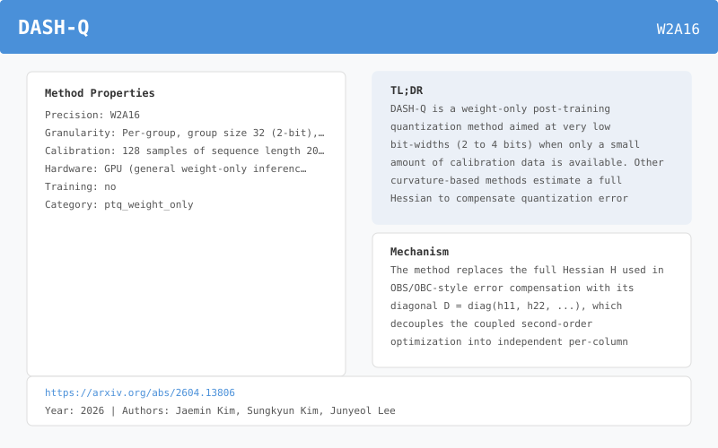

<em>DASH-Q discards off-diagonal Hessian terms, keeping only the diagonal curvature D = diag(h11, h22, ...) to turn second-order error compensation into independent per-column weighted least squares problems solved iteratively for stable 2-bit weight-only quantization.</em>

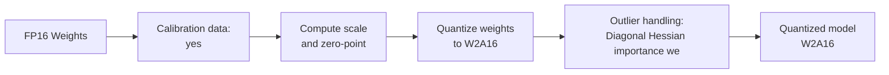
```mermaid
flowchart LR
    A[FP16 Weights] --> B[Calibration data:\nyes]
    B --> C[Compute scale\nand zero-point]
    C --> D[Quantize weights\nto W2A16]
    D --> E[Outlier handling:\nDiagonal Hessian importance we]
    E --> F[Quantized model\nW2A16]
```

> DASH-Q is a weight-only post-training quantization method aimed at very low bit-widths (2 to 4 bits) when only a small amount of calibration data is available. Other curvature-based methods estimate a full Hessian to compensate quantization error across channels, but with limited calibration samples those cross-channel estimates become noisy and hurt accuracy at low bit-widths. DASH-Q keeps only the diagonal of the Hessian, treating each weight column independently, and solves an iterative weighted least squares problem so that columns carrying more signal power are preserved more carefully. The result is a quantizer that stays stable with few calibration samples and runs much faster than optimization-heavy alternatives, while improving accuracy in the 2-bit regime.

| Field | Value |
|-------|-------|
| Published at | **EuroMLSys 2026** |
| Paper | [2604.13806](https://arxiv.org/abs/2604.13806) |
| Precision | W2A16 |
| Granularity | Per-group, group size 32 (2-bit), 64 (3-bit), 128 (4-bit) |
| Calibration | 128 samples of sequence length 2048 from WikiText-2 training set |
| Symmetric? | asymmetric |
| Outlier handling | Diagonal Hessian importance weighting that prioritizes preservation of salient feature power; off-diagonal (cross-channel) curvature terms are discarded as noise rather than using a separate outlier path |
| Hardware target | GPU (general weight-only inference); no custom kernel introduced |
| Training needed? | no |
| Calibration data? | yes |
| Typical degradation | At 2-bit weight-only on Llama-3.1-8B: 56.52% average zero-shot accuracy across 8 tasks (ARC-C/E, BoolQ, HellaSwag, OBQA, PIQA, SIQA, Winogrande), reported as +14.01% over the strongest baseline and +7.01% average improvement across five models (Llama-3.1-8B, Qwen3-14B, DeepSeek-MoE-16B, Phi-3.5-MoE, Mixtral-8x7B); up to 74.5x faster quantization than optimization-based PTQ baselines |
| Builds on | [obs](#obs) · [obq](#obq) · [gptq](#gptq) |
| Related | [awq](#awq) · [quip](#quip) · [owq](#owq) · [spqr](#spqr) · [squeezellm](#squeezellm) · [rtn](#rtn) · [quarot](#quarot) |

**How it works:**

The method replaces the full Hessian H used in OBS/OBC-style error compensation with its diagonal D = diag(h11, h22, ...), which decouples the coupled second-order optimization into independent per-column weighted least squares subproblems that have closed-form solutions. The diagonal weights act as importance scores that emphasize columns with high feature power, while discarding noise-prone off-diagonal dependencies that are poorly estimated from limited calibration data. Quantization uses asymmetric affine group-wise rounding (group sizes 32/64/128 for 2/3/4-bit), and the weighted least squares step is applied iteratively to refine the assignment without any retraining.

---

### CAE (ResComp) · W2/W3 A16 · PTQ W-only · 2026-04

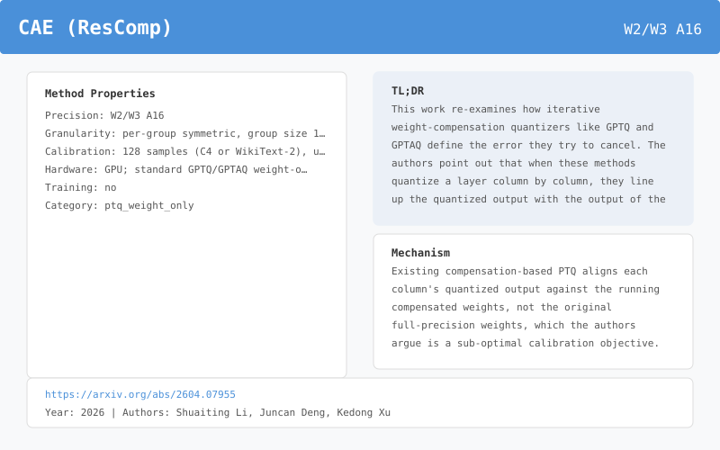

<em>Column-wise weight quantization with two residual-error sources fed into the inverse-Hessian update: the cross-layer output difference (as in GPTAQ) plus the new intra-layer compensation-aware error between compensated and original weights, both aligned to the original full-precision output.</em>

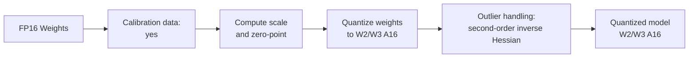
```mermaid
flowchart LR
    A[FP16 Weights] --> B[Calibration data:\nyes]
    B --> C[Compute scale\nand zero-point]
    C --> D[Quantize weights\nto W2/W3 A16]
    D --> E[Outlier handling:\nsecond-order inverse Hessian]
    E --> F[Quantized model\nW2/W3 A16]
```

> This work re-examines how iterative weight-compensation quantizers like GPTQ and GPTAQ define the error they try to cancel. The authors point out that when these methods quantize a layer column by column, they line up the quantized output with the output of the already- compensated weights instead of the original full-precision weights, which is the wrong target. They reframe the objective to always match the true full-precision output, and show this introduces an extra error source they call the compensation-aware error: the gap between compensated and original weights inside the same layer. Folding this term into the column update (reusing GPTAQ's neuron-decomposition trick) costs only about 5 percent more quantization time and noticeably improves accuracy, with the biggest gains showing up at 3-bit and 2-bit weight-only settings.

| Field | Value |
|-------|-------|
| Published at | **ICLR 2026** |
| Paper | [2604.07955](https://arxiv.org/abs/2604.07955) |
| Code | [list0830/ResComp](https://github.com/list0830/ResComp) |
| Precision | W2/W3 A16 |
| Granularity | per-group symmetric, group size 128 |
| Calibration | 128 samples (C4 or WikiText-2), unlabeled |
| Symmetric? | symmetric |
| Outlier handling | second-order (inverse Hessian) error compensation, augmented with a compensation-aware error term; pairs with QuaRot rotation for 2-bit |
| Hardware target | GPU; standard GPTQ/GPTAQ weight-only inference kernels |
| Training needed? | no |
| Calibration data? | yes |
| Typical degradation | GPTQ+CAE cuts Llama2-7B 3-bit C4 perplexity from 13.60 to 8.34; GPTAQ+CAE reaches 8.19 (vs 8.40); 2-bit + QuaRot on Llama2-13B: WikiText-2 7.32 vs 7.50 for GPTAQ |
| Builds on | [gptq](#gptq) · [quarot](#quarot) |
| Related | [obq](#obq) · [obs](#obs) · [spinquant](#spinquant) · [quip](#quip) |

**How it works:**

Existing compensation-based PTQ aligns each column's quantized output against the running compensated weights, not the original full-precision weights, which the authors argue is a sub-optimal calibration objective. They redefine the per-step objective to align the quantized output directly with the original full-precision output, exposing a second residual-error source beyond the usual cross-layer output difference: the discrepancy between compensated and original weights within the layer, named the compensation-aware error. Using GPTAQ's neuron-decomposition, this extra term is incorporated efficiently into the standard inverse-Hessian column update with minimal overhead. The enhancement is drop-in for both GPTQ and GPTAQ and is combined with QuaRot rotation for 2-bit settings.

---

### OA-EM · W2A16 · PTQ W-only · 2026-04

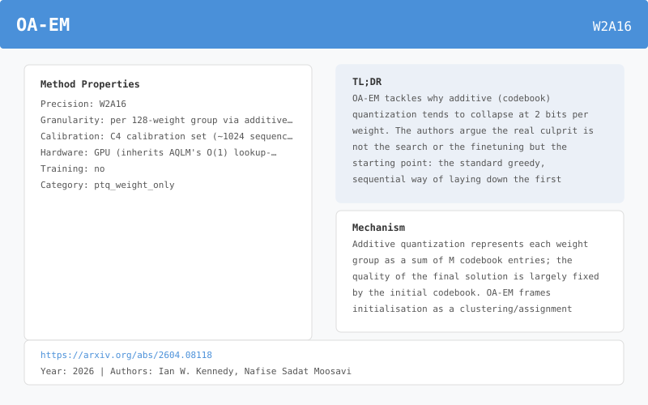

<em>OA-EM: Hessian-weighted Mahalanobis EM initialisation of the additive codebook places 2-bit optimisation in a better basin than greedy sequential init.</em>

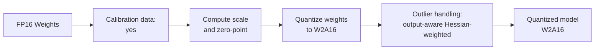
```mermaid
flowchart LR
    A[FP16 Weights] --> B[Calibration data:\nyes]
    B --> C[Compute scale\nand zero-point]
    C --> D[Quantize weights\nto W2A16]
    D --> E[Outlier handling:\noutput-aware Hessian-weighted]
    E --> F[Quantized model\nW2A16]
```

> OA-EM tackles why additive (codebook) quantization tends to collapse at 2 bits per weight. The authors argue the real culprit is not the search or the finetuning but the starting point: the standard greedy, sequential way of laying down the first codebook drops the model into a poor region that later beam search and PV-tuning cannot climb out of. They introduce a representational ratio that relates how many weight groups must be encoded to how much capacity the codebooks actually have, and use it to reason about when initialisation matters most. Their fix replaces greedy placement with an EM procedure that assigns weight groups to codebook entries using a Hessian-weighted Mahalanobis distance, so the initialisation accounts for how much each weight affects the layer output. On small Llama and Qwen models this lowers 2-bit perplexity noticeably while keeping the same fast lookup-table inference as AQLM.

| Field | Value |
|-------|-------|
| Published at | arXiv (preprint) |
| Paper | [2604.08118](https://arxiv.org/abs/2604.08118) |
| Code | [kenno94-IK/aqlm-oaem](https://github.com/kenno94-IK/aqlm-oaem) |
| Precision | W2A16 |
| Granularity | per 128-weight group via additive codebook (K=256, M=2 codebooks) |
| Calibration | C4 calibration set (~1024 sequences) used to compute the output-aware Hessian for initialisation |
| Symmetric? | n/a |
| Outlier handling | output-aware (Hessian-weighted) codebook initialisation that steers optimisation into a better basin; magnitudes absorbed by additive multi-codebook representation |
| Hardware target | GPU (inherits AQLM's O(1) lookup-table dequantization kernels) |
| Training needed? | no |
| Calibration data? | yes |
| Typical degradation | Llama 3.2 3B at 2-bit: WikiText-2 ppl ~11.53 with OA-EM vs ~12.66 with greedy sequential initialisation |
| Builds on | [aqlm](#aqlm) · [pv-tuning](#pv-tuning) |
| Related | [quip-sharp](#quip-sharp) · [gptq](#gptq) · [squeezellm](#squeezellm) · [qtip](#qtip) |

**How it works:**

Additive quantization represents each weight group as a sum of M codebook entries; the quality of the final solution is largely fixed by the initial codebook. OA-EM frames initialisation as a clustering/assignment problem solved by Expectation-Maximization, where the distance used to assign a weight group to a codebook centroid is a Hessian-weighted Mahalanobis distance (output-aware), rather than plain Euclidean distance over raw weights. This biases the initial codebook toward minimizing the layer's output reconstruction error, placing the model in a better optimisation basin before the usual beam-search code updates and PV-tuning finetuning are applied. The authors analyse this through the representational ratio rho = N/(K*M), which characterizes the tension between the number of weight groups and the codebook capacity.

---

### RAMP · W2-W8 A16 mixed (per-layer) · PTQ W-only · 2026-03

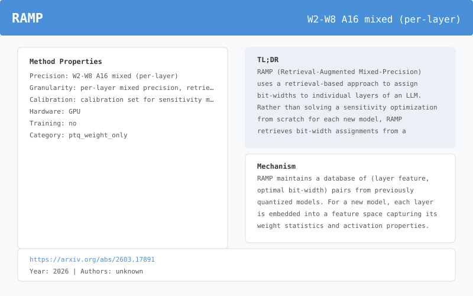

<em>RAMP: SAC reinforcement-learning policy assigns per-layer bit-widths under a global bit-budget.</em>

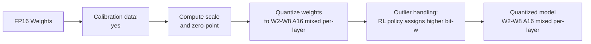
```mermaid
flowchart LR
    A[FP16 Weights] --> B[Calibration data:\nyes]
    B --> C[Compute scale\nand zero-point]
    C --> D[Quantize weights\nto W2-W8 A16 mixed per-layer]
    D --> E[Outlier handling:\nRL policy assigns higher bit-w]
    E --> F[Quantized model\nW2-W8 A16 mixed per-layer]
```

> RAMP (Reinforcement Adaptive Mixed-Precision) uses a Soft Actor-Critic (SAC) reinforcement-learning policy to automatically assign per-layer bit-widths to an LLM under a global bit-budget constraint. The RL agent observes each layer's sensitivity statistics and outputs a bit-width decision; the reward is a combination of model quality (perplexity) and constraint satisfaction. This replaces expensive evolutionary or gradient-based mixed-precision search with a learned, adaptive policy that generalizes across architectures.

| Field | Value |
|-------|-------|
| Published at | arXiv (preprint) |
| Paper | [2603.17891](https://arxiv.org/abs/2603.17891) |
| Precision | W2-W8 A16 mixed (per-layer) |
| Granularity | per-layer mixed precision, RL-guided |
| Calibration | small calibration set for sensitivity and reward estimation |
| Symmetric? | symmetric |
| Outlier handling | RL policy assigns higher bit-width to sensitive layers |
| Hardware target | GPU |
| Training needed? | no |
| Calibration data? | yes |
| Typical degradation | near-lossless at 4-bit average via intelligent per-layer bit allocation |
| Builds on | [gptq](#gptq) · [awq](#awq) |
| Related | [gptq](#gptq) · [awq](#awq) · [omniquant](#omniquant) · [spqr](#spqr) |

**How it works:**

RAMP formulates per-layer bit-width selection as a sequential decision problem and trains a SAC agent to solve it. Each layer is described by a feature vector of weight and activation statistics; the agent outputs a bit-width from a discrete action space (e.g. 2, 3, 4, 8 bits). A global bit-budget constraint is enforced via a Lagrangian penalty in the reward. RAMP also introduces "Scale Folding," which folds per-channel quantization scales into adjacent BatchNorm or LayerNorm parameters to eliminate scale overhead at inference time. The trained policy can be applied to new models without re-running the RL search from scratch.

---

### QTIP · W2 A16 · PTQ W-only · 2024-06

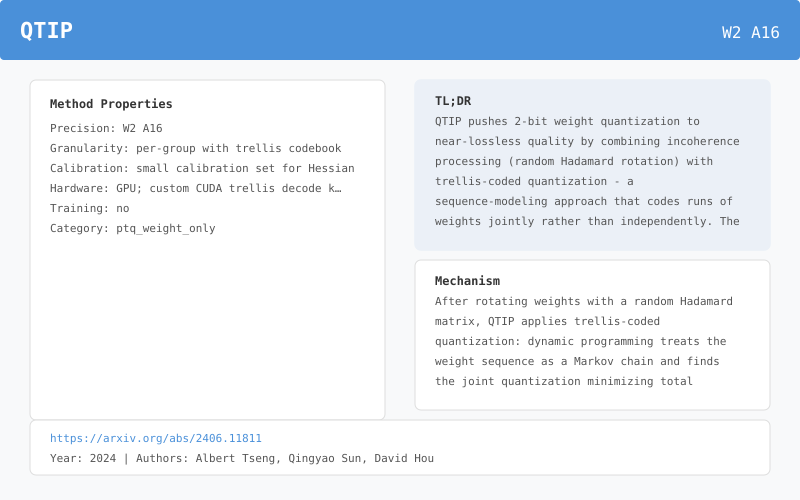

<em>QTIP: Hadamard rotation + trellis-coded joint quantization over weight sequences.</em>

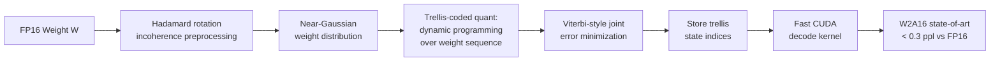
```mermaid
flowchart LR
    A[FP16 Weight W] --> B[Hadamard rotation\nincoherence preprocessing]
    B --> C[Near-Gaussian\nweight distribution]
    C --> D[Trellis-coded quant:\ndynamic programming\nover weight sequence]
    D --> E[Viterbi-style joint\nerror minimization]
    E --> F[Store trellis\nstate indices]
    F --> G[Fast CUDA\ndecode kernel]
    G --> H[W2A16 state-of-art\n< 0.3 ppl vs FP16]
```

> QTIP pushes 2-bit weight quantization to near-lossless quality by combining incoherence processing (random Hadamard rotation) with trellis-coded quantization - a sequence-modeling approach that codes runs of weights jointly rather than independently. The trellis codebook captures inter-weight correlations within a group, yielding significantly better rate-distortion than per-weight scalar codebooks. QTIP achieves state-of-the-art 2-bit results on LLaMA-2 70B with perplexity within 0.3 of FP16.

| Field | Value |
|-------|-------|
| Published at | **NeurIPS 2024** |
| Paper | [2406.11811](https://arxiv.org/abs/2406.11811) |
| Code | [Cornell-RelaxML/qtip](https://github.com/Cornell-RelaxML/qtip) |
| Precision | W2 A16 |
| Granularity | per-group with trellis codebook |
| Calibration | small calibration set for Hessian |
| Symmetric? | symmetric |
| Outlier handling | incoherence processing (Hadamard rotation) before trellis coding |
| Hardware target | GPU; custom CUDA trellis decode kernel |
| Training needed? | no |
| Calibration data? | yes |
| Typical degradation | < 0.3 ppl vs FP16 at W2 on LLaMA-2-70B |
| Builds on | [quip-sharp](#quip-sharp) · [quip](#quip) · [gptq](#gptq) |
| Related | [quip-sharp](#quip-sharp) · [aqlm](#aqlm) · [hqq](#hqq) |

**How it works:**

After rotating weights with a random Hadamard matrix, QTIP applies trellis-coded quantization: dynamic programming treats the weight sequence as a Markov chain and finds the joint quantization minimizing total squared error across the group. This is analogous to Viterbi decoding on a trellis. Results are stored as trellis-state indices decoded at inference via a fast CUDA kernel. Builds on QuIP# incoherence preprocessing and adds sequence-level coding on top.

---

### QuaRot / Quant-LLM (FP6) · W4/W6 A16 · PTQ W-only · 2024-05

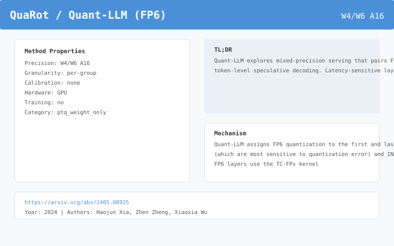

<em>Mixed FP6/INT4 per-layer assignment with speculative decoding compensation.</em>

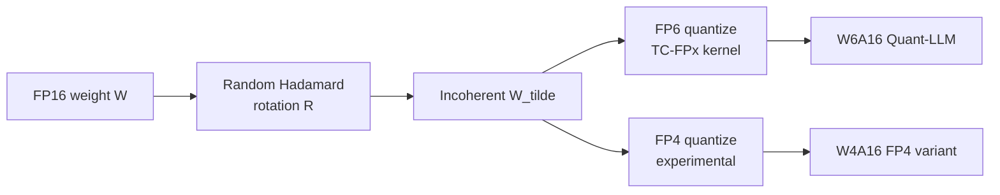
```mermaid
flowchart LR
    A[FP16 weight W] --> B[Random Hadamard\nrotation R]
    B --> C[Incoherent W_tilde]
    C --> D[FP6 quantize\nTC-FPx kernel]
    D --> E[W6A16 Quant-LLM]
    C --> F[FP4 quantize\nexperimental]
    F --> G[W4A16 FP4 variant]
```

> Quant-LLM explores mixed-precision serving that pairs FP6 weight quantization with token-level speculative decoding. Latency-sensitive layers get W6A16 (FP6 weights) for high quality, while less sensitive layers get W4A16. Speculative decoding with a small draft model compensates for the quality gap of the lower-precision layers. This co-design approach targets serving throughput rather than the quantization algorithm itself.

| Field | Value |
|-------|-------|
| Published at | arXiv (preprint) |
| Paper | [2405.08925](https://arxiv.org/abs/2405.08925) |
| Precision | W4/W6 A16 |
| Granularity | per-group |
| Calibration | none |
| Symmetric? | symmetric |
| Outlier handling | floating-point format; speculative decoding for mixed-bit layers |
| Hardware target | GPU |
| Training needed? | no |
| Calibration data? | no |
| Typical degradation | competitive with GPTQ at same effective bit-width |
| Builds on | [fp6-llm](#fp6-llm) · [gptq](#gptq) |
| Related | [fp6-llm](#fp6-llm) · [awq](#awq) · [marlin](#marlin) |

**How it works:**

Quant-LLM assigns FP6 quantization to the first and last layers of the transformer (which are most sensitive to quantization error) and INT4 to the middle layers. The FP6 layers use the TC-FPx kernel from FP6-LLM for efficient dequantization. Token-level speculative decoding (accepting draft tokens only when the draft quality is high) partially masks the perplexity gap from lower-precision layers. The net result is higher serving throughput per GPU at near-equivalent quality vs. uniform FP16 or W4A16.

---

### QuIP# · W2/W3/W4 A16 · PTQ W-only · 2024-02

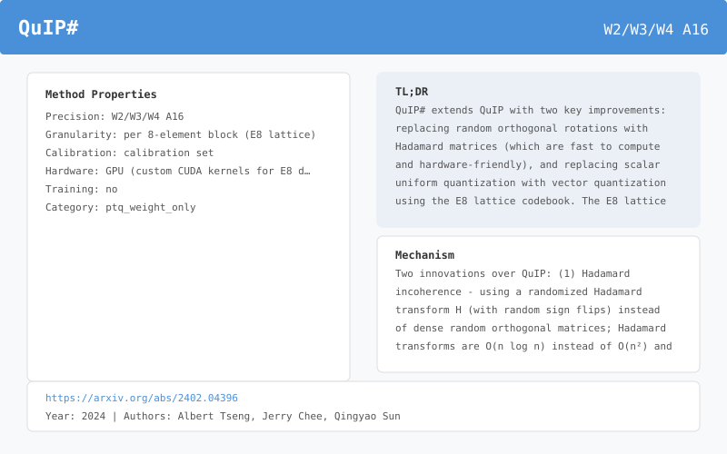

<em>Hadamard incoherence + E8 lattice vector quantization for 2-bit PTQ.</em>

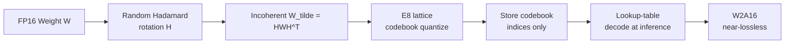
```mermaid
flowchart LR
    A[FP16 Weight W] --> B[Random Hadamard\nrotation H]
    B --> C[Incoherent W_tilde = HWH^T]
    C --> D[E8 lattice\ncodebook quantize]
    D --> E[Store codebook\nindices only]
    E --> F[Lookup-table\ndecode at inference]
    F --> G[W2A16\nnear-lossless]
```

> QuIP# extends QuIP with two key improvements: replacing random orthogonal rotations with Hadamard matrices (which are fast to compute and hardware-friendly), and replacing scalar uniform quantization with vector quantization using the E8 lattice codebook. The E8 lattice is the densest known 8-dimensional integer lattice; using it as a codebook allows more efficient representation of 8 values simultaneously than 8 independent scalar quantizations. Together, these make QuIP# the best-known 2-bit PTQ method as of 2024, achieving near-FP16 perplexity at 2 bits on LLaMA-2 scale.

| Field | Value |
|-------|-------|
| Published at | **NeurIPS 2024** |
| Paper | [2402.04396](https://arxiv.org/abs/2402.04396) |
| Code | [Cornell-RelaxML/quip-sharp](https://github.com/Cornell-RelaxML/quip-sharp) |
| Precision | W2/W3/W4 A16 |
| Granularity | per 8-element block (E8 lattice) |
| Calibration | calibration set |
| Symmetric? | symmetric |
| Outlier handling | Hadamard incoherence + E8 lattice vector quantization |
| Hardware target | GPU (custom CUDA kernels for E8 decode) |
| Training needed? | no |
| Calibration data? | yes |
| Typical degradation | 2-bit LLaMA-2-7B approaches full-precision quality; best known 2-bit PTQ |
| Builds on | [quip](#quip) · [gptq](#gptq) |
| Related | [aqlm](#aqlm) · [quip](#quip) · [quarot](#quarot) |

**How it works:**

Two innovations over QuIP: (1) Hadamard incoherence - using a randomized Hadamard transform H (with random sign flips) instead of dense random orthogonal matrices; Hadamard transforms are O(n log n) instead of O(n²) and can be fused with matrix multiplications. (2) E8 lattice codebooks - groups of 8 weights are jointly quantized to the nearest point in the E8 lattice (scaled by a per-group scale), achieving the theoretical lower bound on quantization error for nearly-Gaussian distributions in 8D. At 2 bits (E8P codebook, 2 bits/weight), ppl of LLaMA-2-7B on WikiText-2 drops to ~6.5 vs. FP16 ~5.5 - within 1 point.

---

### FP6-LLM · W6A16 · PTQ W-only · 2024-01

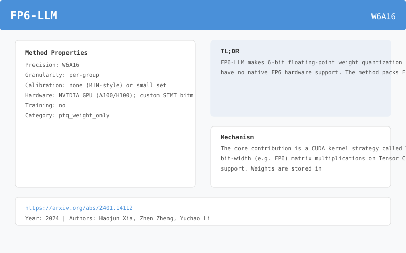

<em>TC-FPx kernel: bitpacked FP6 weights unpacked to FP16 inside Tensor Core matmul.</em>

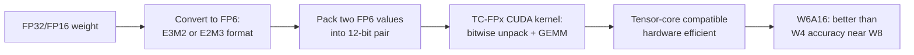
```mermaid
flowchart LR
    A[FP32/FP16 weight] --> B[Convert to FP6:\nE3M2 or E2M3 format]
    B --> C[Pack two FP6 values\ninto 12-bit pair]
    C --> D[TC-FPx CUDA kernel:\nbitwise unpack + GEMM]
    D --> E[Tensor-core compatible\nhardware efficient]
    E --> F[W6A16: better than\nW4 accuracy near W8]
```

> FP6-LLM makes 6-bit floating-point weight quantization practical on NVIDIA GPUs that have no native FP6 hardware support. The method packs FP6 weights (1 sign, 2 exponent, 3 mantissa bits) into standard GPU memory layouts and implements a GPU kernel (TC-FPx) that unpacks and converts FP6 to FP16 during the matrix multiplication, achieving near-FP16 throughput. The floating-point format's larger dynamic range compared to INT6 means FP6 requires less clipping, which is important for LLM weights with outlier channels.

| Field | Value |
|-------|-------|
| Published at | **USENIX ATC 2024** |
| Paper | [2401.14112](https://arxiv.org/abs/2401.14112) |
| Code | [usyd-fsalab/fp6_llm](https://github.com/usyd-fsalab/fp6_llm) |
| Precision | W6A16 |
| Granularity | per-group |
| Calibration | none (RTN-style) or small set |
| Symmetric? | symmetric |
| Outlier handling | floating-point format has larger dynamic range than INT6 |
| Hardware target | NVIDIA GPU (A100/H100); custom SIMT bitmanipulation kernels |
| Training needed? | no |
| Calibration data? | no |
| Typical degradation | minimal at 6-bit; better perplexity than INT6 RTN at same storage |
| Builds on | [rtn](#rtn) |
| Related | [awq](#awq) · [gptq](#gptq) · [marlin](#marlin) |

**How it works:**

The core contribution is a CUDA kernel strategy called TC-FPx that enables arbitrary bit-width (e.g. FP6) matrix multiplications on Tensor Cores without native hardware support. Weights are stored in a bitpacked format; during matmul, each FP6 weight is unpacked and up-cast to FP16 in registers before multiplication, leveraging the GPU's native FP16 Tensor Cores. The unpacking is done in SIMT warps in a way that is bandwidth-efficient and avoids branching. At 6 bits, floating-point representation outperforms integer (INT6) because the non-uniform grid better fits the near-Gaussian weight distributions of large LLMs.

---

### AQLM · W2 A16 (avg ~2 bits) · PTQ W-only · 2024-01

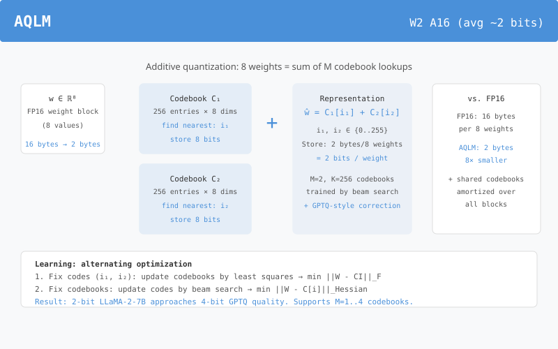

<em>Additive multi-codebook quantization: 8 weights = 2 index lookups.</em>

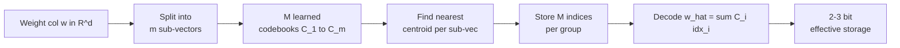
```mermaid
flowchart LR
    A[Weight col w in R^d] --> B[Split into\nm sub-vectors]
    B --> C[M learned\ncodebooks C_1 to C_m]
    C --> D[Find nearest\ncentroid per sub-vec]
    D --> E[Store M indices\nper group]
    E --> F[Decode w_hat = sum C_i idx_i]
    F --> G[2-3 bit\neffective storage]
```

> AQLM applies additive quantization (from the image/audio compression literature) to LLM weights. Each group of 8 weights is represented as a sum of M codebook entries (M=1 or 2 in practice), where each codebook has 2^b entries. With M=2 codebooks of 256 entries each, 8 weights are stored as 2 bytes of indices plus the shared codebooks, achieving approximately 2 bits per weight. Learned via a beam-search optimization that jointly minimizes layer-wise reconstruction error, AQLM achieves state-of-the-art 2-bit quality among PTQ methods and outperforms QuIP# on several model families.

| Field | Value |
|-------|-------|
| Published at | **ICML 2024** |
| Paper | [2401.06118](https://arxiv.org/abs/2401.06118) |
| Code | [Vahe1994/AQLM](https://github.com/Vahe1994/AQLM) |
| Precision | W2 A16 (avg ~2 bits) |
| Granularity | per 8-weight group via additive codebook |
| Calibration | calibration set for codebook learning (beam search) |
| Symmetric? | n/a (codebook-based) |
| Outlier handling | multi-codebook additive representation absorbs all magnitudes |
| Hardware target | GPU (custom CUDA kernel for codebook decode) |
| Training needed? | no |
| Calibration data? | yes |
| Typical degradation | LLaMA-2-7B at 2 bits: ~6.7 ppl vs 5.5 FP16 - best among 2-bit PTQ at time of release |
| Builds on | [gptq](#gptq) · [obq](#obq) |
| Related | [quip-sharp](#quip-sharp) · [squeezellm](#squeezellm) · [gptq](#gptq) |

**How it works:**

Each weight block w ∈ ℝ⁸ is approximated as ŵ = Σ_{m=1}^{M} C_m[i_m], where C_m are learned codebooks of shape (K, 8) and i_m is a learned integer index. With M=2, K=256: total bits = 2 × log₂(256) = 16 bits for 8 weights = 2 bits/weight. Codebooks are learned by alternating between fixing codes and updating codebooks (via least-squares) and fixing codebooks and updating codes (via beam search). The layer-wise reconstruction loss is minimized as in GPTQ. AQLM also supports a fine-tuning step to further close the gap with FP16.

---

### GGUF I-quants · W1/W2/W3/W4 A16 (fractional effective bits) · PTQ W-only · 2024-01

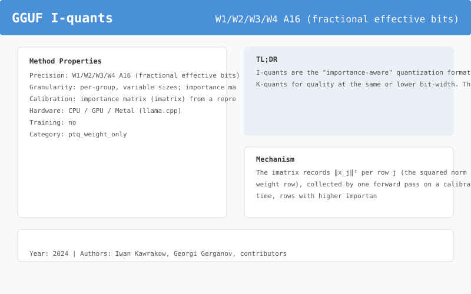

<em>Importance-weighted lattice quantization: imatrix guides bit allocation per row.</em>

```mermaid
flowchart LR
    A[Weight block] --> B[Hadamard preprocess:\nincoherence rotation]
    B --> C[Near-Gaussian\nweight distribution]
    C --> D[E8-like lattice\ncodebook quantize]
    D --> E[Store codebook indices\nIQ2_XXS to IQ4_XS]
    E --> F[Best quality per bit\nin GGUF format]
```

> I-quants are the "importance-aware" quantization formats in llama.cpp, superseding K-quants for quality at the same or lower bit-width. They require an "importance matrix" (imatrix) computed by running the model on a representative sample and recording the squared mean activation for each weight row. Weights in rows with high importance scores are quantized more carefully (or get more effective bits). The quantization grid itself uses lattice codebooks derived from the paper "Improved Lattice Quantization via Dual Quantization" rather than uniform linear scales, allowing non-uniform grids that fit the weight distributions better.

| Field | Value |
|-------|-------|
| Published at | n/a (no paper) |
| Code | [ggerganov/llama.cpp](https://github.com/ggerganov/llama.cpp) |
| Blog / post | [link](https://github.com/ggerganov/llama.cpp/pull/4773) |
| Precision | W1/W2/W3/W4 A16 (fractional effective bits) |
| Granularity | per-group, variable sizes; importance matrix guided |
| Calibration | importance matrix (imatrix) from a representative dataset |
| Symmetric? | n/a (lattice codebook-based) |
| Outlier handling | importance-weighted lattice quantization; high-importance weights get more bits |
| Hardware target | CPU / GPU / Metal (llama.cpp) |
| Training needed? | no |
| Calibration data? | yes |
| Typical degradation | IQ4_XS at ~4.25 bits beats Q4_K_M; IQ2_XXS at ~2.06 bits is usable |
| Builds on | [gguf-kquants](#gguf-kquants) · [rtn](#rtn) |
| Related | [gguf-kquants](#gguf-kquants) · [aqlm](#aqlm) · [hqq](#hqq) |

**How it works:**

The imatrix records ‖x_j‖² per row j (the squared norm of input activations for each weight row), collected by one forward pass on a calibration corpus. At quantization time, rows with higher importance are assigned more bits or have their quantization refined more carefully. The quantization codebooks for sub-4-bit formats are lattice-based (derived from integer lattices), not simple uniform grids. IQ4_NL uses a "non-linear" 4-bit codebook derived from the NF4 quantile approach. Sub-3-bit formats (IQ2_*, IQ1_S) use group-wise lattice VQ with the imatrix weighting to preserve perplexity at extremely low bit rates.

---

### HQQ · W2/W3/W4/W8 A16 · PTQ W-only · 2023-11

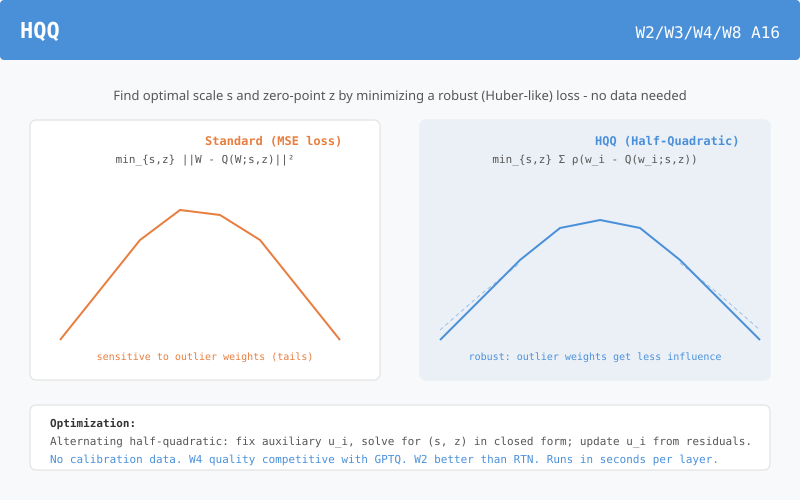

<em>Robust half-quadratic loss minimization for scale/zero-point - no calibration data needed.</em>

```mermaid
flowchart LR
    A[Weight W] --> B[Minimize L1\nnorm W - Q W_s_z]
    B --> C[Proximal\niterative solve]
    C --> D{Converged?}
    D -->|no| B
    D -->|yes| E[Optimal scale s\nzero-point z]
    E --> F[No calibration data\nW4/W2 in under 1 min]
```

> HQQ finds optimal quantization parameters (scale and zero-point) by directly minimizing a robust loss between the original and quantized weights using half-quadratic optimization, without any calibration data. The half-quadratic penalty is a smoothed version of L1 that down-weights large residuals (outliers), making the scale/zp solution robust to weight outliers. Because it needs no activations, HQQ is significantly faster to run than GPTQ and can quantize a 70B model in under a minute on CPU. Quality is close to GPTQ at 4-bit and significantly better than RTN, especially at lower bits.

| Field | Value |
|-------|-------|
| Published at | n/a (no paper) |
| Code | [mobiusml/hqq](https://github.com/mobiusml/hqq) |
| Blog / post | [link](https://mobiusml.github.io/hqq_blog/) |
| Precision | W2/W3/W4/W8 A16 |
| Granularity | per-group, g=64 (default) |
| Calibration | none - weights only |
| Symmetric? | asymmetric |
| Outlier handling | robust half-quadratic (Huber-like) loss minimization during scale/zp optimization |
| Hardware target | GPU; custom CUDA/Triton kernels for W4A16 and W2A16 |
| Training needed? | no |
| Calibration data? | no |
| Typical degradation | competitive with GPTQ at 4-bit; better than RTN at 3-bit |
| Builds on | [rtn](#rtn) |
| Related | [gptq](#gptq) · [awq](#awq) · [rtn](#rtn) |

**How it works:**

Standard RTN minimizes ‖W − Q(W)‖² w.r.t. the scale s and zero-point z, but this mean-squared loss is sensitive to outliers. HQQ instead solves: min_{s,z} Σ ρ(w_i − Q(w_i; s, z)) where ρ is a half-quadratic (Huber-like) penalty. This is solved by iterative half-quadratic optimization: alternating between a quadratic subproblem for s and z (given auxiliary variables) and an update of auxiliary variables (given s and z). The result is a set of quantization parameters that minimize the robust loss without requiring any calibration data.

---

### EXL2 · W2–W8 A16 (mixed per-row, target average bit-width) · PTQ W-only · 2023-10

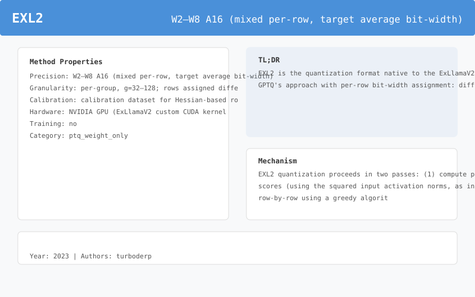

<em>EXL2: each weight matrix row assigned a different bit-width by Hessian importance.</em>

```mermaid
flowchart LR
    A[FP16 Weights] --> B[Calibration data:\nyes]
    B --> C[Compute scale\nand zero-point]
    C --> D[Quantize weights\nto W2-W8 A16 mixed per-row, target average bit-width]
    D --> E[Outlier handling:\nper-row bit-width assignment: ]
    E --> F[Quantized model\nW2-W8 A16 mixed per-row, target average bit-width]
```

> EXL2 is the quantization format native to the ExLlamaV2 inference engine. It extends GPTQ's approach with per-row bit-width assignment: different rows (output channels) of each weight matrix are quantized to different bit-widths (2–8), with the assignment determined by row-level Hessian importance. A target average bits-per-weight is specified, and the quantizer greedily assigns more bits to rows that suffer more from quantization. This makes EXL2 a "smooth" format - any target bpw from 2.0 to 8.0 in 0.05 steps is achievable, rather than the discrete jumps of W3/W4/W5.

| Field | Value |
|-------|-------|
| Published at | n/a (no paper) |
| Code | [turboderp/exllamav2](https://github.com/turboderp/exllamav2) |
| Blog / post | [link](https://github.com/turboderp/exllamav2/blob/master/doc/quant/exl2.md) |
| Precision | W2–W8 A16 (mixed per-row, target average bit-width) |
| Granularity | per-group, g=32–128; rows assigned different bit-widths |
| Calibration | calibration dataset for Hessian-based row importance |
| Symmetric? | asymmetric |
| Outlier handling | per-row bit-width assignment: important rows get more bits |
| Hardware target | NVIDIA GPU (ExLlamaV2 custom CUDA kernels) |
| Training needed? | no |
| Calibration data? | yes |
| Typical degradation | at 4.0 bpw: comparable to GPTQ 4-bit; at 3.0 bpw: better than GPTQ 3-bit |
| Builds on | [gptq](#gptq) |
| Related | [gguf-kquants](#gguf-kquants) · [gptq](#gptq) · [marlin](#marlin) |

**How it works:**

EXL2 quantization proceeds in two passes: (1) compute per-row Hessian importance scores (using the squared input activation norms, as in GPTQ), then assign bit-widths row-by-row using a greedy algorithm that maximizes quality for a given average bpw budget; (2) quantize each row to its assigned bit-width using GPTQ-style column-by-column second-order updates. At inference, ExLlamaV2's custom CUDA kernel handles the heterogeneous row precisions in a single kernel call, using a compact header per row that specifies its bit-width and group size. The result is smooth quality-vs-compression tradeoffs unavailable in fixed-format schemes.

---

### AutoRound · W4A16 · PTQ W-only · 2023-09

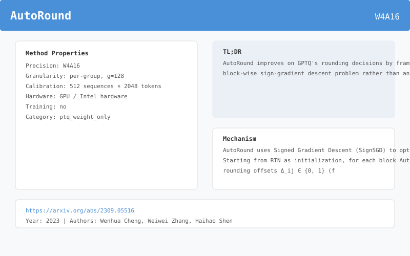

<em>Sign gradient descent optimizes rounding direction per weight jointly within each block.</em>

```mermaid
flowchart LR
    A[FP16 weights\n+ calibration data] --> B[SignSGD optimizer\nfor scale and zero-point]
    B --> C[Fake quant in\nforward pass]
    C --> D[Gradient via\nSTE backprop]
    D --> E{Converged?}
    E -->|no| B
    E -->|yes| F[INT4 weights\nAutoGPTQ-compatible format]
```

> AutoRound improves on GPTQ's rounding decisions by framing quantization as a block-wise sign-gradient descent problem rather than an analytic second-order update. Each weight's rounding direction (floor vs. ceil) is treated as a binary decision variable, and these decisions are optimized jointly within each block by computing sign gradients of the block reconstruction loss. This allows AutoRound to find better rounding patterns than the greedy column-by-column approach of GPTQ, without requiring more memory than a calibration forward pass.

| Field | Value |
|-------|-------|
| Published at | arXiv (preprint) |
| Paper | [2309.05516](https://arxiv.org/abs/2309.05516) |
| Code | [intel/auto-round](https://github.com/intel/auto-round) |
| Precision | W4A16 |
| Granularity | per-group, g=128 |
| Calibration | 512 sequences × 2048 tokens |
| Symmetric? | asymmetric |
| Outlier handling | sign gradient descent for rounding decisions (not just round-to-nearest) |
| Hardware target | GPU / Intel hardware |
| Training needed? | no |
| Calibration data? | yes |
| Typical degradation | close to or better than GPTQ at 4-bit on most benchmarks |
| Builds on | [gptq](#gptq) · [rtn](#rtn) |
| Related | [gptq](#gptq) · [awq](#awq) · [omniquant](#omniquant) |

**How it works:**

AutoRound uses Signed Gradient Descent (SignSGD) to optimize rounding decisions. Starting from RTN as initialization, for each block AutoRound iteratively updates the rounding offsets Δ_ij ∈ {0, 1} (floor or ceil) according to: Δ ← clip(Δ − lr · sign(∇_Δ ‖ f(X; W) − f(X; W̃) ‖²), 0, 1). This is run for a fixed number of iterations (200 by default) per block. Unlike GPTQ which processes columns sequentially, AutoRound treats the block jointly. The resulting rounding patterns tend to be more balanced, especially at 4-bit.

---

### GGUF K-quants · W2/W3/W4/W5/W6 A16 · PTQ W-only · 2023-08

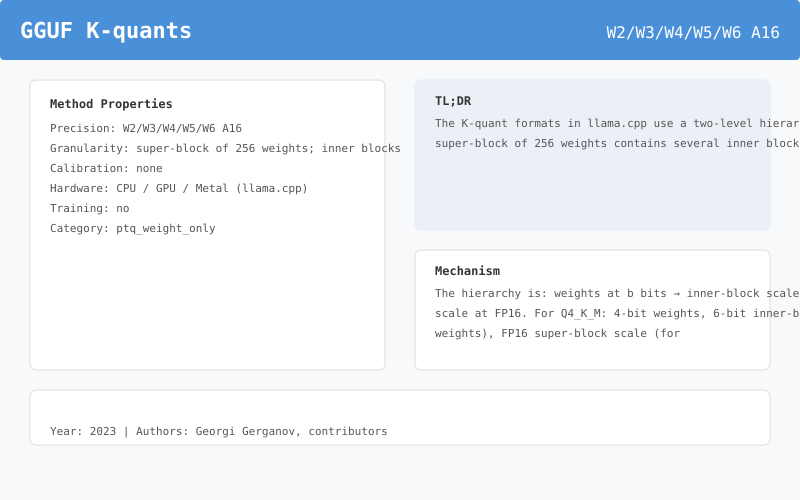

<em>Hierarchical two-level K-quant: inner-block scales quantized relative to a FP16 super-block scale.</em>

```mermaid
flowchart LR
    A[FP16 weight block\n256 elements] --> B[Compute importance\nvia activation norms]
    B --> C[Scale important\ngroups more finely]
    C --> D[Super-block scale\n+ sub-block scales]
    D --> E[Pack to target bit\nQ2_K to Q8_K]
    E --> F[Better accuracy than\nuniform at same bits]
```

> The K-quant formats in llama.cpp use a two-level hierarchical quantization scheme. A super-block of 256 weights contains several inner blocks of 16–32 weights each. Each inner block has its own low-precision scale (quantized), while the super-block stores the dequantization scale for those inner-block scales in a higher precision. Different K-quant variants (Q2_K, Q3_K, Q4_K_S, Q4_K_M, Q5_K, Q6_K) differ in the number of bits for both the weights and the block scales, and optionally assign higher precision to specific layers (e.g. attention layers in _M variants).

| Field | Value |
|-------|-------|
| Published at | n/a (no paper) |
| Code | [ggerganov/llama.cpp](https://github.com/ggerganov/llama.cpp) |
| Blog / post | [link](https://github.com/ggerganov/llama.cpp/pull/1684) |
| Precision | W2/W3/W4/W5/W6 A16 |
| Granularity | super-block of 256 weights; inner blocks of 16–32 weights |
| Calibration | none |
| Symmetric? | mixed (super-block scale symmetric; inner block scales asymmetric) |
| Outlier handling | hierarchical two-level scaling with higher-bit super-block scale |
| Hardware target | CPU / GPU / Metal (llama.cpp) |
| Training needed? | no |
| Calibration data? | no |
| Typical degradation | Q4_K_M: < 0.5 ppl vs FP16 on LLaMA-7B; Q2_K: ~2–4 ppl |
| Builds on | [rtn](#rtn) |
| Superseded by | [gguf-iquants](#gguf-iquants) |
| Related | [gguf-iquants](#gguf-iquants) · [hqq](#hqq) · [awq](#awq) |

**How it works:**

The hierarchy is: weights at b bits → inner-block scale at b' bits → super-block scale at FP16. For Q4_K_M: 4-bit weights, 6-bit inner-block scales (for every 32 weights), FP16 super-block scale (for every 256 weights), with attention output and feed-forward gate layers boosted to 6-bit. The _S suffix means "small" (uniform across layers); _M means "medium" (mixed layers). This two-level scheme amortizes the scale overhead and achieves better quality-per-byte than flat per-group quantization with the same group size.

---

### QuIP · W2/W4 A16 · PTQ W-only · 2023-07

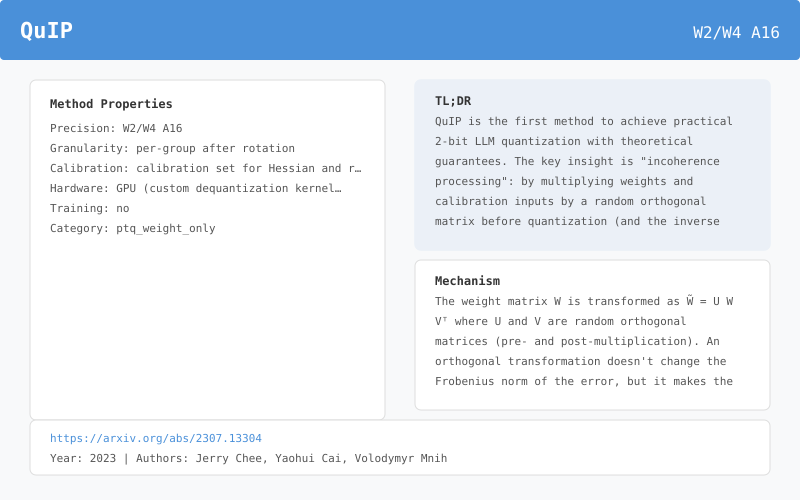

<em>Random orthogonal rotation makes weights incoherent; uniform quantization then works at 2-bit.</em>

```mermaid
flowchart LR
    A[FP16 Weight W] --> B[Random orthogonal\nrotation R]
    B --> C[Incoherent W_tilde = R W R^T]
    C --> D[Near-Gaussian\ndistribution]
    D --> E[Uniform scalar\nquantize W_tilde]
    E --> F[At inference:\ndecode via R^T * Q * R]
    F --> G[Incoherence enables\nlow-bit near-lossless]
```

> QuIP is the first method to achieve practical 2-bit LLM quantization with theoretical guarantees. The key insight is "incoherence processing": by multiplying weights and calibration inputs by a random orthogonal matrix before quantization (and the inverse after), the weight distribution becomes nearly Gaussian with no outliers, allowing simple uniform quantization to work well even at 2 bits. The quality improvement is dramatic - 2-bit QuIP outperforms all prior 2-bit methods by a large margin.

| Field | Value |
|-------|-------|
| Published at | **NeurIPS 2023** |
| Paper | [2307.13304](https://arxiv.org/abs/2307.13304) |
| Code | [jerry-chee/QuIP](https://github.com/jerry-chee/QuIP) |
| Precision | W2/W4 A16 |
| Granularity | per-group after rotation |
| Calibration | calibration set for Hessian and rotation |
| Symmetric? | symmetric |
| Outlier handling | random orthogonal pre/post-rotation to spread outliers uniformly |
| Hardware target | GPU (custom dequantization kernels needed for rotation) |
| Training needed? | no |
| Calibration data? | yes |
| Typical degradation | < 1 ppl at 2-bit LLaMA-2-7B vs. previous 2-bit methods (large improvement) |
| Builds on | [gptq](#gptq) · [obq](#obq) |
| Superseded by | [quip-sharp](#quip-sharp) |
| Related | [quip-sharp](#quip-sharp) · [quarot](#quarot) · [spinquant](#spinquant) · [gptq](#gptq) |

**How it works:**

The weight matrix W is transformed as W̃ = U W Vᵀ where U and V are random orthogonal matrices (pre- and post-multiplication). An orthogonal transformation doesn't change the Frobenius norm of the error, but it makes the error more uniform across entries, reducing the maximum individual error from O(√d) to O(1). This "incoherence" property allows uniform scalar quantization of W̃ to work well. At inference, inputs are also pre-multiplied by V and the output is post-multiplied by Uᵀ. QuIP also includes a greedy coordinate descent (LDLQ) step to further reduce quantization error.

---

### SqueezeLLM · W4 A16 (sparse overlay) · PTQ W-only · 2023-06

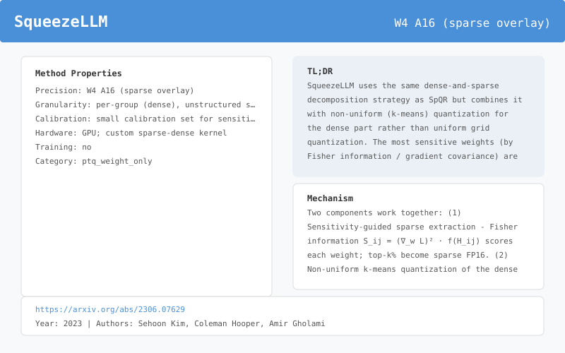

<em>k-means non-uniform quantization + sensitivity-based sparse FP16 overlay.</em>

```mermaid
flowchart LR
    A[Weight W] --> B[Fisher info\nsensitivity map]
    B --> C[Top-k sensitive\nweights → sparse FP16]
    C --> D[Rest → k-means\nclustered INT4]
    D --> E[Dense INT4\n+ sparse FP16 residual]
    E --> F[Non-uniform quant\nbetter than uniform at same bits]
```

> SqueezeLLM uses the same dense-and-sparse decomposition strategy as SpQR but combines it with non-uniform (k-means) quantization for the dense part rather than uniform grid quantization. The most sensitive weights (by Fisher information / gradient covariance) are stored in a sparse FP16 matrix; the remaining weights are clustered using k-means, with each weight pointing to one of 2^b centroids stored in a look-up table. The non-uniform grid better captures the actual weight distribution, reducing error vs. uniform quantization at the same bit-width.

| Field | Value |
|-------|-------|
| Published at | **ICML 2024** |
| Paper | [2306.07629](https://arxiv.org/abs/2306.07629) |
| Code | [SqueezeAILab/SqueezeLLM](https://github.com/SqueezeAILab/SqueezeLLM) |
| Precision | W4 A16 (sparse overlay) |
| Granularity | per-group (dense), unstructured sparse |
| Calibration | small calibration set for sensitivity |
| Symmetric? | asymmetric |
| Outlier handling | sensitivity-based sparse extraction + non-uniform k-means quantization |
| Hardware target | GPU; custom sparse-dense kernel |
| Training needed? | no |
| Calibration data? | yes |
| Typical degradation | < 0.1 ppl at 3-bit (LLaMA-7B vs FP16) with 0.45% sparse ratio |
| Builds on | [gptq](#gptq) · [rtn](#rtn) |
| Related | [spqr](#spqr) · [aqlm](#aqlm) · [owq](#owq) |

**How it works:**

Two components work together: (1) Sensitivity-guided sparse extraction - Fisher information S_ij = (∇_w L)² · f(H_ij) scores each weight; top-k% become sparse FP16. (2) Non-uniform k-means quantization of the dense remainder - instead of a linear scale, centroids are learned offline (2^b of them per group), and each weight is stored as a b-bit index into the centroid table. This is a form of scalar vector quantization. At inference, a custom CUDA kernel handles both the sparse lookup and the centroid dequantization in a single pass.

---

### SpQR · W3/W4 A16 (sparse overlay) · PTQ W-only · 2023-06

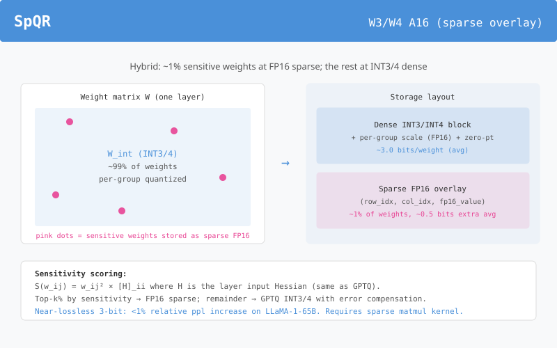

<em>Sensitive weights kept as FP16 sparse; rest quantized to INT3/INT4.</em>

```mermaid
flowchart LR
    A[FP16 Weight W] --> B[Sensitivity via\nHessian H]
    B --> C{Outlier weight?}
    C -->|yes ~1%| D[Store in\nFP16 sparse]
    C -->|no ~99%| E[Quantize to\n3-4 bit group]
    D --> F[Sparse FP16\n+ dense INT3/4]
    E --> F
    F --> G[approx 3.9 bit avg\nnear-lossless]
```

> SpQR combines dense grouped quantization with a sparse FP16 overlay for the most sensitive weights. For each weight group, the Hessian-based sensitivity is computed, and the top ~1% of weights with the highest sensitivity score are extracted and stored in a sparse FP16 format alongside the quantized dense block. This lets SpQR achieve near-lossless 3-bit compression: the bulk of weights go to 3 bits, while a tiny fraction stay in FP16. The dense part is compatible with standard GPTQ-style quantization.

| Field | Value |
|-------|-------|
| Published at | **ICLR 2024** |
| Paper | [2306.03078](https://arxiv.org/abs/2306.03078) |
| Code | [Vahe1994/SpQR](https://github.com/Vahe1994/SpQR) |
| Precision | W3/W4 A16 (sparse overlay) |
| Granularity | per-group (dense part), unstructured sparse (sensitive weights) |
| Calibration | 128 sequences, calibration for Hessian estimation |
| Symmetric? | asymmetric |
| Outlier handling | sensitive weights stored as FP16 sparse; density ~1% of weights |
| Hardware target | GPU; requires sparse kernel support for the FP16 overlay |
| Training needed? | no |
| Calibration data? | yes |
| Typical degradation | < 1% relative perplexity increase at 3-bit on LLaMA-1-65B |
| Builds on | [gptq](#gptq) · [obq](#obq) |
| Related | [squeezellm](#squeezellm) · [owq](#owq) · [gptq](#gptq) |

**How it works:**

SpQR extends GPTQ with a hybrid representation: each weight w_ij is scored by its sensitivity |∂²L/∂w_ij²| = [H]_{ii} / N (column Hessian diagonal). Weights with sensitivity above a threshold are stored as (index, FP16 value) sparse pairs; the rest are quantized to low bit-width with per-group scales. At inference, the sparse FP16 overlay is added on top of the dequantized dense matmul result. The overhead of the sparse overlay is negligible at 1% density, but its impact on quality is large since it captures the most error-sensitive weights.

---

### OWQ · W3/W4 A16 (mixed) · PTQ W-only · 2023-06

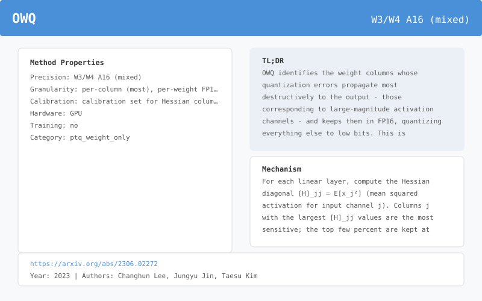

<em>Hessian-ranked column selection: top columns stay FP16, rest go INT3/4.</em>

```mermaid
flowchart LR
    A[Weight W\n+ activation stats] --> B[Identify outlier-\ninfluenced columns]
    B --> C[Outlier cols:\nhigher bit width or FP16]
    C --> D[Remaining cols:\nlow-bit GPTQ quantize]
    D --> E[Mixed-precision\nper column]
    E --> F[Better accuracy\nthan uniform GPTQ]
```

> OWQ identifies the weight columns whose quantization errors propagate most destructively to the output - those corresponding to large-magnitude activation channels - and keeps them in FP16, quantizing everything else to low bits. This is complementary to SpQR: OWQ works at the column level (keeping entire columns at FP16) rather than individual weight sensitivity. The column selection criterion is the Hessian diagonal [H]_jj (the squared input activation norm for column j), which captures how much quantizing column j would affect the output.

| Field | Value |
|-------|-------|
| Published at | **AAAI 2024** |
| Paper | [2306.02272](https://arxiv.org/abs/2306.02272) |
| Code | [xvyaward/owq](https://github.com/xvyaward/owq) |
| Precision | W3/W4 A16 (mixed) |
| Granularity | per-column (most), per-weight FP16 for sensitive |
| Calibration | calibration set for Hessian column norms |
| Symmetric? | asymmetric |
| Outlier handling | Hessian-norm-ranked weight columns kept at FP16 (mixed precision) |
| Hardware target | GPU |
| Training needed? | no |
| Calibration data? | yes |
| Typical degradation | < 0.5 ppl at 3-bit LLaMA-7B with ~0.1% FP16 columns |
| Builds on | [gptq](#gptq) · [rtn](#rtn) |
| Related | [spqr](#spqr) · [gptq](#gptq) · [awq](#awq) |

**How it works:**

For each linear layer, compute the Hessian diagonal [H]_jj = E[x_j²] (mean squared activation for input channel j). Columns j with the largest [H]_jj values are the most sensitive; the top few percent are kept at FP16 while the rest are quantized to W3 or W4 with GPTQ-style second-order correction. A small number of FP16 columns (0.1–0.3%) provides a large quality recovery because the outlier channels (which exist in the same positions across all tokens for large LLMs) are fully preserved.

---

### AWQ · W4A16 · PTQ W-only · 2023-06

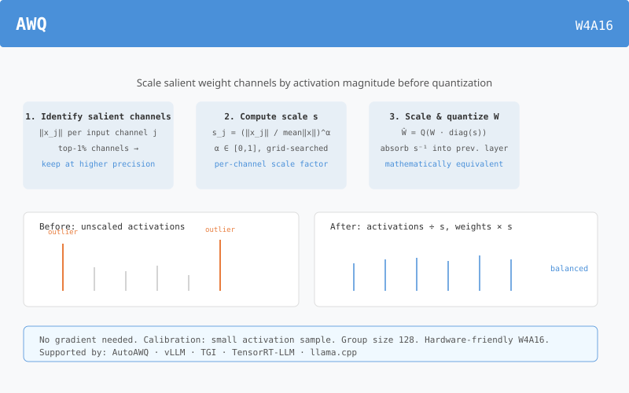

<em>Activation-magnitude-guided channel scaling before standard quantization.</em>

```mermaid
flowchart LR
    A[Calibration\nActivations X] --> B[Per-channel\nmagnitude norm_x_j]
    B --> C[Scale s_j = norm_x_j ^ alpha]
    C --> D[W_hat = Q of W times diag_s]
    D --> E[Absorb s^-1 into\nprevious layer]
    E --> F[W4A16\ndeployment]
```

> AWQ observes that not all weight channels are equally important - channels corresponding to high-magnitude activation dimensions cause disproportionately large quantization error. The solution is to scale those channels up by their activation magnitude (making them harder to quantize individually but reducing their contribution to output error), then divide the corresponding activation by the same scale to preserve mathematical equivalence. The scale can be found analytically or by a fast grid search. AWQ requires no Hessian computation and no per-weight optimization: it is one forward calibration pass plus a scale computation, making it much faster than GPTQ.

| Field | Value |
|-------|-------|
| Published at | **MLSys 2024** |
| Paper | [2306.00978](https://arxiv.org/abs/2306.00978) |
| Code | [mit-han-lab/llm-awq](https://github.com/mit-han-lab/llm-awq) |
| Precision | W4A16 |
| Granularity | per-group, g=128 |
| Calibration | small activation sample (no labels required) |
| Symmetric? | asymmetric |
| Outlier handling | activation-magnitude-guided per-channel weight scaling before quantization |
| Hardware target | GPU; TinyChat / AutoAWQ W4A16 kernels (CUDA, Metal) |
| Training needed? | no |
| Calibration data? | yes |
| Typical degradation | < 0.3 ppl on LLaMA-7B at 4-bit (WikiText-2) |
| Builds on | [rtn](#rtn) |
| Related | [gptq](#gptq) · [owq](#owq) · [spqr](#spqr) · [smoothquant](#smoothquant) |

**How it works:**

For each linear layer, AWQ observes per-channel activation magnitudes s̃j = mean(|Xj|) and computes a scale factor sj = s̃j^α, where α ∈ [0,1] balances the difficulty between weights and activations. The transformation W' = W · diag(s) is applied to weights (scale up salient columns), and the inverse diag(s)⁻¹ is absorbed into the preceding layer (scale down the activations). The scaled W' is then quantized with standard RTN. The α parameter is found by a lightweight grid search minimizing layer-wise reconstruction loss. Because the scale is absorbed offline, inference overhead is zero.

---

### NF4 / QLoRA · W4A16 (NF4) · PTQ W-only · 2023-05

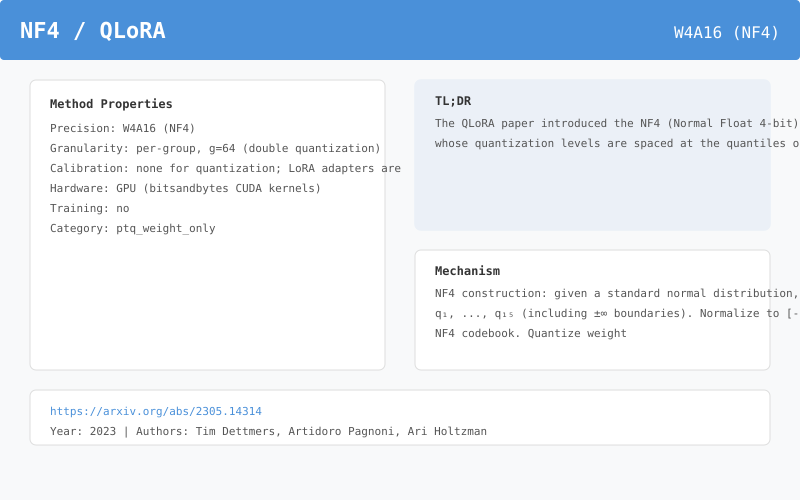

<em>NF4 quantile grid: 16 levels at Gaussian quantiles; double-quantized per-group scale.</em>

```mermaid
flowchart LR
    A[FP16 weight values\nof one 64-element block] --> B[Normalize to -1 to 1\nabs max scaling]
    B --> C[Find nearest NF4 level\nfrom 16 non-uniform bins]
    C --> D[Store 4-bit NF4 index\nper weight]
    D --> E[At compute time:\ndequant to BF16]
    E --> F[Optimal for normal\ndistribution weights]
```

> The QLoRA paper introduced the NF4 (Normal Float 4-bit) data type: a 4-bit format whose quantization levels are spaced at the quantiles of the standard normal distribution, rather than linearly. Because pre-trained LLM weights are approximately normally distributed, NF4 achieves lower expected quantization error than uniform INT4 at the same bit-width. QLoRA also introduces "double quantization" (quantizing the per-group scales themselves to 8 bits) and paged optimizers to fit fine-tuning of 65B+ models into a single GPU. NF4 is implemented in bitsandbytes and is now the dominant format for memory-efficient inference of base models.

| Field | Value |
|-------|-------|
| Published at | **NeurIPS 2023** |
| Paper | [2305.14314](https://arxiv.org/abs/2305.14314) |
| Code | [artidoro/qlora](https://github.com/artidoro/qlora) |
| Precision | W4A16 (NF4) |
| Granularity | per-group, g=64 (double quantization) |
| Calibration | none for quantization; LoRA adapters are trained separately |
| Symmetric? | n/a (non-uniform NF4 grid) |
| Outlier handling | NF4 quantile grid inherently handles Gaussian tails; double quantization for scales |
| Hardware target | GPU (bitsandbytes CUDA kernels) |
| Training needed? | no |
| Calibration data? | no |
| Typical degradation | < 0.5 ppl on LLaMA-7B; specifically designed to minimize quantization error for normally-distributed weights |
| Builds on | [rtn](#rtn) |
| Related | [gptq](#gptq) · [awq](#awq) · [hqq](#hqq) · [qlora](#qlora) |

**How it works:**

NF4 construction: given a standard normal distribution, compute the 16 quantiles q₀, q₁, ..., q₁₅ (including ±∞ boundaries). Normalize to [-1, 1]. These 16 values are the NF4 codebook. Quantize weight w as: round(w / s) → nearest NF4 code index (lookup table), where s = max(|W|) / max(NF4 codes). The quantiles are closer together near zero (where most weights concentrate) and farther at the tails, matching the Gaussian distribution's probability density. Double quantization: each per-group scale is itself stored as FP8 with a shared FP32 super-scale, saving an extra 0.125 bits/weight.

---

### GPTQ · W3/W4 A16 · PTQ W-only · 2022-10

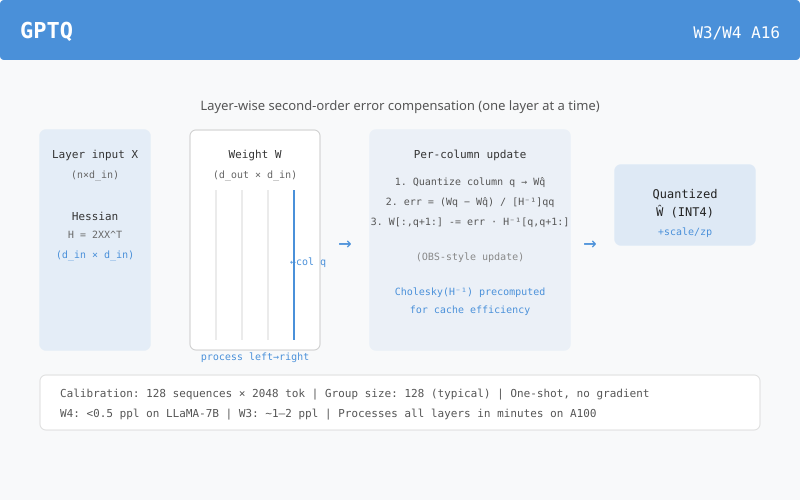

<em>Column-wise error compensation via inverse Hessian redistribution.</em>

```mermaid
flowchart LR
    A[FP16 Weight W] --> B[Compute Hessian\nH = 2XX^T]
    B --> C[Cholesky\ndecompose H^-1]
    C --> D{For each\ncolumn q}
    D --> E[Quantize col\nto INT4]
    E --> F[Redistribute error\nto cols q+1 onward]
    F --> D
    D --> G[INT4 W\n+ group scales]
```

> GPTQ processes each transformer layer independently, using an approximate inverse Hessian of the layer's input to compensate for quantization error column-by-column. Quantizing one column introduces a residual error, which is immediately redistributed to the remaining unquantized columns via an OBS-style update. A careful column-ordering and a precomputed Cholesky factorization of the Hessian make the whole thing tractable in minutes per layer. GPTQ produced the kernel ecosystem (Marlin, ExLlamaV2) that most 4-bit open-weight LLM inference runs on today, and was the first method to make sub-4-bit quality practical at LLaMA scale.

| Field | Value |
|-------|-------|
| Published at | **ICLR 2023** |
| Paper | [2210.17323](https://arxiv.org/abs/2210.17323) |
| Code | [IST-DASLab/gptq](https://github.com/IST-DASLab/gptq) |
| Precision | W3/W4 A16 |
| Granularity | per-column (output), group size 128 typical |
| Calibration | 128 sequences × 2048 tokens, unlabeled |
| Symmetric? | asymmetric |
| Outlier handling | second-order (inverse Hessian) error compensation per column |
| Hardware target | GPU; Marlin / ExLlamaV2 W4A16 kernels for fast inference |
| Training needed? | no |
| Calibration data? | yes |
| Typical degradation | < 0.5 ppl on LLaMA-7B at 4-bit; ~1–2 ppl at 3-bit (WikiText-2) |
| Builds on | [obq](#obq) · [obs](#obs) |
| Related | [awq](#awq) · [spqr](#spqr) · [quip](#quip) · [owq](#owq) |

**How it works:**

For each linear layer, GPTQ estimates H = 2 X Xᵀ (the expected squared input) as a proxy for the layer-wise loss Hessian. It then processes weight columns left-to-right: quantize column q to b bits, compute the residual error δq = (wq − ŵq), and propagate it to all remaining columns as Δ W[:,q+1:] -= δq · (H⁻¹[q, q+1:] / H⁻¹[qq]). The inverse Hessian is maintained via a blocked Cholesky factorization for numerical stability and cache efficiency. This is a direct application of the OBS (Optimal Brain Surgeon) framework to PTQ, applied layer-by-layer without any gradient computation.

---

### OBQ · W3/W4 A16 · PTQ W-only · 2022-08

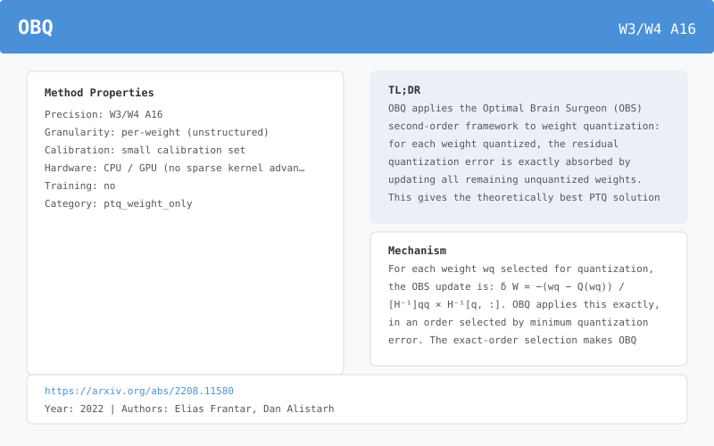

<em>Optimal Brain Surgeon applied per-weight with exact error propagation.</em>

```mermaid
flowchart LR
    A[Weight matrix W\n+ Hessian H] --> B[Compute per-weight\nsaliency score]
    B --> C[Select least-salient\nweight]
    C --> D[Quantize it to\nlow-bit value]
    D --> E[Redistribute error:\nW remaining -= delta * H^-1 row]
    E --> F{All weights\nquantized?}
    F -->|no| B
    F -->|yes| G[Low-bit W\nwith OBS error comp]
```

> OBQ applies the Optimal Brain Surgeon (OBS) second-order framework to weight quantization: for each weight quantized, the residual quantization error is exactly absorbed by updating all remaining unquantized weights. This gives the theoretically best PTQ solution within a layer given an inverse Hessian, but is O(d³) per layer - impractical at LLM scale. GPTQ is a fast approximation of OBQ that sacrifices exact per-weight optimality for column-parallel processing, reducing complexity to O(d² × columns).

| Field | Value |
|-------|-------|
| Published at | **NeurIPS 2022** |
| Paper | [2208.11580](https://arxiv.org/abs/2208.11580) |
| Code | [IST-DASLab/OBQ](https://github.com/IST-DASLab/OBQ) |
| Precision | W3/W4 A16 |
| Granularity | per-weight (unstructured) |
| Calibration | small calibration set |
| Symmetric? | asymmetric |
| Outlier handling | exact OBS second-order error propagation |
| Hardware target | CPU / GPU (no sparse kernel advantage without sparsity support) |
| Training needed? | no |
| Calibration data? | yes |
| Typical degradation | better than RTN at equal bit-width; slower than GPTQ |
| Builds on | [obs](#obs) |
| Superseded by | [gptq](#gptq) |
| Related | [gptq](#gptq) · [spqr](#spqr) |

**How it works:**

For each weight wq selected for quantization, the OBS update is: δ W = −(wq − Q(wq)) / [H⁻¹]qq × H⁻¹[q, :]. OBQ applies this exactly, in an order selected by minimum quantization error. The exact-order selection makes OBQ intractable at LLM scale (quadratic in the number of weights per row), but gives near-theoretical-optimal quality on small models.

---

### OBS · n/a (pruning framework; later adapted to quantization) · PTQ W-only · 1993-01

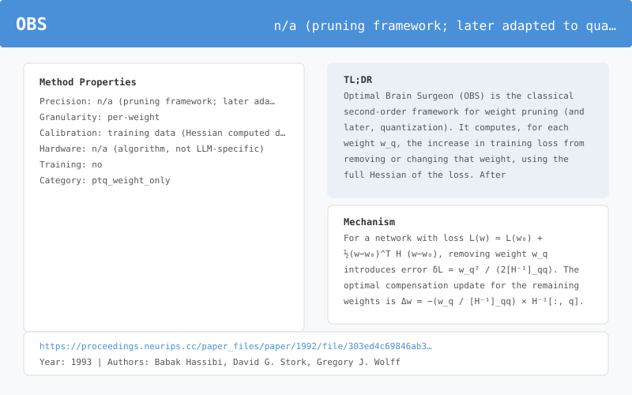

<em>OBS: second-order weight change formulation and exact Hessian-based compensation.</em>

```mermaid
flowchart LR
    A[Layer output error\nE = trace of H * delta_W^2] --> B[Choose weight\nwith min saliency]
    B --> C[Set weight to zero\n/ quantize it]
    C --> D[Update remaining\nweights via H^-1]
    D --> E{More weights?}
    E -->|yes| B
    E -->|no| F[Compressed layer\n+ error compensation]
```

> Optimal Brain Surgeon (OBS) is the classical second-order framework for weight pruning (and later, quantization). It computes, for each weight w_q, the increase in training loss from removing or changing that weight, using the full Hessian of the loss. After removing/changing weight q, OBS updates all remaining weights to minimize the resulting error: Δw = −(w_q / [H⁻¹]_qq) × H⁻¹[q, :]. This exact second-order compensation is the theoretical foundation for GPTQ, OBQ, and all subsequent Hessian-based quantization methods.

| Field | Value |
|-------|-------|
| Published at | **NeurIPS 1992** |
| Paper | [303ed4c69846ab36c2904d3ba8573050-Paper.pdf](https://proceedings.neurips.cc/paper_files/paper/1992/file/303ed4c69846ab36c2904d3ba8573050-Paper.pdf) |
| Precision | n/a (pruning framework; later adapted to quantization) |
| Granularity | per-weight |
| Calibration | training data (Hessian computed during training) |
| Symmetric? | n/a |
| Outlier handling | second-order Taylor expansion; exact error propagation |
| Hardware target | n/a (algorithm, not LLM-specific) |
| Training needed? | no |
| Calibration data? | yes |
| Typical degradation | n/a |
| Related | [obq](#obq) · [gptq](#gptq) |

**How it works:**

For a network with loss L(w) ≈ L(w₀) + ½(w−w₀)^T H (w−w₀), removing weight w_q introduces error δL = w_q² / (2[H⁻¹]_qq). The optimal compensation update for the remaining weights is Δw = −(w_q / [H⁻¹]_qq) × H⁻¹[:, q]. OBS generalizes this to quantization: setting w_q to its quantized value ŵ_q (instead of zero) introduces error (w_q − ŵ_q)² / (2[H⁻¹]_qq), and the same Hessian update compensates. The key computational challenge is inverting H, which is O(d³) - the bottleneck that GPTQ and OBQ address with approximations.

---

### RTN · W4A16 · PTQ W-only · unknown

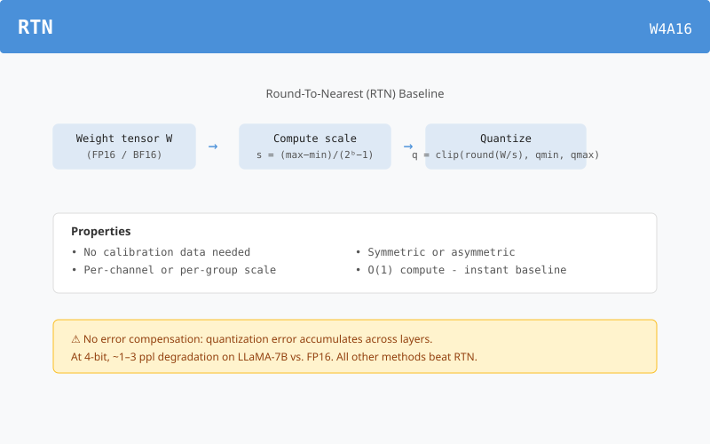

<em>Round-to-nearest: scale, round, clip - the universal baseline.</em>

```mermaid
flowchart LR
    A[FP16 Weights] --> B[Calibration data:\nno]
    B --> C[Compute scale\nand zero-point]
    C --> D[Quantize weights\nto W4A16]
    D --> E[Outlier handling:\nnone - no compensation mechani]
    E --> F[Quantized model\nW4A16]
```

> Round-to-nearest is the simplest possible quantization strategy: compute a linear scale from the weight range, divide each weight by that scale, round to the nearest integer, and clip to the representable range. It requires no data, no calibration, and no compute beyond a single pass over the weights. It is the universal baseline against which all other methods are measured. At 4-bit it typically degrades perplexity by 1–3 points on LLaMA-scale models, and at 3-bit or below it degrades rapidly. Every method in this gallery claims to beat RTN at the same bit-width.

| Field | Value |
|-------|-------|
| Published at | n/a (no paper) |
| Precision | W4A16 |
| Granularity | per-channel or per-group (g=128 typical) |
| Calibration | none - weights only |
| Symmetric? | asymmetric |
| Outlier handling | none - no compensation mechanism |
| Hardware target | any (no custom kernels required) |
| Training needed? | no |
| Calibration data? | no |
| Typical degradation | ~1–3 ppl on LLaMA-7B at 4-bit; ~8–15 ppl at 3-bit (vs. FP16) |
| Superseded by | [gptq](#gptq) · [awq](#awq) · [hqq](#hqq) |
| Related | [gptq](#gptq) · [awq](#awq) · [owq](#owq) |

**How it works:**

Given a weight tensor W, compute s = (max(W) − min(W)) / (2^b − 1) for asymmetric quantization, then q = clip(round(W/s), 0, 2^b − 1). Dequantize as Ŵ = (q − z) × s. Granularity choices (per-tensor, per-channel, per-group) trade storage overhead for accuracy. Per-group with g=128 is the minimum quality bar for LLM deployment today.

---

---

## Post-Training Quantization - Weights + Activations

Quantizing both weights and activations enables integer matrix multiplication (W8A8 or W4A8), which is compute-bound-friendly and achieves higher throughput than W-only on GPU. The challenge is handling activation outliers without sacrificing accuracy.

### Shift-and-Sum · W4A4 / W4A6 / W6A6 · PTQ W+A · 2026-06

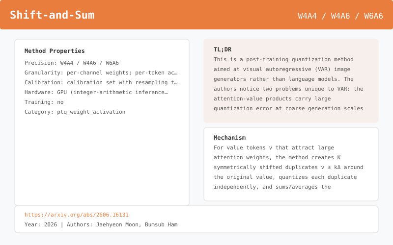

<em>Shift-and-Sum: high-attention value tokens are duplicated with symmetric shifts, each quantized, then aggregated so rounding errors cancel; calibration resampling aligns codebook frequency with predicted probabilities.</em>

```mermaid
flowchart LR
    A[FP16 Weights + Activations] --> B[Handle outliers:\nduplicating value tokens with ]
    B --> C[Quantize weights\nto low-bit]
    B --> D[Quantize activations\nto low-bit]
    C --> E[INT GEMM\ntensor cores]
    D --> E
    E --> F[W4A4 / W4A6 / W6A6\nquantized inference]
```

> This is a post-training quantization method aimed at visual autoregressive (VAR) image generators rather than language models. The authors notice two problems unique to VAR: the attention-value products carry large quantization error at coarse generation scales where attention concentrates on a few value tokens, and the calibration set under- or over- represents certain codebook entries relative to how often the model actually predicts them. To fix the first, they make extra copies of the value tokens that receive high attention, nudge each copy by a small symmetric offset above and below the original value, quantize all of them, and average the results so the rounding errors cancel out. To fix the second, they resample the calibration tokens so that each VQVAE codebook entry appears in proportion to its predicted probability. The method needs only calibration data and no retraining, and it works across VAR depths on class-conditional generation, inpainting, outpainting, and editing.

| Field | Value |
|-------|-------|
| Published at | **ICLR 2026** |
| Paper | [2606.16131](https://arxiv.org/abs/2606.16131) |
| Code | [cvlab-yonsei/Shift-and-Sum](https://github.com/cvlab-yonsei/Shift-and-Sum) |
| Blog / post | [link](http://cvlab.yonsei.ac.kr/projects/Shift-and-Sum/) |
| Precision | W4A4 / W4A6 / W6A6 |
| Granularity | per-channel weights; per-token activations (attention-value path) |
| Calibration | calibration set with resampling to align codebook-entry sampling frequency with predicted probabilities |
| Symmetric? | symmetric |
| Outlier handling | duplicating value tokens with large attention scores and applying symmetric shifts around the original value, then aggregating the quantized duplicates so per-token quantization error cancels in the attention-value product |
| Hardware target | GPU (integer-arithmetic inference for VAR generators) |
| Training needed? | no |
| Calibration data? | yes |
| Typical degradation | VAR-d24 on ImageNet 256x256 at W4A6: FID 3.96 / IS 230.7; VAR-d30 at W4A6: FID 4.59 (vs FP16 baseline) |
| Related | [smoothquant](#smoothquant) |

**How it works:**

For value tokens v that attract large attention weights, the method creates K symmetrically shifted duplicates v ± kΔ around the original value, quantizes each duplicate independently, and sums/averages the dequantized results; because the shifts are symmetric, the per- duplicate rounding errors are anti-correlated and largely cancel, yielding a lower-error estimate of the attention-value product than quantizing v once. The weights and remaining activations are quantized with standard uniform symmetric grids at 4-6 bits. A complementary resampling calibration step reassigns tokens from over-sampled to under-sampled codebook entries so the calibration statistics match the model's predicted token distribution, which improves activation range estimates. The whole pipeline is post-training (calibration only, no gradient updates).

---

### MosaicQuant · W4A8 (also W4A4) · PTQ W+A · 2026-06

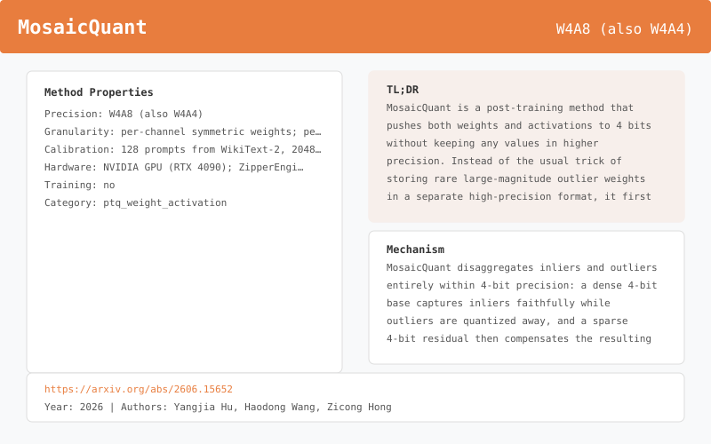

<em>Dense 4-bit base plus Hessian-selected sparse 4-bit residual, fused into one INT4 GEMM by ZipperEngine.</em>

```mermaid
flowchart LR
    A[FP16 Weights + Activations] --> B[Handle outliers:\ninlier-outlier disaggregation:]
    B --> C[Quantize weights\nto low-bit]
    B --> D[Quantize activations\nto low-bit]
    C --> E[INT GEMM\ntensor cores]
    D --> E
    E --> F[W4A8 also W4A4\nquantized inference]
```

> MosaicQuant is a post-training method that pushes both weights and activations to 4 bits without keeping any values in higher precision. Instead of the usual trick of storing rare large-magnitude outlier weights in a separate high-precision format, it first quantizes the entire weight matrix to a single dense 4-bit representation, accepting that outliers get crushed. It then measures which weight blocks hurt the layer output most, using a diagonal- Hessian-based score, and adds a second sparse 4-bit residual only on those blocks to claw back the lost accuracy. Because both the base and the correction are 4-bit, the whole computation stays in one uniform low-bit pipeline; a fused kernel called ZipperEngine folds the sparse residual into the dense 4-bit matrix multiply so there is no extra precision conversion or memory traffic. It needs only a small calibration set and keeps accuracy close to FP16 on LLaMA3 and Qwen3 while running faster than the FP16 baseline.

| Field | Value |
|-------|-------|
| Published at | arXiv (preprint) |
| Paper | [2606.15652](https://arxiv.org/abs/2606.15652) |
| Precision | W4A8 (also W4A4) |
| Granularity | per-channel symmetric weights; per-token dynamic activations (W4A8) / per-group activations (W4A4); block-level residual selection |
| Calibration | 128 prompts from WikiText-2, 2048 tokens each |
| Symmetric? | symmetric |
| Outlier handling | inlier-outlier disaggregation: dense 4-bit base plus a sparse 4-bit residual on error-critical blocks chosen by a Hessian-guided output-aware criterion (diagonal-Hessian Delta scoring) |
| Hardware target | NVIDIA GPU (RTX 4090); ZipperEngine fuses sparse residual into dense INT4 GEMM via an overlapped pipeline |
| Training needed? | no |
| Calibration data? | yes |
| Typical degradation | WikiText-2 PPL: LLaMA3-8B W4A8 10.2 vs FP16 8.6; Qwen3-8B W4A8 10.6 vs FP16 9.7 (W4A4 11.2); Qwen3-8B 6-task zero-shot avg 70.6 vs FP16 71.6; up to 1.24x speedup over W16A16 |
| Builds on | [gptq](#gptq) · [spqr](#spqr) · [squeezellm](#squeezellm) |
| Related | [atom](#atom) · [qserve](#qserve) · [quarot](#quarot) · [marlin](#marlin) · [awq](#awq) |

**How it works:**

MosaicQuant disaggregates inliers and outliers entirely within 4-bit precision: a dense 4-bit base captures inliers faithfully while outliers are quantized away, and a sparse 4-bit residual then compensates the resulting error only on the most error-critical weight blocks. Those blocks are picked by a Hessian-guided, output-aware criterion: for each input channel the diagonal Hessian estimate weights how strongly that channel's quantization error distorts the layer output, concentrating the residual budget where it matters. To keep execution uniform, ZipperEngine fuses the sparse residual blocks into the dense INT4 GEMM through an overlapped pipeline that interleaves dequant, compute, and reduce-add, avoiding the precision conversion and extra data movement that mixed-precision outlier handling normally incurs.

---

### Trainable SmoothRot · W4A4 · PTQ W+A · 2026-06

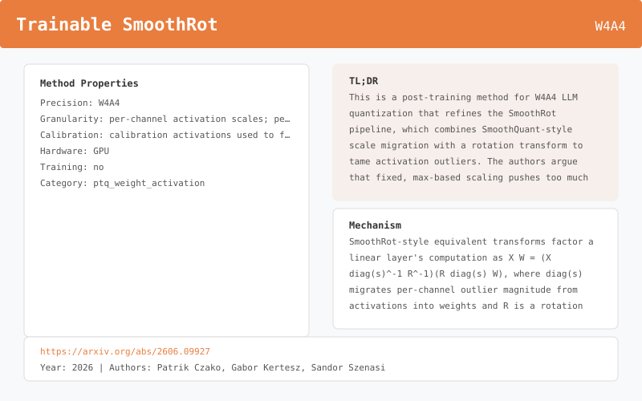

<em>Quantile-robust scale migration plus rotation, with constrained gradient-learned per-channel scales, for W4A4 activation-weight quantization.</em>

```mermaid
flowchart LR
    A[FP16 Weights + Activations] --> B[Handle outliers:\nquantile-robust scale migratio]
    B --> C[Quantize weights\nto low-bit]
    B --> D[Quantize activations\nto low-bit]
    C --> E[INT GEMM\ntensor cores]
    D --> E
    E --> F[W4A4\nquantized inference]
```

> This is a post-training method for W4A4 LLM quantization that refines the SmoothRot pipeline, which combines SmoothQuant-style scale migration with a rotation transform to tame activation outliers. The authors argue that fixed, max-based scaling pushes too much outlier energy from activations into weights (over-migration), so they replace the max statistic with a high quantile to set scales more robustly and then fine-tune the per-channel scales with a small constrained gradient search. Both the smoothing strength and the quantile are treated as searchable knobs, and a lightweight training step adjusts the channel scales while keeping the model weights frozen and the transform mathematically equivalent. On LLaMA-3.2-1B they report consistent per-layer error reductions over the SmoothRot baseline, with the largest gains on down-projection layers.

| Field | Value |
|-------|-------|
| Published at | arXiv (preprint) |
| Paper | [2606.09927](https://arxiv.org/abs/2606.09927) |
| Precision | W4A4 |
| Granularity | per-channel activation scales; per-layer rotation applied within decoder blocks |
| Calibration | calibration activations used to fit quantile statistics and to optimize the transform parameters |
| Symmetric? | symmetric |
| Outlier handling | quantile-robust scale migration plus rotation, with constrained gradient-learned per-channel scales to avoid over-migration of outlier energy |
| Hardware target | GPU |
| Training needed? | no |
| Calibration data? | yes |
| Typical degradation | On LLaMA-3.2-1B at W4A4, selected-layer error improves up to 18.5% over the SmoothRot baseline (12% from joint alpha,q search; 11.1% from quantile-only policy search); replaying the best policy on all decoder-block down-projection layers cuts full-layer mean error from 97.51 to 78.08 (19.9%). No perplexity/accuracy numbers reported. |
| Builds on | [smoothquant](#smoothquant) · [quarot](#quarot) · [spinquant](#spinquant) |
| Related | [flatquant](#flatquant) · [duquant](#duquant) · [affine-quant](#affine-quant) · [omniquant](#omniquant) · [outlier-suppression-plus](#outlier-suppression-plus) |

**How it works:**

SmoothRot-style equivalent transforms factor a linear layer's computation as X W = (X diag(s)^-1 R^-1)(R diag(s) W), where diag(s) migrates per-channel outlier magnitude from activations into weights and R is a rotation that further spreads outlier energy. The paper replaces the usual max-based rule for s with a high-quantile statistic so a few extreme samples do not inflate the scale and cause over-migration, and it jointly searches the smoothing exponent alpha together with the quantile level q. It then adds a constrained gradient-based optimization that learns the per-channel scales directly to minimize layer- wise reconstruction error under W4A4, while the transform remains an exact equivalence so no model weights are modified.

---

### OffQ · W4A4KV4 · PTQ W+A · 2026-06

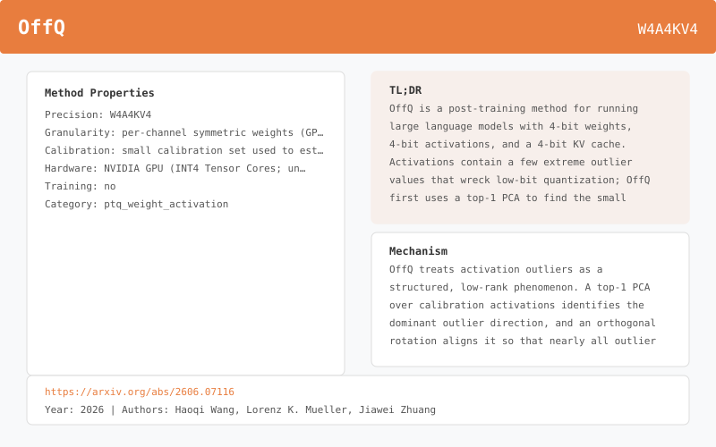

<em>Top-1 PCA + rotation concentrate activation outliers into one channel, which is absorbed as a shared offset to enable uniform-grid W4A4KV4.</em>

```mermaid
flowchart LR
    A[FP16 Weights + Activations] --> B[Handle outliers:\ntop-1 PCA finds a low-dimensio]
    B --> C[Quantize weights\nto low-bit]
    B --> D[Quantize activations\nto low-bit]
    C --> E[INT GEMM\ntensor cores]
    D --> E
    E --> F[W4A4KV4\nquantized inference]
```

> OffQ is a post-training method for running large language models with 4-bit weights, 4-bit activations, and a 4-bit KV cache. Activations contain a few extreme outlier values that wreck low-bit quantization; OffQ first uses a top-1 PCA to find the small subspace where these outliers live, then applies a rotation that herds the outlier energy into a single channel. Instead of giving that channel special treatment, OffQ subtracts its magnitude as a shared offset, which lowers the spread of the activation values so an ordinary uniform grid can represent them well. Because the grid stays uniform and the precision stays the same everywhere, the result is friendly to standard integer hardware while keeping accuracy close to full precision.

| Field | Value |
|-------|-------|
| Published at | arXiv (preprint) |
| Paper | [2606.07116](https://arxiv.org/abs/2606.07116) |
| Precision | W4A4KV4 |
| Granularity | per-channel symmetric weights (GPTQ); per-group asymmetric activations (g=128) |
| Calibration | small calibration set used to estimate the outlier subspace (top-1 PCA) and per-layer offsets, and for GPTQ weight quantization |
| Symmetric? | mixed |
| Outlier handling | top-1 PCA finds a low-dimensional outlier subspace; a rotation concentrates outlier energy into a single channel, whose magnitude is then absorbed as a shared additive offset, shrinking activation variance for uniform-grid quantization |
| Hardware target | NVIDIA GPU (INT4 Tensor Cores; uniform-grid, uniform-precision for deployment) |
| Training needed? | no |
| Calibration data? | yes |
| Typical degradation | W4A4KV4 WikiText PPL 5.77 on LLaMA-2-7B and 6.98 on LLaMA-3-8B (vs SpinQuant 6.0 / QuaRot 7.8, SpinQuant 7.4, ResQ 7.1); ~65.5 avg zero-shot accuracy on LLaMA-3-8B across ARC-e/c, BoolQ, HellaSwag, OBQA, PIQA, SIQA, WinoGrande |
| Builds on | [quarot](#quarot) · [spinquant](#spinquant) · [resq](#resq) · [gptq](#gptq) |
| Related | [flatquant](#flatquant) · [duquant](#duquant) · [quip](#quip) |

**How it works:**

OffQ treats activation outliers as a structured, low-rank phenomenon. A top-1 PCA over calibration activations identifies the dominant outlier direction, and an orthogonal rotation aligns it so that nearly all outlier magnitude collapses into one channel (similar in spirit to Hadamard/learned rotations in QuaRot/SpinQuant, but targeted at the principal outlier component). The magnitude of that concentrated channel is then converted into a shared additive offset that is folded into the linear layer, removing the outlier's contribution to the activation standard deviation. With the distribution flattened, OffQ applies deployment-friendly uniform-grid quantization: per-group (g=128) asymmetric activations and per-channel symmetric GPTQ weights, extending to the KV cache for full W4A4KV4.

---

### FAIR-Calib · W4A4 · PTQ W+A · 2026-06

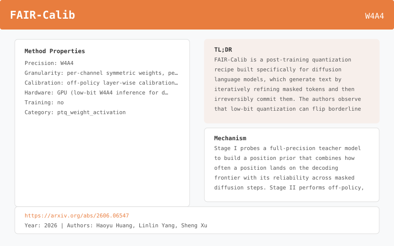

<em>FAIR-Calib: Stage I teacher probing of frontier/reliability position priors feeds a Stage II instability-reweighted hidden-state MSE calibration for W4A4 diffusion-LLM quantization.</em>

```mermaid
flowchart LR
    A[FP16 Weights + Activations] --> B[Handle outliers:\naffine flattening transforms i]
    B --> C[Quantize weights\nto low-bit]
    B --> D[Quantize activations\nto low-bit]
    C --> E[INT GEMM\ntensor cores]
    D --> E
    E --> F[W4A4\nquantized inference]
```

> FAIR-Calib is a post-training quantization recipe built specifically for diffusion language models, which generate text by iteratively refining masked tokens and then irreversibly commit them. The authors observe that low-bit quantization can flip borderline token choices right at the model's write frontier, and because those choices get locked in, the error propagates through the rest of the sequence. The method first probes a full-precision teacher to learn which token positions are most fragile, then runs a layer-wise calibration that weights the per-position reconstruction error so that fragile frontier positions are protected more strongly. It works at W4A4 for both weights and activations and avoids running full diffusion rollouts during calibration.

| Field | Value |
|-------|-------|
| Published at | **ICML 2026** |
| Paper | [2606.06547](https://arxiv.org/abs/2606.06547) |
| Precision | W4A4 |
| Granularity | per-channel symmetric weights, per-token symmetric activations |
| Calibration | off-policy layer-wise calibration minimizing reweighted hidden-state MSE; ~512 GSM8K prompts for frontier probing plus 128 WikiText-2 sequences, 1024-token calibration length |
| Symmetric? | symmetric |
| Outlier handling | affine flattening transforms inherited from FlatQuant, combined with instability-reweighting that protects fragile write-frontier token decisions |
| Hardware target | GPU (low-bit W4A4 inference for diffusion LLMs) |
| Training needed? | no |
| Calibration data? | yes |
| Typical degradation | On LLaDA-Base W4A4, 61.09% average over 10 benchmarks (vs 59.37% FlatQuant, 58.78% QuaRot); LLaDA-1.5 72.75% avg; Dream-Base 64.64% avg (vs 62.08% FlatQuant); GSM8K 64.75% vs 57.24% on LLaDA-Base |
| Builds on | [flatquant](#flatquant) · [quarot](#quarot) |
| Related | [gptq](#gptq) · [omniquant](#omniquant) |

**How it works:**

Stage I probes a full-precision teacher model to build a position prior that combines how often a position lands on the decoding frontier with its reliability across masked diffusion steps. Stage II performs off-policy, layer-wise calibration that minimizes a hidden-state MSE reweighted by this prior, so quantization error is spent preferentially on protecting unstable frontier-token decisions rather than already-stable ones. The reweighted objective is theoretically motivated as a surrogate for minimizing output KL divergence, and the off- policy formulation avoids expensive end-to-end diffusion sampling during calibration. It layers on top of FlatQuant-style affine flattening transforms to keep weights and activations quantization-friendly at W4A4.

---

### MorphoQuant · W4A4 · PTQ W+A · 2026-06

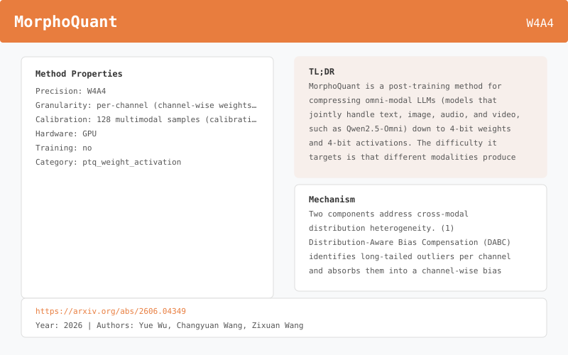

<em>MorphoQuant for W4A4 omni-modal LLMs: DABC offloads per-channel long-tailed outliers into channel biases, and MDQFO co-optimizes the quantization grid with the outlier masks for consistent alignment across modalities.</em>

```mermaid
flowchart LR
    A[FP16 Weights + Activations] --> B[Handle outliers:\nDistribution-Aware Bias Compen]
    B --> C[Quantize weights\nto low-bit]
    B --> D[Quantize activations\nto low-bit]
    C --> E[INT GEMM\ntensor cores]
    D --> E
    E --> F[W4A4\nquantized inference]
```

> MorphoQuant is a post-training method for compressing omni-modal LLMs (models that jointly handle text, image, audio, and video, such as Qwen2.5-Omni) down to 4-bit weights and 4-bit activations. The difficulty it targets is that different modalities produce very different activation distributions and outlier patterns, so a single quantizer tuned for one modality wrecks accuracy on the others. It tackles this in two parts: first it shifts the heavy long- tailed outliers in each channel into a learned per-channel bias term, leaving a tighter, more uniform set of values that 4-bit quantization can represent well; second it jointly tunes the quantization grid and the outlier-selection masks so the same scheme stays well- aligned across all modalities. On Qwen2.5-Omni it reports W4A4 accuracy that edges past the weight-only W4A16 reference on ScienceQA while also covering MMMU and Video-MME, using only a small 128-sample calibration set and no gradient training of the base model.

| Field | Value |
|-------|-------|
| Published at | arXiv (preprint) |
| Paper | [2606.04349](https://arxiv.org/abs/2606.04349) |
| Precision | W4A4 |
| Granularity | per-channel (channel-wise weights and activations; per-channel bias compensation with per-channel outlier masks) |
| Calibration | 128 multimodal samples (calibration set for the search/optimization phase) |
| Symmetric? | asymmetric |
| Outlier handling | Distribution-Aware Bias Compensation (DABC): selectively absorbs long-tailed outliers into channel-wise biases so the remaining dense inliers can be discretized at high precision |
| Hardware target | GPU |
| Training needed? | no |
| Calibration data? | yes |
| Typical degradation | W4A4 reaches 76.63% on ScienceQA with Qwen2.5-Omni, above the 75.88% W4A16 QLoRA baseline; also evaluated on MMMU and Video-MME |
| Builds on | [smoothquant](#smoothquant) · [awq](#awq) · [omniquant](#omniquant) · [atom](#atom) · [outlier-suppression-plus](#outlier-suppression-plus) |
| Related | [duquant](#duquant) · [quarot](#quarot) · [atom](#atom) · [omniquant](#omniquant) |

**How it works:**

Two components address cross-modal distribution heterogeneity. (1) Distribution-Aware Bias Compensation (DABC) identifies long-tailed outliers per channel and absorbs them into a channel-wise bias instead of forcing them through the low-bit quantizer; this protects outlier magnitudes while letting the dense inlier mass be discretized at full effective resolution. (2) Morphology-Directed Quantization Function Optimization (MDQFO) co-optimizes the quantization grid (scales/clipping) together with the per-channel outlier bias masks so the quantizer is consistently aligned across the differing modal distributions. The combination is a calibration-only PTQ pipeline (128 multimodal samples) that needs no fine- tuning of the model weights.

---

### STaR-Quant · W4A4 · PTQ W+A · 2026-06

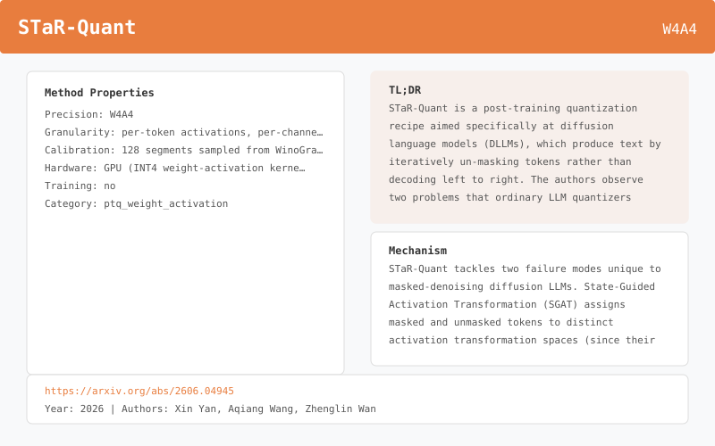

<em>STaR-Quant: State-Guided Activation Transformation splits masked/unmasked tokens into separate activation spaces with a shared weight transform, and Temporal Attention Compensation applies a block-diagonal affine correction to quantized attention across denoising steps.</em>

```mermaid
flowchart LR
    A[FP16 Weights + Activations] --> B[Handle outliers:\nstate-guided activation transf]
    B --> C[Quantize weights\nto low-bit]
    B --> D[Quantize activations\nto low-bit]
    C --> E[INT GEMM\ntensor cores]
    D --> E
    E --> F[W4A4\nquantized inference]
```

> STaR-Quant is a post-training quantization recipe aimed specifically at diffusion language models (DLLMs), which produce text by iteratively un-masking tokens rather than decoding left to right. The authors observe two problems that ordinary LLM quantizers miss: masked and unmasked tokens have very different activation ranges within a single denoising step, and small quantization errors compound over the many denoising iterations. To handle the first, masked and unmasked tokens are routed through separate activation transformation spaces while sharing one static weight-side transform, so a single quantized weight matrix still serves both. To handle the second, a lightweight block-diagonal affine correction is applied to the quantized attention to keep the attention output close to its full-precision counterpart across steps. The method needs only a small calibration set and no fine-tuning, and targets 4-bit weight and 4-bit activation deployment.

| Field | Value |
|-------|-------|
| Published at | arXiv (preprint) |
| Paper | [2606.04945](https://arxiv.org/abs/2606.04945) |
| Precision | W4A4 |
| Granularity | per-token activations, per-channel weights |
| Calibration | 128 segments sampled from WinoGrande |
| Symmetric? | asymmetric |
| Outlier handling | state-guided activation transformation (separate transform spaces for masked vs unmasked tokens) plus a unified static weight-side transformation; temporal attention compensation corrects quantized attention with a block-diagonal affine map |
| Hardware target | GPU (INT4 weight-activation kernels); reports up to 1.69x speedup and 3.14x memory saving over FP16 |
| Training needed? | no |
| Calibration data? | yes |
| Typical degradation | W4A4 on LLaDA-8B reaches 49.12 average accuracy across 9 benchmarks (TruthfulQA-MC2, ARC-Challenge, HellaSwag, WinoGrande, PIQA, MMLU, C-EVAL, GSM8K, HumanEval), +2.78 over the DLLMQuant++ baseline; consistent gains also reported on LLaDA-1.5-8B and Dream 7B |
| Builds on | [awq](#awq) · [quarot](#quarot) |
| Related | [smoothquant](#smoothquant) · [rtn](#rtn) |

**How it works:**

STaR-Quant tackles two failure modes unique to masked-denoising diffusion LLMs. State-Guided Activation Transformation (SGAT) assigns masked and unmasked tokens to distinct activation transformation spaces (since their distributions differ within a step) but pairs them with one shared static weight-side transformation, so weights remain singly quantized while activations are normalized per state. Temporal Attention Compensation (TAC) then corrects the quantized attention representation through a lightweight block-diagonal affine mapping, counteracting the error that otherwise accumulates over the iterative denoising trajectory. Together these enable W4A4 weight-activation quantization with per-token activation and per- channel weight scales, asymmetric, calibrated on 128 WinoGrande segments without any gradient training.

---

### InfoQuant · W4A4KV4 · PTQ W+A · 2026-05

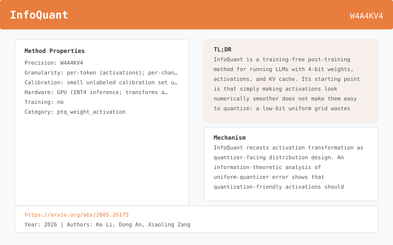

<em>PSOT reshapes activations to a tighter range with higher dispersion (info-theoretic target) before W4A4KV4 quantization; outlier tokens are adaptively discounted during fitting.</em>

```mermaid
flowchart LR
    A[FP16 Weights + Activations] --> B[Handle outliers:\nPeak Suppression Orthogonal Tr]
    B --> C[Quantize weights\nto low-bit]
    B --> D[Quantize activations\nto low-bit]
    C --> E[INT GEMM\ntensor cores]
    D --> E
    E --> F[W4A4KV4\nquantized inference]
```

> InfoQuant is a training-free post-training method for running LLMs with 4-bit weights, activations, and KV cache. Its starting point is that simply making activations look numerically smoother does not make them easy to quantize: a low-bit uniform grid wastes precision when the range stays wide or when most values pile up near the mean. The authors analyze quantization error from an information-theoretic angle and argue that good activations need both a tighter range and enough spread across that range. They then apply learned orthogonal transformations to reshape activations toward that target before quantizing, with an extra step that decides which outlier tokens to down-weight while fitting the transforms so the fit stays stable. The transforms are orthogonal, so they can be folded into the surrounding weight matrices and add no extra inference cost.

| Field | Value |
|-------|-------|
| Published at | arXiv (preprint) |
| Paper | [2605.26175](https://arxiv.org/abs/2605.26175) |
| Code | [LLIKKE/InfoQuant](https://github.com/LLIKKE/InfoQuant) |
| Precision | W4A4KV4 |
| Granularity | per-token (activations); per-channel weights with GPTQ, group size 128 |
| Calibration | small unlabeled calibration set used to optimize the orthogonal transforms and clipping |
| Symmetric? | asymmetric |
| Outlier handling | Peak Suppression Orthogonal Transformation that shrinks activation range while raising dispersion, plus adaptive outlier-token selection during optimization |
| Hardware target | GPU (INT4 inference; transforms absorbed into weights, orthogonal so matmul-preserving) |
| Training needed? | no |
| Calibration data? | yes |
| Typical degradation | W4A4KV4 LLaMA-2-7B: 5.89 WikiText-2 ppl / 63.16% avg zero-shot; LLaMA-2-13B: 5.18 ppl / 66.33% avg; preserves ~97% of FP accuracy on average |
| Builds on | [quarot](#quarot) · [spinquant](#spinquant) · [gptq](#gptq) |
| Related | [quarot](#quarot) · [spinquant](#spinquant) · [duquant](#duquant) · [flatquant](#flatquant) |

**How it works:**

InfoQuant recasts activation transformation as quantizer-facing distribution design. An information-theoretic analysis of uniform-quantizer error shows that quantization-friendly activations should jointly minimize numerical range and maximize normalized dispersion within that range. To produce such distributions it introduces Peak Suppression Orthogonal Transformation (PSOT): orthogonal matrices optimized with a peak-suppression objective that reduces the activation range while increasing dispersion, kept matmul-preserving so they fold into adjacent weights offline. An adaptive outlier-token selection scheme identifies and discounts the most disruptive tokens during PSOT optimization to make the fit robust, and a learnable activation clipping step (LAC) further tunes the quantization range. Weights are quantized per-channel with GPTQ.

---

### TORQ · W4A4 (both weights and activations in MXFP4 e2m1) · PTQ W+A · 2026-05

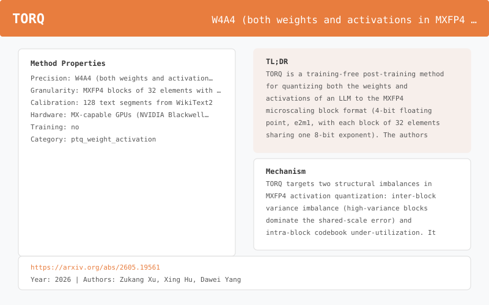

<em>TORQ: macro inter-block rotation (Schur-Horn) equalizes variance across MXFP4 blocks; micro intra-block rotation (max-entropy) fills the FP4 codebook.</em>

```mermaid
flowchart LR
    A[FP16 Weights + Activations] --> B[Handle outliers:\ntwo-level orthogonal rotation:]
    B --> C[Quantize weights\nto low-bit]
    B --> D[Quantize activations\nto low-bit]
    C --> E[INT GEMM\ntensor cores]
    D --> E
    E --> F[W4A4 both weights and activations in MXFP4 e2m1\nquantized inference]
```

> TORQ is a training-free post-training method for quantizing both the weights and activations of an LLM to the MXFP4 microscaling block format (4-bit floating point, e2m1, with each block of 32 elements sharing one 8-bit exponent). The authors observe that naively casting activations to MXFP4 fails in two ways: some blocks carry far more variance than others, and within a block the limited set of FP4 codewords is poorly used. TORQ fixes this with two orthogonal rotations applied before quantization. The first rotation rebalances variance evenly across blocks, and the second reshapes the distribution inside each block so it covers the available codewords more fully. Because the rotations are orthogonal they can be folded into the surrounding weight matrices, so inference stays in plain MXFP4 with no extra runtime cost while recovering most of the accuracy lost by direct rounding.

| Field | Value |
|-------|-------|
| Published at | arXiv (preprint) |
| Paper | [2605.19561](https://arxiv.org/abs/2605.19561) |
| Precision | W4A4 (both weights and activations in MXFP4 e2m1) |
| Granularity | MXFP4 blocks of 32 elements with a shared E8M0 exponent scale |
| Calibration | 128 text segments from WikiText2 |
| Symmetric? | symmetric |
| Outlier handling | two-level orthogonal rotation: inter-block (Schur-Horn) rotation equalizes variance across blocks, intra-block (max-entropy) rotation spreads values across the FP4 codebook |
| Hardware target | MX-capable GPUs (NVIDIA Blackwell with native MXFP4 Tensor Cores) |
| Training needed? | no |
| Calibration data? | yes |
| Typical degradation | WikiText2 PPL +2.43 on LLaMA3-8B (8.57 vs 6.14 BF16); +0.82 on Qwen3-32B (8.43 vs 7.61 BF16); zero-shot avg accuracy gap ~-1.19% on Qwen3-32B (73.63% vs 74.82% BF16) |
| Builds on | [quarot](#quarot) · [spinquant](#spinquant) · [mx-formats](#mx-formats) |
| Related | [quarot](#quarot) · [spinquant](#spinquant) · [duquant](#duquant) · [flatquant](#flatquant) · [nvfp4](#nvfp4) · [mx-formats](#mx-formats) |

**How it works:**

TORQ targets two structural imbalances in MXFP4 activation quantization: inter-block variance imbalance (high-variance blocks dominate the shared-scale error) and intra-block codebook under-utilization. It applies a macro-equilibrium rotation, constructed per token position across the blocks using the Schur-Horn theorem, to redistribute variance uniformly over the 32-element MXFP4 blocks so no single block's dynamic range dominates its shared E8M0 scale. It then applies a micro-alignment rotation inside each block, optimized with a codebook-occupancy / maximum-entropy objective, so activation values are spread across the e2m1 codeword set rather than clustering. Both transformations are orthogonal, so they preserve the matmul exactly and are absorbed into adjacent weights offline, keeping inference in standard MXFP4. The procedure is training-free and uses 128 WikiText2 calibration segments.

---

### SplitQ · W4A8 · PTQ W+A · 2026-05

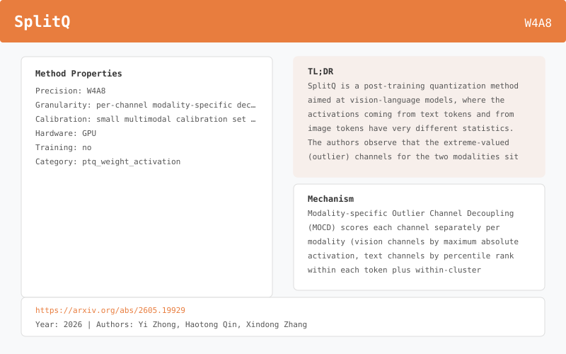

<em>SplitQ separates text-specific and vision-specific outlier channels (MOCD), then applies dual per-modality low-rank affine correction branches (ACC) to enable low-bit (down to W3A2) weight+activation quantization of VLMs.</em>

```mermaid
flowchart LR
    A[FP16 Weights + Activations] --> B[Handle outliers:\nmodality-specific outlier chan]
    B --> C[Quantize weights\nto low-bit]
    B --> D[Quantize activations\nto low-bit]
    C --> E[INT GEMM\ntensor cores]
    D --> E
    E --> F[W4A8\nquantized inference]
```

> SplitQ is a post-training quantization method aimed at vision-language models, where the activations coming from text tokens and from image tokens have very different statistics. The authors observe that the extreme-valued (outlier) channels for the two modalities sit in different places, so treating all channels uniformly hurts low-bit accuracy. SplitQ first sorts channels into groups that are shared, text-only, or vision-only based on per-modality scoring, and handles each group's outliers separately. It then attaches two small learnable branches, one per modality, that are fit on a calibration set to undo the error introduced by quantizing to as few as 3 or 4 bits, letting weights and activations both be pushed to low precision with limited accuracy loss.

| Field | Value |
|-------|-------|
| Published at | arXiv (preprint) |
| Paper | [2605.19929](https://arxiv.org/abs/2605.19929) |
| Code | [EMVision-NK/SplitQ](https://github.com/EMVision-NK/SplitQ) |
| Precision | W4A8 |
| Granularity | per-channel modality-specific decoupling (activations); per-group/per-layer learned affine (weights) |
| Calibration | small multimodal calibration set to fit the learnable correction branches |
| Symmetric? | symmetric |
| Outlier handling | modality-specific outlier channel decoupling (MOCD): isolates salient outlier channels separately for the text and vision modalities, then applies per-modality low-rank affine correction (ACC) |
| Hardware target | GPU |
| Training needed? | no |
| Calibration data? | yes |
| Typical degradation | Qwen2.5-VL-7B retains 93.5% of FP16 (69.5 vs 74.3 avg) at W3A3 and 98.9% (73.5) at W4A4 across MMMU, OCRBench, TextVQA, SEED-Bench, VizWiz, ScienceQA |
| Builds on | [smoothquant](#smoothquant) · [flatquant](#flatquant) |
| Related | [duquant](#duquant) · [omniquant](#omniquant) |

**How it works:**

Modality-specific Outlier Channel Decoupling (MOCD) scores each channel separately per modality (vision channels by maximum absolute activation, text channels by percentile rank within each token plus within-cluster variance) and partitions channels into three disjoint sets: modality-compatible, text-specific, and vision-specific, so each modality's outliers are isolated cheaply. Adaptive Cross-Modal Calibration (ACC) then adds dual lightweight learnable low-rank branches (a FlatQuant-style learnable affine parameterization, with separate matrices Us/Vs for shared and Uc/Vc for modality channels) that dynamically compensate for modality-induced quantization error. Together they let weights and activations be quantized to W4A8 down to W3A2 while preserving most of FP16 accuracy on VLM benchmarks.

---

### DiRotQ · W4A4 · PTQ W+A · 2026-05

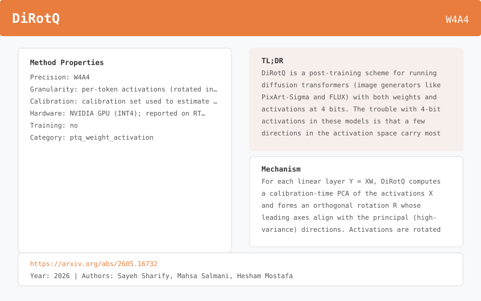

<em>PCA-derived rotation aligns dominant activation variance to a low-rank subspace kept at higher precision; remaining coordinates and weights are quantized to 4-bit (W4A4).</em>

```mermaid
flowchart LR
    A[FP16 Weights + Activations] --> B[Handle outliers:\nPCA-derived orthogonal rotatio]
    B --> C[Quantize weights\nto low-bit]
    B --> D[Quantize activations\nto low-bit]
    C --> E[INT GEMM\ntensor cores]
    D --> E
    E --> F[W4A4\nquantized inference]
```

> DiRotQ is a post-training scheme for running diffusion transformers (image generators like PixArt-Sigma and FLUX) with both weights and activations at 4 bits. The trouble with 4-bit activations in these models is that a few directions in the activation space carry most of the variance, and crushing them to 4 bits wrecks image quality. DiRotQ uses PCA on calibration activations to find that high-variance, low-rank subspace, then rotates each layer's activations into the PCA basis so the important directions line up with a handful of coordinates. Those coefficients are kept at higher precision while everything else drops to 4-bit, and weights are quantized with a GPTQ-style pass. Because the rotation is orthogonal it leaves the layer's math unchanged, so it folds into the weights with no extra runtime cost. The authors also add a vision-language-model-based judge to score perceptual quality under aggressive compression, and report 4-bit image quality close to higher-precision baselines with measurable memory and latency wins.

| Field | Value |
|-------|-------|
| Published at | arXiv (preprint) |
| Paper | [2605.16732](https://arxiv.org/abs/2605.16732) |
| Precision | W4A4 |
| Granularity | per-token activations (rotated into PCA basis); per-group weights (GPTQ) |
| Calibration | calibration set used to estimate the activation covariance / PCA rotation and to run GPTQ weight quantization |
| Symmetric? | symmetric |
| Outlier handling | PCA-derived orthogonal rotation that concentrates dominant activation variance into a low-rank subspace whose coefficients are kept at higher precision; remaining components quantized to 4-bit |
| Hardware target | NVIDIA GPU (INT4); reported on RTX 4090 |
| Training needed? | no |
| Calibration data? | yes |
| Typical degradation | PixArt-Sigma on MJHQ-30K at W4A4: FID 15.9 / PSNR 19.1 dB, vs SVDQuant FID 18.9 / PSNR 17.6; FLUX.1-dev: 2.1x memory reduction and 2.3x speedup vs BF16 on an RTX 4090 |
| Builds on | [quarot](#quarot) · [spinquant](#spinquant) · [gptq](#gptq) |
| Related | [quarot](#quarot) · [spinquant](#spinquant) · [flatquant](#flatquant) · [duquant](#duquant) |

**How it works:**

For each linear layer Y = XW, DiRotQ computes a calibration-time PCA of the activations X and forms an orthogonal rotation R whose leading axes align with the principal (high- variance) directions. Activations are rotated as XR and weights pre-rotated as R^T W offline; since R R^T = I the layer output is preserved exactly. After rotation the dominant variance lives in a small set of leading coordinates, which are assigned higher precision, while the remaining (now low-variance) coordinates are quantized to 4 bits per-token. Weights are quantized to 4 bits with a GPTQ-style error-compensating pass. This mixed- precision-in-the-rotated-basis design targets the heavy-tailed, low-rank activation structure specific to diffusion transformers rather than relying on a fixed random Hadamard rotation.

---

### ConQuR · W4A4 · PTQ W+A · 2026-05

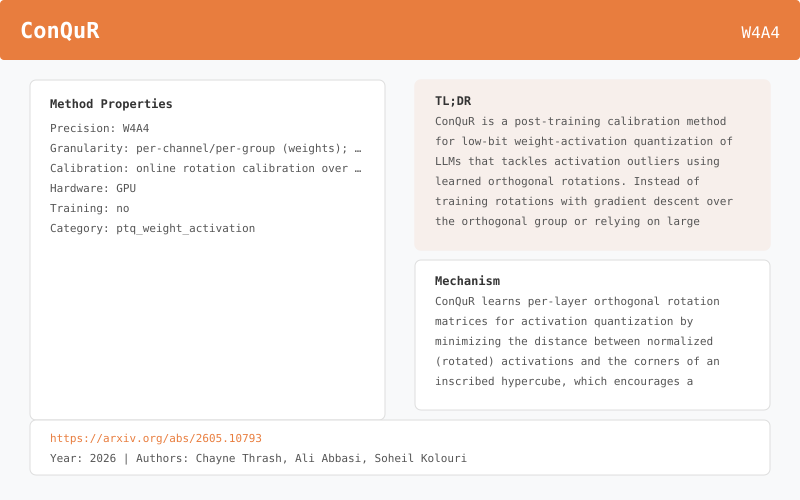

<em>Closed-form orthogonal Procrustes rotations align activations to hypercube corners, evenly spreading energy for W4A4.</em>

```mermaid
flowchart LR
    A[FP16 Weights + Activations] --> B[Handle outliers:\northogonal rotations that alig]
    B --> C[Quantize weights\nto low-bit]
    B --> D[Quantize activations\nto low-bit]
    C --> E[INT GEMM\ntensor cores]
    D --> E
    E --> F[W4A4\nquantized inference]
```

> ConQuR is a post-training calibration method for low-bit weight-activation quantization of LLMs that tackles activation outliers using learned orthogonal rotations. Instead of training rotations with gradient descent over the orthogonal group or relying on large stored activation corpora, it frames the goal as aligning normalized activations with the corners of an inscribed hypercube so that activation energy is spread evenly across dimensions. This alignment objective has a closed-form solution through the orthogonal Procrustes problem, making each rotation update cheap. An online calibration loop refines the rotations as each calibration sample passes through, so activations never need to be written to disk and the rotations adapt to the quantized activation distribution.

| Field | Value |
|-------|-------|
| Published at | arXiv (preprint) |
| Paper | [2605.10793](https://arxiv.org/abs/2605.10793) |
| Precision | W4A4 |
| Granularity | per-channel/per-group (weights); per-token (activations) |
| Calibration | online rotation calibration over a small calibration set; rotations updated as samples are processed without storing activations on disk |
| Symmetric? | symmetric |
| Outlier handling | orthogonal rotations that align normalized activations with the corners of an inscribed hypercube, spreading activation energy evenly across dimensions to suppress outliers |
| Hardware target | GPU |
| Training needed? | no |
| Calibration data? | yes |
| Typical degradation | W4A4 WikiText-2 perplexity around 6.04 (Llama-2-7B) and 6.22 (Llama-3-8B); competitive with or better than prior rotation methods across perplexity and commonsense reasoning |
| Builds on | [quarot](#quarot) · [spinquant](#spinquant) |
| Related | [quarot](#quarot) · [spinquant](#spinquant) · [flatquant](#flatquant) · [duquant](#duquant) |

**How it works:**

ConQuR learns per-layer orthogonal rotation matrices for activation quantization by minimizing the distance between normalized (rotated) activations and the corners of an inscribed hypercube, which encourages a balanced spread of magnitude across channels and reduces the dynamic range that outliers create. Because the target is a set of corner points, the optimal rotation is obtained in closed form via the orthogonal Procrustes problem (SVD of the cross-covariance), avoiding gradient-based optimization on the Stiefel/orthogonal manifold used by methods like SpinQuant. Calibration is performed online: rotations are incrementally updated as calibration samples stream through the network, so no activation corpus is stored and the rotations adapt to the actual quantized-activation statistics.

---

### LoRaQ · W4A8 · PTQ W+A · 2026-04

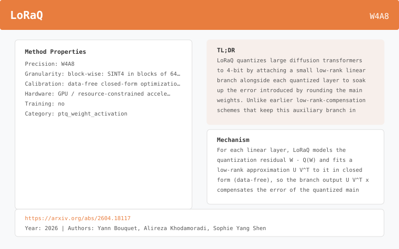

<em>LoRaQ: a data-free low-rank branch absorbs 4-bit quantization error and is itself quantized for a fully sub-16-bit diffusion-transformer pipeline.</em>

```mermaid
flowchart LR
    A[FP16 Weights + Activations] --> B[Handle outliers:\nlow-rank auxiliary branch that]
    B --> C[Quantize weights\nto low-bit]
    B --> D[Quantize activations\nto low-bit]
    C --> E[INT GEMM\ntensor cores]
    D --> E
    E --> F[W4A8\nquantized inference]
```

> LoRaQ quantizes large diffusion transformers to 4-bit by attaching a small low-rank linear branch alongside each quantized layer to soak up the error introduced by rounding the main weights. Unlike earlier low-rank-compensation schemes that keep this auxiliary branch in 16-bit precision and need a calibration dataset to initialize it, LoRaQ computes the branch factors in closed form without any data and then quantizes the branch itself down to 8-, 6-, or 4-bit. The result is a pipeline where every part runs below 16 bits while preserving image quality. On PixArt-Sigma and SANA, it matches or beats prior low-rank methods at the same memory budget.

| Field | Value |
|-------|-------|
| Published at | arXiv (preprint) |
| Paper | [2604.18117](https://arxiv.org/abs/2604.18117) |
| Precision | W4A8 |
| Granularity | block-wise: SINT4 in blocks of 64 with FP16 per-block scale; MX format in blocks of 32 with 8-bit power-of-two scale |
| Calibration | data-free closed-form optimization of the low-rank compensation factors (no calibration set); adopts SmoothQuant-style activation smoothing as a complementary step |
| Symmetric? | symmetric |
| Outlier handling | low-rank auxiliary branch that absorbs the high-magnitude quantization-error components, combined with activation smoothing and rotation between the low-rank factors |
| Hardware target | GPU / resource-constrained accelerators |
| Training needed? | no |
| Calibration data? | no |
| Typical degradation | PixArt-Sigma SINT4 (20 steps): FID 16.9, ImageReward 0.898, LPIPS 0.309 on MJHQ; SANA-1.6B SINT4: FID 16.1, ImageReward 1.09, LPIPS 0.182 on MJHQ |
| Related | [smoothquant](#smoothquant) · [quarot](#quarot) · [flatquant](#flatquant) |

**How it works:**

For each linear layer, LoRaQ models the quantization residual W - Q(W) and fits a low-rank approximation U V^T to it in closed form (data-free), so the branch output U V^T x compensates the error of the quantized main path Q(W) x. Because the compensation is derived analytically rather than calibrated on data, the low-rank factors can themselves be quantized (W8A8, W6A6, or W4A8) without re-introducing large error, removing the high- precision (W16A16) branch assumed by prior work and yielding a fully sub-16-bit forward pass. It additionally adopts SmoothQuant-style activation smoothing and optimizes rotations between the low-rank factors to better condition the residual before quantization.

---

### OSC · W4A4 · PTQ W+A · 2026-04

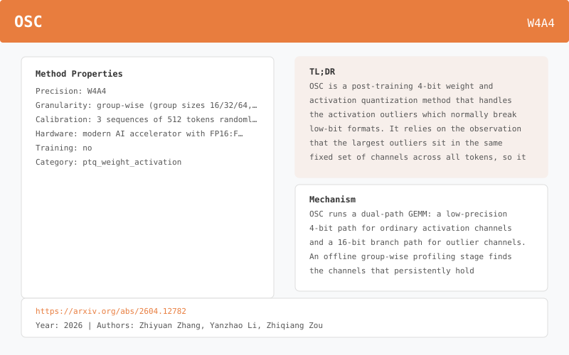

<em>OSC splits each activation matrix into a fixed set of profiled outlier channels (routed through an FP16 branch GEMM after sub-tensor extraction) and the remaining channels (4-bit GEMM); results are merged, with diffuse-outlier layers falling back to higher precision.</em>

```mermaid
flowchart LR
    A[FP16 Weights + Activations] --> B[Handle outliers:\noffline profiling identifies f]
    B --> C[Quantize weights\nto low-bit]
    B --> D[Quantize activations\nto low-bit]
    C --> E[INT GEMM\ntensor cores]
    D --> E
    E --> F[W4A4\nquantized inference]
```

> OSC is a post-training 4-bit weight and activation quantization method that handles the activation outliers which normally break low-bit formats. It relies on the observation that the largest outliers sit in the same fixed set of channels across all tokens, so it profiles these channels offline and routes them through a separate high-precision path while everything else goes through fast 4-bit matrix multiplication. The outlier channels are gathered into a small dense tensor at runtime to keep the high-precision work cheap, and layers whose outliers are too spread out are switched to a higher-precision format. This avoids the runtime rotation or dynamic-detection overhead of earlier outlier-handling schemes while keeping accuracy close to full precision.

| Field | Value |
|-------|-------|
| Published at | arXiv (preprint) |
| Paper | [2604.12782](https://arxiv.org/abs/2604.12782) |
| Precision | W4A4 |
| Granularity | group-wise (group sizes 16/32/64, primary G=32), per-group outlier-channel identification |
| Calibration | 3 sequences of 512 tokens randomly sampled from the Pile dataset, used for offline outlier-channel profiling |
| Symmetric? | asymmetric |
| Outlier handling | offline profiling identifies fixed high-magnitude outlier channels, which are extracted into a compact dense sub-tensor and computed in a separate FP16 branch GEMM while the rest runs in a 4-bit GEMM; layers with diffused outliers fall back to higher precision |
| Hardware target | modern AI accelerator with FP16:FP8:FP4 throughput ratio of 1:2:4; 1.78x speedup over W8A8 GEMM baseline |
| Training needed? | no |
| Calibration data? | yes |
| Typical degradation | Average accuracy drop of 2.19 points on Qwen3-8B and 1.12 points on Qwen3-30B-A3B vs FP16, averaged over MMLU (5-shot), GSM8K (8-shot), and ARC-Challenge/Easy (25-shot) |
| Builds on | [outlier-suppression](#outlier-suppression) · [atom](#atom) · [nvfp4](#nvfp4) · [mx-formats](#mx-formats) |
| Related | [quarot](#quarot) · [spinquant](#spinquant) · [smoothquant](#smoothquant) · [duquant](#duquant) · [flatquant](#flatquant) · [qserve](#qserve) · [owq](#owq) · [spqr](#spqr) |

**How it works:**

OSC runs a dual-path GEMM: a low-precision 4-bit path for ordinary activation channels and a 16-bit branch path for outlier channels. An offline group-wise profiling stage finds the channels that persistently hold high-magnitude outliers and sets layer-wise thresholds; at inference these scattered channels are coalesced via structured sub-tensor extraction into a compact dense tensor so the high-precision branch stays small. A static suppression pipeline fuses both paths into the quantized matmul, and an adaptive fallback promotes layers with diffuse (non-clustered) outliers to a higher-precision format rather than forcing them into the 4-bit path. Because the outlier channels are fixed and determined offline, there is no per-token rotation or dynamic-detection cost at runtime.

---

### ReSpinQuant · W4A4KV4 / W3A3KV3 · PTQ W+A · 2026-04

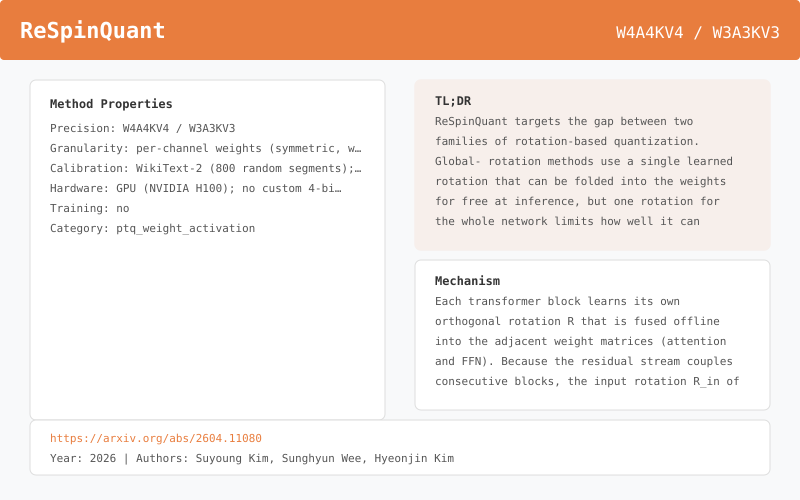

<em>Per-layer rotations fused into weights; residual basis mismatch corrected by a low-rank (rank-r) subspace rotation applied online.</em>

```mermaid
flowchart LR
    A[FP16 Weights + Activations] --> B[Handle outliers:\nlayer-wise learned orthogonal ]
    B --> C[Quantize weights\nto low-bit]
    B --> D[Quantize activations\nto low-bit]
    C --> E[INT GEMM\ntensor cores]
    D --> E
    E --> F[W4A4KV4 / W3A3KV3\nquantized inference]
```

> ReSpinQuant targets the gap between two families of rotation-based quantization. Global- rotation methods use a single learned rotation that can be folded into the weights for free at inference, but one rotation for the whole network limits how well it can suppress outliers. Per-layer rotation methods are more accurate but cannot be folded into weights because the residual (skip) connection forces every layer to share a common basis, so they pay an online matrix-multiply cost at runtime. ReSpinQuant lets each layer learn its own rotation and still fuse it into the weights; the only thing it computes online is a small correction for the mismatch between a layer's incoming and outgoing bases. That correction is done inside a tiny rank-r subspace (default r=32) rather than over the full hidden dimension, so the runtime overhead is about 1.7 percent while accuracy stays close to the expensive per-layer baselines, even down to 3-bit weights and activations.

| Field | Value |
|-------|-------|
| Published at | **ICML 2026** |
| Paper | [2604.11080](https://arxiv.org/abs/2604.11080) |
| Precision | W4A4KV4 / W3A3KV3 |
| Granularity | per-channel weights (symmetric, with GPTQ); per-token activations and KV cache (asymmetric) |
| Calibration | WikiText-2 (800 random segments); C4 also tested; ~100 optimization steps for the rotation matrices |
| Symmetric? | mixed (weights symmetric; activations and KV asymmetric) |
| Outlier handling | layer-wise learned orthogonal rotations fused offline into weights, with residual basis mismatch across the skip connection corrected by a low-rank subspace rotation approximation |
| Hardware target | GPU (NVIDIA H100); no custom 4-bit kernels (PyTorch + HuggingFace) |
| Training needed? | no |
| Calibration data? | yes |
| Typical degradation | LLaMA-3 8B W4A4: 7.24 WikiText-2 ppl (vs 7.50 for SpinQuant); LLaMA-2 7B W4A4: 5.74 ppl. At W3A3, LLaMA-3 8B: 13.09 ppl (vs 15.07 SpinQuant); LLaMA-3.2 1B: 49.90 ppl (vs 69.70 SpinQuant) |
| Builds on | [spinquant](#spinquant) · [quarot](#quarot) · [flatquant](#flatquant) · [gptq](#gptq) |
| Related | [spinquant](#spinquant) · [quarot](#quarot) · [flatquant](#flatquant) · [duquant](#duquant) · [resq](#resq) · [paroquant](#paroquant) |

**How it works:**

Each transformer block learns its own orthogonal rotation R that is fused offline into the adjacent weight matrices (attention and FFN). Because the residual stream couples consecutive blocks, the input rotation R_in of one block and the output rotation R_out of the previous block differ, producing a basis-mismatch transition matrix T = R_out * R_in^T that would normally have to be applied densely (O(D^2)) at inference. ReSpinQuant takes an SVD of (T - I), keeps the top-r principal directions, and applies a learned r x r rotation only within that subspace while leaving the orthogonal complement unchanged, reducing the online cost to O(D*r). Weights are quantized with GPTQ (symmetric, per-channel); activations and the KV cache are quantized asymmetrically to the same bit-width. Rotations are optimized on a small calibration set with a Cayley (Stiefel-manifold) optimizer, so no model weights are trained.

---

### ParoQuant · W4A8 (reasoning-model optimized) · PTQ W+A · 2025-11

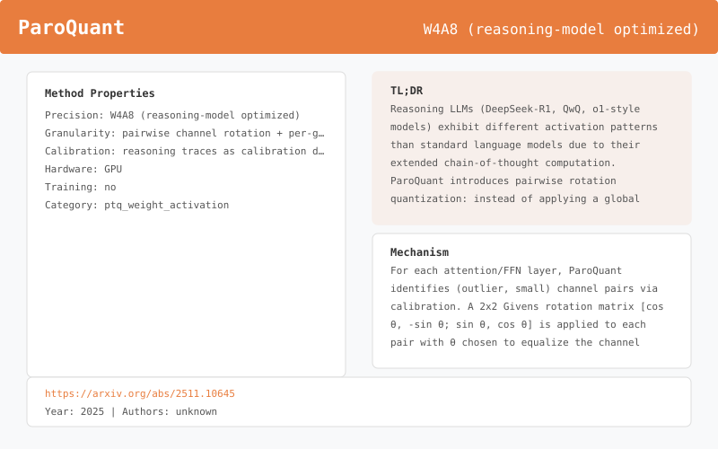

<em>ParoQuant: pairwise Givens rotation targets outlier-channel pairs for efficient reasoning LLM quantization.</em>

```mermaid
flowchart LR
    A[FP16 Weights + Activations] --> B[Handle outliers:\npairwise rotation: pair outlie]
    B --> C[Quantize weights\nto low-bit]
    B --> D[Quantize activations\nto low-bit]
    C --> E[INT GEMM\ntensor cores]
    D --> E
    E --> F[W4A8 reasoning-model optimized\nquantized inference]
```

> Reasoning LLMs (DeepSeek-R1, QwQ, o1-style models) exhibit different activation patterns than standard language models due to their extended chain-of-thought computation. ParoQuant introduces pairwise rotation quantization: instead of applying a global random rotation (like QuaRot), it identifies pairs of channels where one has large outliers and the other is near-zero, and applies a targeted 2x2 Givens rotation to redistribute the outlier energy between them. This is more efficient than full Hadamard rotation and better preserves reasoning-specific activation structures.

| Field | Value |
|-------|-------|
| Published at | **ICLR 2026** |
| Paper | [2511.10645](https://arxiv.org/abs/2511.10645) |
| Precision | W4A8 (reasoning-model optimized) |
| Granularity | pairwise channel rotation + per-group weight quant |
| Calibration | reasoning traces as calibration data |
| Symmetric? | symmetric |
| Outlier handling | pairwise rotation: pair outlier channels with compensating channels |
| Hardware target | GPU |
| Training needed? | no |
| Calibration data? | yes |
| Typical degradation | < 1% degradation on math/reasoning benchmarks at W4A8 |
| Builds on | [quarot](#quarot) · [spinquant](#spinquant) · [duquant](#duquant) |
| Related | [quarot](#quarot) · [spinquant](#spinquant) · [duquant](#duquant) · [flatquant](#flatquant) |

**How it works:**

For each attention/FFN layer, ParoQuant identifies (outlier, small) channel pairs via calibration. A 2x2 Givens rotation matrix [cos θ, -sin θ; sin θ, cos θ] is applied to each pair with θ chosen to equalize the channel norms. This spreads the outlier energy into two manageable channels instead of one extreme channel. The rotations are folded into adjacent weight matrices offline (zero inference cost). Using reasoning traces (not just random text) as calibration ensures the outlier pairs reflect actual inference-time distributions for CoT workloads.

---

### ResQ · W4A8 with FP16 low-rank residual for outlier subspace · PTQ W+A · 2025-01

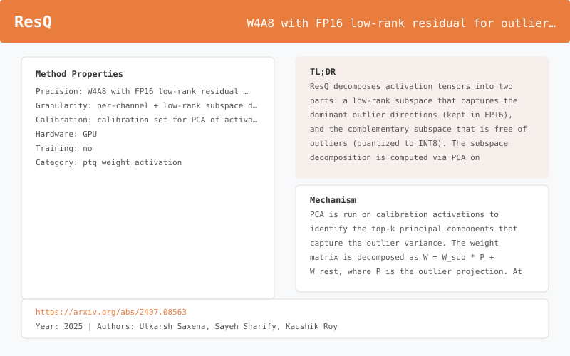

<em>ResQ: PCA decomposes activations into outlier subspace (FP16) and clean subspace (INT8).</em>

```mermaid
flowchart LR
    A[FP16 Weights + Activations] --> B[Handle outliers:\nisolate outlier subspace via P]
    B --> C[Quantize weights\nto low-bit]
    B --> D[Quantize activations\nto low-bit]
    C --> E[INT GEMM\ntensor cores]
    D --> E
    E --> F[W4A8 with FP16 low-rank residual for outlier subspace\nquantized inference]
```

> ResQ decomposes activation tensors into two parts: a low-rank subspace that captures the dominant outlier directions (kept in FP16), and the complementary subspace that is free of outliers (quantized to INT8). The subspace decomposition is computed via PCA on calibration activations. This is analogous to LLM.int8()'s decomposition but applied at a subspace level rather than individual channels, allowing much more of the computation to run in INT8 while still handling outliers accurately.

| Field | Value |
|-------|-------|
| Published at | **ICLR 2025** |
| Paper | [2407.08563](https://arxiv.org/abs/2407.08563) |
| Precision | W4A8 with FP16 low-rank residual for outlier subspace |
| Granularity | per-channel + low-rank subspace decomposition |
| Calibration | calibration set for PCA of activations |
| Symmetric? | asymmetric |
| Outlier handling | isolate outlier subspace via PCA; quantize subspace-free activations to INT8 |
| Hardware target | GPU |
| Training needed? | no |
| Calibration data? | yes |
| Typical degradation | < 0.5 ppl on LLaMA-2-70B W4A8 |
| Builds on | [llm-int8](#llm-int8) · [smoothquant](#smoothquant) |
| Related | [llm-int8](#llm-int8) · [atom](#atom) · [quarot](#quarot) · [spinquant](#spinquant) |

**How it works:**

PCA is run on calibration activations to identify the top-k principal components that capture the outlier variance. The weight matrix is decomposed as W = W_sub * P + W_rest, where P is the outlier projection. At inference, X is split into X_sub (projected onto outlier subspace, computed in FP16) and X_rest (quantized to INT8 and computed with quantized weights). The final output combines both. Since only k << d dimensions use FP16, the overhead is small but the accuracy gain is large.

---

### FlatQuant · W4A4 · PTQ W+A · 2024-10

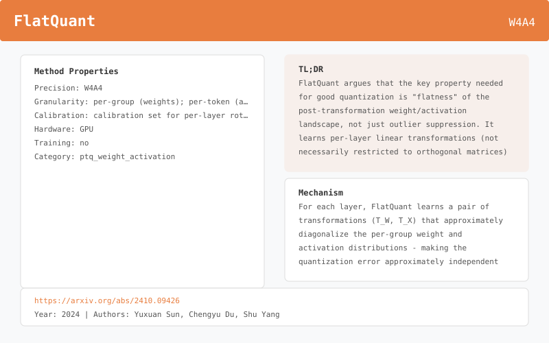

<em>Per-layer learned affine transformations optimize weight/activation flatness for W4A4.</em>

```mermaid
flowchart LR
    A[Layer activations] --> B[Learnable Kronecker\naffine transform A]
    B --> C[Calibrate A per-layer\nto flatten distribution]
    C --> D{Flat enough?}
    D -->|no| C
    D -->|yes| E[Apply A offline to W]
    E --> F[Flat activation dist\nno rotation overhead]
    F --> G[W4A4 low-error]
```

> FlatQuant argues that the key property needed for good quantization is "flatness" of the post-transformation weight/activation landscape, not just outlier suppression. It learns per-layer linear transformations (not necessarily restricted to orthogonal matrices) that minimize a measure of quantization-induced flatness loss. The transformations are more expressive than pure rotations and are jointly optimized across weights and activations using a calibration-based gradient method, achieving state-of-the-art W4A4 results on LLaMA-2/3 families.

| Field | Value |
|-------|-------|
| Published at | arXiv (preprint) |
| Paper | [2410.09426](https://arxiv.org/abs/2410.09426) |
| Precision | W4A4 |
| Granularity | per-group (weights); per-token (activations) |
| Calibration | calibration set for per-layer rotation learning |
| Symmetric? | symmetric |
| Outlier handling | per-layer learned affine transformations that flatten the weight/activation landscape |
| Hardware target | GPU |
| Training needed? | no |
| Calibration data? | yes |
| Typical degradation | state-of-the-art W4A4 on LLaMA-2/3 as of late 2024 |
| Builds on | [quarot](#quarot) · [spinquant](#spinquant) · [omniquant](#omniquant) |
| Related | [quarot](#quarot) · [spinquant](#spinquant) · [duquant](#duquant) |

**How it works:**

For each layer, FlatQuant learns a pair of transformations (T_W, T_X) that approximately diagonalize the per-group weight and activation distributions - making the quantization error approximately independent across dimensions. The transformation includes a rotation component (enforced to be near-orthogonal via a regularizer) plus a learned channel-wise scaling. The overall transformation is more expressive than Hadamard or pure rotation. Optimization minimizes the block-wise reconstruction loss ‖ f(X; W) − f(T_X X; T_W W) ‖² using Adam on the transformation parameters while keeping model weights frozen.

---

### DuQuant · W4A4 · PTQ W+A · 2024-06

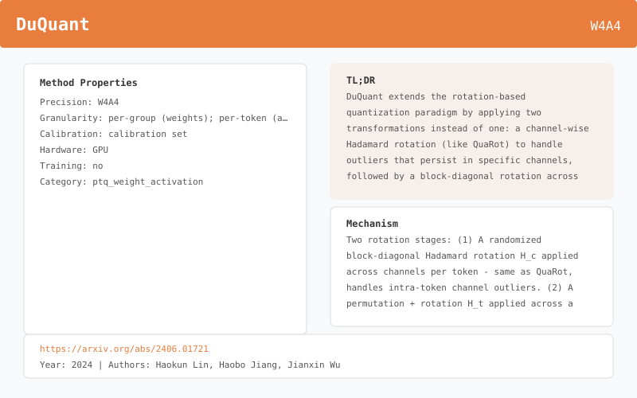

<em>Dual rotation: channel Hadamard (spatial) + token-group rotation (temporal) for W4A4.</em>

```mermaid
flowchart LR
    A[FP16 Activations] --> B[Stage 1: Rotation\nHadamard spreading]
    B --> C[Reduced outliers\nbut residuals remain]
    C --> D[Stage 2: Permutation\nreorder channels by range]
    D --> E[Residual outliers\ngrouped and compressed]
    E --> F[W4A4 state-of-art\ndual transformation]
```

> DuQuant extends the rotation-based quantization paradigm by applying two transformations instead of one: a channel-wise Hadamard rotation (like QuaRot) to handle outliers that persist in specific channels, followed by a block-diagonal rotation across tokens within each group to further smooth the activation distribution across the sequence dimension. The dual rotation is more expressive than a single rotation and can eliminate outliers that persist after a single Hadamard pass.

| Field | Value |
|-------|-------|
| Published at | **NeurIPS 2024** |
| Paper | [2406.01721](https://arxiv.org/abs/2406.01721) |
| Precision | W4A4 |
| Granularity | per-group (weights); per-token (activations) |
| Calibration | calibration set |
| Symmetric? | symmetric |
| Outlier handling | dual rotation: Hadamard across channels + block-diagonal rotation across tokens |
| Hardware target | GPU |
| Training needed? | no |
| Calibration data? | yes |
| Typical degradation | better than QuaRot at W4A4; competitive with SpinQuant |
| Builds on | [quarot](#quarot) · [spinquant](#spinquant) |
| Related | [quarot](#quarot) · [spinquant](#spinquant) · [flatquant](#flatquant) |

**How it works:**

Two rotation stages: (1) A randomized block-diagonal Hadamard rotation H_c applied across channels per token - same as QuaRot, handles intra-token channel outliers. (2) A permutation + rotation H_t applied across a window of tokens within each activation group, smoothing out any temporal outliers that persist after step 1. The combination of channel-wise and token-wise rotations addresses both sources of activation non-uniformity. Both rotations are orthogonal and are absorbed into the preceding weight matrices offline. This dual approach reduces the post-rotation quantization error further than single-rotation methods.

---

### SpinQuant · W4A8 / W4A4 · PTQ W+A · 2024-05

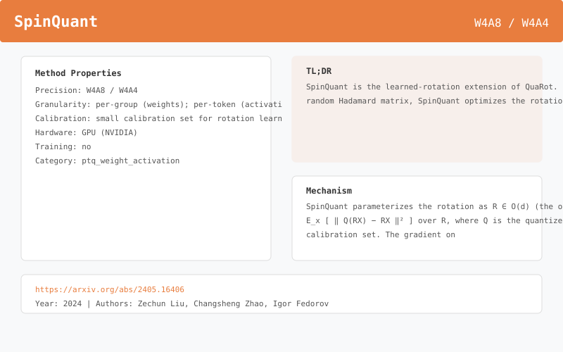

<em>Learned rotation on Stiefel manifold minimizes post-rotation quantization error.</em>

```mermaid
flowchart LR
    A[Random rotation R_0] --> B[Optimize via\nCayley SGD]
    B --> C{Stiefel manifold\nconstraint met?}
    C -->|no| B
    C -->|yes| D[Learned R*\northogonal matrix]
    D --> E[Fold into W and X offline]
    E --> F[W4A4 / W4A8\nlow-outlier inference]
```

> SpinQuant is the learned-rotation extension of QuaRot. Instead of using a fixed random Hadamard matrix, SpinQuant optimizes the rotation matrix R on the Stiefel manifold (the set of orthogonal matrices) to minimize the quantization error of the rotated activations. The optimization uses Cayley SGD - a manifold-aware gradient method for orthogonal matrices - and runs on a small calibration set. Because the rotation is learned to specifically minimize quantization error (rather than just spreading outliers randomly), SpinQuant consistently outperforms QuaRot at equal bit-widths.

| Field | Value |
|-------|-------|
| Published at | **ICLR 2025** |
| Paper | [2405.16406](https://arxiv.org/abs/2405.16406) |
| Code | [facebookresearch/SpinQuant](https://github.com/facebookresearch/SpinQuant) |
| Precision | W4A8 / W4A4 |
| Granularity | per-group (weights); per-token (activations) |
| Calibration | small calibration set for rotation learning |
| Symmetric? | symmetric |
| Outlier handling | learned orthogonal rotation minimizes post-rotation quantization error |
| Hardware target | GPU (NVIDIA) |
| Training needed? | no |
| Calibration data? | yes |
| Typical degradation | outperforms QuaRot at W4A4 on LLaMA-2/3 by learning optimal rotation |
| Builds on | [quarot](#quarot) · [quip](#quip) |
| Related | [quarot](#quarot) · [duquant](#duquant) · [flatquant](#flatquant) |

**How it works:**

SpinQuant parameterizes the rotation as R ∈ O(d) (the orthogonal group) and minimizes E_x [ ‖ Q(RX) − RX ‖² ] over R, where Q is the quantizer and x is drawn from the calibration set. The gradient on the manifold is computed using the Riemannian gradient: ∇^{manifold}_R L = R (∇_R L - (∇_R L)^T R^T R) (Cayley SGD step). After learning R, the weight matrices are pre-rotated (offline) and quantized with GPTQ. At inference, activations are rotated by R before each layer. Hadamard matrices can be used to initialize R (as in QuaRot) and then refined by SpinQuant's optimization.

---

### QServe · W4A8KV4 · PTQ W+A · 2024-05

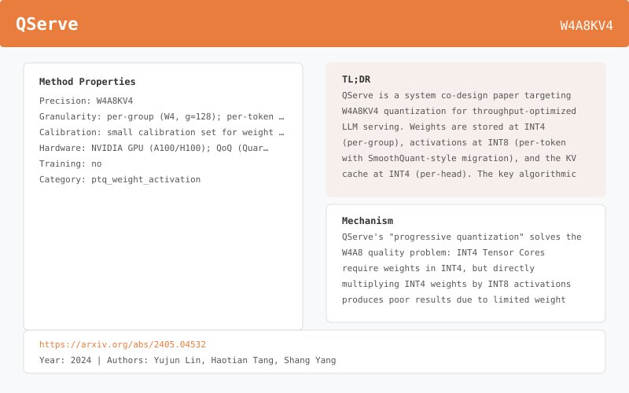

<em>W4A8KV4 system: progressive INT4→INT8 dequant inside kernel; QoQ custom Tensor Core matmul.</em>

```mermaid
flowchart LR
    A[FP16 model] --> B[GPTQ W4\nweight quant]
    B --> C[SmoothAttention\nfor KV4]
    C --> D[W4 to INT8\nfused dequant kernel]
    D --> E[INT8 GEMM\ntensor cores]
    E --> F[W4A8KV4\n2x vs W4A16]
```

> QServe is a system co-design paper targeting W4A8KV4 quantization for throughput-optimized LLM serving. Weights are stored at INT4 (per-group), activations at INT8 (per-token with SmoothQuant-style migration), and the KV cache at INT4 (per-head). The key algorithmic contribution is "progressive quantization": a W4→W8 dequantization path that avoids the poor W4A8 INT4-Tensor-Core quality problem by performing the dequant inside the kernel. The system contribution is QoQ (Quarot-on-Quantized), an INT4 matrix multiplication kernel that achieves 3.5× throughput over FP16 on A100.

| Field | Value |
|-------|-------|
| Published at | **NeurIPS 2024** |
| Paper | [2405.04532](https://arxiv.org/abs/2405.04532) |
| Code | [mit-han-lab/qserve](https://github.com/mit-han-lab/qserve) |
| Precision | W4A8KV4 |
| Granularity | per-group (W4, g=128); per-token (A8); per-head (KV4) |
| Calibration | small calibration set for weight quantization |
| Symmetric? | asymmetric |
| Outlier handling | progressive group quantization (W4A8 with activation smoothing); SmoothQuant-style migration |
| Hardware target | NVIDIA GPU (A100/H100); QoQ (Quarot-on-Quantized) custom INT4 Tensor Core kernels |
| Training needed? | no |
| Calibration data? | yes |
| Typical degradation | < 1 ppl at W4A8KV4 on LLaMA-2-7B/13B/70B; 1.2–3.5× serving speedup vs FP16 |
| Builds on | [smoothquant](#smoothquant) · [gptq](#gptq) · [quarot](#quarot) |
| Related | [atom](#atom) · [quarot](#quarot) · [marlin](#marlin) |

**How it works:**

QServe's "progressive quantization" solves the W4A8 quality problem: INT4 Tensor Cores require weights in INT4, but directly multiplying INT4 weights by INT8 activations produces poor results due to limited weight range. The solution: dequantize INT4 weights to INT8 inside the Tensor Core kernel (using the per-group scale stored in FP16 registers), then perform INT8 × INT8 matmul with INT32 accumulation. The KV cache is quantized to INT4 (per-head) with no quality loss using a rotation technique from QuaRot. The combined W4A8KV4 format yields 1.2× (LLaMA-2-70B) to 3.5× (LLaMA-2-7B) throughput improvement over FP16 serving on A100.

---

### QuaRot · W4A4 (with optional KV4) · PTQ W+A · 2024-04

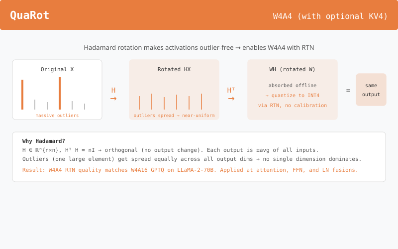

<em>Hadamard rotation equalizes activation magnitudes, enabling W4A4 without outlier handling.</em>

```mermaid
flowchart LR
    A[FP16 LLM] --> B[Random Hadamard\nmatrix R]
    B --> C[Rotate weights offline\nW_tilde = W times R^T]
    B --> D[Rotate acts online\nX_tilde = X times R]
    C --> E[Uniform dist\nno outliers]
    D --> E
    E --> F[W4A4\nquantization]
```

> QuaRot applies random Hadamard rotations to the weight and activation spaces of every linear layer in the transformer. A Hadamard rotation is orthogonal (preserves matrix products exactly) and has the effect of spreading activation outliers uniformly across all dimensions. After rotation, activations are nearly isotropic with no dominant outlier channels, making per-token INT4 quantization of activations feasible with minimal quality loss. Weights are correspondingly pre-rotated offline and then quantized. The result is practical W4A4 inference with quality close to W4A16 GPTQ.

| Field | Value |
|-------|-------|
| Published at | **NeurIPS 2024** |
| Paper | [2404.00456](https://arxiv.org/abs/2404.00456) |
| Code | [spcl/QuaRot](https://github.com/spcl/QuaRot) |
| Precision | W4A4 (with optional KV4) |
| Granularity | per-group (weights, g=128); per-token (rotated activations) |
| Calibration | none for rotation; optionally GPTQ calibration for weight quantization |
| Symmetric? | symmetric |
| Outlier handling | random Hadamard rotation spreads outliers uniformly, eliminating per-channel outliers |
| Hardware target | NVIDIA GPU (INT4 Tensor Cores) |
| Training needed? | no |
| Calibration data? | no |
| Typical degradation | < 0.5 ppl W4A4 on LLaMA-2-7B vs FP16 (near-GPTQ W4A16 quality) |
| Builds on | [quip](#quip) · [gptq](#gptq) |
| Related | [spinquant](#spinquant) · [duquant](#duquant) · [flatquant](#flatquant) · [quip](#quip) |

**How it works:**

For each linear layer Y = XW, a random Hadamard matrix H is applied: Y = (XH)(H^T W). Since H is orthogonal, H H^T = I, so the output is unchanged. The rotated weight H^T W is computed offline and stored. At inference, activations are pre-multiplied by H before each layer (and post-multiplied by H^T after). The Hadamard transform, being a Walsh-Hadamard transform, can be computed in O(n log n) and is cheap relative to the matmul. After rotation, activation channels all have similar variance (no outliers remain dominant), allowing per-token INT4 quantization of X with RTN or GPTQ for W. The rotation is also applied to KV cache computation, enabling W4A4KV4 with minimal perplexity degradation.

---

### AffineQuant · W4A8 / W4A4 · PTQ W+A · 2024-03

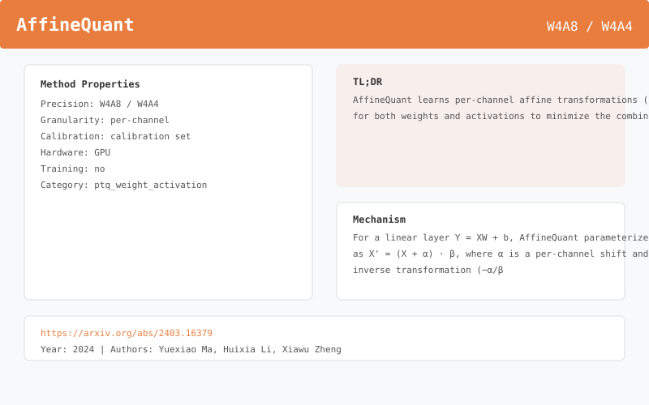

<em>Per-channel shift + scale learned jointly; shift absorbed into bias, scale into weights.</em>

```mermaid
flowchart LR
    A[FP16 model] --> B[Optimize full affine\ntransform matrix T]
    B --> C[W_equiv = T times W\nX_equiv = X times T^-1]
    C --> D[Newton-step solver\nfor T efficiently]
    D --> E{Converged?}
    E -->|no| B
    E -->|yes| F[Generalized SmoothQuant:\nfull linear vs diagonal]
    F --> G[W4A4 / W4A8\nbetter than SmoothQuant]
```

> AffineQuant learns per-channel affine transformations (scale + shift, not just scale) for both weights and activations to minimize the combined quantization error. Unlike SmoothQuant (scale only) or rotation methods (orthogonal matrices), AffineQuant's per-channel shift is a genuine additional degree of freedom that can center asymmetric distributions. The transformations are equivalent (absorbed into surrounding layers), and the shift absorbed into bias vectors provides centering at no inference cost.

| Field | Value |
|-------|-------|
| Published at | **ICLR 2024** |
| Paper | [2403.16379](https://arxiv.org/abs/2403.16379) |
| Precision | W4A8 / W4A4 |
| Granularity | per-channel |
| Calibration | calibration set |
| Symmetric? | asymmetric |
| Outlier handling | learned affine (scale + shift) equivalent transformation for both weights and activations |
| Hardware target | GPU |
| Training needed? | no |
| Calibration data? | yes |
| Typical degradation | < 1 ppl W4A4 LLaMA-2-7B, competitive with rotation methods |
| Builds on | [smoothquant](#smoothquant) · [omniquant](#omniquant) |
| Related | [smoothquant](#smoothquant) · [omniquant](#omniquant) · [flatquant](#flatquant) |

**How it works:**

For a linear layer Y = XW + b, AffineQuant parameterizes a per-channel transformation as X' = (X + α) · β, where α is a per-channel shift and β is a per-channel scale. The inverse transformation (−α/β, 1/β) is absorbed into W and b via equivalent weight transformation, leaving the model output unchanged. Both α and β are optimized by minimizing the block-wise reconstruction loss using gradient descent on the calibration set. The extra shift parameter (vs. SmoothQuant which only learns β) allows centering channels that have non-zero mean outliers - common in post-attention activations of larger LLMs.

---

### Atom · W4A4 (mixed with W8 for sensitive layers) · PTQ W+A · 2023-10

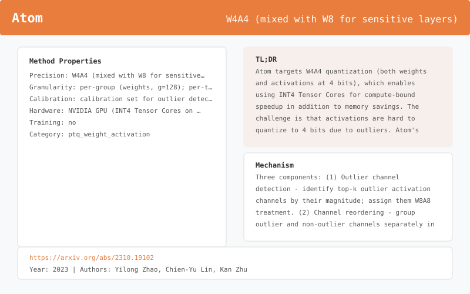

<em>W4A4 matmul for non-outlier channels; W8A8 for outlier channels; mixed output summed.</em>

```mermaid
flowchart LR
    A[LLM layer] --> B{Channel type}
    B -->|outlier ~1%| C[INT8 / FP16]
    B -->|normal ~99%| D[INT4 group quant]
    D --> E[Dynamic per-token\nact quantization]
    C --> F[INT4 GEMM\nCUTLASS kernels]
    E --> F
    F --> G[KV INT4 cache]
    G --> H[W4A4KV4 serving]
```

> Atom targets W4A4 quantization (both weights and activations at 4 bits), which enables using INT4 Tensor Cores for compute-bound speedup in addition to memory savings. The challenge is that activations are hard to quantize to 4 bits due to outliers. Atom's approach: detect the most quantization-sensitive weight/activation channels using a calibration pass, assign those channels to a higher precision (W8/A8), and quantize everything else to W4A4 with per-group weight and per-token activation scales. A custom CUDA kernel handles the mixed-precision channel assignment efficiently.

| Field | Value |
|-------|-------|
| Published at | **MLSys 2024** |
| Paper | [2310.19102](https://arxiv.org/abs/2310.19102) |
| Code | [efeslab/Atom](https://github.com/efeslab/Atom) |
| Precision | W4A4 (mixed with W8 for sensitive layers) |
| Granularity | per-group (weights, g=128); per-token (activations) |
| Calibration | calibration set for outlier detection and mixed-precision assignment |
| Symmetric? | asymmetric |
| Outlier handling | outlier channels kept at W8/A8; reordering for per-group activation quantization |
| Hardware target | NVIDIA GPU (INT4 Tensor Cores on Ada/Hopper) |
| Training needed? | no |
| Calibration data? | yes |
| Typical degradation | < 1 ppl at W4A4 on LLaMA-2 family with mixed precision |
| Builds on | [smoothquant](#smoothquant) · [rptq](#rptq) · [gptq](#gptq) |
| Related | [quarot](#quarot) · [llm-int8](#llm-int8) · [smoothquant](#smoothquant) |

**How it works:**

Three components: (1) Outlier channel detection - identify top-k outlier activation channels by their magnitude; assign them W8A8 treatment. (2) Channel reordering - group outlier and non-outlier channels separately in memory so they can be processed by separate kernel paths. (3) W4A4 INT4 matmul for the non-outlier channels with per-token activation quantization and per-group weight quantization. The mixed-precision kernel sums the W4A4 output (non-outlier) and W8A8 output (outlier) at the end. Atom achieves ~3× throughput over FP16 on A100 while maintaining quality.

---

### ZeroQuant(4+2) · W4+W6 A8 (mixed: sensitive layers at FP6, rest at W4A8) · PTQ W+A · 2023-10

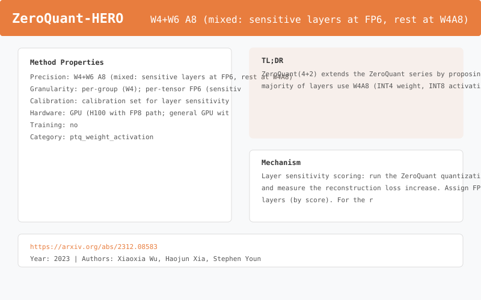

<em>ZeroQuant(4+2): sensitive layers at FP6, rest at W4A8; mixed-precision layer assignment.</em>

```mermaid
flowchart LR
    A[All layers] --> B[Measure quantization\nsensitivity per block]
    B --> C[Sort blocks\nby sensitivity score]
    C --> D{Top-k pct?}
    D -->|yes| E[Assign FP6\nTC-FPx kernel]
    D -->|no| F[Assign W4A8\nZeroQuant style]
    E --> G[Mixed 4+2 model\napprox 4.X bits avg]
    F --> G
```

> ZeroQuant(4+2) extends the ZeroQuant series by proposing a mixed W4+W6 strategy: the majority of layers use W4A8 (INT4 weight, INT8 activation) for high compression, while the most sensitive layers (typically the first and last layers, plus selected attention layers) use FP6 weights for better precision. The sensitivity is measured by the ZeroQuant block-wise reconstruction loss. The paper also explores FP8 training as a natural extension of the ZeroQuant framework and provides a comprehensive study of mixed-precision strategies across model families.

| Field | Value |
|-------|-------|
| Published at | arXiv (preprint) |
| Paper | [2312.08583](https://arxiv.org/abs/2312.08583) |
| Code | [microsoft/DeepSpeed](https://github.com/microsoft/DeepSpeed) |
| Precision | W4+W6 A8 (mixed: sensitive layers at FP6, rest at W4A8) |
| Granularity | per-group (W4); per-tensor FP6 (sensitive) |
| Calibration | calibration set for layer sensitivity |
| Symmetric? | symmetric |
| Outlier handling | FP6 for most sensitive layers; W4A8 for the rest |
| Hardware target | GPU (H100 with FP8 path; general GPU with custom FP6 kernels) |
| Training needed? | no |
| Calibration data? | yes |
| Typical degradation | < 0.5 ppl vs FP16 on Llama/OPT with (4+2) mixed assignment |
| Builds on | [zeroquant-fp](#zeroquant-fp) · [fp6-llm](#fp6-llm) |
| Related | [zeroquant-fp](#zeroquant-fp) · [zeroquant-v2](#zeroquant-v2) · [fp6-llm](#fp6-llm) |

**How it works:**

Layer sensitivity scoring: run the ZeroQuant quantization on each block independently and measure the reconstruction loss increase. Assign FP6 to the top-k% most sensitive layers (by score). For the remaining layers, use W4A8 with ZeroQuant's per-group weight and per-token activation quantization. The FP6 layers use the TC-FPx kernel from the FP6-LLM paper for efficient inference. The total average bit-width is approximately 4 + (fraction_FP6 × 2) bits, hence the "4+2" name.

---

### QLLM · W4A8 · PTQ W+A · 2023-10

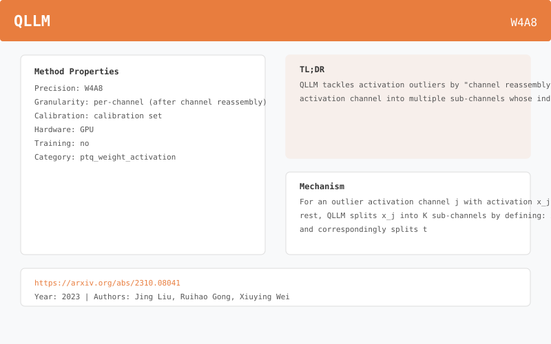

<em>Channel reassembly: outlier channel split into K sub-channels each within quantizable range.</em>

```mermaid
flowchart LR
    A[Outlier activation\nchannel j] --> B{Action}
    B -->|large outlier| C[Channel disassembly:\nsplit into k sub-channels]
    B -->|near-zero| D[Channel assembly:\nmerge with neighbor]
    C --> E[Equivalent transform\nno accuracy loss]
    D --> E
    E --> F[All channels in\nnormal quantizable range]
    F --> G[W4A8 / W4A4]
```

> QLLM tackles activation outliers by "channel reassembly": splitting each outlier activation channel into multiple sub-channels whose individual amplitudes fall within the quantizable range. This is complementary to smoothing-based methods: instead of migrating outlier energy to weights (SmoothQuant), QLLM splits the outlier channel itself into two or more channels of smaller amplitude. The split is handled by adjusting the corresponding weight rows, maintaining mathematical equivalence. After reassembly, standard per-channel or per-token INT8 quantization works well on all channels.

| Field | Value |
|-------|-------|
| Published at | **ICLR 2024** |
| Paper | [2310.08041](https://arxiv.org/abs/2310.08041) |
| Precision | W4A8 |
| Granularity | per-channel (after channel reassembly) |
| Calibration | calibration set |
| Symmetric? | asymmetric |
| Outlier handling | channel reassembly: split outlier channels into sub-channels with lower amplitude |
| Hardware target | GPU |
| Training needed? | no |
| Calibration data? | yes |
| Typical degradation | < 1 ppl W4A8 on LLaMA at 7B |
| Builds on | [smoothquant](#smoothquant) · [rtn](#rtn) |
| Related | [smoothquant](#smoothquant) · [rptq](#rptq) · [atom](#atom) |

**How it works:**

For an outlier activation channel j with activation x_j that is consistently |x_j| >> rest, QLLM splits x_j into K sub-channels by defining: x'_{j,k} = x_j / K for k=1..K, and correspondingly splits the weight row w_j into K rows w'_{j,k} = w_j (unchanged value, since their product sums back to w_j × x_j). The number of splits K for channel j is determined by how much its amplitude exceeds the per-tensor quantization range. The reassembled tensor has K times more channels but all within range. The overhead is small because only ~1% of channels are outliers.

---

### OmniQuant · W4A16 (weight-only mode); W4A8, W6A6 (W+A mode) · PTQ W+A · 2023-08

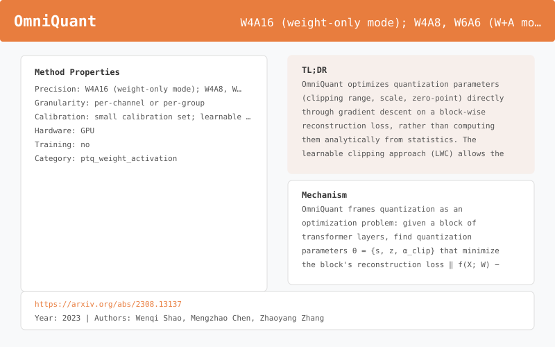

<em>Learnable clipping range and equivalent transformation, optimized by backprop through frozen weights.</em>

```mermaid
flowchart LR
    A[Calibration data] --> B[Learnable Weight\nClipping LWC]
    A --> C[Learnable Equiv\nTransform LET]
    B --> D[Optimize clip\nthresholds end-to-end]
    C --> E[Learn channel\nscale and shift]
    D --> F[Block-wise KD\nfrom FP16 teacher]
    E --> F
    F --> G[W4A16, W4A4\nor W6A6 model]
```

> OmniQuant optimizes quantization parameters (clipping range, scale, zero-point) directly through gradient descent on a block-wise reconstruction loss, rather than computing them analytically from statistics. The learnable clipping approach (LWC) allows the clipping range to adapt to the actual distribution, trading off more clips against smaller scale. A learnable equivalent transformation (LET) handles the activation quantization case by absorbing a channel-wise scale into the preceding layer (analogous to SmoothQuant but with learned parameters). Both weight-only and weight+activation modes are supported.

| Field | Value |
|-------|-------|
| Published at | **ICLR 2024** |
| Paper | [2308.13137](https://arxiv.org/abs/2308.13137) |
| Code | [OpenGVLab/OmniQuant](https://github.com/OpenGVLab/OmniQuant) |
| Precision | W4A16 (weight-only mode); W4A8, W6A6 (W+A mode) |
| Granularity | per-channel or per-group |
| Calibration | small calibration set; learnable clipping via block-wise optimization |
| Symmetric? | asymmetric |
| Outlier handling | learnable weight clipping (LWC) + learnable equivalent transformation (LET) |
| Hardware target | GPU |
| Training needed? | no |
| Calibration data? | yes |
| Typical degradation | < 0.3 ppl at W4A16 LLaMA-7B; competitive at W4A8 |
| Builds on | [gptq](#gptq) · [smoothquant](#smoothquant) |
| Related | [gptq](#gptq) · [awq](#awq) · [smoothquant](#smoothquant) |

**How it works:**

OmniQuant frames quantization as an optimization problem: given a block of transformer layers, find quantization parameters θ = {s, z, α_clip} that minimize the block's reconstruction loss ‖ f(X; W) − f(X; Q(W; θ)) ‖² where X is a calibration batch. Only θ is updated; the original weights W are frozen. The LWC component learns the clipping factor α per tensor, and the LET component learns per-channel scale factors that are absorbed into preceding linear or LayerNorm weights. Optimization runs for ~20 minutes on a 7B model with a small calibration set.

---

### ZeroQuant-FP · W4A8 (FP4 weights, FP8 activations) · PTQ W+A · 2023-07

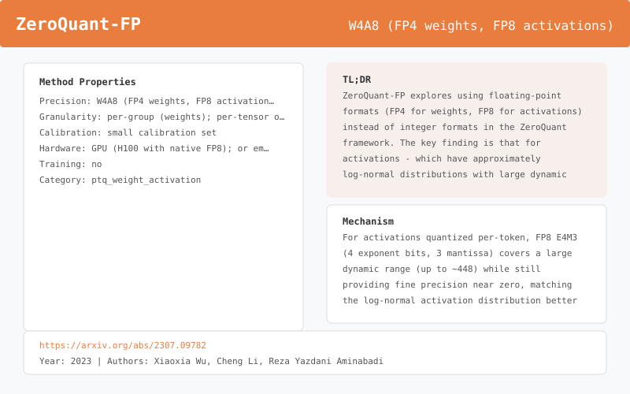

<em>FP4/FP8 formats: non-uniform grid covers activation dynamic range better than INT8.</em>

```mermaid
flowchart LR
    A[FP16 model] --> B{Choose format}
    B -->|weights| C[FP4 vs INT4\ncomparison]
    B -->|activations| D[FP8 vs INT8\ncomparison]
    C --> E[FP4 wins on\noutlier robustness]
    D --> F[FP8 E4M3 wins\nfor activations]
    E --> G[W4A8 FP-based\nbetter than INT at same bits]
    F --> G
```

> ZeroQuant-FP explores using floating-point formats (FP4 for weights, FP8 for activations) instead of integer formats in the ZeroQuant framework. The key finding is that for activations - which have approximately log-normal distributions with large dynamic range - FP8 (E4M3 or E5M2) significantly outperforms INT8 at the same bit-width because the non-uniform floating-point grid better covers the tails. For weights (approximately normally distributed), FP4 also outperforms INT4 due to the same effect. This paper motivated the adoption of FP8 in subsequent hardware (H100 Tensor Cores) and training frameworks.

| Field | Value |
|-------|-------|
| Published at | arXiv (preprint) |
| Paper | [2307.09782](https://arxiv.org/abs/2307.09782) |
| Code | [microsoft/DeepSpeed](https://github.com/microsoft/DeepSpeed) |
| Precision | W4A8 (FP4 weights, FP8 activations) |
| Granularity | per-group (weights); per-tensor or per-token (activations) |
| Calibration | small calibration set |
| Symmetric? | symmetric |
| Outlier handling | floating-point format's non-uniform grid naturally handles activation dynamic range |
| Hardware target | GPU (H100 with native FP8); or emulated on A100 |
| Training needed? | no |
| Calibration data? | yes |
| Typical degradation | FP4 weights + FP8 activations better than INT4+INT8 at same bit-width |
| Builds on | [zeroquant-v2](#zeroquant-v2) · [zeroquant](#zeroquant) |
| Related | [atom](#atom) · [fp8-training](#fp8-training) · [smoothquant](#smoothquant) |

**How it works:**

For activations quantized per-token, FP8 E4M3 (4 exponent bits, 3 mantissa) covers a large dynamic range (up to ~448) while still providing fine precision near zero, matching the log-normal activation distribution better than INT8's uniform grid. For weights per-group, FP4 E2M1 (2 exponent bits, 1 mantissa) outperforms INT4 for the same reason. The framework computes per-tensor or per-token scale factors and maps values to the nearest FP4/FP8 code. On H100 with native FP8 Tensor Cores, FP8 activation quantization achieves actual throughput gains.

---

### Outlier Suppression+ · W8A8, W6A6 · PTQ W+A · 2023-04

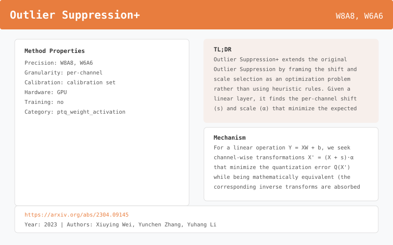

<em>Optimal per-channel shift and scale, solved analytically to minimize quantization error.</em>

```mermaid
flowchart LR
    A[Activation channel X_j] --> B[Compute optimal\nshift t_j and scale s_j]
    B --> C[Shifted X_j_shifted = X_j - t_j]
    C --> D[Zero-centered\nsymmetric distribution]
    D --> E[Scale X_j_shifted / s_j]
    E --> F[INT8 quantize]
    F --> G[Absorb t_j and s_j\ninto adjacent weights]
    G --> H[W8A8 / W4A8\nanalytical optimal]
```

> Outlier Suppression+ extends the original Outlier Suppression by framing the shift and scale selection as an optimization problem rather than using heuristic rules. Given a linear layer, it finds the per-channel shift (s) and scale (α) that minimize the expected quantization error subject to the constraint that the transformation is equivalent (can be absorbed into surrounding layers without changing model output). The optimal parameters are found analytically using first- and second-order statistics from the calibration set. The result is consistently better than heuristic approaches.

| Field | Value |
|-------|-------|
| Published at | **EMNLP 2023** |
| Paper | [2304.09145](https://arxiv.org/abs/2304.09145) |
| Precision | W8A8, W6A6 |
| Granularity | per-channel |
| Calibration | calibration set |
| Symmetric? | asymmetric |
| Outlier handling | optimal equivalent shifting and scaling jointly minimizing quantization error |
| Hardware target | GPU |
| Training needed? | no |
| Calibration data? | yes |
| Typical degradation | better than Outlier Suppression; < 0.5 ppl at W6A6 on LLaMA |
| Builds on | [outlier-suppression](#outlier-suppression) · [smoothquant](#smoothquant) |
| Related | [smoothquant](#smoothquant) · [omniquant](#omniquant) · [atom](#atom) |

**How it works:**

For a linear operation Y = XW + b, we seek channel-wise transformations X' = (X + s)·α that minimize the quantization error Q(X') while being mathematically equivalent (the corresponding inverse transforms are absorbed into W and b). Setting s_j = -median(X_j) (centering) and α_j based on the MMSE quantization scale for the resulting distribution yields an analytically optimal solution under the per-channel quantization model. Extended to cover both weight and activation channels, and shown to generalize across model families without per-model tuning.

---

### RPTQ · W4A8 · PTQ W+A · 2023-04

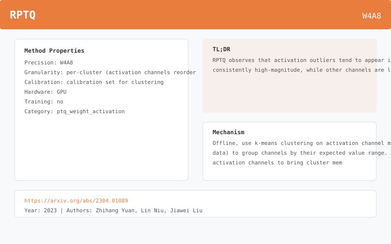

<em>Channel reordering: cluster similar-magnitude channels, apply per-cluster quantization scale.</em>

```mermaid
flowchart LR
    A[Activation channels] --> B[Group channels by\nsimilar range]
    B --> C[Channel reordering:\noutliers grouped together]
    C --> D[Cluster-wise\nquantization per group]
    D --> E[Outliers share\nscale within group]
    E --> F[W4A8 / W4A4\nno decomposition overhead]
```

> RPTQ observes that activation outliers tend to appear in specific channels that are consistently high-magnitude, while other channels are low-magnitude. Instead of handling them separately (LLM.int8()) or scaling them away (SmoothQuant), RPTQ reorders activation channels into clusters of similar magnitude and then applies per-cluster quantization. By grouping high-magnitude channels together into their own cluster, the per-cluster dynamic range is reduced relative to per-tensor quantization, allowing lower-bit quantization with less error.

| Field | Value |
|-------|-------|
| Published at | arXiv (preprint) |
| Paper | [2304.01089](https://arxiv.org/abs/2304.01089) |
| Precision | W4A8 |
| Granularity | per-cluster (activation channels reordered into low-variance clusters) |
| Calibration | calibration set for clustering |
| Symmetric? | symmetric |
| Outlier handling | channel clustering groups similar-magnitude channels together, reducing per-cluster dynamic range |
| Hardware target | GPU |
| Training needed? | no |
| Calibration data? | yes |
| Typical degradation | < 1 ppl at W4A8 on LLaMA |
| Builds on | [rtn](#rtn) · [llm-int8](#llm-int8) |
| Related | [llm-int8](#llm-int8) · [smoothquant](#smoothquant) · [atom](#atom) |

**How it works:**

Offline, use k-means clustering on activation channel magnitudes (from calibration data) to group channels by their expected value range. At inference, permute activation channels to bring cluster members together, then apply per-cluster INT8/INT4 quantization (one scale per cluster). The same permutation is applied to the weight matrix columns. Since the reordering is the same for every token, it can be absorbed as a fixed permutation matrix into the weight, adding no runtime overhead. Quantizing per-cluster of similar-magnitude channels gives lower error than per-tensor at the same bit-width.

---

### ZeroQuant-V2 · W4/W8 A8 · PTQ W+A · 2023-03

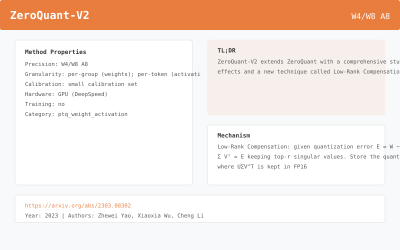

<em>Low-Rank Compensation: SVD of quantization error added back to quantized weights.</em>

```mermaid
flowchart LR
    A[Quantized model] --> B[Measure per-block\nreconstruction error]
    B --> C{Error too high?}
    C -->|yes| D[Add low-rank\ncompensation matrix]
    D --> E[W * A_r * B_r\nadded to quantized W]
    C -->|no| F[Keep quantized block]
    E --> G[W4A8 or W8A8\n+ LoRC correction]
    F --> G
```

> ZeroQuant-V2 extends ZeroQuant with a comprehensive study of quantization granularity effects and a new technique called Low-Rank Compensation (LoRC). LoRC adds a low-rank matrix decomposition of the quantization error to the quantized weight matrix: given the error E = W − Q(W), compute a rank-r approximation Ê = UV^T via SVD, and store Ŵ + Ê instead of just Ŵ. This extra low-rank correction (with very small memory overhead) compensates for the most structured part of the quantization error, recovering significant accuracy at W4A8 precision.

| Field | Value |
|-------|-------|
| Published at | arXiv (preprint) |
| Paper | [2303.08302](https://arxiv.org/abs/2303.08302) |
| Code | [microsoft/DeepSpeed](https://github.com/microsoft/DeepSpeed) |
| Precision | W4/W8 A8 |
| Granularity | per-group (weights); per-token (activations) |
| Calibration | small calibration set |
| Symmetric? | symmetric |
| Outlier handling | low-rank compensation (LoRC) for sensitive layers |
| Hardware target | GPU (DeepSpeed) |
| Training needed? | no |
| Calibration data? | yes |
| Typical degradation | improved vs ZeroQuant at W4A8 with LoRC |
| Builds on | [zeroquant](#zeroquant) |
| Superseded by | [zeroquant-fp](#zeroquant-fp) |
| Related | [zeroquant](#zeroquant) · [atom](#atom) · [smoothquant](#smoothquant) |

**How it works:**

Low-Rank Compensation: given quantization error E = W − Q(W), compute truncated SVD U Σ Vᵀ ≈ E keeping top-r singular values. Store the quantized weight as Q(W) + U·(ΣVᵀ), where UΣV^T is kept in FP16 and multiplied separately during inference. The overhead is r × (d_in + d_out) FP16 parameters per layer, which is small for r=4–16. Combined with the ZeroQuant per-group weight / per-token activation scheme, this gives the accuracy of W4A8 within 1 point of W8A8 on GPT-3-scale models.

---

### SmoothQuant · W8A8 · PTQ W+A · 2022-11

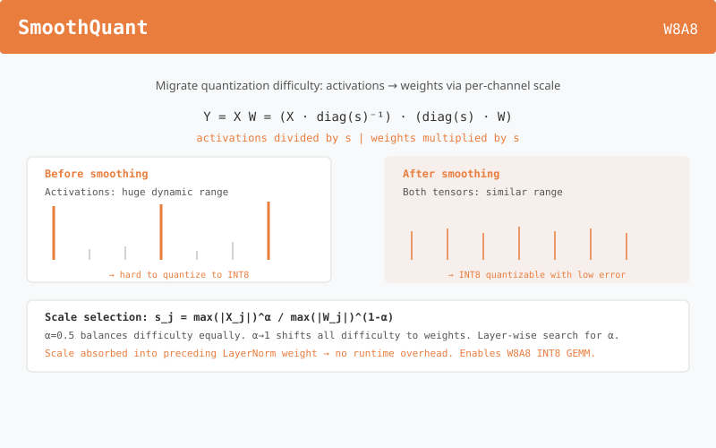

<em>Scale migration: diag(s) moves from activations to weights, equalizing quantization difficulty.</em>

```mermaid
flowchart LR
    A[FP16 Act X\noutlier channels] --> B[Compute smooth\nfactor s_j per channel]
    B --> C[X_tilde = X div diag_s]
    B --> D[W_tilde = diag_s times W]
    C --> E[Quantize X_tilde\nto INT8]
    D --> F[Quantize W_tilde\nto INT8]
    E --> G[INT8 GEMM\ntensor cores]
    F --> G
```

> SmoothQuant addresses the fundamental difficulty of activation quantization: the presence of large per-channel outliers that dominate the dynamic range. The insight is that outliers are systematic (always in the same channels across all tokens), so we can "smooth" them away by multiplying each activation channel by its inverse scale and multiplying the corresponding weight column by the same scale - an operation that is mathematically equivalent to the original matmul but redistributes the quantization difficulty from activations (which vary token-to-token) to weights (which are static). The per-channel weight scales are absorbed into the preceding LayerNorm, so they are free at inference time.

| Field | Value |
|-------|-------|
| Published at | **ICML 2023** |
| Paper | [2211.10438](https://arxiv.org/abs/2211.10438) |
| Code | [mit-han-lab/smoothquant](https://github.com/mit-han-lab/smoothquant) |
| Precision | W8A8 |
| Granularity | per-channel (weights, after scaling); per-token (activations, after scaling) |
| Calibration | small calibration set for activation statistics |
| Symmetric? | symmetric |
| Outlier handling | per-channel scale migration: diag(s) absorbed into weight; diag(s)⁻¹ applied to activation |
| Hardware target | NVIDIA GPU (INT8 Tensor Cores); 1.56× speedup on A100 |
| Training needed? | no |
| Calibration data? | yes |
| Typical degradation | < 0.5 ppl on OPT-175B/LLaMA at W8A8 |
| Builds on | [llm-int8](#llm-int8) · [rtn](#rtn) |
| Related | [zeroquant](#zeroquant) · [atom](#atom) · [quarot](#quarot) · [spinquant](#spinquant) |

**How it works:**

For each linear layer, compute per-channel activation scales as s_j = max_t(|X_{t,j}|)^α / max_k(|W_{j,k}|)^{1-α} where α=0.5 balances difficulty equally. Apply the transformation: X' = X · diag(s)⁻¹ and W' = diag(s) · W. Both X' and W' can then be quantized to INT8 per-token and per-channel respectively with much smaller quantization error. The scales are pre-absorbed into the preceding LayerNorm's weight and bias, meaning the smooth transform has no runtime cost. W8A8 INT8 matmul on Tensor Cores then provides actual speedup (not just memory savings).

---

### Outlier Suppression · W8A8 · PTQ W+A · 2022-09

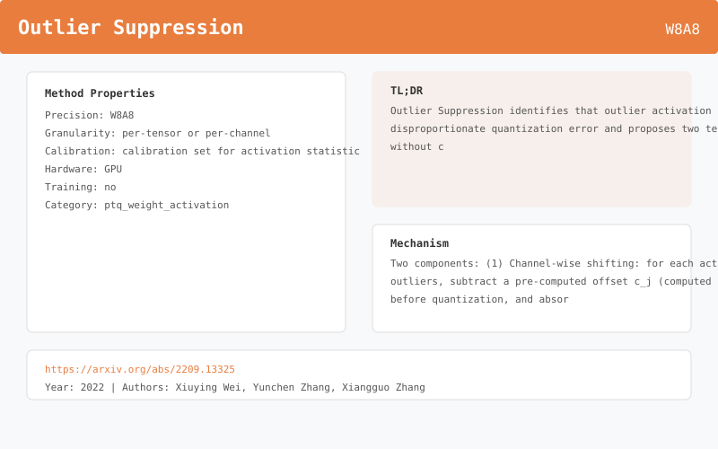

<em>Channel shifting + token clamping center the activation distribution for INT8.</em>

```mermaid
flowchart LR
    A[LayerNorm gamma\noutlier generator] --> B[Gamma Migration:\nabsorb scale into\nadjacent linear]
    B --> C[Smoother activations]
    C --> D[Token-wise clipping:\nper-token asymmetric quant]
    D --> E[Optimal clip threshold\nper token]
    E --> F[W8A8 / W6A6\nno decomposition needed]
```

> Outlier Suppression identifies that outlier activation channels cause disproportionate quantization error and proposes two techniques to mitigate them without changing the model architecture. Gamma correction shifts outlier channels by their maximum value to center them around zero. Token-level absolute-max clamping clips extreme outlier values per-token. Together, these preprocessing steps make the activation distribution more amenable to uniform INT8 quantization, achieving W8A8 quality close to FP16 without any equivalent transformation that modifies weights.

| Field | Value |
|-------|-------|
| Published at | **NeurIPS 2022** |
| Paper | [2209.13325](https://arxiv.org/abs/2209.13325) |
| Precision | W8A8 |
| Granularity | per-tensor or per-channel |
| Calibration | calibration set for activation statistics |
| Symmetric? | asymmetric |
| Outlier handling | gamma correction and token-level absolute-max shifting for outlier channels |
| Hardware target | GPU |
| Training needed? | no |
| Calibration data? | yes |
| Typical degradation | < 0.5 ppl on OPT at W6A6 |
| Builds on | [rtn](#rtn) |
| Superseded by | [outlier-suppression-plus](#outlier-suppression-plus) |
| Related | [smoothquant](#smoothquant) · [llm-int8](#llm-int8) · [rptq](#rptq) |

**How it works:**

Two components: (1) Channel-wise shifting: for each activation channel j with extreme outliers, subtract a pre-computed offset c_j (computed from calibration max values) before quantization, and absorb +c_j into the bias of the next layer. This centers the distribution. (2) Token-level clamping: clip activations to ±α·σ per token before quantization, where σ is estimated from the calibration set. Unlike SmoothQuant, Outlier Suppression avoids modifying weight matrices (no absorbed scaling into weights), making it compatible with models where the preceding layer is not a LayerNorm.

---

### LLM.int8() · W8A8 (with FP16 outlier decomposition) · PTQ W+A · 2022-08

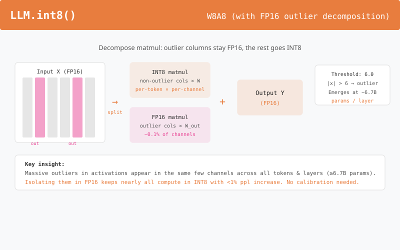

<em>Outlier decomposition: FP16 path for outlier columns, INT8 path for the rest.</em>

```mermaid
flowchart LR
    A[Input X] --> B{Outlier\ndetector}
    B -->|outlier dims ~0.1%| C[FP16 matmul]
    B -->|normal dims ~99.9%| D[INT8 quantize]
    D --> E[INT8 matmul]
    C --> F[Dequant + combine]
    E --> F
    F --> G[FP16 output]
```

> LLM.int8() was the first practical INT8 inference method for LLMs that does not degrade perplexity. The key observation is that, in models with more than ~6.7B parameters, a small set of activation channels (about 0.1%) contain systematic outliers that are 10–100× larger than the rest. Quantizing these channels to INT8 causes catastrophic error. LLM.int8() avoids this by decomposing the matrix multiplication: outlier columns of the input are extracted and computed in FP16 while all other columns go through INT8 matmul. The two partial results are summed in FP16. This halves the memory usage of a 7B+ model while preserving quality.

| Field | Value |
|-------|-------|
| Published at | **NeurIPS 2022** |
| Paper | [2208.07339](https://arxiv.org/abs/2208.07339) |
| Code | [bitsandbytes-foundation/bitsandbytes](https://github.com/bitsandbytes-foundation/bitsandbytes) |
| Precision | W8A8 (with FP16 outlier decomposition) |
| Granularity | per-column (weights), per-token (activations) |
| Calibration | none - threshold is fixed at 6.0 |
| Symmetric? | symmetric |
| Outlier handling | outlier channels isolated and computed in FP16; rest in INT8 |
| Hardware target | NVIDIA GPU (CUDA INT8 cublas / bitsandbytes kernels) |
| Training needed? | no |
| Calibration data? | no |
| Typical degradation | < 1% perplexity increase on OPT/BLOOM/LLaMA at 8-bit |
| Builds on | [rtn](#rtn) |
| Superseded by | [smoothquant](#smoothquant) |
| Related | [smoothquant](#smoothquant) · [zeroquant](#zeroquant) · [rptq](#rptq) |

**How it works:**

Given input X ∈ ℝ^{T×d} and weight W ∈ ℝ^{d×d'}, LLM.int8() identifies columns j of X where |X_{t,j}| > 6 for any token t. These "outlier" columns (and corresponding rows of W) are extracted: X_out ∈ ℝ^{T×k} and W_out ∈ ℝ^{k×d'}. The non-outlier part uses per-token (row) scales for X and per-column scales for W to fit both into INT8, and computes W_int · X_int in INT8. Results are dequantized and summed: Y = X_out · W_out (FP16) + dequant(X_int · W_int). This is exact decomposition - the two contributions recover the original matmul result.

---

### ZeroQuant · W8A8 · PTQ W+A · 2022-06

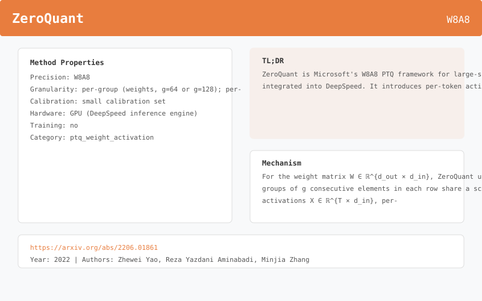

<em>Per-token dynamic activation scales + per-group static weight scales for W8A8.</em>

```mermaid
flowchart LR
    A[LLM layer] --> B[Token-wise\nact quant INT8]
    A --> C[Group-wise\nweight quant INT8]
    B --> D[INT8 GEMM\ncustom CUDA kernel]
    C --> D
    D --> E{High degradation?}
    E -->|yes| F[Layer-wise KD\nfrom FP16 teacher]
    F --> G[W8A8 model]
    E -->|no| G
```

> ZeroQuant is Microsoft's W8A8 PTQ framework for large-scale transformer inference, integrated into DeepSpeed. It introduces per-token activation quantization (one scale per output token vector rather than one scale per entire activation tensor) and per-group weight quantization (small blocks of 64–128 consecutive weights share a scale). Together, these finer-grained quantization schemes significantly reduce quantization error vs. per-tensor approaches. ZeroQuant also provides a knowledge-distillation fine-tuning option (ZeroQuant-FT) to further recover quality after quantization.

| Field | Value |
|-------|-------|
| Published at | **NeurIPS 2022** |
| Paper | [2206.01861](https://arxiv.org/abs/2206.01861) |
| Code | [microsoft/DeepSpeed](https://github.com/microsoft/DeepSpeed) |
| Precision | W8A8 |
| Granularity | per-group (weights, g=64 or g=128); per-token (activations) |
| Calibration | small calibration set |
| Symmetric? | symmetric |
| Outlier handling | per-token activation quantization reduces the dynamic range mismatch |
| Hardware target | GPU (DeepSpeed inference engine) |
| Training needed? | no |
| Calibration data? | yes |
| Typical degradation | ~0.5–1 ppl on GPT-3 scale at W8A8 |
| Builds on | [rtn](#rtn) |
| Superseded by | [zeroquant-v2](#zeroquant-v2) · [smoothquant](#smoothquant) |
| Related | [llm-int8](#llm-int8) · [smoothquant](#smoothquant) · [atom](#atom) |

**How it works:**

For the weight matrix W ∈ ℝ^{d_out × d_in}, ZeroQuant uses per-group quantization: groups of g consecutive elements in each row share a scale s and zero-point z. For activations X ∈ ℝ^{T × d_in}, per-token quantization is used: each row (token) gets its own scale max(|X_t|)/127, computed online during inference. The combination of fine-grained weight quantization and dynamic per-token activation quantization gives high accuracy with real hardware speedup. ZeroQuant uses LeCun et al.'s optimal brain damage approach for a lightweight knowledge-distillation step to recover any remaining accuracy gap.

---

---

## Quantization-Aware Training & Quantized Fine-Tuning

Methods that involve gradient updates: either training from scratch with simulated quantization, or fine-tuning a pre-trained model (often with LoRA adapters) while the base weights are kept quantized. Generally achieves better quality at the same bit-width than PTQ, at the cost of training compute.

### LC-QAT · W2A16 · QAT / QFT · 2026-06

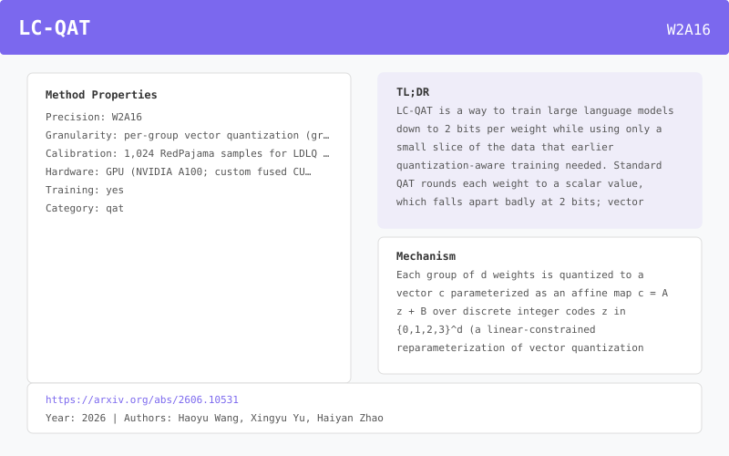

<em>Linear-constrained vector quantization: discrete codes z mapped via learned affine c=Az+B enable differentiable 2-bit QAT after a Hadamard+LDLQ PTQ init.</em>

```mermaid
flowchart LR
    A[FP16 pretrained\nor random init] --> B[Insert fake-quant\nnodes]
    B --> C[Forward pass with\nsimulated quantization]
    C --> D[Compute loss]
    D --> E[Backprop via\nSTE for quant nodes]
    E --> F{Converged?}
    F -->|no| C
    F -->|yes| G[W2A16\nquantized model]
```

> LC-QAT is a way to train large language models down to 2 bits per weight while using only a small slice of the data that earlier quantization-aware training needed. Standard QAT rounds each weight to a scalar value, which falls apart badly at 2 bits; vector quantization (grouping several weights and mapping them to entries in a codebook) holds up much better but normally can't be trained end-to-end because looking up a codebook entry is not differentiable. LC-QAT sidesteps this by writing each quantized vector as a learned linear (affine) function of a small set of discrete integer codes, so the forward pass is a plain matrix expression that gradients flow through, with no explicit lookup step during training. It first builds a strong starting point with a post-training pass (Hadamard incoherence processing plus an LDLQ-style Hessian-guided quantization), and because that initialization is already good, only a short fine-tune on a fraction of the usual data is needed to recover quality.

| Field | Value |
|-------|-------|
| Published at | **ICML 2026** |
| Paper | [2606.10531](https://arxiv.org/abs/2606.10531) |
| Precision | W2A16 |
| Granularity | per-group vector quantization (group size d=4, also d=8) |
| Calibration | 1,024 RedPajama samples for LDLQ Hessian-based PTQ initialization; QAT fine-tuning on ~4B FineWeb tokens (only 0.1%-10% of data used by prior QAT) |
| Symmetric? | symmetric |
| Outlier handling | Hadamard (incoherence) transform on weights during PTQ initialization, following QuIP#/QTIP |
| Hardware target | GPU (NVIDIA A100; custom fused CUDA kernel, ~1.68x speedup over FP16 on LLaMA-3-8B) |
| Training needed? | yes |
| Calibration data? | yes |
| Typical degradation | 2-bit LLaMA-3-8B: WikiText-2 PPL 9.38, average zero-shot ~73.4 (ARC-C 57.9, ARC-E 83.0); reported to beat prior SOTA QAT using 0.1%-10% of the training data |
| Builds on | [qtip](#qtip) · [llm-qat](#llm-qat) |
| Related | [aqlm](#aqlm) · [qtip](#qtip) · [efficientqat](#efficientqat) · [pv-tuning](#pv-tuning) |

**How it works:**

Each group of d weights is quantized to a vector c parameterized as an affine map c = A z + B over discrete integer codes z in {0,1,2,3}^d (a linear-constrained reparameterization of vector quantization extending UniSVQ). This replaces the non-differentiable codebook lookup with a closed-form linear expression, letting the whole network train end-to-end with ordinary gradients while still enjoying vector quantization's higher representational capacity at 2 bits. Initialization comes from a PTQ stage: weights are first made incoherent via a Hadamard transform (following QuIP#/QTIP), then quantized with an LDLQ Hessian-aware procedure using ~1,024 calibration samples, producing a high-quality starting point so that subsequent QAT needs only 0.1%-10% of the data prior methods use. A custom fused CUDA kernel implements the reformulated forward pass for fast inference.

---

### CKA-QAD · W4A4 · QAT / QFT · 2026-06

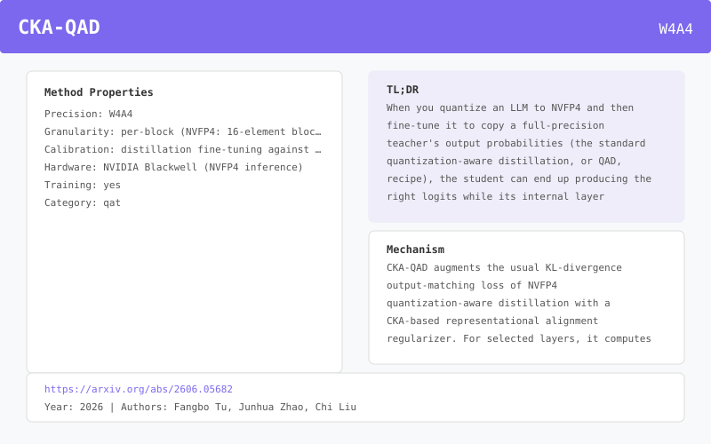

<em>Adds a CKA layerwise Gram-matrix alignment loss on top of KL output matching so the NVFP4 student preserves the BF16 teacher's internal geometry, not just its logits.</em>

```mermaid
flowchart LR
    A[FP16 pretrained\nor random init] --> B[Insert fake-quant\nnodes]
    B --> C[Forward pass with\nsimulated quantization]
    C --> D[Compute loss]
    D --> E[Backprop via\nSTE for quant nodes]
    E --> F{Converged?}
    F -->|no| C
    F -->|yes| G[W4A4\nquantized model]
```

> When you quantize an LLM to NVFP4 and then fine-tune it to copy a full-precision teacher's output probabilities (the standard quantization-aware distillation, or QAD, recipe), the student can end up producing the right logits while its internal layer activations have drifted far from the teacher's. The authors measure this drift with Centered Kernel Alignment (CKA) and show it is worst for models that were post-trained with reinforcement learning, and that it lines up with weaker reasoning and coding performance. Their fix adds a lightweight extra loss term during distillation that pulls each layer's activation similarity structure (Gram matrix) back toward the teacher's, so the quantized model matches the teacher inside as well as at the output. On Nemotron 3 Nano and Qwen3-4B-Thinking-2507 this improves internal alignment and downstream accuracy with only modest extra training cost.

| Field | Value |
|-------|-------|
| Published at | arXiv (preprint) |
| Paper | [2606.05682](https://arxiv.org/abs/2606.05682) |
| Precision | W4A4 |
| Granularity | per-block (NVFP4: 16-element blocks with FP8 block scale) |
| Calibration | distillation fine-tuning against a frozen BF16 teacher (KL output loss + CKA layerwise regularizer) |
| Symmetric? | symmetric |
| Outlier handling | CKA-based layerwise Gram-matrix alignment regularizer that preserves internal representational geometry during distillation (complementing NVFP4 block-scale handling of dynamic range) |
| Hardware target | NVIDIA Blackwell (NVFP4 inference) |
| Training needed? | yes |
| Calibration data? | yes |
| Typical degradation | Improves layerwise CKA similarity to the BF16 teacher and recovers reasoning/coding accuracy over KL-only QAD on Nemotron 3 Nano and Qwen3-4B-Thinking-2507 (abstract reports qualitative gains; no single numeric ppl/accuracy figure stated) |
| Builds on | [nvfp4](#nvfp4) · [bitdistiller](#bitdistiller) |
| Related | [llm-qat](#llm-qat) · [bitdistiller](#bitdistiller) · [nvfp4](#nvfp4) · [fp8-training](#fp8-training) |

**How it works:**

CKA-QAD augments the usual KL-divergence output-matching loss of NVFP4 quantization-aware distillation with a CKA-based representational alignment regularizer. For selected layers, it computes the Gram (pairwise-similarity) matrices of the quantized student's and the frozen BF16 teacher's activations over a batch and adds a penalty that maximizes their Centered Kernel Alignment, encouraging the student to preserve the teacher's internal geometry rather than only its final logits. The diagnosis motivating this is that many different intermediate activation geometries can yield teacher-aligned outputs, so output matching alone can mask internal degradation, which is especially severe in RL-post-trained models and correlates with reasoning/coding bottlenecks. The regularizer is cheap to add and is presented as a complement to, not a replacement for, output-distribution matching.

---

### Joint NAS-Quant · W2/4/8 A2/4/8/16 (mixed-precision, per-layer searched) · QAT / QFT · 2026-06

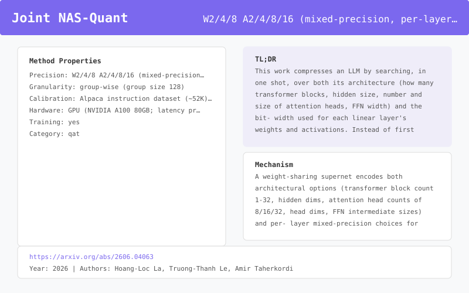

<em>Joint differentiable NAS over architecture (depth/width/heads/FFN) and per-layer weight+activation bit-widths in one weight-sharing supernet, steered by a latency objective and finalized with distillation.</em>

```mermaid
flowchart LR
    A[FP16 pretrained\nor random init] --> B[Insert fake-quant\nnodes]
    B --> C[Forward pass with\nsimulated quantization]
    C --> D[Compute loss]
    D --> E[Backprop via\nSTE for quant nodes]
    E --> F{Converged?}
    F -->|no| C
    F -->|yes| G[W2/4/8 A2/4/8/16 mixed-precision, per-layer searched\nquantized model]
```

> This work compresses an LLM by searching, in one shot, over both its architecture (how many transformer blocks, hidden size, number and size of attention heads, FFN width) and the bit- width used for each linear layer's weights and activations. Instead of first shrinking the network and then quantizing it (which can lock in a poor combination), the two decisions are made together inside a single differentiable search over a supernet, so the framework can pick, for example, a slightly larger layer kept at higher precision versus a smaller one pushed to fewer bits. LoRA adapters and OmniQuant-initialized quantizers let the candidate subnetworks be trained efficiently, and a knowledge-distillation pass refines the final selected model. The reported benefit is a better accuracy-versus-latency curve for deploying an 8B model under edge latency budgets.

| Field | Value |
|-------|-------|
| Published at | arXiv (preprint) |
| Paper | [2606.04063](https://arxiv.org/abs/2606.04063) |
| Precision | W2/4/8 A2/4/8/16 (mixed-precision, per-layer searched) |
| Granularity | group-wise (group size 128) |
| Calibration | Alpaca instruction dataset (~52K) for supernet fine-tuning; OmniQuant used to initialize quantizers |
| Symmetric? | symmetric |
| Outlier handling | OmniQuant-initialized quantizers plus learnable LoRA adapters; STE-based quantization-aware training adapts weights to the chosen grid |
| Hardware target | GPU (NVIDIA A100 80GB; latency profiled with Marlin and ABQ-LLM kernels), targeting edge accuracy-latency trade-offs |
| Training needed? | yes |
| Calibration data? | yes |
| Typical degradation | On Llama-3.1-8B across 7 reasoning tasks (BoolQ, PIQA, HellaSwag, WinoGrande, ARC-e, ARC-c, MMLU): ~41% average accuracy at 30ms latency, roughly 6% higher than sequential NAS-then-quantization baselines at equal latency; or up to 1.4x faster at comparable accuracy |
| Builds on | [omniquant](#omniquant) · [llm-qat](#llm-qat) · [qlora](#qlora) · [marlin](#marlin) |
| Related | [autoround](#autoround) · [smoothquant](#smoothquant) |

**How it works:**

A weight-sharing supernet encodes both architectural options (transformer block count 1-32, hidden dims, attention head counts of 8/16/32, head dims, FFN intermediate sizes) and per- layer mixed-precision choices for weights (2/4/8-bit) and activations (2/4/8/16-bit), giving over 15K candidate architectures. Architecture and quantization choices are relaxed into continuous, jointly-optimized variables; the Straight-Through Estimator passes gradients through the quantization operations and OmniQuant initializes the quantizers, while LoRA adapters (rank 32) inserted in all linear layers make subnet fine-tuning on Alpaca cheap. A latency objective (profiled with Marlin/ABQ-LLM kernels) steers the search toward a target budget, and the converged subnetwork is finalized with knowledge distillation from the full- precision teacher.

---

### LAQuant · W3A16 · QAT / QFT · 2026-05

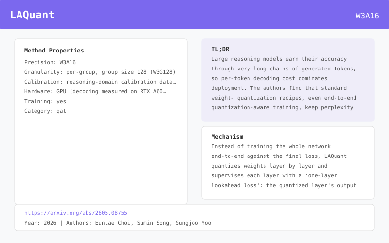

<em>LAQuant: layer-wise weight-only QAT with a one-layer lookahead loss that preserves the next-layer residual stream for long-decoding reasoning accuracy.</em>

```mermaid
flowchart LR
    A[FP16 pretrained\nor random init] --> B[Insert fake-quant\nnodes]
    B --> C[Forward pass with\nsimulated quantization]
    C --> D[Compute loss]
    D --> E[Backprop via\nSTE for quant nodes]
    E --> F{Converged?}
    F -->|no| C
    F -->|yes| G[W3A16\nquantized model]
```

> Large reasoning models earn their accuracy through very long chains of generated tokens, so per-token decoding cost dominates deployment. The authors find that standard weight- quantization recipes, even end-to-end quantization-aware training, keep perplexity and short-answer accuracy intact but quietly lose accuracy on long reasoning tasks. A gradient- direction analysis traces this to two causes: end-to-end supervision under-weights the KV- cache fidelity that the attention softmax depends on, and the calibration data sits in a different Hessian subspace than the deployment workload. LAQuant is a layer-wise, weight- only quantization-aware training method that fixes both by calibrating on reasoning traces and training each layer with a one-layer lookahead loss, all without adding any inference- time transform. On Qwen3-4B at 3-bit it recovers most of the lost reasoning accuracy while keeping a large decoding speedup.

| Field | Value |
|-------|-------|
| Published at | arXiv (preprint) |
| Paper | [2605.08755](https://arxiv.org/abs/2605.08755) |
| Precision | W3A16 |
| Granularity | per-group, group size 128 (W3G128) |
| Calibration | reasoning-domain calibration data (reasoning traces matching the deployment distribution) |
| Symmetric? | symmetric |
| Outlier handling | layer-wise QAT with straight-through gradients; one-layer lookahead loss adapts weights to the 3-bit grid (no online transform) |
| Hardware target | GPU (decoding measured on RTX A6000); no online-transform overhead at inference |
| Training needed? | yes |
| Calibration data? | yes |
| Typical degradation | Qwen3-4B at W3G128: AIME25 Pass@1 54.69% vs 35.31% for ReasoningQAT (+15.11pp over ParoQuant, +1.93pp over ParoQuant++ at matched calibration); 3.42x decoding speedup over FP16 |
| Builds on | [llm-qat](#llm-qat) · [paroquant](#paroquant) |
| Related | [paroquant](#paroquant) · [efficientqat](#efficientqat) · [bitdistiller](#bitdistiller) · [gptq](#gptq) |

**How it works:**

Instead of training the whole network end-to-end against the final loss, LAQuant quantizes weights layer by layer and supervises each layer with a 'one-layer lookahead loss': the quantized layer's output is pushed not just to match its own teacher output but to keep the next layer's residual stream intact. This implicit cross-layer co-adaptation preserves the KV-cache fidelity that the softmax Fisher metric makes the attention mechanism sensitive to, which end-to-end QAT supervision tends to attenuate. Combined with reasoning-domain calibration data (so the calibration Hessian subspace aligns with the deployment distribution), the method targets the two failure modes identified via gradient-direction analysis. Because it is weight-only and adds no online transform, the quantized model has no inference-time overhead.

---

### Bit-by-Bit · W2A2 / W2A16 · QAT / QFT · 2026-04

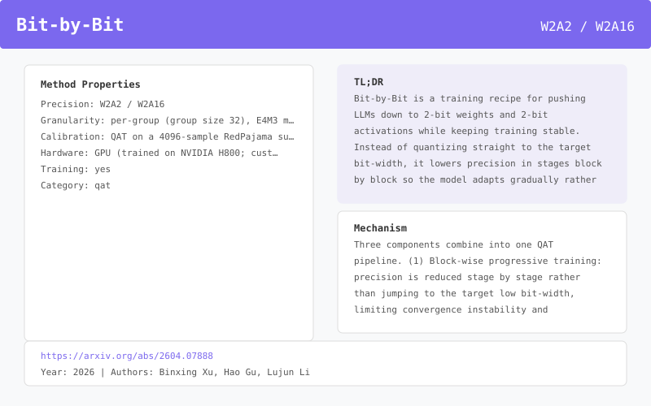

<em>Staged precision reduction (block-wise progressive QAT) with nested integer grids and rounding-aware outlier channel splitting for stable W2A2 training.</em>

```mermaid
flowchart LR
    A[FP16 pretrained\nor random init] --> B[Insert fake-quant\nnodes]
    B --> C[Forward pass with\nsimulated quantization]
    C --> D[Compute loss]
    D --> E[Backprop via\nSTE for quant nodes]
    E --> F{Converged?}
    F -->|no| C
    F -->|yes| G[W2A2 / W2A16\nquantized model]
```

> Bit-by-Bit is a training recipe for pushing LLMs down to 2-bit weights and 2-bit activations while keeping training stable. Instead of quantizing straight to the target bit-width, it lowers precision in stages block by block so the model adapts gradually rather than collapsing under quantization noise. It also lays the integer quantization grids out so that coarser grids are nested inside finer ones, which lets a single trained model be served at several different bit-widths without retraining. To deal with the heavy-tailed channels that cause most of the error, it duplicates the worst channels and rebalances them in a way that leaves the layer's output unchanged before quantization. The authors also wrote custom W2A2 and W2A16 GPU kernels so the low-bit model actually runs faster at inference.

| Field | Value |
|-------|-------|
| Published at | arXiv (preprint) |
| Paper | [2604.07888](https://arxiv.org/abs/2604.07888) |
| Precision | W2A2 / W2A16 |
| Granularity | per-group (group size 32), E4M3 micro-scaling scales |
| Calibration | QAT on a 4096-sample RedPajama subset (ablations also use WikiText2/C4); training data used to learn quantized weights |
| Symmetric? | asymmetric |
| Outlier handling | rounding-aware outlier channel splitting (OCS): high-norm channels selected by ||X_i||_2 * max|W_ij| are split into two branches acting as an identity transform so the unquantized output is preserved while per-channel quantization error is reduced |
| Hardware target | GPU (trained on NVIDIA H800; custom CUDA 12.1 W2A2/W2A16 GEMV kernels benchmarked on RTX 4090, up to ~11x speedup over BF16) |
| Training needed? | yes |
| Calibration data? | yes |
| Typical degradation | LLaMA-2 7B W2A2: 7.72 WikiText2 PPL vs 5.47 FP16 (+2.25 PPL); LLaMA-3-8B W2A2 ~11.51 PPL; LLaMA-3.2-1B W2A2 ~22.71 PPL; surpasses BitDistiller/EfficientQAT under equal training budget |
| Builds on | [efficientqat](#efficientqat) · [bitdistiller](#bitdistiller) · [llm-qat](#llm-qat) · [mx-formats](#mx-formats) |
| Related | [efficientqat](#efficientqat) · [bitdistiller](#bitdistiller) · [llm-qat](#llm-qat) · [billm](#billm) · [pv-tuning](#pv-tuning) |

**How it works:**

Three components combine into one QAT pipeline. (1) Block-wise progressive training: precision is reduced stage by stage rather than jumping to the target low bit-width, limiting convergence instability and cross-layer error accumulation. (2) Nested integer quantization grids: lower-precision grids are subsets of higher-precision ones, enabling a train-once / deploy-at-any-precision model with asymmetric (zero-point) quantizers and E4M3 micro-scaling group scales at group size 32. (3) Rounding-aware outlier channel splitting: outlier channels (ranked by ||X_i||_2 * max|W_ij|) are split into two channels that reduce the per-channel quantization range while acting as an exact identity transform, so the pre- quantization output is unchanged.

---

### EfficientQAT · W2/W4 A16 · QAT / QFT · 2024-07

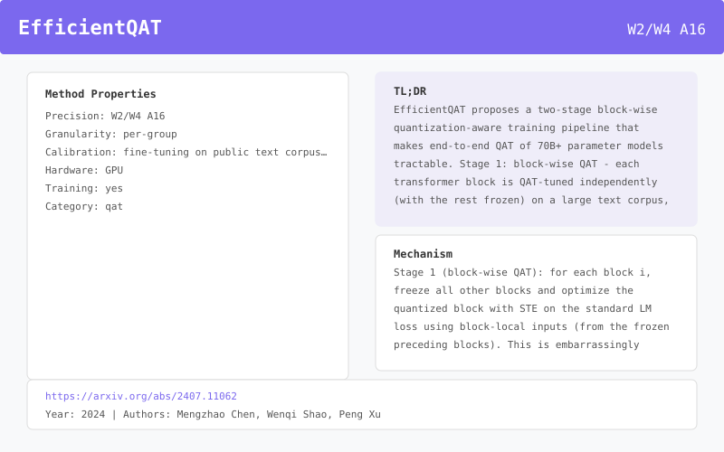

<em>Two-stage QAT: block-wise STE (parallelizable) then global fine-tuning pass.</em>

```mermaid
flowchart LR
    A[FP16 LLM] --> B[Phase 1: Block-AP\nblock-wise quant param train]
    B --> C[Freeze surrounding blocks\ntrain scales and zeros]
    C --> D[Phase 2: E2E-QP\nend-to-end quant param finetune]
    D --> E{All blocks done?}
    E -->|no| B
    E -->|yes| F[W4A8 or W2A16\nhigh-quality QAT]
```

> EfficientQAT proposes a two-stage block-wise quantization-aware training pipeline that makes end-to-end QAT of 70B+ parameter models tractable. Stage 1: block-wise QAT - each transformer block is QAT-tuned independently (with the rest frozen) on a large text corpus, using the STE. Stage 2: end-to-end QAT - a lightweight global fine-tuning pass refines all blocks jointly. By decoupling the block-wise stage (which is easily parallelizable), EfficientQAT scales to large models without requiring full-model QAT from the start, and achieves state-of-the-art W2 quality among QAT methods.

| Field | Value |
|-------|-------|
| Published at | arXiv (preprint) |
| Paper | [2407.11062](https://arxiv.org/abs/2407.11062) |
| Precision | W2/W4 A16 |
| Granularity | per-group |
| Calibration | fine-tuning on public text corpus (WikiText, etc.) |
| Symmetric? | asymmetric |
| Outlier handling | block-wise QAT with STE over quantized weights; data-driven adaptation |
| Hardware target | GPU |
| Training needed? | yes |
| Calibration data? | no |
| Typical degradation | best-known W2A16 QAT result; competitive with PTQ at W4 |
| Builds on | [llm-qat](#llm-qat) · [gptq](#gptq) |
| Related | [llm-qat](#llm-qat) · [bitdistiller](#bitdistiller) · [pv-tuning](#pv-tuning) |

**How it works:**

Stage 1 (block-wise QAT): for each block i, freeze all other blocks and optimize the quantized block with STE on the standard LM loss using block-local inputs (from the frozen preceding blocks). This is embarrassingly parallel across blocks. The quantized weights evolve via: w_q ← STE_grad(L_block(w_q)) where STE passes the gradient through the round operation. Stage 2 (end-to-end fine-tuning): with all blocks initialized from Stage 1, run a short global QAT pass on the full model. The sequential dependency makes Stage 2 important for cross-block error compensation, but it is short because Stage 1 already provides a good starting point.

---

### PV-Tuning · W2 A16 · QAT / QFT · 2024-05

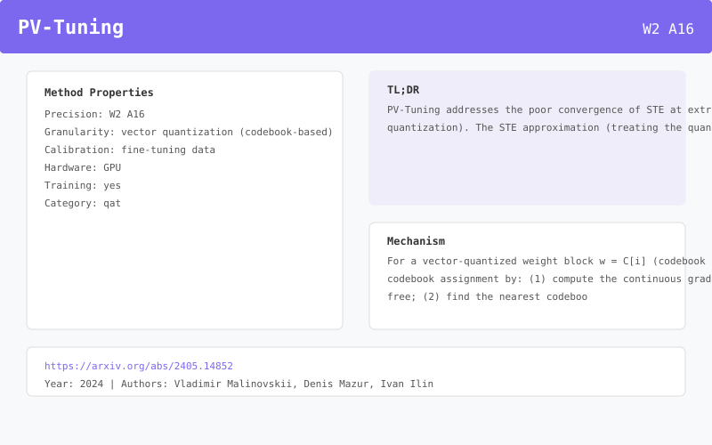

<em>Proximal gradient on discrete codebook assignments avoids STE; finds nearest valid code.</em>

```mermaid
flowchart LR
    A[AQLM codebook\nquantized model] --> B[Directly optimize\ncodebook entries]
    B --> C[Per-vector gradient\nvia straight-through]
    C --> D[Update codebook\ncentroids end-to-end]
    D --> E{Converged?}
    E -->|no| B
    E -->|yes| F[Better codebooks\nthan init-only AQLM]
    F --> G[W2A16 state-of-art\nvector quant]
```

> PV-Tuning addresses the poor convergence of STE at extreme compression (2-bit vector quantization). The STE approximation (treating the quantization round as the identity during backpropagation) becomes severely wrong at 2-bit because the quantization distortion is large. PV-Tuning instead formulates the optimization as a proximal gradient descent over discrete codebook assignments: at each step, the gradient update suggests a direction; then a discrete projection finds the nearest valid quantized assignment. This avoids the STE altogether and works even with vector-quantized (AQLM-style) weights.

| Field | Value |
|-------|-------|
| Published at | **NeurIPS 2024** |
| Paper | [2405.14852](https://arxiv.org/abs/2405.14852) |
| Precision | W2 A16 |
| Granularity | vector quantization (codebook-based) |
| Calibration | fine-tuning data |
| Symmetric? | n/a (codebook-based) |
| Outlier handling | vector quantization codebook absorbs all magnitudes; proximal gradient update |
| Hardware target | GPU |
| Training needed? | yes |
| Calibration data? | no |
| Typical degradation | best-known 2-bit quantized fine-tuning quality as of mid-2024 |
| Builds on | [aqlm](#aqlm) · [llm-qat](#llm-qat) |
| Related | [aqlm](#aqlm) · [efficientqat](#efficientqat) · [bitdistiller](#bitdistiller) |

**How it works:**

For a vector-quantized weight block w = C[i] (codebook entry), PV-Tuning updates the codebook assignment by: (1) compute the continuous gradient ∇_{w} L as if w were free; (2) find the nearest codebook entry to w − lr·∇L. This is a proximal step on the discrete set of codebook entries. The key insight is that for discrete quantization, the proximal step (find nearest quantized point) is the exact discrete projection, not an approximation like STE. Combined with a codebook update step (re-optimize centroids given fixed assignments via least squares), PV-Tuning jointly optimizes both the codebook and assignments - effectively a quantized version of coordinate descent.

---

### BitDistiller · W2/W3 A16 · QAT / QFT · 2024-02

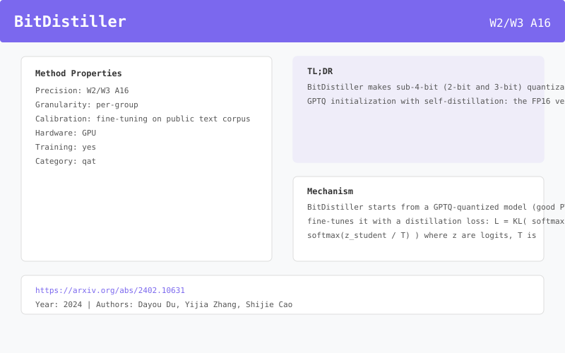

<em>GPTQ init + KL self-distillation from FP16 teacher recovers 2/3-bit model quality.</em>

```mermaid
flowchart LR
    A[FP16 teacher model] --> B[Soft targets\n+ intermediate features]
    B --> C[Quantized student\nINT2 / INT3]
    C --> D[Knowledge distillation\nloss KL + MSE]
    D --> E[Student learns\nto mimic teacher]
    E --> F{Training done?}
    F -->|no| C
    F -->|yes| G[High-quality\nextreme-bit model]
```

> BitDistiller makes sub-4-bit (2-bit and 3-bit) quantization practical by combining GPTQ initialization with self-distillation: the FP16 version of the same model serves as a teacher, and the quantized model is fine-tuned to match the teacher's output distributions (using KL divergence on logits). Because the teacher and student have the same architecture, this is "self-distillation." The distillation training signal is much richer than cross-entropy on labels, recovering quality that would otherwise be lost at extreme bit-widths.

| Field | Value |
|-------|-------|
| Published at | **ACL 2024** |
| Paper | [2402.10631](https://arxiv.org/abs/2402.10631) |
| Precision | W2/W3 A16 |
| Granularity | per-group |
| Calibration | fine-tuning on public text corpus |
| Symmetric? | asymmetric |
| Outlier handling | self-distillation from FP16 teacher; GPTQ initialization of quantized weights |
| Hardware target | GPU |
| Training needed? | yes |
| Calibration data? | no |
| Typical degradation | significantly better than PTQ at W2/W3; approaches W4 PTQ quality at W3 |
| Builds on | [gptq](#gptq) · [qlora](#qlora) |
| Related | [llm-qat](#llm-qat) · [efficientqat](#efficientqat) · [pv-tuning](#pv-tuning) |

**How it works:**

BitDistiller starts from a GPTQ-quantized model (good PTQ initialization) and fine-tunes it with a distillation loss: L = KL( softmax(z_teacher / T) ‖ softmax(z_student / T) ) where z are logits, T is temperature, and the teacher is the FP16 base model. The quantized weights (INT2/INT3) are kept frozen in their quantized form; the quantization scales (per-group) are the only parameters that get gradient updates from the distillation loss. This is lighter than full QAT (no STE over weights), just learning optimal scale parameters. The combination of GPTQ init + self-distillation scale training achieves W3 quality close to W4 GPTQ.

---

### IR-QLoRA · W4A16 (NF4 base) + BF16 LoRA · QAT / QFT · 2024-02

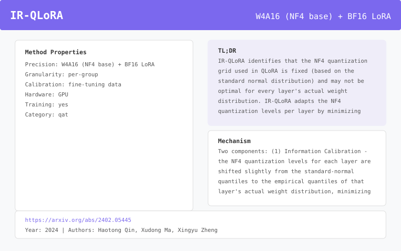

<em>Per-layer NF4 level adaptation (information calibration) + confidence-guided LoRA updates.</em>

```mermaid
flowchart LR
    A[QLoRA model\nINT4 + LoRA] --> B[Measure inter-layer\nfeature correlation]
    B --> C[Identify redundant\nLoRA rank dimensions]
    C --> D[Prune redundant\nrank components]
    D --> E[Reinitialize pruned\nrank with new directions]
    E --> F{Iterations done?}
    F -->|no| B
    F -->|yes| G[Compact LoRA\nbetter QLoRA baseline]
```

> IR-QLoRA identifies that the NF4 quantization grid used in QLoRA is fixed (based on the standard normal distribution) and may not be optimal for every layer's actual weight distribution. IR-QLoRA adapts the NF4 quantization levels per layer by minimizing the information loss (measured by the KL divergence between the original and quantized weight distributions), and additionally uses a confidence-guided LoRA training approach where LoRA updates are weighted by the model's prediction confidence to avoid wasted gradient on easy examples.

| Field | Value |
|-------|-------|
| Published at | **ICML 2024** |
| Paper | [2402.05445](https://arxiv.org/abs/2402.05445) |
| Precision | W4A16 (NF4 base) + BF16 LoRA |
| Granularity | per-group |
| Calibration | fine-tuning data |
| Symmetric? | n/a (NF4) |
| Outlier handling | information calibration of NF4 quantization levels per layer; confidence-guided LoRA |
| Hardware target | GPU |
| Training needed? | yes |
| Calibration data? | no |
| Typical degradation | consistently outperforms QLoRA on downstream tasks |
| Builds on | [qlora](#qlora) · [loftq](#loftq) |
| Related | [qlora](#qlora) · [loftq](#loftq) · [apiq](#apiq) |

**How it works:**

Two components: (1) Information Calibration - the NF4 quantization levels for each layer are shifted slightly from the standard-normal quantiles to the empirical quantiles of that layer's actual weight distribution, minimizing KL divergence between Q(W) and W. This is a cheap per-layer histogram operation requiring no data. (2) Confidence-guided LoRA - during fine-tuning, the LoRA gradient for each training example is scaled by (1 − p(y|x)), the model's uncertainty, focusing updates on harder examples where the quantized model is most uncertain.

---

### ApiQ · W2A16 (base) + BF16 LoRA · QAT / QFT · 2024-02

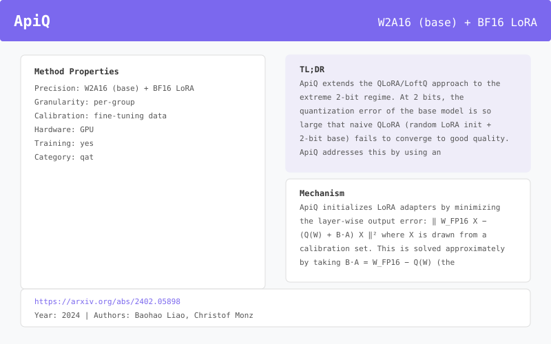

<em>Activation-aware LoRA initialization for 2-bit base - minimizes layer-wise output error.</em>

```mermaid
flowchart LR
    A[Calibration activations] --> B[Compute activation\ncovariance stats]
    B --> C[Design per-layer\nquantization grid]
    C --> D[Grid aligned to\nactivation principal components]
    D --> E[Quantize W on\naligned grid]
    E --> F[Better W4A16\nactivation-aware grid]
```

> ApiQ extends the QLoRA/LoftQ approach to the extreme 2-bit regime. At 2 bits, the quantization error of the base model is so large that naive QLoRA (random LoRA init + 2-bit base) fails to converge to good quality. ApiQ addresses this by using an activation-aware initialization of the LoRA adapters that directly minimizes the output error of each layer before fine-tuning starts, analogous to LoftQ but tailored to the higher-error 2-bit case and using activations rather than pure weight error.

| Field | Value |
|-------|-------|
| Published at | **EMNLP 2024** |
| Paper | [2402.05898](https://arxiv.org/abs/2402.05898) |
| Precision | W2A16 (base) + BF16 LoRA |
| Granularity | per-group |
| Calibration | fine-tuning data |
| Symmetric? | asymmetric |
| Outlier handling | activation-aware initialization of LoRA adapters for 2-bit quantized base |
| Hardware target | GPU |
| Training needed? | yes |
| Calibration data? | yes |
| Typical degradation | competitive fine-tuning quality at 2-bit base; better than QLoRA+2-bit GPTQ |
| Builds on | [qlora](#qlora) · [loftq](#loftq) |
| Related | [qlora](#qlora) · [loftq](#loftq) · [ir-qlora](#ir-qlora) |

**How it works:**

ApiQ initializes LoRA adapters by minimizing the layer-wise output error: ‖ W_FP16 X − (Q(W) + B·A) X ‖² where X is drawn from a calibration set. This is solved approximately by taking B·A = W_FP16 − Q(W) (the quantization error) and computing the rank-r approximation via SVD of the activation-weighted error (X^T (W − Q(W))^T). The key difference from LoftQ: the initialization accounts for the activation distribution X, not just the weight matrix. For 2-bit models where ‖ W − Q(W) ‖ is large, this better initialization is critical for convergence.

---

### LoftQ · W4A16 (quantized base) + BF16 LoRA · QAT / QFT · 2023-10

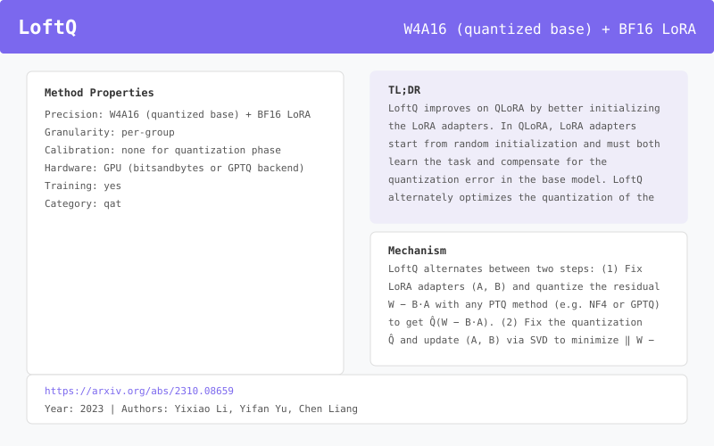

<em>Alternating quantization of residual and SVD initialization of LoRA adapters.</em>

```mermaid
flowchart LR
    A[FP16 pretrained W] --> B[SVD: W approx A times B\nlow-rank init]
    B --> C[Quantize W - A times B\nresidual to INT4]
    C --> D[New residual\nR = W - Q_int4]
    D --> E[SVD of R to update\nA and B]
    E --> F{Iterations done?}
    F -->|no| C
    F -->|yes| G[Aligned INT4 base\n+ LoRA A, B init]
    G --> H[Fine-tune A, B\nbetter start than random]
```

> LoftQ improves on QLoRA by better initializing the LoRA adapters. In QLoRA, LoRA adapters start from random initialization and must both learn the task and compensate for the quantization error in the base model. LoftQ alternately optimizes the quantization of the base model and the initialization of LoRA adapters so that (quantized base + LoRA adapters) closely approximates the original FP16 weights before fine-tuning begins. This warm-start initialization reduces the gap between the quantized-and-adapter model and FP16, giving better convergence and higher accuracy at the same number of fine-tuning steps.

| Field | Value |
|-------|-------|
| Published at | **ICLR 2024** |
| Paper | [2310.08659](https://arxiv.org/abs/2310.08659) |
| Code | [yxli2123/LoftQ](https://github.com/yxli2123/LoftQ) |
| Precision | W4A16 (quantized base) + BF16 LoRA |
| Granularity | per-group |
| Calibration | none for quantization phase |
| Symmetric? | asymmetric |
| Outlier handling | SVD-initialized LoRA adapters compensate for quantization error before fine-tuning starts |
| Hardware target | GPU (bitsandbytes or GPTQ backend) |
| Training needed? | yes |
| Calibration data? | no |
| Typical degradation | better starting point than QLoRA for fine-tuning; reduces quantization error propagation |
| Builds on | [qlora](#qlora) · [gptq](#gptq) |
| Related | [qlora](#qlora) · [qa-lora](#qa-lora) · [apiq](#apiq) · [ir-qlora](#ir-qlora) |

**How it works:**

LoftQ alternates between two steps: (1) Fix LoRA adapters (A, B) and quantize the residual W − B·A with any PTQ method (e.g. NF4 or GPTQ) to get Q̂(W − B·A). (2) Fix the quantization Q̂ and update (A, B) via SVD to minimize ‖ W − Q̂ − B·A ‖_F. After N iterations (typically 5), the LoRA adapters are initialized to compensate for the quantization error, and the base is quantized accordingly. Fine-tuning then starts from this better initialization. The alternating optimization is fast (no gradients - just SVD and PTQ).

---

### QA-LoRA · W4A16 (group-wise) · QAT / QFT · 2023-09

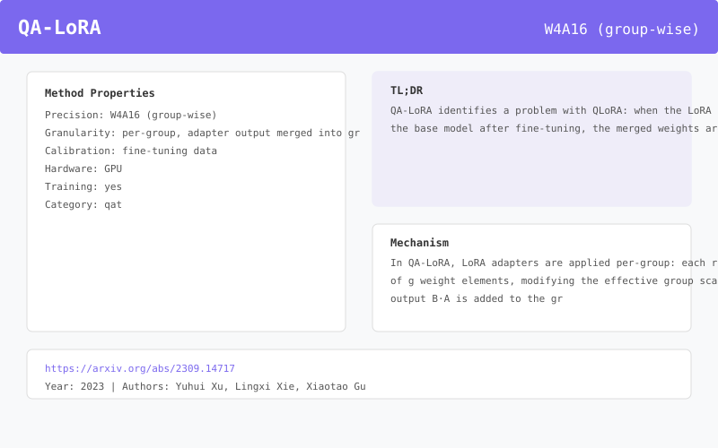

<em>Group-wise LoRA adapters that absorb cleanly into quantization parameters at merge.</em>

```mermaid
flowchart LR
    A[INT4 quantized\nbase model] --> B[Group-wise LoRA:\nrank = group size]
    B --> C[Adapter A, B have\nsame granularity as quant groups]
    C --> D[Fine-tune adapters\nwith QA-aware gradients]
    D --> E[Merge A, B into\nquantized weights]
    E --> F[No extra inference\noverhead after merge]
```

> QA-LoRA identifies a problem with QLoRA: when the LoRA adapters are merged back into the base model after fine-tuning, the merged weights are no longer well-fit by the original quantization grid. QA-LoRA rethinks the adapter design so that the merged (adapter + quantized base) can be re-quantized cleanly: adapters are designed to be absorbed into the group-wise quantization parameters (scale + zero-point) rather than added as a separate floating-point correction. The result is a merged quantized model that is properly quantized after fine-tuning, enabling clean deployment without a separate re-quantization step.

| Field | Value |
|-------|-------|
| Published at | **NeurIPS 2023** |
| Paper | [2309.14717](https://arxiv.org/abs/2309.14717) |
| Precision | W4A16 (group-wise) |
| Granularity | per-group, adapter output merged into group-wise quantization scale |
| Calibration | fine-tuning data |
| Symmetric? | asymmetric |
| Outlier handling | LoRA updates absorbed into group-wise quantization parameters at merge time |
| Hardware target | GPU |
| Training needed? | yes |
| Calibration data? | no |
| Typical degradation | better than QLoRA at low LoRA rank; adapter merges cleanly into quantized model |
| Builds on | [qlora](#qlora) · [gptq](#gptq) |
| Related | [qlora](#qlora) · [loftq](#loftq) · [ir-qlora](#ir-qlora) |

**How it works:**

In QA-LoRA, LoRA adapters are applied per-group: each rank-r adapter acts on a group of g weight elements, modifying the effective group scale and zero-point. The adapter output B·A is added to the group-level dequantization of Q(W_group), and since B·A is low-rank across the group dimension, it can be absorbed into the group-wise quantization parameters after fine-tuning. The number of parameters per adapter is r × (g_in + g_out) per group - small and proportional to the group size rather than the full channel count.

---

### LLM-QAT · W4A8KV4 / W4A8 · QAT / QFT · 2023-05

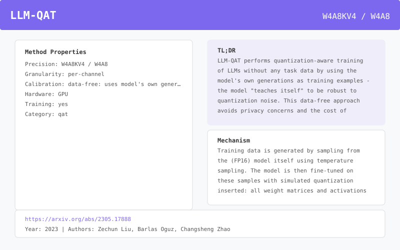

<em>Data-free QAT: model generates its own training data, STE backprops through quantization.</em>

```mermaid
flowchart LR
    A[FP16 pretrained\nLLM] --> B[Insert fake quant\nnodes throughout]
    B --> C[Forward: quantize\nweights + activations]
    C --> D[Loss on labeled data\nor self-supervised]
    D --> E[Backprop through\nSTE for quant nodes]
    E --> F{Converged?}
    F -->|no| C
    F -->|yes| G[Quantized LLM\nbetter than PTQ at same bits]
```

> LLM-QAT performs quantization-aware training of LLMs without any task data by using the model's own generations as training examples - the model "teaches itself" to be robust to quantization noise. This data-free approach avoids privacy concerns and the cost of collecting task-specific data. During QAT, the straight-through estimator (STE) provides gradients through the quantization step, and the training objective is standard next-token prediction on the self-generated text. The method also quantizes the KV cache to 4 bits, which was novel at the time.

| Field | Value |
|-------|-------|
| Published at | arXiv (preprint) |
| Paper | [2305.17888](https://arxiv.org/abs/2305.17888) |
| Precision | W4A8KV4 / W4A8 |
| Granularity | per-channel |
| Calibration | data-free: uses model's own generations as pseudo-training data |
| Symmetric? | symmetric |
| Outlier handling | QAT optimization naturally adapts weights to quantization grid |
| Hardware target | GPU |
| Training needed? | yes |
| Calibration data? | no |
| Typical degradation | W4A8 comparable to PTQ methods; W4A8KV4 enables 4-bit KV with minimal loss |
| Builds on | [rtn](#rtn) |
| Related | [qlora](#qlora) · [bitdistiller](#bitdistiller) · [efficientqat](#efficientqat) |

**How it works:**

Training data is generated by sampling from the (FP16) model itself using temperature sampling. The model is then fine-tuned on these samples with simulated quantization inserted: all weight matrices and activations have fake quantization applied in the forward pass (quantize then dequantize), and the STE carries gradients through. Both weights and activations are jointly quantized to W4A8. A separate QAT phase for the KV cache (quantizing K and V to INT4 during generation) allows W4A8KV4 models. The result is models that are inherently robust to quantization at inference.

---

### QLoRA · W4A16 (NF4 base) + BF16 LoRA adapters · QAT / QFT · 2023-05

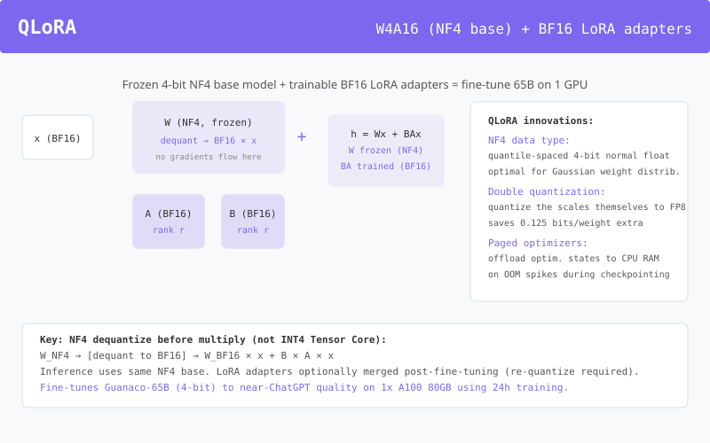

<em>NF4 frozen base + BF16 LoRA adapters: fine-tune 65B on one 48GB GPU.</em>

```mermaid
flowchart LR
    A[FP16 base model] --> B[Quantize to NF4\n4-bit frozen]
    B --> C[Frozen NF4\nbase weights]
    C --> D[LoRA adapters\ndelta W = B times A in BF16]
    D --> E[Forward: dequant NF4 to BF16 + delta W]
    E --> F[Backprop only\nthrough adapters A, B]
    F --> G[65B model\nfits on 48 GB GPU]
```

> QLoRA makes fine-tuning 65B+ parameter models possible on a single 48GB GPU by keeping the base model frozen in 4-bit NF4 quantization and training only lightweight LoRA adapters in BF16. The quantized base model provides a good initialization; the LoRA adapters learn the task-specific residual correction without having to update the quantized weights directly. QLoRA introduces NF4 (the quantile-spaced 4-bit normal float), double quantization (quantizing the quantization scales themselves), and paged optimizers to handle gradient checkpointing on consumer hardware.

| Field | Value |
|-------|-------|
| Published at | **NeurIPS 2023** |
| Paper | [2305.14314](https://arxiv.org/abs/2305.14314) |
| Code | [artidoro/qlora](https://github.com/artidoro/qlora) |
| Precision | W4A16 (NF4 base) + BF16 LoRA adapters |
| Granularity | per-group g=64 (NF4 double-quant) |
| Calibration | none for base quantization; fine-tuning on task data |
| Symmetric? | n/a (NF4) |
| Outlier handling | NF4 quantile grid; LoRA adapters learn residual corrections |
| Hardware target | NVIDIA GPU (bitsandbytes NF4 kernels) |
| Training needed? | yes |
| Calibration data? | no |
| Typical degradation | approaches full-precision LoRA fine-tuning quality on most tasks |
| Builds on | [bitsandbytes-nf4](#bitsandbytes-nf4) |
| Related | [loftq](#loftq) · [qa-lora](#qa-lora) · [ir-qlora](#ir-qlora) · [apiq](#apiq) |

**How it works:**

QLoRA freezes the base model weights in NF4 quantization and adds rank-r LoRA adapter matrices (A ∈ ℝ^{d×r}, B ∈ ℝ^{r×d}) to each linear layer. During a forward pass, the NF4 weights are dequantized to BF16 for the matmul (no INT4×INT4 compute - dequant before multiply), and the LoRA output is added: h = W_NF4×x + B×A×x. Only A and B have gradients; the quantized W_NF4 is frozen. The NF4 quantization error acts as a form of noise that the LoRA adapters learn to compensate for. Paged optimizers handle out-of-memory spikes by offloading optimizer states to CPU RAM during gradient checkpointing.

---

### PEQA · W4A16 (INT4 weight) · QAT / QFT · 2023-04

<em>PEQA: fine-tune only per-column scale multipliers γ on frozen INT4 weights.</em>

```mermaid
flowchart LR
    A[Quantized base model\nINT4 / INT8] --> B[Freeze quantized\nbase weights]
    B --> C[Add task-specific\nFP16 bias vectors]
    C --> D[Fine-tune only\nbias parameters]
    D --> E[Tiny parameter count\n<< full fine-tune]
    E --> F[Task-adapted\nquantized model]
```

> PEQA fine-tunes quantized LLMs by keeping the quantized integer weights frozen and only training per-column scale factors alongside the original dequantization scale. Rather than adding separate adapter matrices (like QLoRA), PEQA modifies the quantization scale itself - a minimal number of parameters that changes the effective floating-point value of the entire quantized column. This is computationally light and avoids the overhead of separate adapter matrices, while still giving the model freedom to shift its weight distribution during fine-tuning.

| Field | Value |
|-------|-------|
| Published at | **NeurIPS 2023** |
| Paper | [2304.02384](https://arxiv.org/abs/2304.02384) |
| Precision | W4A16 (INT4 weight) |
| Granularity | per-column |
| Calibration | fine-tuning data |
| Symmetric? | symmetric |
| Outlier handling | fine-tuning adapts scale parameters alongside quantized weights |
| Hardware target | GPU |
| Training needed? | yes |
| Calibration data? | no |
| Typical degradation | approaches full-precision LoRA fine-tuning quality |
| Builds on | [rtn](#rtn) · [gptq](#gptq) |
| Related | [qlora](#qlora) · [loftq](#loftq) · [qa-lora](#qa-lora) |

**How it works:**

For a quantized column w̃ = s · q_int (where s is the dequantization scale and q_int is the stored integer vector), PEQA introduces a learnable multiplier γ per column: w_eff = γ · s · q_int. During fine-tuning, only γ (one scalar per column) is updated; q_int remains frozen. The number of trainable parameters is one per column of each linear layer - much fewer than LoRA adapters. Despite this minimal parameterization, the scale multiplier can significantly shift the effective weight values column-wide, allowing meaningful task adaptation.

---

---

## Extreme Low-Bit & Binary/Ternary Quantization

Methods targeting 1–2 bits per weight, including binary {-1, +1}, ternary {-1, 0, +1}, and sub-2-bit codebook approaches. At these bit-widths quantization error is substantial and most methods require QAT or architectural changes. The frontier of model compression research.

### TWLA · W1.58A4 · Sub-2-bit · 2026-06

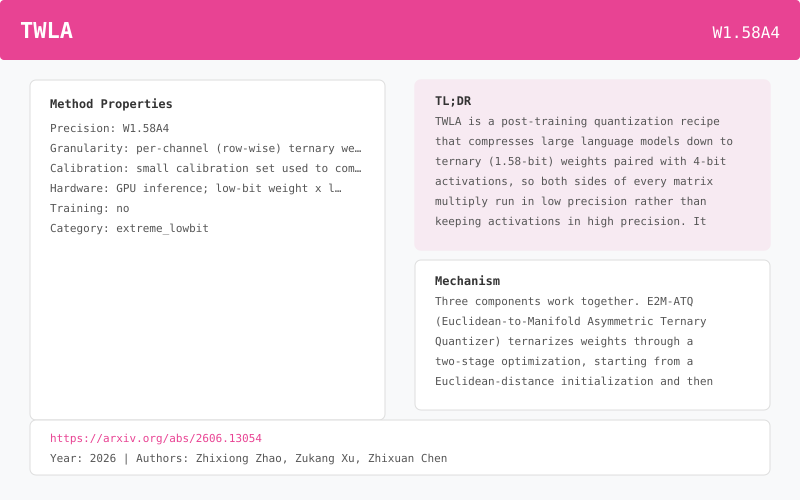

<em>TWLA pipeline: E2M-ATQ ternary weight quantizer, KOTMS Kronecker orthogonal tri-modal reshaping that also suppresses activation outliers, and ILA-AMP inter-layer-aware mixed-precision activation bit allocation, producing a W1.58A4 model.</em>

```mermaid
flowchart LR
    A[Training from scratch\nor PTQ] --> B[W1.58A4\ntarget format]
    B --> C[Binary or ternary\nweight representation]
    C --> D[Scale factors\nto compensate range]
    D --> E[Matmuls become\nadditions or lookups]
    E --> F[Extreme compression\nwith quality tradeoff]
```

> TWLA is a post-training quantization recipe that compresses large language models down to ternary (1.58-bit) weights paired with 4-bit activations, so both sides of every matrix multiply run in low precision rather than keeping activations in high precision. It tackles three obstacles at once: ternarizing weights without exploding layer output error, reshaping weight distributions so ternary values fit them well while also taming activation outliers, and deciding how many activation bits each layer needs. The result is a fully low-bit pipeline that keeps accuracy close to higher-precision baselines while enabling faster end- to-end inference, without any gradient retraining.

| Field | Value |
|-------|-------|
| Published at | **ICML 2026** |
| Paper | [2606.13054](https://arxiv.org/abs/2606.13054) |
| Code | [Kishon-zzx/TWLA](https://github.com/Kishon-zzx/TWLA) |
| Precision | W1.58A4 |
| Granularity | per-channel (row-wise) ternary weights with row-wise threshold/scale; per-token activations with mixed-precision (per-layer) bit allocation |
| Calibration | small calibration set used to compute layer-output reconstruction error and second-order inter-layer interaction costs |
| Symmetric? | asymmetric |
| Outlier handling | Kronecker-structured shared orthogonal rotation (KOTMS) that reshapes weights into tri-modal ternary-friendly distributions while statistically suppressing activation outliers; inter-layer-aware mixed-precision activation allocation (ILA-AMP) |
| Hardware target | GPU inference; low-bit weight x low-bit activation matmul for end-to-end acceleration |
| Training needed? | no |
| Calibration data? | yes |
| Typical degradation | At W1.58A4: LLaMA-2-70B reaches 4.77 WikiText-2 perplexity and 71.10 average zero-shot accuracy; LLaMA-3-8B reaches 12.83 WikiText-2 perplexity and 55.23 average zero-shot accuracy |
| Builds on | [bitnet-b158](#bitnet-b158) · [quarot](#quarot) · [flatquant](#flatquant) |
| Related | [bitnet-b158](#bitnet-b158) · [billm](#billm) · [spectra](#spectra) · [quarot](#quarot) · [spinquant](#spinquant) |

**How it works:**

Three components work together. E2M-ATQ (Euclidean-to-Manifold Asymmetric Ternary Quantizer) ternarizes weights through a two-stage optimization, starting from a Euclidean-distance initialization and then relocating points on a manifold to minimize layer-output reconstruction error with an asymmetric ternary mapping. KOTMS (Kronecker Orthogonal Tri- Modal Shaping) applies a Kronecker-structured orthogonal rotation that pushes weights into a tri-modal distribution well-matched to ternary levels, and because the same rotation also acts on activations it statistically suppresses activation outliers. ILA-AMP (Inter-Layer Aware Activation Mixed Precision) allocates activation bits across layers by modeling adjacent-layer second-order interaction costs, accounting for how the shared rotation changes per-layer quantization gain and preventing error cascades from a few weak layers.

---

### SAGE-PTQ · W1A16 · Sub-2-bit · 2026-06

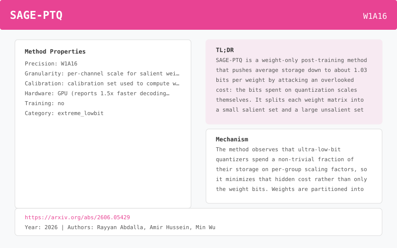

<em>Saliency split (per-channel multi-bit salient + binary unsalient groups) with graph-estimated group counts to minimize scale-storage overhead at ~1.03 bits/weight.</em>

```mermaid
flowchart LR
    A[Training from scratch\nor PTQ] --> B[W1A16\ntarget format]
    B --> C[Binary or ternary\nweight representation]
    C --> D[Scale factors\nto compensate range]
    D --> E[Matmuls become\nadditions or lookups]
    E --> F[Extreme compression\nwith quality tradeoff]
```

> SAGE-PTQ is a weight-only post-training method that pushes average storage down to about 1.03 bits per weight by attacking an overlooked cost: the bits spent on quantization scales themselves. It splits each weight matrix into a small salient set and a large unsalient set using distributional statistics, keeps the salient weights at a few bits of precision (2 to 4), and binarizes everything else. To keep scale overhead near zero it uses just one per- channel scale for the salient weights and a single scalar per unsalient binary group, and it picks how many groups each layer needs by treating subsampled unsalient weights as a sparse graph. An adaptive threshold sets the salient ratio separately for each matrix. The result is a 1-bit-class quantizer that reports much lower perplexity than prior binary PTQ methods while adding almost no metadata.

| Field | Value |
|-------|-------|
| Published at | arXiv (preprint) |
| Paper | [2606.05429](https://arxiv.org/abs/2606.05429) |
| Precision | W1A16 |
| Granularity | per-channel scale for salient weights; one scalar per unsalient binary group; per-layer group count chosen by graph model |
| Calibration | calibration set used to compute weight saliency statistics (post-training, no labels) |
| Symmetric? | mixed |
| Outlier handling | saliency separation: tiny salient fraction (~1%) kept at multi-bit (2-4 bit) precision, remaining weights binarized; adaptive per-matrix saliency thresholding |
| Hardware target | GPU (reports 1.5x faster decoding on NVIDIA L40) |
| Training needed? | no |
| Calibration data? | yes |
| Typical degradation | WikiText2 perplexity: 5.87 on LLaMA-2-7B, 7.51 on LLaMA-2-70B, 6.74 on LLaMA-3-8B (vs 55.8 for BiLLM on LLaMA-3-8B), all at ~1.03 bits/weight |
| Builds on | [billm](#billm) · [pb-llm](#pb-llm) |
| Related | [billm](#billm) · [pb-llm](#pb-llm) · [onebit](#onebit) · [spqr](#spqr) |

**How it works:**

The method observes that ultra-low-bit quantizers spend a non-trivial fraction of their storage on per-group scaling factors, so it minimizes that hidden cost rather than only the weight bits. Weights are partitioned into salient and unsalient sets via distributional statistics, with an adaptive per-matrix saliency threshold choosing the salient ratio (often around 1%). Salient weights get multi-bit precision (4-bit in outlier-heavy early layers, 2-bit later) sharing a single per-channel scale, while unsalient weights are binarized and share one scalar per group. The number of unsalient groups per layer is estimated by modeling subsampled unsalient weights as a sparse graph, balancing reconstruction accuracy against the scale budget so the combined cost lands near 1.03 weight bits plus ~0.004 scaling bits per matrix.

---

### Spectral-LLM · W2A16 · Sub-2-bit · 2026-05

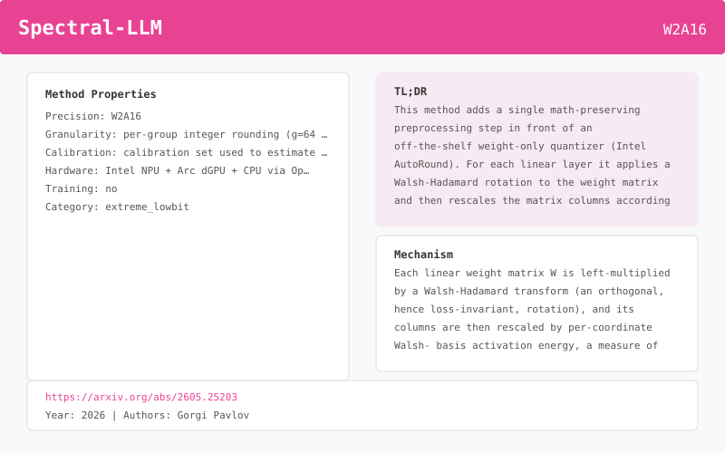

<em>Spectral-LLM: per-layer Walsh-Hadamard rotation plus Walsh-basis influence rescaling biases AutoRound's 2-bit rounding toward high-energy channels before OpenVINO IR export.</em>

```mermaid
flowchart LR
    A[Training from scratch\nor PTQ] --> B[W2A16\ntarget format]
    B --> C[Binary or ternary\nweight representation]
    C --> D[Scale factors\nto compensate range]
    D --> E[Matmuls become\nadditions or lookups]
    E --> F[Extreme compression\nwith quality tradeoff]
```

> This method adds a single math-preserving preprocessing step in front of an off-the-shelf weight-only quantizer (Intel AutoRound). For each linear layer it applies a Walsh-Hadamard rotation to the weight matrix and then rescales the matrix columns according to how much activation energy each coordinate carries in the Walsh basis, an importance signal borrowed from Boolean-function influence analysis. The effect is to push the rounding budget toward the coordinates that matter most, so that when AutoRound quantizes the rotated-and-scaled weights down to 2 bits, the reconstruction error lands on the least important directions. Because the transform is invertible, accuracy is unchanged in full precision, and the quantized weights export to OpenVINO IR and run identically on Intel CPU, NPU, and Arc GPU. On small decoder-only models it cuts WikiText-2 perplexity by roughly 15 to 58 percent relative to plain AutoRound at 2-bit.

| Field | Value |
|-------|-------|
| Published at | arXiv (preprint) |
| Paper | [2605.25203](https://arxiv.org/abs/2605.25203) |
| Code | [gogipav14/spectral-llm](https://github.com/gogipav14/spectral-llm) |
| Precision | W2A16 |
| Granularity | per-group integer rounding (g=64 in repo examples), with per-coordinate column rescaling |
| Calibration | calibration set used to estimate Walsh-basis activation energy and drive AutoRound reconstruction |
| Symmetric? | mixed (AutoRound integer rounding; asymmetric Gamma=diag(gamma)U construction for RoPE-compatible attention routes) |
| Outlier handling | Walsh-Hadamard rotation spreads energy across coordinates, then per-coordinate Walsh-basis activation-energy rescaling biases rounding toward high-spectral-energy (high-influence) channels |
| Hardware target | Intel NPU + Arc dGPU + CPU via OpenVINO IR export |
| Training needed? | no |
| Calibration data? | yes |
| Typical degradation | W2A16 perplexity reductions of 15-58% vs vanilla AutoRound on WikiText-2: Qwen3-0.6B 136.76 -> 88.99, Qwen2.5-1.5B 36.93 -> 21.84 (also evaluated on TinyLlama-1.1B and a 135M model) |
| Builds on | [autoround](#autoround) · [quarot](#quarot) |
| Related | [spinquant](#spinquant) · [quip-sharp](#quip-sharp) · [aqlm](#aqlm) · [omniquant](#omniquant) · [gptq](#gptq) |

**How it works:**

Each linear weight matrix W is left-multiplied by a Walsh-Hadamard transform (an orthogonal, hence loss-invariant, rotation), and its columns are then rescaled by per-coordinate Walsh- basis activation energy, a measure of each spectral coordinate's influence on the output. This biases the subsequent per-group integer rounding toward high-energy / high-influence channels, concentrating quantization error on low-influence directions. The rotated, rescaled weights are handed to Intel AutoRound as the reconstruction-error quantizer, and the inverse rotation/scale is folded back so the operation is mathematically equivalent to the original layer at full precision. Variants include asymmetric constructions and per-pair SO(2) rotations that commute with RoPE for attention layers.

---

### BWLA · W1A6 (also W1A4/W1A8/W1A16 evaluated) · Sub-2-bit · 2026-05

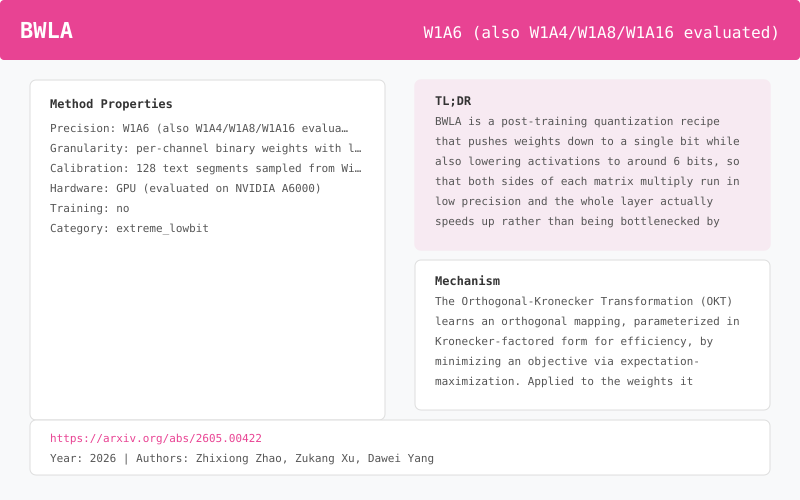

<em>Learned orthogonal-Kronecker transform symmetrizes weights into a bimodal form for clean 1-bit binarization while suppressing activation tails; proximal SVD projection adds low-rank refinement, enabling W1 weights with low-bit activations.</em>

```mermaid
flowchart LR
    A[Training from scratch\nor PTQ] --> B[W1A6 also W1A4/W1A8/W1A16 evaluated\ntarget format]
    B --> C[Binary or ternary\nweight representation]
    C --> D[Scale factors\nto compensate range]
    D --> E[Matmuls become\nadditions or lookups]
    E --> F[Extreme compression\nwith quality tradeoff]
```

> BWLA is a post-training quantization recipe that pushes weights down to a single bit while also lowering activations to around 6 bits, so that both sides of each matrix multiply run in low precision and the whole layer actually speeds up rather than being bottlenecked by full-precision activations. The challenge it targets is that binary-weight methods usually have to keep activations in high precision because of their heavy-tailed distributions; BWLA instead applies a learned orthogonal transform that reshapes the weight distribution into a symmetric two-peak form (which binarizes cleanly) and at the same time flattens the activation tails. A second low-rank correction step recovers extra accuracy at little cost. The result is usable 1-bit-weight, low-bit-activation models without any retraining.

| Field | Value |
|-------|-------|
| Published at | **ACL 2026** |
| Paper | [2605.00422](https://arxiv.org/abs/2605.00422) |
| Precision | W1A6 (also W1A4/W1A8/W1A16 evaluated) |
| Granularity | per-channel binary weights with learned orthogonal-Kronecker transforms; low-bit per-token activations |
| Calibration | 128 text segments sampled from Wikitext2 |
| Symmetric? | symmetric |
| Outlier handling | Orthogonal-Kronecker Transformation (learned via EM) reshapes weights into symmetric bimodal forms and suppresses activation heavy tails / incoherence; Proximal SVD Projection adds low-rank refinement |
| Hardware target | GPU (evaluated on NVIDIA A6000) |
| Training needed? | no |
| Calibration data? | yes |
| Typical degradation | Qwen3-32B at W1A6: Wikitext2 perplexity 11.92 (vs ~38 from prior SOTA); >70% relative gain across five zero-shot tasks; 3.26x inference speedup |
| Builds on | [billm](#billm) · [quarot](#quarot) |
| Related | [billm](#billm) · [onebit](#onebit) · [pb-llm](#pb-llm) · [quarot](#quarot) · [spinquant](#spinquant) |

**How it works:**

The Orthogonal-Kronecker Transformation (OKT) learns an orthogonal mapping, parameterized in Kronecker-factored form for efficiency, by minimizing an objective via expectation- maximization. Applied to the weights it converts their unimodal distribution into a symmetric bimodal shape that is well matched to 1-bit binarization, while the same rotation applied to the activation path suppresses heavy tails and reduces incoherence so activations can be quantized to low bits. The Proximal SVD Projection (PSP) then performs a lightweight low-rank refinement through proximal SVD projection to further improve quantizability with minimal overhead. The whole pipeline is post-training (no gradient fine-tuning) and uses a small Wikitext2 calibration set.

---

### LBLLM · W(1+1)A4 · Sub-2-bit · 2026-04

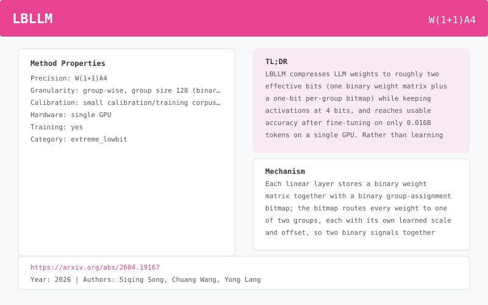

<em>LBLLM three-stage pipeline: PTQ initialization, layer-wise distillation of binary weights and group-wise bitmaps with full-precision activations, then learned 4-bit activation quantizers, producing a W(1+1)A4 model.</em>

```mermaid
flowchart LR
    A[Training from scratch\nor PTQ] --> B[W1+1A4\ntarget format]
    B --> C[Binary or ternary\nweight representation]
    C --> D[Scale factors\nto compensate range]
    D --> E[Matmuls become\nadditions or lookups]
    E --> F[Extreme compression\nwith quality tradeoff]
```

> LBLLM compresses LLM weights to roughly two effective bits (one binary weight matrix plus a one-bit per-group bitmap) while keeping activations at 4 bits, and reaches usable accuracy after fine-tuning on only 0.016B tokens on a single GPU. Rather than learning weights and activations at the same time, it runs three separate phases: a post-training quantization warm start, then layer-wise distillation that fits the binary weights and per-group parameters with activations left in full precision, and finally a short phase that learns the activation quantizers. Splitting the work this way keeps training stable and avoids the two quantization steps fighting each other. The result improves on prior binarization methods in the comparable two-bit-weight, four-bit-activation regime across language modeling, commonsense QA, and language understanding.

| Field | Value |
|-------|-------|
| Published at | arXiv (preprint) |
| Paper | [2604.19167](https://arxiv.org/abs/2604.19167) |
| Code | [JimmyCrave/LBLLM](https://github.com/JimmyCrave/LBLLM) |
| Precision | W(1+1)A4 |
| Granularity | group-wise, group size 128 (binary weight matrix plus a binary group-assignment bitmap selecting between two scale/offset pairs) |
| Calibration | small calibration/training corpus of 0.016B tokens used for layer-wise distillation |
| Symmetric? | asymmetric |
| Outlier handling | learnable activation clipping factors and learnable knee points that split activation ranges into three regions with separate quantization parameters |
| Hardware target | single GPU |
| Training needed? | yes |
| Calibration data? | yes |
| Typical degradation | 9.18 WikiText-2 perplexity on LLaMA-2-7B at W(1+1)A4, versus 32.48 (BiLLM), 19.14 (ARB-LLM) and 10.19 (OneBit) baselines |
| Builds on | [billm](#billm) · [onebit](#onebit) · [pb-llm](#pb-llm) |
| Related | [billm](#billm) · [onebit](#onebit) · [pb-llm](#pb-llm) · [bitdistiller](#bitdistiller) · [omniquant](#omniquant) |

**How it works:**

Each linear layer stores a binary weight matrix together with a binary group-assignment bitmap; the bitmap routes every weight to one of two groups, each with its own learned scale and offset, so two binary signals together encode four states (about two bits) at group size 128. Training proceeds in three decoupled stages: (1) a PTQ initialization for a good starting point, (2) layer-wise knowledge distillation that learns the binary weights, group bitmaps, and quantization parameters while activations stay full-precision, and (3) learning dynamic 4-bit activation quantizers using learnable clipping factors and learnable knee points that partition the activation range into three regions. Decoupling weight and activation quantization reduces interference and yields more stable optimization than joint training.

---

### Tequila · W1.58 A16 (ternary {-1, 0, +1} PTQ) · Sub-2-bit · 2025-09

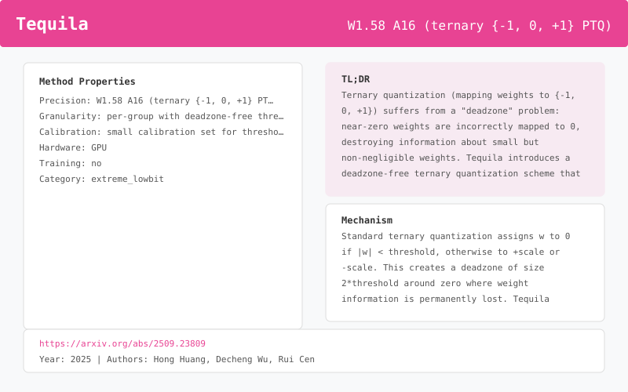

<em>Tequila: deadzone-free threshold optimization for ternary {-1,0,+1} PTQ of pretrained LLMs.</em>

```mermaid
flowchart LR
    A[Training from scratch\nor PTQ] --> B[W1.58 A16 ternary -1, 0, +1 PTQ\ntarget format]
    B --> C[Binary or ternary\nweight representation]
    C --> D[Scale factors\nto compensate range]
    D --> E[Matmuls become\nadditions or lookups]
    E --> F[Extreme compression\nwith quality tradeoff]
```

> Ternary quantization (mapping weights to {-1, 0, +1}) suffers from a "deadzone" problem: near-zero weights are incorrectly mapped to 0, destroying information about small but non-negligible weights. Tequila introduces a deadzone-free ternary quantization scheme that carefully calibrates the thresholds for zero-assignment to minimize reconstruction error. Unlike BitNet b1.58 which requires training from scratch, Tequila is a post-training method that brings ternary quantization quality to pretrained FP16 models.

| Field | Value |
|-------|-------|
| Published at | **ICLR 2026** |
| Paper | [2509.23809](https://arxiv.org/abs/2509.23809) |
| Precision | W1.58 A16 (ternary {-1, 0, +1} PTQ) |
| Granularity | per-group with deadzone-free threshold |
| Calibration | small calibration set for threshold optimization |
| Symmetric? | symmetric |
| Outlier handling | deadzone-free thresholding prevents over-assignment to zero |
| Hardware target | GPU |
| Training needed? | no |
| Calibration data? | yes |
| Typical degradation | state-of-art ternary PTQ; better than round-to-nearest ternary |
| Builds on | [bitnet-b158](#bitnet-b158) · [hqq](#hqq) · [gptq](#gptq) |
| Related | [bitnet-b158](#bitnet-b158) · [bitnet-2b4t](#bitnet-2b4t) · [pb-llm](#pb-llm) · [hqq](#hqq) |

**How it works:**

Standard ternary quantization assigns w to 0 if |w| < threshold, otherwise to +scale or -scale. This creates a deadzone of size 2*threshold around zero where weight information is permanently lost. Tequila optimizes the threshold per group to minimize the L2 reconstruction error subject to a target zero-fraction constraint. The deadzone-free formulation ensures small weights contribute to the scale estimation even when rounded to zero, improving the scale value and reducing reconstruction error compared to standard ternary PTQ.

---

### LittleBit · sub-1-bit (effective ~0.1 bits per weight) · Sub-2-bit · 2025-09

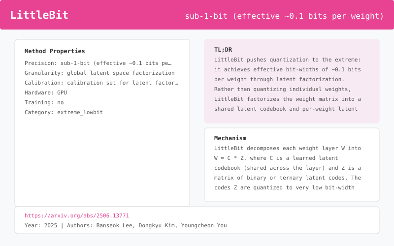

<em>LittleBit: weight matrix factorized into FP16 codebook C + ultra-low-bit latent codes Z.</em>

```mermaid
flowchart LR
    A[Training from scratch\nor PTQ] --> B[sub-1-bit effective approx 0.1 bits per weight\ntarget format]
    B --> C[Binary or ternary\nweight representation]
    C --> D[Scale factors\nto compensate range]
    D --> E[Matmuls become\nadditions or lookups]
    E --> F[Extreme compression\nwith quality tradeoff]
```

> LittleBit pushes quantization to the extreme: it achieves effective bit-widths of ~0.1 bits per weight through latent factorization. Rather than quantizing individual weights, LittleBit factorizes the weight matrix into a shared latent codebook and per-weight latent codes. The latent codes are quantized to extremely few bits (or even single bits), while the shared codebook captures the bulk of the information. This is related to tensor factorization and vector quantization but targets extreme sub-1-bit regimes that are beyond previous methods.

| Field | Value |
|-------|-------|
| Published at | **NeurIPS 2025** |
| Paper | [2506.13771](https://arxiv.org/abs/2506.13771) |
| Precision | sub-1-bit (effective ~0.1 bits per weight) |
| Granularity | global latent space factorization |
| Calibration | calibration set for latent factor optimization |
| Symmetric? | symmetric |
| Outlier handling | latent factorization absorbs distribution into low-dimensional space |
| Hardware target | GPU |
| Training needed? | no |
| Calibration data? | yes |
| Typical degradation | significant at sub-1-bit; best known result at this compression ratio |
| Builds on | [aqlm](#aqlm) · [quip-sharp](#quip-sharp) · [qtip](#qtip) |
| Related | [aqlm](#aqlm) · [qtip](#qtip) · [quip-sharp](#quip-sharp) · [bitnet](#bitnet) |

**How it works:**

LittleBit decomposes each weight layer W into W = C * Z, where C is a learned latent codebook (shared across the layer) and Z is a matrix of binary or ternary latent codes. The codes Z are quantized to very low bit-width (1-2 bits), while C is kept in higher precision (FP16) but is small enough that the total storage is sub-1-bit average. The decomposition is optimized via alternating minimization on calibration data. The extreme compression sacrifices some accuracy but enables deployment scenarios where memory is the absolute bottleneck.

---

### BitNet b1.58 2B4T · W1.58A8 · Sub-2-bit · 2025-04

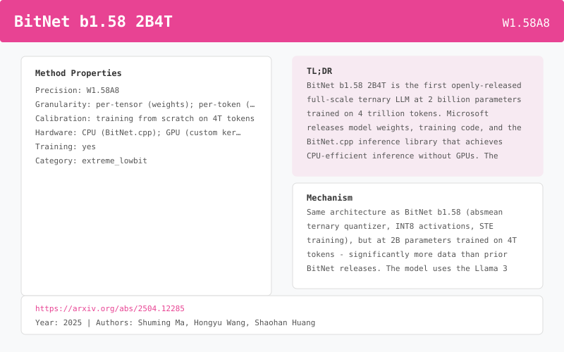

<em>BitNet b1.58 2B4T: first open ternary LLM at 2B params; BitNet.cpp CPU inference runtime.</em>

```mermaid
flowchart LR
    A[2B param architecture\nBitNet b1.58 design] --> B[Train on 4T tokens\nfrom scratch]
    B --> C[Ternary weights -1/0/+1\nthroughout training]
    C --> D[INT8 activations\nAbsMax quantization]
    D --> E[First open-source\n1-bit 2B model]
    E --> F[Competitive with\nFP16 Llama-3.2-1B/3B]
```

> BitNet b1.58 2B4T is the first openly-released full-scale ternary LLM at 2 billion parameters trained on 4 trillion tokens. Microsoft releases model weights, training code, and the BitNet.cpp inference library that achieves CPU-efficient inference without GPUs. The model demonstrates that ternary (W1.58) LLMs can be trained at full scale and achieve quality competitive with similarly-sized FP16 models, while consuming a fraction of the memory and enabling energy-efficient inference on commodity hardware.

| Field | Value |
|-------|-------|
| Published at | arXiv (preprint) |
| Paper | [2504.12285](https://arxiv.org/abs/2504.12285) |
| Code | [microsoft/BitNet](https://github.com/microsoft/BitNet) |
| Precision | W1.58A8 |
| Granularity | per-tensor (weights); per-token (activations) |
| Calibration | training from scratch on 4T tokens |
| Symmetric? | symmetric |
| Outlier handling | ternary weights from training; absmean quantizer |
| Hardware target | CPU (BitNet.cpp); GPU (custom kernels) |
| Training needed? | yes |
| Calibration data? | no |
| Typical degradation | approaches comparable FP16 7B model quality at 2B parameters (reported) |
| Builds on | [bitnet-b158](#bitnet-b158) |
| Related | [bitnet-b158](#bitnet-b158) · [spectra](#spectra) · [matmul-free](#matmul-free) |

**How it works:**

Same architecture as BitNet b1.58 (absmean ternary quantizer, INT8 activations, STE training), but at 2B parameters trained on 4T tokens - significantly more data than prior BitNet releases. The model uses the Llama 3 architecture with BitLinear replacing standard Linear layers. The open release includes a dedicated BitNet.cpp runtime that exploits ternary arithmetic (no multiplications) for CPU inference, achieving 2-5× throughput improvement over FP16 llama.cpp inference on consumer CPUs.

---

### Spectra · W1.58A8 (ternary), W4A16, FP16 · Sub-2-bit · 2024-07

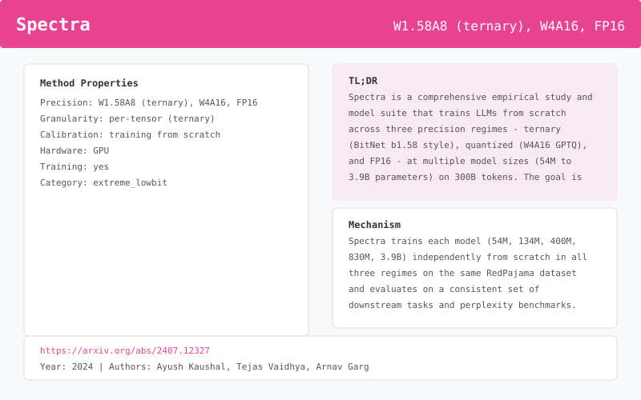

<em>Spectra: systematic study training ternary, quantized, and FP16 LLMs at matched scales.</em>

```mermaid
flowchart LR
    A[Train LLM from scratch\non internet-scale data] --> B[INT4 / INT8 / FP16\nweight formats]
    B --> C[No quantization error:\nweights never float]
    C --> D[Release family:\nSpectra-99M to 3.9B]
    D --> E[Benchmark across\nbit-widths and tasks]
    E --> F[Integer-trained models\noutperform PTQ at same bits]
```

> Spectra is a comprehensive empirical study and model suite that trains LLMs from scratch across three precision regimes - ternary (BitNet b1.58 style), quantized (W4A16 GPTQ), and FP16 - at multiple model sizes (54M to 3.9B parameters) on 300B tokens. The goal is to rigorously compare the quality-vs-efficiency tradeoffs across precisions at scale, providing training recipes and released checkpoints for each configuration. The study confirms that ternary models can approach FP16 quality at 3B+ parameters given sufficient training.

| Field | Value |
|-------|-------|
| Published at | arXiv (preprint) |
| Paper | [2407.12327](https://arxiv.org/abs/2407.12327) |
| Precision | W1.58A8 (ternary), W4A16, FP16 |
| Granularity | per-tensor (ternary) |
| Calibration | training from scratch |
| Symmetric? | symmetric |
| Outlier handling | training from scratch with ternary constraint |
| Hardware target | GPU |
| Training needed? | yes |
| Calibration data? | no |
| Typical degradation | ternary Spectra (54M–3.9B) studied systematically vs quantized and FP16 baselines |
| Builds on | [bitnet-b158](#bitnet-b158) |
| Related | [bitnet-b158](#bitnet-b158) · [matmul-free](#matmul-free) · [bitnet](#bitnet) |

**How it works:**

Spectra trains each model (54M, 134M, 400M, 830M, 3.9B) independently from scratch in all three regimes on the same RedPajama dataset and evaluates on a consistent set of downstream tasks and perplexity benchmarks. The ternary variant uses the BitNet b1.58 absmean quantizer with STE. The key findings: (1) ternary models need ~2× more parameters than FP16 to match perplexity; (2) quantized-from-scratch (W4A16) outperforms PTQ of FP16 models at small scale; (3) ternary models have significantly better memory and inference efficiency at equivalent quality.

---

### MatMul-free LM · W1.58A8 (ternary weights, similar to BitNet b1.58) · Sub-2-bit · 2024-06

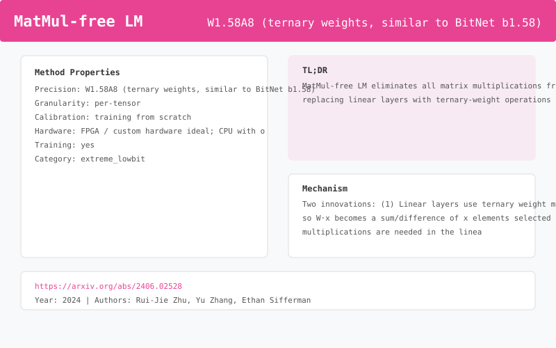

<em>Ternary linear layers + gated linear recurrence: no matrix multiplications in the entire model.</em>

```mermaid
flowchart LR
    A[Transformer block] --> B[Replace all linear\nlayers]
    B --> C[Ternary weights\n-1, 0, +1]
    C --> D[Binary activations\nHardtanh clipped]
    D --> E[Attention alternative:\nTokenMixer replaces\nQK^T matmul]
    E --> F[Pure additions\nno multiplications]
    F --> G[1-bit W, 1-bit A\ntrue integer inference]
```

> MatMul-free LM eliminates all matrix multiplications from the transformer by replacing linear layers with ternary-weight operations (implementable as add/subtract) and replacing the standard attention mechanism with a linear-time RNN-like token mixing (based on RWKV/GRU dynamics). The result is a language model where the dominant compute operation - matrix multiplication - is replaced by additions, enabling much lower power consumption on hardware that does not support efficient float matrix multiply.

| Field | Value |
|-------|-------|
| Published at | arXiv (preprint) |
| Paper | [2406.02528](https://arxiv.org/abs/2406.02528) |
| Code | [ridgerchu/matmulfreellm](https://github.com/ridgerchu/matmulfreellm) |
| Precision | W1.58A8 (ternary weights, similar to BitNet b1.58) |
| Granularity | per-tensor |
| Calibration | training from scratch |
| Symmetric? | symmetric |
| Outlier handling | ternary weights avoid extreme weight values; trained from scratch |
| Hardware target | FPGA / custom hardware ideal; CPU with optimized kernels |
| Training needed? | yes |
| Calibration data? | no |
| Typical degradation | approaches comparable-size FP32 models up to 2.7B parameters |
| Builds on | [bitnet-b158](#bitnet-b158) |
| Related | [bitnet-b158](#bitnet-b158) · [bitnet](#bitnet) · [onebit](#onebit) |

**How it works:**

Two innovations: (1) Linear layers use ternary weight matrices (BitNet b1.58 style), so W·x becomes a sum/difference of x elements selected by W ∈ {-1,0,+1}. No multiplications are needed in the linear layers. (2) The attention mechanism is replaced by a token mixing layer based on a gated linear recurrence (MLGRU), which can also be computed without matrix multiplication. The combination produces a model that runs without any floating-point multiplications in its core computation, making it suitable for highly energy-efficient hardware implementations.

---

### BitNet b1.58 · W1.58A8 · Sub-2-bit · 2024-02

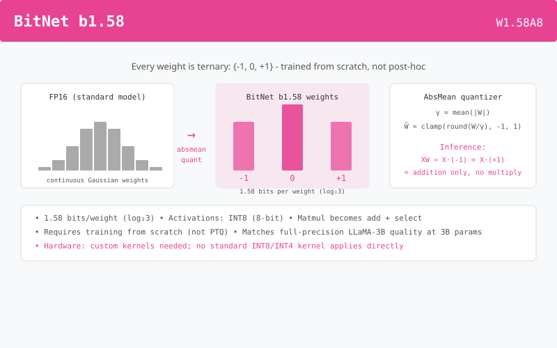

<em>Ternary {-1,0,+1} weights via absmean quantizer; matmul becomes add-only (no multiplications).</em>

```mermaid
flowchart LR
    A[Training from scratch] --> B[Ternary weights\n-1, 0, +1]
    B --> C[Straight-through\nestimator STE]
    C --> D[AbsMean\nact quantization INT8]
    D --> E[MatMuls become\nadditions only]
    E --> F[1.58-bit model\nmatches FP16 at 3B+]
```

> BitNet b1.58 (named after log₂(3) ≈ 1.58 bits) represents LLM weights as ternary values {-1, 0, +1}, one step above binary. The addition of zero is significant: it allows the model to implement magnitude selection (zeroing out some directions) which binary weights cannot do. Training uses a simple absmean quantizer (scale by mean absolute value, round to nearest of {-1, 0, +1}) with STE. The reported result is that BitNet b1.58 at 3.9B parameters matches full-precision LLaMA-3B on perplexity and most benchmarks, while using a fraction of the memory and enabling inference with add-only arithmetic (no multiplications).

| Field | Value |
|-------|-------|
| Published at | arXiv (preprint) |
| Paper | [2402.17764](https://arxiv.org/abs/2402.17764) |
| Code | [microsoft/BitNet](https://github.com/microsoft/BitNet) |
| Precision | W1.58A8 |
| Granularity | per-tensor (weights); per-token (activations) |
| Calibration | training from scratch |
| Symmetric? | symmetric |
| Outlier handling | ternary representation absorbs zero (dead weights); absmean quantizer |
| Hardware target | custom kernels; llama.cpp BitNet.cpp branch for CPU |
| Training needed? | yes |
| Calibration data? | no |
| Typical degradation | matches FP16 LLaMA-3B/7B quality at same parameter count (reported) |
| Builds on | [bitnet](#bitnet) |
| Related | [bitnet](#bitnet) · [onebit](#onebit) · [billm](#billm) · [matmul-free](#matmul-free) |

**How it works:**

Each weight matrix W is quantized per-tensor as: γ = mean(|W|), W̃ = clip(round(W/γ), -1, 1). This yields ternary values {-1, 0, +1}. Activations use per-token INT8 quantization. The matmul W̃ x with ternary W can be computed without any multiplications: result = sum(x_i where W̃_i=+1) - sum(x_i where W̃_i=-1). On hardware with popcount instructions or dedicated binary/ternary compute, this is much more energy-efficient than float32 or INT8 matmul. The zero weight values effectively prune neurons without explicit pruning, allowing the model to learn a sparse-like internal structure.

---

### OneBit · W1A16 (sign + magnitude decomposition) · Sub-2-bit · 2024-02

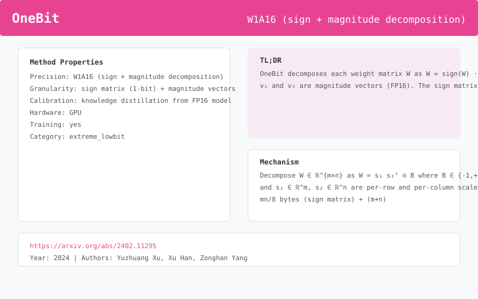

<em>Sign-value decomposition: W = sign(W) × row_scale × col_scale; sign stored at 1-bit.</em>

```mermaid
flowchart LR
    A[Weight W] --> B[Sign-value decomp:\nW = V times sign S]
    B --> C[V: value vectors\nper output channel]
    C --> D[S: binary sign\nmatrix INT1]
    D --> E[Forward: W_hat = V times S]
    E --> F[STE training\nfrom scratch or QAT]
    F --> G[1-bit with value\nvectors = better than plain binary]
```

> OneBit decomposes each weight matrix W as W ≈ sign(W) · diag(v₁) · diag(v₂)^T where v₁ and v₂ are magnitude vectors (FP16). The sign matrix is stored at 1 bit; the two magnitude vectors are stored at full precision. This is a sign-value decomposition analogous to SVD-1 (rank-1 SVD) but in the sign domain. The magnitude vectors capture the scale information that binary weights cannot represent. Combined with knowledge distillation from the FP16 teacher, OneBit achieves quality close to W4 quantization at an effective bit-width of ~1.5 bits.

| Field | Value |
|-------|-------|
| Published at | **NeurIPS 2024** |
| Paper | [2402.11295](https://arxiv.org/abs/2402.11295) |
| Precision | W1A16 (sign + magnitude decomposition) |
| Granularity | sign matrix (1-bit) + magnitude vectors (FP16) |
| Calibration | knowledge distillation from FP16 model |
| Symmetric? | symmetric |
| Outlier handling | magnitude vectors capture scale information; distillation recovers quality |
| Hardware target | GPU |
| Training needed? | yes |
| Calibration data? | no |
| Typical degradation | approaches W4 PTQ quality at 1.5 effective bits with distillation |
| Builds on | [bitnet](#bitnet) |
| Related | [bitnet-b158](#bitnet-b158) · [billm](#billm) · [pb-llm](#pb-llm) |

**How it works:**

Decompose W ∈ ℝ^{m×n} as W ≈ s₁ s₂ᵀ ⊙ B where B ∈ {-1,+1}^{m×n} is the sign matrix and s₁ ∈ ℝ^m, s₂ ∈ ℝ^n are per-row and per-column scale vectors. The storage cost is mn/8 bytes (sign matrix) + (m+n) × 2 bytes (scale vectors). For a 4096×4096 layer: 2MB for signs + 32KB for scales ≈ 2.03MB total vs. 32MB for FP16 - about 15.7× compression. Training uses the standard knowledge distillation loss (KL divergence) from the FP16 teacher to recover quality lost to the coarse 1-bit representation.

---

### BiLLM · W1 A16 (post-training) · Sub-2-bit · 2024-02

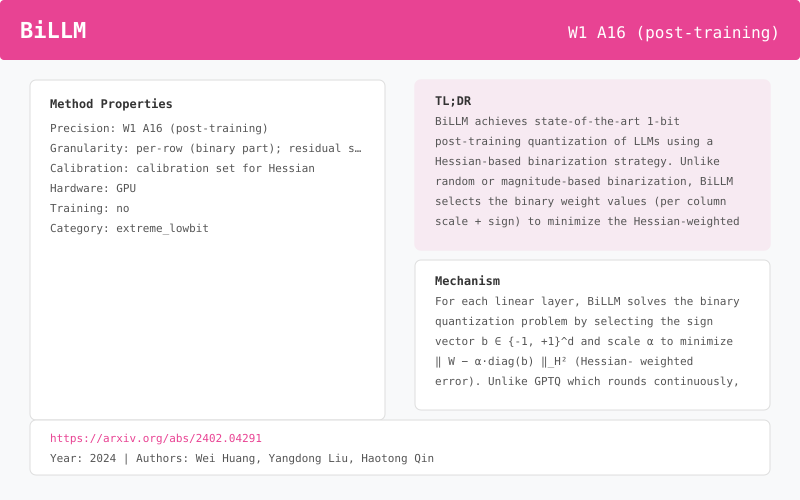

<em>Hessian-weighted greedy 1-bit binarization + sparse FP16 residual for highest-error weights.</em>

```mermaid
flowchart LR
    A[LLM weights] --> B[Bell-shaped analysis:\nidentify salient values]
    B --> C[Salient set:\nresidual approximation]
    C --> D[Non-salient set:\nbinary +1/-1]
    D --> E[Optimal rescaling\nfor binary group]
    C --> F[Store residuals\nin sparse format]
    D --> F
    F --> G[Post-training\n1-bit with residuals]
```

> BiLLM achieves state-of-the-art 1-bit post-training quantization of LLMs using a Hessian-based binarization strategy. Unlike random or magnitude-based binarization, BiLLM selects the binary weight values (per column scale + sign) to minimize the Hessian-weighted reconstruction error, analogous to GPTQ but for binary. A residual mechanism stores the highest-error weights as sparse FP16 corrections. The combination makes the best-known 1-bit PTQ results without any training, demonstrating that binary LLMs are achievable purely from post-training optimization.

| Field | Value |
|-------|-------|
| Published at | **ICML 2024** |
| Paper | [2402.04291](https://arxiv.org/abs/2402.04291) |
| Code | [Aaronhuang-778/BiLLM](https://github.com/Aaronhuang-778/BiLLM) |
| Precision | W1 A16 (post-training) |
| Granularity | per-row (binary part); residual stored as sparse FP16 |
| Calibration | calibration set for Hessian |
| Symmetric? | symmetric |
| Outlier handling | structured Hessian-based binarization; sparse residual for salient weights |
| Hardware target | GPU |
| Training needed? | no |
| Calibration data? | yes |
| Typical degradation | best post-training 1-bit results to date; ~2–3 ppl gap vs W4 GPTQ on LLaMA |
| Builds on | [gptq](#gptq) · [pb-llm](#pb-llm) |
| Related | [pb-llm](#pb-llm) · [bitnet](#bitnet) · [onebit](#onebit) |

**How it works:**

For each linear layer, BiLLM solves the binary quantization problem by selecting the sign vector b ∈ {-1, +1}^d and scale α to minimize ‖ W − α·diag(b) ‖_H² (Hessian- weighted error). Unlike GPTQ which rounds continuously, the binary decision is made by a greedy column-by-column selection that iteratively updates each sign bit to minimize the Hessian-weighted residual. Additionally, a sparse residual (top-k% of highest-error weights stored as FP16) is maintained on top of the binary base, similar to SpQR's sparse overlay but for the binary setting.

---

### BitNet · W1A8 · Sub-2-bit · 2023-10

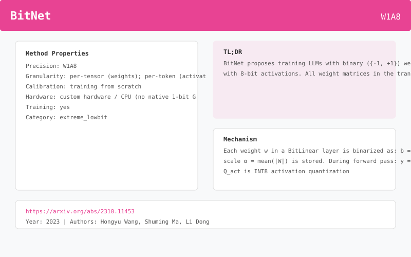

<em>BitLinear: binary {-1,+1} weights + INT8 activations, trained from scratch with STE.</em>

```mermaid
flowchart LR
    A[FP16 training] --> B[Binary weights\n+1 or -1 via sign]
    B --> C[Straight-through\nestimator STE]
    C --> D[Scale factor\nalpha = mean of abs W]
    D --> E[W_tilde = alpha times sign W]
    E --> F[MatMuls replaced\nby additions + scaling]
    F --> G[1-bit LLM\ntraining from scratch]
```

> BitNet proposes training LLMs with binary ({-1, +1}) weight matrices from scratch, with 8-bit activations. All weight matrices in the transformer (attention projections, FFN weights) are replaced with "BitLinear" layers that store weights as binary and apply a per-tensor scale at dequantization. Training uses the STE to propagate gradients through the binary step. BitNet is the first to show that billion-scale LLMs can be trained with 1-bit weights without catastrophic collapse - the key is training from scratch rather than post-hoc binarization.

| Field | Value |
|-------|-------|
| Published at | arXiv (preprint) |
| Paper | [2310.11453](https://arxiv.org/abs/2310.11453) |
| Code | [microsoft/BitNet](https://github.com/microsoft/BitNet) |
| Precision | W1A8 |
| Granularity | per-tensor (weights); per-token (activations) |
| Calibration | training from scratch |
| Symmetric? | symmetric |
| Outlier handling | training from scratch; absmax weight normalization before binarization |
| Hardware target | custom hardware / CPU (no native 1-bit GPU support) |
| Training needed? | yes |
| Calibration data? | no |
| Typical degradation | lags FP16 at same parameter count; scales to close the gap; requires more params |
| Superseded by | [bitnet-b158](#bitnet-b158) |
| Related | [bitnet-b158](#bitnet-b158) · [onebit](#onebit) · [billm](#billm) |

**How it works:**

Each weight w in a BitLinear layer is binarized as: b = sign(w), and a per-tensor scale α = mean(|W|) is stored. During forward pass: y = Q_act(x) · (b · α) where Q_act is INT8 activation quantization. Gradients backprop through b via STE: ∂L/∂w ≈ ∂L/∂b (treating sign as identity). The absmax normalization before binarization (w̃ = w / max(|w|)) ensures the binary weights are ±1 symmetrically. LayerNorm before each BitLinear layer is critical to make activation distributions more Gaussian and INT8-quantizable. Training with this setup scales to 30B parameters.

---

### PB-LLM · W1/W16 A16 (binary weights + FP16 for salient subset) · Sub-2-bit · 2023-09

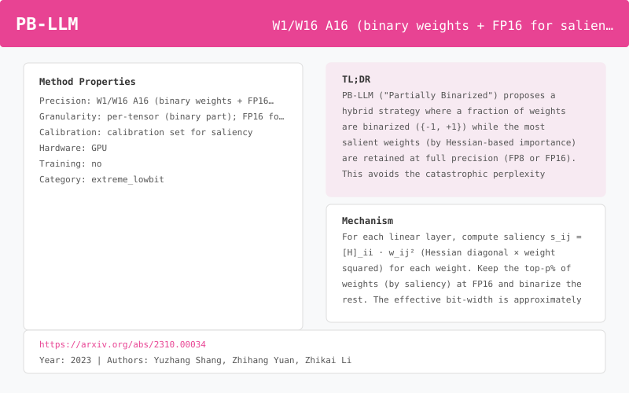

<em>Hessian-guided partial binarization: salient weights at FP16, rest binary.</em>

```mermaid
flowchart LR
    A[FP16 LLM weights] --> B[Compute per-weight\nHessian sensitivity]
    B --> C{Salient weight?}
    C -->|yes top-p%| D[Keep in FP16\nor INT8]
    C -->|no| E[Binarize to +1/-1]
    E --> F[Scale factor\nper group]
    D --> G[Mixed: FP16 salient\n+ binary rest]
    F --> G
```

> PB-LLM ("Partially Binarized") proposes a hybrid strategy where a fraction of weights are binarized ({-1, +1}) while the most salient weights (by Hessian-based importance) are retained at full precision (FP8 or FP16). This avoids the catastrophic perplexity collapse of full binarization while still achieving very low average bit-width. The saliency metric is the Hessian diagonal, and the method is applied post-training without QAT - making it a PTQ approach despite being in the extreme low-bit category.

| Field | Value |
|-------|-------|
| Published at | **ICLR 2024** |
| Paper | [2310.00034](https://arxiv.org/abs/2310.00034) |
| Precision | W1/W16 A16 (binary weights + FP16 for salient subset) |
| Granularity | per-tensor (binary part); FP16 for salient |
| Calibration | calibration set for saliency |
| Symmetric? | symmetric |
| Outlier handling | salient weights identified by Hessian and kept at FP8/FP16; rest binarized |
| Hardware target | GPU |
| Training needed? | no |
| Calibration data? | yes |
| Typical degradation | significantly better than full binarization; approaches W3 PTQ quality at ~1.5 effective bits |
| Builds on | [rtn](#rtn) · [gptq](#gptq) |
| Related | [spqr](#spqr) · [bitnet](#bitnet) · [billm](#billm) |

**How it works:**

For each linear layer, compute saliency s_ij = [H]_ii · w_ij² (Hessian diagonal × weight squared) for each weight. Keep the top-p% of weights (by saliency) at FP16 and binarize the rest. The effective bit-width is approximately 1 + p × 15 bits (the binary part is ~1 bit, the FP16 part is 16 bits weighted by fraction p). At p=0.5%, effective bits ≈ 1.08; at p=10%, ≈ 2.5. A key finding is that the salient weights form a sparse pattern with no structure (unlike pruning where rows or columns can be dropped), so sparse matrix operations are needed.

---

---

## KV-Cache Quantization

The attention KV cache grows linearly with context length and becomes the dominant memory consumer at long contexts. Quantizing K and V tensors to 4 or fewer bits reduces memory pressure, increases effective batch size, and enables longer contexts - at the cost of a small attention quality penalty.

### KVarN · W16A16KV2 · KV Quant · 2026-06

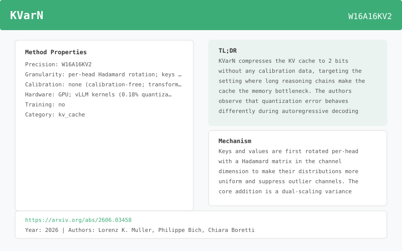

<em>KVarN: per-head Hadamard rotation then dual-axis variance normalization before 2-bit KV quantization.</em>

```mermaid
flowchart LR
    A[K and V tensors\nfrom attention] --> B[Compression strategy:\nper-head Hadamard rotation in ]
    B --> C[Quantize or prune\nKV to W16A16KV2]
    C --> D[Store compressed\nKV cache]
    D --> E[Decompress during\nattention computation]
    E --> F[Lower memory\nlonger context]
```

> KVarN compresses the KV cache to 2 bits without any calibration data, targeting the setting where long reasoning chains make the cache the memory bottleneck. The authors observe that quantization error behaves differently during autoregressive decoding than in prefill-only evaluations: errors compound across decoding steps, mostly because individual tokens get the wrong scale. To fix this they first apply a per-head Hadamard rotation to spread out channel outliers, then iteratively normalize variance along both the token and channel axes before round-to-nearest quantization. All transforms run online at inference, so no per-model calibration pass is needed, and the method ships as vLLM kernels with low runtime overhead.

| Field | Value |
|-------|-------|
| Published at | arXiv (preprint) |
| Paper | [2606.03458](https://arxiv.org/abs/2606.03458) |
| Code | [huawei-csl/KVarN](https://github.com/huawei-csl/KVarN) |
| Precision | W16A16KV2 |
| Granularity | per-head Hadamard rotation; keys quantized per-channel, values per-token; group size 128; ~2.3 bits/element average with FP16 sink (128) and trailing (128) tokens |
| Calibration | none (calibration-free; transforms applied online at inference) |
| Symmetric? | asymmetric |
| Outlier handling | per-head Hadamard rotation in the channel dimension plus iterative dual-axis variance normalization (Sinkhorn-style) to correct outlying token scales |
| Hardware target | GPU; vLLM kernels (0.18% quantization overhead, <=1.4% dequantization overhead) |
| Training needed? | no |
| Calibration data? | no |
| Typical degradation | Qwen3-4B at 2-bit KV: AIME24 60.0% vs 61.1% FP16, MATH500 79.2% vs 82.6%, HumanEval 88.4% vs 88.8% |
| Builds on | [rotatekv](#rotatekv) · [kivi](#kivi) · [quarot](#quarot) |
| Related | [kivi](#kivi) · [kvquant](#kvquant) · [rotatekv](#rotatekv) · [skvq](#skvq) · [pmkvq](#pmkvq) |

**How it works:**

Keys and values are first rotated per-head with a Hadamard matrix in the channel dimension to make their distributions more uniform and suppress outlier channels. The core addition is a dual-scaling variance normalization: scales are computed and balanced across both the token axis and the channel axis using an iterative Sinkhorn-style procedure, which corrects the per-token scale errors the authors identify as the main driver of error accumulation during decoding. After normalization, K and V are quantized with asymmetric round-to-nearest (keys per-channel, values per-token, group size 128), keeping the first 128 sink tokens and last 128 tokens in FP16. The whole pipeline is calibration-free and runs online.

---

### HQMQ · W16A16KV4 (~3.79-5 effective bits per KV element) · KV Quant · 2026-05

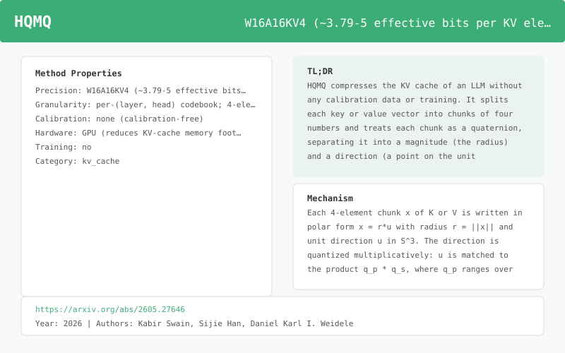

<em>Each 4-element KV chunk becomes a quaternion: radius scalar-quantized, direction snapped to the product of a 24-point Hurwitz group and a random per-head codebook (24S codes from S stored), with Med3x outlier chunks kept in FP16.</em>

```mermaid
flowchart LR
    A[K and V tensors\nfrom attention] --> B[Compression strategy:\nMed3x per-batch median-multipl]
    B --> C[Quantize or prune\nKV to W16A16KV4 approx 3.79-5 effective bits per KV element]
    C --> D[Store compressed\nKV cache]
    D --> E[Decompress during\nattention computation]
    E --> F[Lower memory\nlonger context]
```

> HQMQ compresses the KV cache of an LLM without any calibration data or training. It splits each key or value vector into chunks of four numbers and treats each chunk as a quaternion, separating it into a magnitude (the radius) and a direction (a point on the unit 3-sphere). The radius is quantized with a plain uniform scalar quantizer using a per-token-max scale, while the direction is snapped to one of a fixed set of points. Those points come from multiplying the 24 unit quaternions of the Hurwitz group (the corners of the 24-cell) by a small per-layer, per-head codebook of randomly drawn unit quaternions, so a codebook of S entries gives 24*S effective directions while only S need to be stored. Because left- multiplying by a unit quaternion is a rotation of the sphere, the random seed barely affects accuracy. A cheap per-batch step pulls out the few chunks whose norm exceeds three times the batch median and keeps them in FP16, which is enough to handle outlier-heavy architectures. The result is near-lossless KV compression down to roughly four bits per element, shrinking a 128k-context Llama-3-70B cache from 43 GB to 8.5 GB.

| Field | Value |
|-------|-------|
| Published at | arXiv (preprint) |
| Paper | [2605.27646](https://arxiv.org/abs/2605.27646) |
| Precision | W16A16KV4 (~3.79-5 effective bits per KV element) |
| Granularity | per-(layer, head) codebook; 4-element chunks treated as quaternions; per-token-max radius scale |
| Calibration | none (calibration-free) |
| Symmetric? | n/a (direction quantized to discrete codewords on S^3; radius via uniform scalar quantizer) |
| Outlier handling | Med3x per-batch median-multiplier extraction: chunks with norm > C*median (C=3) stored as FP16 4-tuples |
| Hardware target | GPU (reduces KV-cache memory footprint) |
| Training needed? | no |
| Calibration data? | no |
| Typical degradation | matches FP16 within 0.02-0.03 ppl at ~5 bits on Mistral-7B and Qwen3-8B (with Med3x, 0.02-0.10 ppl on Qwen2.5-7B/Qwen3-8B where naive INT4 collapses to 1e4+ ppl); zero-shot accuracy matches FP16 at 3.79 bits on Mistral-7B |
| Builds on | [rtn](#rtn) · [kivi](#kivi) |
| Related | [kivi](#kivi) · [kvquant](#kvquant) · [rotatekv](#rotatekv) · [palu](#palu) |

**How it works:**

Each 4-element chunk x of K or V is written in polar form x = r*u with radius r = ||x|| and unit direction u in S^3. The direction is quantized multiplicatively: u is matched to the product q_p * q_s, where q_p ranges over the 24-element Hurwitz group 2T (binary tetrahedral group; the 24 vertices of the 24-cell, pairwise 60 degrees apart) and q_s ranges over a per-(layer, head) secondary codebook of S random unit quaternions. This yields 24*S codewords from only S stored parameters; because left-multiplication is an S^3 isometry, random codebooks suffice and seed variation in end-task perplexity is under 1.5%. The radius is quantized separately with a uniform scalar quantizer (b_r in [3,6] bits, per-token-max scale). An outlier step (Med3x) marks any chunk whose norm exceeds C=3 times the per-batch median chunk norm and stores it as an FP16 4-tuple, with C=3 fixed across all models and no calibration.

---

### QKSA · W16A16KV2 · KV Quant · 2026-05

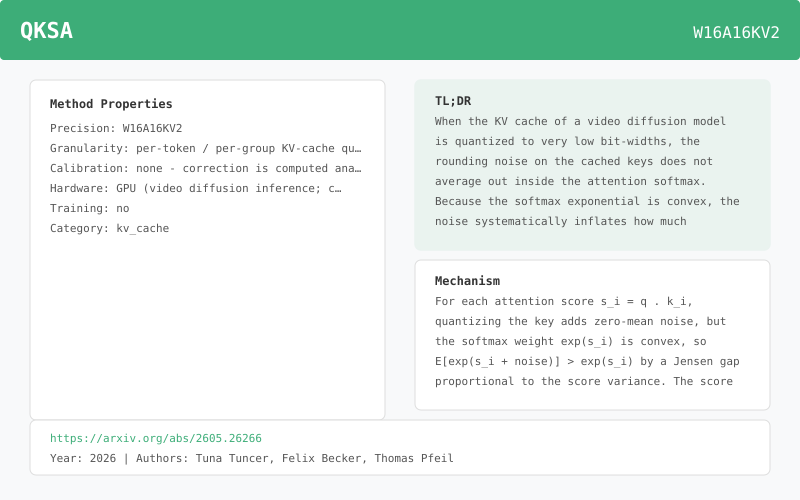

<em>Convex softmax inflates quantized-key attention mass (Jensen bias); an analytic per-score correction from key step size and query norm cancels it before softmax.</em>

```mermaid
flowchart LR
    A[K and V tensors\nfrom attention] --> B[Compression strategy:\nanalytic per-attention-score a]
    B --> C[Quantize or prune\nKV to W16A16KV2]
    C --> D[Store compressed\nKV cache]
    D --> E[Decompress during\nattention computation]
    E --> F[Lower memory\nlonger context]
```

> When the KV cache of a video diffusion model is quantized to very low bit-widths, the rounding noise on the cached keys does not average out inside the attention softmax. Because the softmax exponential is convex, the noise systematically inflates how much attention mass the quantized (past) keys receive, draining attention away from the unquantized current chunk. The authors call this the Jensen bias and show it is the main reason INT2 KV caches degrade. They derive a closed-form estimate of the bias from the key quantization step sizes and the query norm, then subtract it from each attention score before the softmax. The correction needs no extra memory, no calibration data, and no retraining, and adds almost no compute, letting INT2 KV caches reach near-BF16 video quality while beating INT4 at half the memory.

| Field | Value |
|-------|-------|
| Published at | **ICML 2026 Workshops (SCALE, F2S)** |
| Paper | [2605.26266](https://arxiv.org/abs/2605.26266) |
| Precision | W16A16KV2 |
| Granularity | per-token / per-group KV-cache quantization (granularity not explicitly fixed in abstract) |
| Calibration | none - correction is computed analytically on-the-fly from quantization step sizes and query norm |
| Symmetric? | n/a |
| Outlier handling | analytic per-attention-score additive correction that subtracts the softmax Jensen bias instead of suppressing outliers |
| Hardware target | GPU (video diffusion inference; correction fuses into the attention kernel with negligible overhead) |
| Training needed? | no |
| Calibration data? | no |
| Typical degradation | at INT2 KV cache recovers most quality lost to quantization, approaching BF16 and outperforming INT4 at ~50% of its memory, on MAGI-1, SkyReels-V2, and HY-WorldPlay video diffusion models |
| Builds on | [kivi](#kivi) |
| Related | [kvquant](#kvquant) · [kivi](#kivi) · [sageattention](#sageattention) |

**How it works:**

For each attention score s_i = q . k_i, quantizing the key adds zero-mean noise, but the softmax weight exp(s_i) is convex, so E[exp(s_i + noise)] > exp(s_i) by a Jensen gap proportional to the score variance. The score variance is estimated analytically from the per-key quantization step size and the query vector norm, giving a second-order Taylor approximation of the bias for every cached key. This per-score correction term is subtracted from the logits before softmax so the inflated attention mass of quantized keys is removed, restoring the correct balance between past (quantized) and current (full-precision) tokens. The whole correction is data-free and computed on-the-fly at inference time.

---

### RCBEQA · W16A16KV8/KV4 · KV Quant · 2026-05

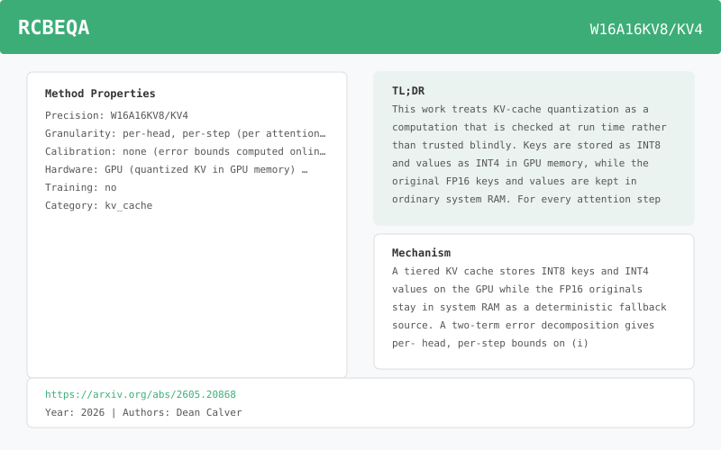

<em>Tiered KV cache (INT8 keys / INT4 values on GPU, FP16 originals in RAM) with online per-head per-step error bounds driving adaptive precision and a multi-stage fallback ladder to exact attention.</em>

```mermaid
flowchart LR
    A[K and V tensors\nfrom attention] --> B[Compression strategy:\nonline per-head per-step error]
    B --> C[Quantize or prune\nKV to W16A16KV8/KV4]
    C --> D[Store compressed\nKV cache]
    D --> E[Decompress during\nattention computation]
    E --> F[Lower memory\nlonger context]
```

> This work treats KV-cache quantization as a computation that is checked at run time rather than trusted blindly. Keys are stored as INT8 and values as INT4 in GPU memory, while the original FP16 keys and values are kept in ordinary system RAM. For every attention step and every head, the method computes two error quantities online: how much the quantized keys distort the attention weight distribution, and how much the quantized values distort the reconstructed output. These computed bounds decide, on the fly, whether the quantized result is acceptable or whether the system should climb a ladder of fallback options, ending if necessary in an exact attention recomputation using the FP16 originals from RAM. The aim is not faster inference but safe deployment of aggressive KV compression: each attention result is guaranteed to be either within a known bound of the FP16 reference or exactly recovered.

| Field | Value |
|-------|-------|
| Published at | arXiv (preprint) |
| Paper | [2605.20868](https://arxiv.org/abs/2605.20868) |
| Precision | W16A16KV8/KV4 |
| Granularity | per-head, per-step (per attention computation); INT8 keys, INT4 values |
| Calibration | none (error bounds computed online at runtime, not from calibration data) |
| Symmetric? | asymmetric |
| Outlier handling | online per-head per-step error bounds drive adaptive precision and a multi-stage fallback ladder that can recover exact FP16 attention from RAM-resident originals |
| Hardware target | GPU (quantized KV in GPU memory) with FP16 originals retained in system RAM |
| Training needed? | no |
| Calibration data? | no |
| Typical degradation | Matches dense FP16 KV within noise on PG-19 (language modelling) and NIAH/RULER (retrieval) for LLaMA-3.1-8B at contexts up to 128K; recovers catastrophic failures seen in naive INT8/INT4 baselines. Value-sensitive short-context tasks show a controlled compression/fidelity trade-off, removable via tighter value tolerances or FP16-value fallback. |
| Builds on | [kivi](#kivi) · [kvquant](#kvquant) |
| Related | [kvquant](#kvquant) · [kivi](#kivi) · [skvq](#skvq) · [gear](#gear) · [sageattention](#sageattention) |

**How it works:**

A tiered KV cache stores INT8 keys and INT4 values on the GPU while the FP16 originals stay in system RAM as a deterministic fallback source. A two-term error decomposition gives per- head, per-step bounds on (i) attention-distribution distortion caused by key quantization and (ii) value reconstruction error. These bounds are evaluated online and used both to select precision adaptively and to trigger a multi-stage fallback ladder; when a bound is exceeded the system escalates, ultimately recomputing the exact dense attention output from the RAM-resident FP16 originals. The certification is local (per-head, per-step): it guarantees each attention computation is either bounded relative to an FP16 reference or exactly recovered, rather than guaranteeing end-to-end model correctness.

---

### OSCAR · W16A16KV2 · KV Quant · 2026-05

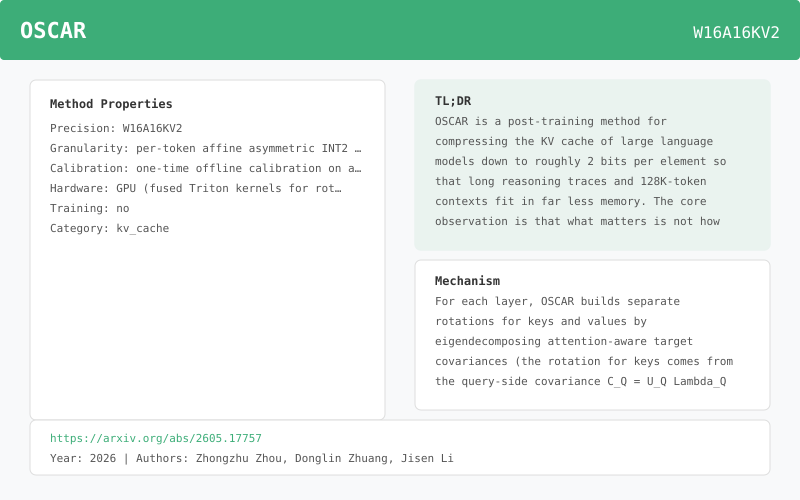

<em>OSCAR: offline spectral covariance-aware rotations (eigendecomp + Hadamard + bit-reversal) and per-token clip thresholds enable ~2.28-bit asymmetric INT2 KV cache with fused SGLang kernels.</em>

```mermaid
flowchart LR
    A[K and V tensors\nfrom attention] --> B[Compression strategy:\ncovariance-aware rotations ei]
    B --> C[Quantize or prune\nKV to W16A16KV2]
    C --> D[Store compressed\nKV cache]
    D --> E[Decompress during\nattention computation]
    E --> F[Lower memory\nlonger context]
```

> OSCAR is a post-training method for compressing the KV cache of large language models down to roughly 2 bits per element so that long reasoning traces and 128K-token contexts fit in far less memory. The core observation is that what matters is not how well the rotated keys and values themselves quantize, but how well attention outputs survive quantization, so the rotations are chosen to be aware of the attention computation rather than being generic Hadamard transforms. All of the expensive analysis (the rotations and the clipping thresholds) is done once offline from a small calibration set, leaving a fixed rotation and clip per layer that can be applied cheaply at serving time. At inference, keys and values are rotated, clipped, and packed into INT2 with token-wise scales and zero-points, with a small number of sink and recent tokens left in BF16. The result keeps accuracy close to BF16 on reasoning and long-context tasks while cutting KV-cache memory about 8x.

| Field | Value |
|-------|-------|
| Published at | arXiv (preprint) |
| Paper | [2605.17757](https://arxiv.org/abs/2605.17757) |
| Code | [FutureMLS-Lab/OSCAR](https://github.com/FutureMLS-Lab/OSCAR) |
| Blog / post | [link](https://oscar-quantize.github.io/) |
| Precision | W16A16KV2 |
| Granularity | per-token affine asymmetric INT2 (block size 128 for scale/zero metadata); BF16 sink/recent-token protection windows |
| Calibration | one-time offline calibration on a small set to estimate attention-aware covariances and per-layer/per-token clip thresholds |
| Symmetric? | asymmetric |
| Outlier handling | covariance-aware rotations (eigendecomposition of attention-aware target covariances, composed with Hadamard mixing + bit-reversal permutation) plus offline percentile-based clip thresholds and small BF16 sink/recent-token windows |
| Hardware target | GPU (fused Triton kernels for rotation/quantization/packing; integrated into SGLang paged attention and vLLM) |
| Training needed? | no |
| Calibration data? | yes |
| Typical degradation | 3.78-point gap vs BF16 on Qwen3-4B-Thinking-2507 and 1.42-point gap on Qwen3-8B across AIME25, GPQA-Diamond, HumanEval, LiveCodeBench v6, and MATH-500; near-BF16 on Qwen3-32B and GLM-4; effective ~2.28 bits/KV element |
| Builds on | [kivi](#kivi) · [kvquant](#kvquant) · [quarot](#quarot) |
| Related | [kivi](#kivi) · [kvquant](#kvquant) · [rotatekv](#rotatekv) · [skvq](#skvq) · [gear](#gear) |

**How it works:**

For each layer, OSCAR builds separate rotations for keys and values by eigendecomposing attention-aware target covariances (the rotation for keys comes from the query-side covariance C_Q = U_Q Lambda_Q U_Q^T so that R_k := U_Q aligns the key subspace with how queries actually read it, and the value rotation comes from the softmax/score-weighted covariance C_S), then composes these spectral rotations with a Hadamard mixing matrix and a bit-reversal permutation to spread remaining energy evenly across channels. Offline calibration also fits per-layer percentile-based clip thresholds (typical c_K ~ 0.96, c_V ~ 0.92) to bound outliers before rounding. At serving time the rotated, clipped K/V are quantized with token-wise affine asymmetric INT2 (scale + zero-point, block size 128 metadata), keeping sink and recent tokens in BF16, giving about 2.28 effective bits per KV element. Fused Triton kernels perform rotation, quantization, and packing inside SGLang's paged attention, yielding up to ~7x throughput at large batch sizes and up to ~3x batch-1 decode speedup.

---

### VeriCache · W16A16KV2 (drafts with 2-4 bit or token-dropped KV; verifies against full FP16 KV) · KV Quant · 2026-05

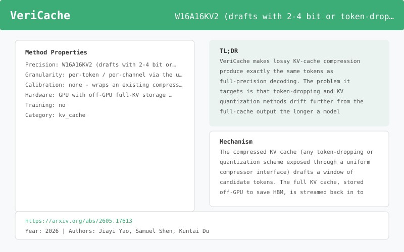

<em>VeriCache: a compressed in-GPU KV cache drafts tokens while the off-GPU full KV cache is swapped in to verify them, overlapping HBM-bound drafting with PCIe-bound verification for lossless output.</em>

```mermaid
flowchart LR
    A[K and V tensors\nfrom attention] --> B[Compression strategy:\nverification against the full ]
    B --> C[Quantize or prune\nKV to W16A16KV2 drafts with 2-4 bit or token-dropped KV; verifies against full FP16 KV]
    C --> D[Store compressed\nKV cache]
    D --> E[Decompress during\nattention computation]
    E --> F[Lower memory\nlonger context]
```

> VeriCache makes lossy KV-cache compression produce exactly the same tokens as full-precision decoding. The problem it targets is that token-dropping and KV quantization methods drift further from the full-cache output the longer a model generates, which breaks long outputs like code and tool-call sequences. VeriCache borrows the draft-and-verify pattern from speculative decoding: it cheaply drafts tokens using a compressed KV cache kept in GPU memory, then verifies those drafts against a full KV cache that lives off the GPU (in CPU memory or on disk). Because drafting is HBM-bandwidth-bound and the full-cache swap is PCIe/network-bound, the two are run in parallel so verification overhead is largely hidden, recovering much of the throughput of the underlying compression method while guaranteeing identical results.

| Field | Value |
|-------|-------|
| Published at | arXiv (preprint) |
| Paper | [2605.17613](https://arxiv.org/abs/2605.17613) |
| Precision | W16A16KV2 (drafts with 2-4 bit or token-dropped KV; verifies against full FP16 KV) |
| Granularity | per-token / per-channel via the underlying compressor (KIVI, KVQuant, RotateKV, SnapKV, etc.) |
| Calibration | none - wraps an existing compressor; no extra calibration data |
| Symmetric? | n/a (inherits from the wrapped KV compression method) |
| Outlier handling | verification against the full KV cache: every drafted token is checked, so any compression-induced error is corrected rather than tolerated |
| Hardware target | GPU with off-GPU full-KV storage (CPU RAM / local or remote disk); evaluated on NVIDIA RTX PRO 6000 96GB and 2xH100 NVL (TP=2) over PCIe 5.0 |
| Training needed? | no |
| Calibration data? | no |
| Typical degradation | lossless - bit-identical to full-KV decoding (KL divergence < 0.01 nats, attributable to hardware nondeterminism) on Mistral-24B, Qwen-32B, Llama-70B across ComplexFuncBench, LongGenBench, GSM8K-Long, PISanitizer, LMCache-trace |
| Builds on | [kivi](#kivi) · [kvquant](#kvquant) · [snapkv](#snapkv) |
| Related | [kivi](#kivi) · [kvquant](#kvquant) · [snapkv](#snapkv) · [gear](#gear) · [skvq](#skvq) |

**How it works:**

The compressed KV cache (any token-dropping or quantization scheme exposed through a uniform compressor interface) drafts a window of candidate tokens. The full KV cache, stored off-GPU to save HBM, is streamed back in to recompute attention and verify the drafts in a single batched forward pass, accepting the longest correct prefix exactly as in speculative decoding so the final output is provably identical to full-KV decoding. The core systems contribution is overlapping the HBM-bandwidth-bound compressed-KV drafting with the PCIe/network-bandwidth-bound full-KV swap-in, plus scheduling that minimizes the cost of bringing the full cache on-chip only for verification.

---

### TriAxialKV · W16A16KV2-KV4 mixed · KV Quant · 2026-05

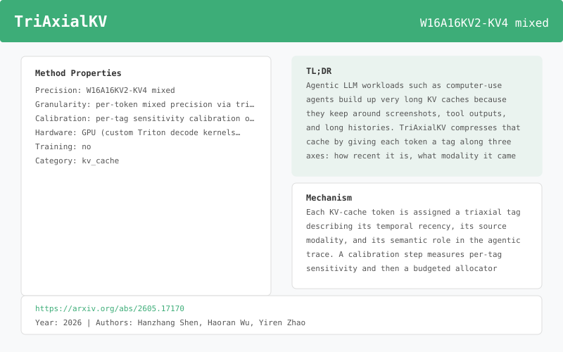

<em>TriAxialKV: each KV token gets a triaxial tag (recency, modality, semantic role); a budgeted allocator assigns INT2/INT4 per tag under a fixed memory budget, served via custom Triton kernels.</em>

```mermaid
flowchart LR
    A[K and V tensors\nfrom attention] --> B[Compression strategy:\nbudgeted bit allocation that k]
    B --> C[Quantize or prune\nKV to W16A16KV2-KV4 mixed]
    C --> D[Store compressed\nKV cache]
    D --> E[Decompress during\nattention computation]
    E --> F[Lower memory\nlonger context]
```

> Agentic LLM workloads such as computer-use agents build up very long KV caches because they keep around screenshots, tool outputs, and long histories. TriAxialKV compresses that cache by giving each token a tag along three axes: how recent it is, what modality it came from (text vs image), and its semantic role in the trace. Tokens judged more important keep more bits (INT4) while the rest are squeezed to INT2, all under a fixed memory budget. The authors wrap this in a serving system with per-tag calibration, memory management, and custom Triton decode kernels so the compression turns into real throughput gains.

| Field | Value |
|-------|-------|
| Published at | arXiv (preprint) |
| Paper | [2605.17170](https://arxiv.org/abs/2605.17170) |
| Precision | W16A16KV2-KV4 mixed |
| Granularity | per-token mixed precision via triaxial tag (recency, modality, semantic role); per-tag calibration |
| Calibration | per-tag sensitivity calibration on agentic traces; no gradient training |
| Symmetric? | asymmetric |
| Outlier handling | budgeted bit allocation that keeps sensitive tokens (recent, image-modality, or semantically important) at INT4 while pushing the rest to INT2 |
| Hardware target | GPU (custom Triton decode kernels; integrated into SGLang) |
| Training needed? | no |
| Calibration data? | yes |
| Typical degradation | matches BF16 KV-cache accuracy of SGLang on OSWorld with Qwen3-VL-32B-Thinking, while supporting 4.5x KV cache size and ~30% higher end-to-end throughput |
| Builds on | [kivi](#kivi) · [kvquant](#kvquant) · [skvq](#skvq) |
| Related | [kvquant](#kvquant) · [kivi](#kivi) · [skvq](#skvq) · [pmkvq](#pmkvq) · [snapkv](#snapkv) · [zipcache](#zipcache) |

**How it works:**

Each KV-cache token is assigned a triaxial tag describing its temporal recency, its source modality, and its semantic role in the agentic trace. A calibration step measures per-tag sensitivity and then a budgeted allocator chooses INT2 or INT4 for each tag so total memory stays under a target while accuracy-critical tokens retain precision. The scheme is realized end-to-end with mixed-precision storage, a memory manager, and custom Triton decode kernels integrated into SGLang, converting the size reduction into higher decode throughput.

---

### FibQuant · W16A16KV2 (also fractional-bit and sub-1-bit operating points) · KV Quant · 2026-05

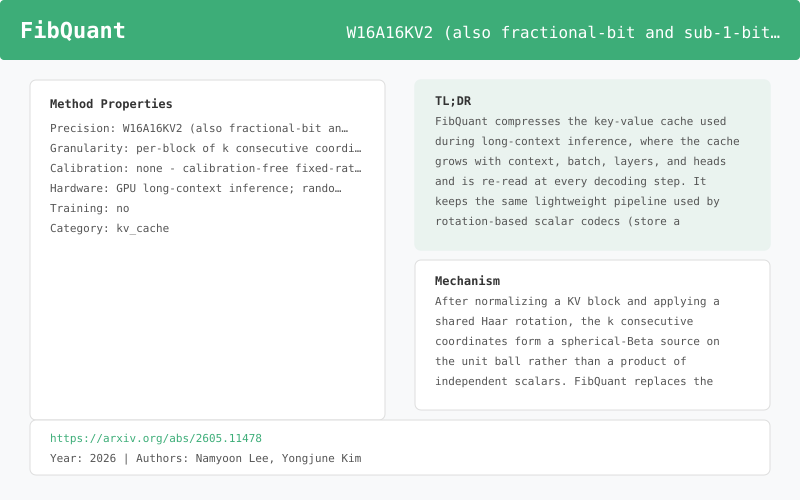

<em>FibQuant: normalize and Haar-rotate a KV block into a spherical-Beta source, then encode with a shared radial-angular codebook (Beta-quantile radii x Fibonacci-lattice directions) for fixed-address random-access codes.</em>

```mermaid
flowchart LR
    A[K and V tensors\nfrom attention] --> B[Compression strategy:\nnormalization store norm plu]
    B --> C[Quantize or prune\nKV to W16A16KV2 also fractional-bit and sub-1-bit operating points]
    C --> D[Store compressed\nKV cache]
    D --> E[Decompress during\nattention computation]
    E --> F[Lower memory\nlonger context]
```

> FibQuant compresses the key-value cache used during long-context inference, where the cache grows with context, batch, layers, and heads and is re-read at every decoding step. It keeps the same lightweight pipeline used by rotation-based scalar codecs (store a per-block norm, apply a shared random rotation, then encode) but observes that after the rotation a block of consecutive coordinates is not independent values; it is a point on a sphere following a spherical-Beta distribution. Instead of quantizing one coordinate at a time with scalar tables, FibQuant uses a single shared codebook over that spherical geometry, picking radii from Beta quantiles and directions from quasi-uniform Fibonacci/Roberts-Kronecker lattices, then refining with Lloyd-Max. Because every token maps to a fixed-size, fixed-address code, the cache stays randomly accessible and the method needs no calibration data, while supporting a continuous range of bit-rates including fractional and sub-one-bit settings.

| Field | Value |
|-------|-------|
| Published at | arXiv (preprint) |
| Paper | [2605.11478](https://arxiv.org/abs/2605.11478) |
| Precision | W16A16KV2 (also fractional-bit and sub-1-bit operating points) |
| Granularity | per-block of k consecutive coordinates (per-token, normalize-then-rotate) |
| Calibration | none - calibration-free fixed-rate codebook |
| Symmetric? | symmetric |
| Outlier handling | normalization (store norm) plus shared Haar rotation; spherical-Beta source modeling absorbs scale via radial-angular code |
| Hardware target | GPU long-context inference; random-access fixed-address per-token codes, no variable-length addresses |
| Training needed? | no |
| Calibration data? | no |
| Typical degradation | TinyLlama-1.1B: within 0.10 perplexity of fp16 at 4x compression; 3.6x lower perplexity than scalar TurboQuant at b=2 (8x). GPT-2 small KV caches: attention cosine similarity 0.99 at 5x to 0.95 at 34x. |
| Builds on | [turboqu](#turboqu) |
| Related | [turboqu](#turboqu) · [kvquant](#kvquant) · [kivi](#kivi) · [quarot](#quarot) |

**How it works:**

After normalizing a KV block and applying a shared Haar rotation, the k consecutive coordinates form a spherical-Beta source on the unit ball rather than a product of independent scalars. FibQuant replaces the scalar quantization tables of rotation-based codecs with one shared radial-angular vector codebook matched to this canonical source: Beta-quantile radii set the magnitude levels, Fibonacci/Roberts-Kronecker quasi-uniform lattice points set the directions on the sphere, and multi-restart Lloyd-Max refines the cells. The construction is proven to strictly improve on its scalar product specialization at matched rate, with the high-rate gain decomposing into a cell-shaping factor and a density-matching factor. The fixed-rate design yields fixed-address per-token codes (preserving random access) and a dense rate axis down to sub-one-bit without calibration or variable-length addressing.

---

### WindowQuant · W16A16KV2-KV4 mixed (avg ~3.17-bit) · KV Quant · 2026-05

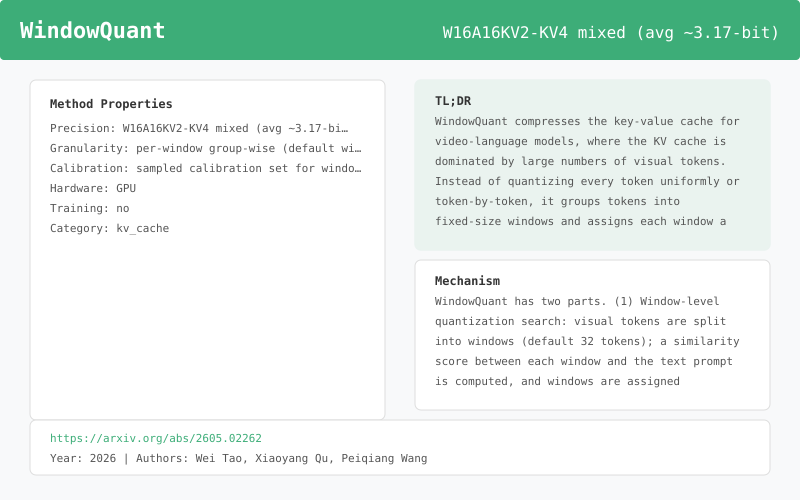

<em>WindowQuant: text-similarity scores assign per-window KV bit-widths; same-precision windows reordered for efficient mixed-precision attention.</em>

```mermaid
flowchart LR
    A[K and V tensors\nfrom attention] --> B[Compression strategy:\nwindow-level mixed precision k]
    B --> C[Quantize or prune\nKV to W16A16KV2-KV4 mixed avg approx 3.17-bit]
    C --> D[Store compressed\nKV cache]
    D --> E[Decompress during\nattention computation]
    E --> F[Lower memory\nlonger context]
```

> WindowQuant compresses the key-value cache for video-language models, where the KV cache is dominated by large numbers of visual tokens. Instead of quantizing every token uniformly or token-by-token, it groups tokens into fixed-size windows and assigns each window a bit-width based on how similar that window's visual content is to the text prompt, so windows that matter more for the answer are kept at higher precision and less relevant windows are compressed harder. To keep the resulting mixed-precision layout fast on hardware, it reorders the cache windows so that windows sharing the same bit-width are computed together, avoiding the irregular memory access that usually makes mixed-precision slow. The method is post-training and only needs a small calibration sample to set the similarity-based thresholds.

| Field | Value |
|-------|-------|
| Published at | **ACM TACO** |
| Paper | [2605.02262](https://arxiv.org/abs/2605.02262) |
| Precision | W16A16KV2-KV4 mixed (avg ~3.17-bit) |
| Granularity | per-window group-wise (default window size 32 tokens) |
| Calibration | sampled calibration set for window-level visual-text similarity / hidden-state similarity |
| Symmetric? | asymmetric |
| Outlier handling | window-level mixed precision keeps high-similarity (more informative) windows at higher bit-width; window reordering groups same-precision windows for efficient computation |
| Hardware target | GPU |
| Training needed? | no |
| Calibration data? | yes |
| Typical degradation | On LLaVA-OneVision-Qwen2-7B: NExT-QA, EgoSchema, IntentQA accuracy within ~1-2% of FP16 baseline while reaching ~3.17 average bits; ~3x decoding throughput and 0.8-6.48 GB KV memory saved |
| Builds on | [kivi](#kivi) · [kvquant](#kvquant) |
| Related | [kivi](#kivi) · [kvquant](#kvquant) · [pmkvq](#pmkvq) · [skvq](#skvq) · [qaq](#qaq) |

**How it works:**

WindowQuant has two parts. (1) Window-level quantization search: visual tokens are split into windows (default 32 tokens); a similarity score between each window and the text prompt is computed, and windows are assigned bit-widths (e.g. INT2 vs INT4, with the most important content kept at FP16) so that more text-relevant windows receive higher precision under an average-bit budget (~3.17 bits). Quantization within a window is asymmetric group-wise round-to-nearest with per-group scale and zero-point. (2) Window-level KV cache computation: before attention, windows are reordered so windows of the same precision are contiguous, eliminating the hardware inefficiency (irregular access, branch divergence) that normally penalizes mixed-precision KV caches, which yields roughly 3x decoding throughput and several GB of memory savings.

---

### RateQuant · W16 A16 KV2-8 mixed (per-head, 2.5-6.0 average bits) · KV Quant · 2026-04

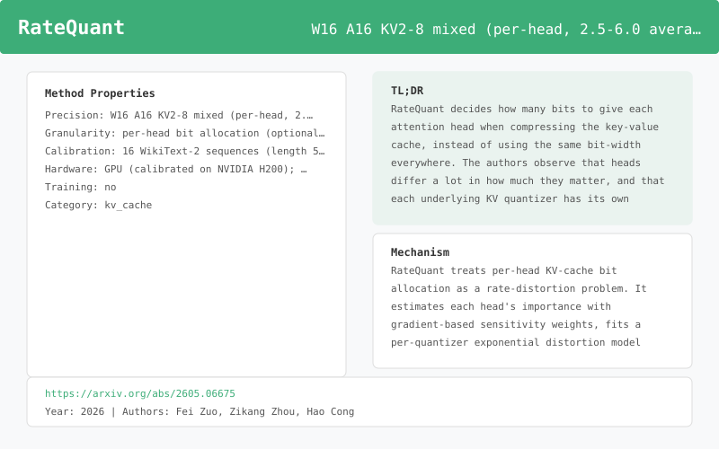

<em>RateQuant: fit a per-quantizer distortion curve and per-head sensitivities, then reverse-waterfill bits across attention heads.</em>

```mermaid
flowchart LR
    A[K and V tensors\nfrom attention] --> B[Compression strategy:\ninherits the base quantizer's ]
    B --> C[Quantize or prune\nKV to W16 A16 KV2-8 mixed per-head, 2.5-6.0 average bits]
    C --> D[Store compressed\nKV cache]
    D --> E[Decompress during\nattention computation]
    E --> F[Lower memory\nlonger context]
```

> RateQuant decides how many bits to give each attention head when compressing the key-value cache, instead of using the same bit-width everywhere. The authors observe that heads differ a lot in how much they matter, and that each underlying KV quantizer has its own error- versus-bits curve with a different decay rate. If you allocate bits using the wrong curve, the head ranking can flip and you end up worse than just using uniform bits, a failure they call distortion model mismatch. RateQuant measures each head's sensitivity and fits the actual distortion curve of whichever quantizer is in use from a tiny calibration set, then computes the bit assignment in closed form. It works as a layer on top of existing KV quantizers (KIVI, QuaRot, TurboQuant) and adds essentially no inference cost.

| Field | Value |
|-------|-------|
| Published at | arXiv (preprint) |
| Paper | [2605.06675](https://arxiv.org/abs/2605.06675) |
| Precision | W16 A16 KV2-8 mixed (per-head, 2.5-6.0 average bits) |
| Granularity | per-head bit allocation (optionally separate keys/values, 2N components) |
| Calibration | 16 WikiText-2 sequences (length 512) for gradient sensitivity plus a per-quantizer distortion-curve fit; ~1.6s for 8B, ~4.2s for 32B on one H200 |
| Symmetric? | mixed |
| Outlier handling | inherits the base quantizer's outlier handling (e.g. QuaRot Hadamard rotations, KIVI per-token asymmetric values); RateQuant only allocates bits |
| Hardware target | GPU (calibrated on NVIDIA H200); static ~2KB lookup table, zero inference overhead |
| Training needed? | no |
| Calibration data? | yes |
| Typical degradation | Qwen3-8B WikiText-2 at 2.5 avg bits: lowers KIVI perplexity 49.3 -> 14.9; raises QuaRot by 6.6 PPL (34.88 -> 28.33); TurboQuant at 4.0 bits 9.94 -> 9.67 (FP16 baseline 9.53) |
| Builds on | [kivi](#kivi) · [quarot](#quarot) · [turboqu](#turboqu) |
| Related | [kvquant](#kvquant) · [pmkvq](#pmkvq) · [skvq](#skvq) · [ramp](#ramp) |

**How it works:**

RateQuant treats per-head KV-cache bit allocation as a rate-distortion problem. It estimates each head's importance with gradient-based sensitivity weights, fits a per-quantizer exponential distortion model D(b)=alpha*beta^(-b) from a small calibration pass, and then solves for the optimal per-head bit count using a reverse-waterfilling result: b*_i = b_bar + (ln w_i - ln w_bar)/ln beta, with a greedy integer rounding step (assign each next bit to the head with maximum marginal distortion reduction). Because beta is measured for the specific base quantizer rather than assumed, RateQuant avoids distortion model mismatch where applying one quantizer's decay rate to another inverts the head ranking and hurts accuracy. It optionally allocates keys and values separately, doubling the number of components to 2N.

---

### SAW-INT4 · W16A16KV4 · KV Quant · 2026-04

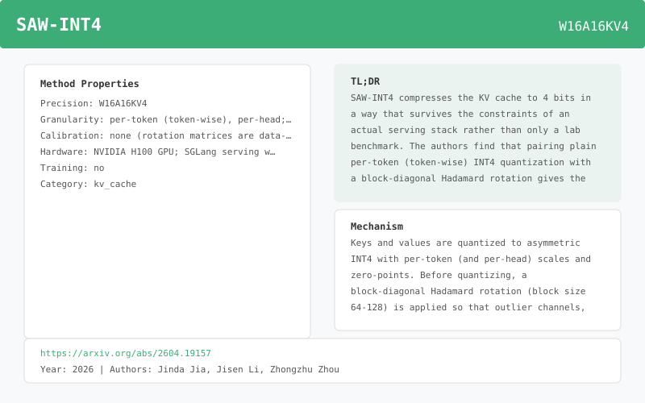

<em>Per-token INT4 K/V quantization preceded by block-diagonal Hadamard rotation (block size 64-128), fused into a paged-KV FlashAttention kernel.</em>

```mermaid
flowchart LR
    A[K and V tensors\nfrom attention] --> B[Compression strategy:\nblock-diagonal Hadamard rotati]
    B --> C[Quantize or prune\nKV to W16A16KV4]
    C --> D[Store compressed\nKV cache]
    D --> E[Decompress during\nattention computation]
    E --> F[Lower memory\nlonger context]
```

> SAW-INT4 compresses the KV cache to 4 bits in a way that survives the constraints of an actual serving stack rather than only a lab benchmark. The authors find that pairing plain per-token (token-wise) INT4 quantization with a block-diagonal Hadamard rotation gives the best balance of accuracy and speed, because the rotation spreads out the large-magnitude channels in the keys that otherwise wreck naive INT4. They build the rotation directly into a fused quantization kernel that fits paged KV-cache layouts and FlashAttention-style execution, so it adds no measurable runtime cost over unrotated INT4. The framing is that KV-cache compression should be treated as a joint accuracy-and-systems problem: the memory layout, paging, and fused attention path constrain which quantization designs are actually usable.

| Field | Value |
|-------|-------|
| Published at | arXiv (preprint) |
| Paper | [2604.19157](https://arxiv.org/abs/2604.19157) |
| Code | [togethercomputer/saw-int4](https://github.com/togethercomputer/saw-int4) |
| Precision | W16A16KV4 |
| Granularity | per-token (token-wise), per-head; block-diagonal Hadamard with block size 64-128 |
| Calibration | none (rotation matrices are data-free Hadamard transforms) |
| Symmetric? | asymmetric |
| Outlier handling | block-diagonal Hadamard rotation (block size 64-128) redistributes channel outliers before per-token INT4 quantization, applied primarily to keys |
| Hardware target | NVIDIA H100 GPU; SGLang serving with PagedAttention and a fused rotation-quantization CUDA/Triton kernel matching plain INT4 throughput |
| Training needed? | no |
| Calibration data? | no |
| Typical degradation | Qwen3-4B-Thinking (32k seq, mean over GPQA-Diamond/HumanEval/LiveCodeBench v6/AIME25/MATH500): BF16 75.64 vs INT4+BDR-128 73.78 (~1.9 pt drop); naive INT4 collapses to 0. Qwen3-8B: BF16 70.84 vs INT4+BDR-64 69.86 (~1 pt drop). |
| Builds on | [kivi](#kivi) · [quarot](#quarot) |
| Related | [kvquant](#kvquant) · [rotatekv](#rotatekv) · [spinquant](#spinquant) · [skvq](#skvq) |

**How it works:**

Keys and values are quantized to asymmetric INT4 with per-token (and per-head) scales and zero-points. Before quantizing, a block-diagonal Hadamard rotation (block size 64-128) is applied so that outlier channels, concentrated in the keys, are mixed across each block and no longer dominate a single quantization range; naive INT4 without this rotation collapses to near-zero accuracy. The rotation is composed so it can be fused with the quantization step and executed inside a paged-KV-cache, FlashAttention-style attention kernel, keeping throughput equal to plain INT4. The design choice is deliberately simple (rotation + per- token INT4) because more elaborate schemes do not fit the memory-layout and fused-execution constraints of real serving.

---

### Don't Waste Bits! · W16A16KV2/4/8 (mixed; per-token chosen from {2,4,8,FP16}) · KV Quant · 2026-04

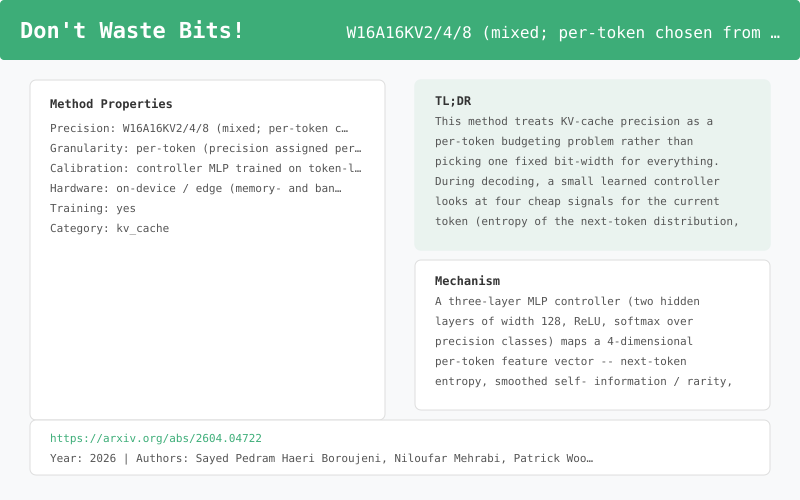

<em>Per-token controller MLP maps {entropy, rarity, attention variance, confidence} to a precision level {2/4/8/FP16}; salient tokens get more bits, low-importance tokens fewer.</em>

```mermaid
flowchart LR
    A[K and V tensors\nfrom attention] --> B[Compression strategy:\nimportant/uncertain tokens are]
    B --> C[Quantize or prune\nKV to W16A16KV2/4/8 mixed; per-token chosen from 2,4,8,FP16]
    C --> D[Store compressed\nKV cache]
    D --> E[Decompress during\nattention computation]
    E --> F[Lower memory\nlonger context]
```

> This method treats KV-cache precision as a per-token budgeting problem rather than picking one fixed bit-width for everything. During decoding, a small learned controller looks at four cheap signals for the current token (entropy of the next-token distribution, a token- rarity score from training frequency, how spread-out the final-layer attention is, and the model's confidence) and decides whether that token's keys and values should be stored at 2, 4, 8, or 16 bits. The idea borrows the Huffman-coding intuition that frequent or low- importance items deserve fewer bits, so most tokens are stored cheaply while the few that matter keep high precision. On small SmolLM models this keeps accuracy almost identical to FP16 while lowering both memory traffic and per-token latency relative to static fixed-bit KV quantization.

| Field | Value |
|-------|-------|
| Published at | **CVPR 2026** |
| Paper | [2604.04722](https://arxiv.org/abs/2604.04722) |
| Code | [SayedPedramHaeri/Dont-Waste-Bits](https://github.com/SayedPedramHaeri/Dont-Waste-Bits) |
| Precision | W16A16KV2/4/8 (mixed; per-token chosen from {2,4,8,FP16}) |
| Granularity | per-token (precision assigned per decoded token; K and V treated equally) |
| Calibration | controller MLP trained on token-level saliency features; no weight-distribution calibration set required for the quantizer itself |
| Symmetric? | symmetric |
| Outlier handling | important/uncertain tokens are kept at higher precision (8-bit or FP16) by the controller; low-importance tokens dropped to 2/4-bit |
| Hardware target | on-device / edge (memory- and bandwidth-constrained); evaluated on small SmolLM models |
| Training needed? | yes |
| Calibration data? | yes |
| Typical degradation | within 0.30 accuracy points of FP16 on SmolLM-360M / HellaSwag (41.20% vs 41.50%), while cutting decoding latency ~17.75% (2.41 vs 3.50 ms/token) and beating the static 4-bit baseline (33.60%) by ~7.6 points |
| Builds on | [rtn](#rtn) |
| Related | [kvquant](#kvquant) · [kivi](#kivi) · [skvq](#skvq) · [qaq](#qaq) · [zipcache](#zipcache) |

**How it works:**

A three-layer MLP controller (two hidden layers of width 128, ReLU, softmax over precision classes) maps a 4-dimensional per-token feature vector -- next-token entropy, smoothed self- information / rarity, final-layer attention variance, and prediction confidence -- to one of four precision levels {2-bit, 4-bit, 8-bit, FP16}. The selected level is applied with uniform symmetric per-token quantization to that token's K and V entries as they are written to the cache. By spending bits proportional to estimated token importance, the scheme minimizes expected KV-cache memory and bandwidth while keeping salient tokens near full precision, trading a tiny accuracy loss for lower decoding latency.

---

### PM-KVQ · KV2-KV8 mixed progressive · KV Quant · 2025-05

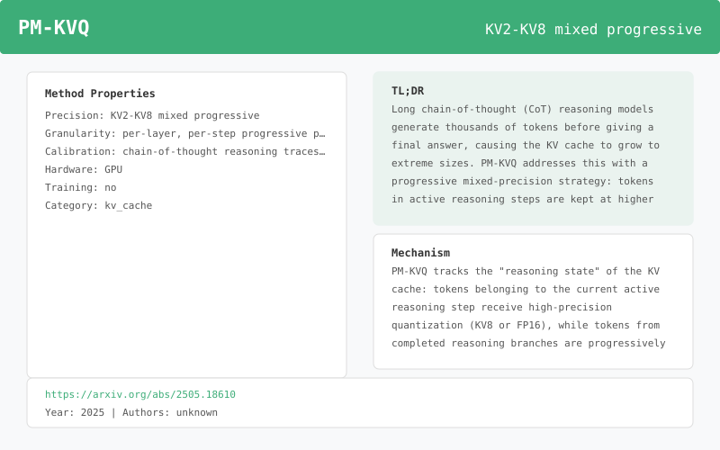

<em>PM-KVQ: active CoT reasoning tokens at high precision; concluded chains compressed progressively.</em>

```mermaid
flowchart LR
    A[K and V tensors\nfrom attention] --> B[Compression strategy:\nhigher precision for early rea]
    B --> C[Quantize or prune\nKV to KV2-KV8 mixed progressive]
    C --> D[Store compressed\nKV cache]
    D --> E[Decompress during\nattention computation]
    E --> F[Lower memory\nlonger context]
```

> Long chain-of-thought (CoT) reasoning models generate thousands of tokens before giving a final answer, causing the KV cache to grow to extreme sizes. PM-KVQ addresses this with a progressive mixed-precision strategy: tokens in active reasoning steps are kept at higher precision, while concluded reasoning chains (past tokens no longer being extended) are compressed aggressively. This temporal structure of CoT reasoning enables much higher compression than static KV quantization without sacrificing reasoning quality.

| Field | Value |
|-------|-------|
| Published at | **ICLR 2026** |
| Paper | [2505.18610](https://arxiv.org/abs/2505.18610) |
| Precision | KV2-KV8 mixed progressive |
| Granularity | per-layer, per-step progressive precision assignment |
| Calibration | chain-of-thought reasoning traces as calibration |
| Symmetric? | symmetric |
| Outlier handling | higher precision for early reasoning tokens; compress concluded tokens |
| Hardware target | GPU |
| Training needed? | no |
| Calibration data? | yes |
| Typical degradation | < 1% on CoT reasoning tasks vs FP16 KV cache |
| Builds on | [kivi](#kivi) · [kvquant](#kvquant) · [snapkv](#snapkv) |
| Related | [kvquant](#kvquant) · [kivi](#kivi) · [qaq](#qaq) · [zipcache](#zipcache) |

**How it works:**

PM-KVQ tracks the "reasoning state" of the KV cache: tokens belonging to the current active reasoning step receive high-precision quantization (KV8 or FP16), while tokens from completed reasoning branches are progressively compressed to KV2-KV4. The precision assignment is updated as generation proceeds. For very long CoT traces (thousands of tokens), the majority of the cache eventually gets compressed, achieving overall 2-3 bit average with near-lossless reasoning quality.

---

### TurboQuant · W16A16KV2.5/KV3.5 (vector quantization) · KV Quant · 2025-04

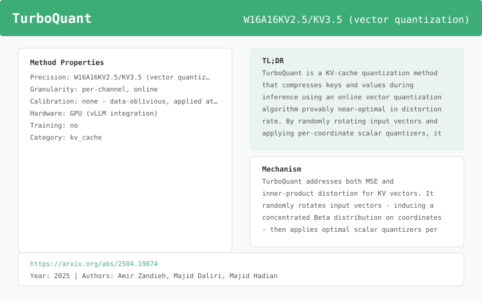

<em>TurboQuant: random rotation + per-coordinate scalar quantization for near-optimal KV cache compression.</em>

```mermaid
flowchart LR
    A[K and V tensors\nfrom attention] --> B[Compression strategy:\nrandom rotation induces concen]
    B --> C[Quantize or prune\nKV to W16A16KV2.5/KV3.5 vector quantization]
    C --> D[Store compressed\nKV cache]
    D --> E[Decompress during\nattention computation]
    E --> F[Lower memory\nlonger context]
```

> TurboQuant is a KV-cache quantization method that compresses keys and values during inference using an online vector quantization algorithm provably near-optimal in distortion rate. By randomly rotating input vectors and applying per-coordinate scalar quantizers, it achieves near-lossless KV compression at 3.5 bits/channel with no calibration data and virtually zero indexing overhead.

| Field | Value |
|-------|-------|
| Published at | **ICLR 2026** |
| Paper | [2504.19874](https://arxiv.org/abs/2504.19874) |
| Precision | W16A16KV2.5/KV3.5 (vector quantization) |
| Granularity | per-channel, online |
| Calibration | none - data-oblivious, applied at runtime |
| Symmetric? | symmetric |
| Outlier handling | random rotation induces concentrated distribution; near-optimal rate-distortion coding |
| Hardware target | GPU (vLLM integration) |
| Training needed? | no |
| Calibration data? | no |
| Typical degradation | quality-neutral at 3.5 bits/channel; marginal degradation at 2.5 bits/channel |
| Builds on | [kivi](#kivi) · [kvquant](#kvquant) |
| Related | [kivi](#kivi) · [kvquant](#kvquant) · [gear](#gear) · [rotatekv](#rotatekv) |

**How it works:**

TurboQuant addresses both MSE and inner-product distortion for KV vectors. It randomly rotates input vectors - inducing a concentrated Beta distribution on coordinates - then applies optimal scalar quantizers per coordinate, exploiting near-independence of dimensions in high-dimensional space. For unbiased inner-product estimation, a two-stage approach is used: an MSE quantizer followed by a 1-bit Quantized Johnson-Lindenstrauss transform on the residual. The method proves information-theoretic lower bounds and shows TurboQuant differs from optimal by only a small constant (~2.7x). Integrated with vLLM for production KV cache compression.

---

### RotateKV · KV2 (2-bit keys and values) · KV Quant · 2025-02

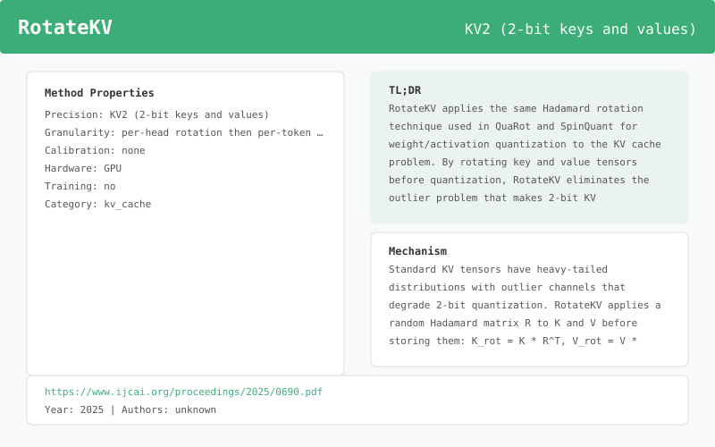

<em>RotateKV: Hadamard rotation of K and V before 2-bit quantization eliminates outliers.</em>

```mermaid
flowchart LR
    A[K and V tensors\nfrom attention] --> B[Compression strategy:\nrandom Hadamard rotation remov]
    B --> C[Quantize or prune\nKV to KV2 2-bit keys and values]
    C --> D[Store compressed\nKV cache]
    D --> E[Decompress during\nattention computation]
    E --> F[Lower memory\nlonger context]
```

> RotateKV applies the same Hadamard rotation technique used in QuaRot and SpinQuant for weight/activation quantization to the KV cache problem. By rotating key and value tensors before quantization, RotateKV eliminates the outlier problem that makes 2-bit KV quantization challenging. The rotation is applied online (cheaply) before caching, and inverse-rotated during attention computation, enabling clean 2-bit KV storage with near-lossless attention quality.

| Field | Value |
|-------|-------|
| Published at | **IJCAI 2025** |
| Paper | [0690.pdf](https://www.ijcai.org/proceedings/2025/0690.pdf) |
| Precision | KV2 (2-bit keys and values) |
| Granularity | per-head rotation then per-token quantization |
| Calibration | none |
| Symmetric? | symmetric |
| Outlier handling | random Hadamard rotation removes outliers from K and V tensors |
| Hardware target | GPU |
| Training needed? | no |
| Calibration data? | no |
| Typical degradation | near-lossless at KV2; significantly better than unrotated 2-bit KV |
| Builds on | [quarot](#quarot) · [kivi](#kivi) · [kvquant](#kvquant) |
| Related | [kivi](#kivi) · [kvquant](#kvquant) · [wkvquant](#wkvquant) · [skvq](#skvq) |

**How it works:**

Standard KV tensors have heavy-tailed distributions with outlier channels that degrade 2-bit quantization. RotateKV applies a random Hadamard matrix R to K and V before storing them: K_rot = K * R^T, V_rot = V * R^T. The rotation spreads outliers incoherently across all dimensions, enabling uniform 2-bit quantization of K_rot and V_rot. During attention, the stored rotated KV are dequantized and inverse-rotated. The Hadamard transform is O(d log d) and fast enough for online use.

---

### SageAttention · Q8K8V16 (INT8 Q and K for QK^T, FP16 V) · KV Quant · 2024-10

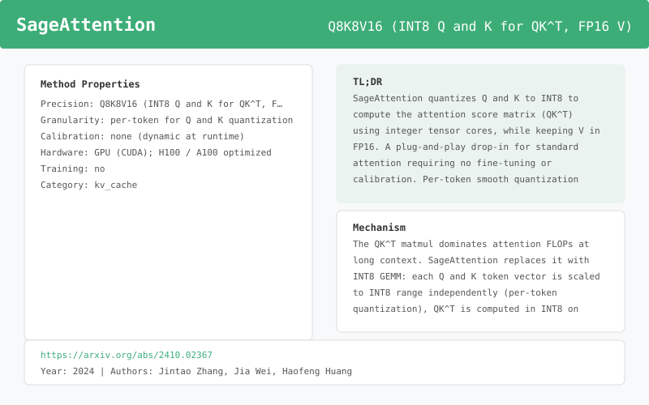

<em>SageAttention: INT8 Q and K for QK^T matmul, FP16 V for the AV weighted sum.</em>

```mermaid
flowchart LR
    A[Query Q and Key K\nFP16] --> B[Per-token smooth\nquantization to INT8]
    B --> C[INT8 GEMM:\nQK^T on tensor cores]
    C --> D[Dequantize result\nbefore softmax]
    D --> E[Softmax in FP32]
    E --> F[FP16 Value V\nweighted sum AV]
    F --> G[2x attention speedup\nnear-zero quality loss]
```

> SageAttention quantizes Q and K to INT8 to compute the attention score matrix (QK^T) using integer tensor cores, while keeping V in FP16. A plug-and-play drop-in for standard attention requiring no fine-tuning or calibration. Per-token smooth quantization handles outliers. Achieves ~2x speedup on the attention operation with near-zero quality loss across language, vision, and video tasks.

| Field | Value |
|-------|-------|
| Published at | **ICLR 2025** |
| Paper | [2410.02367](https://arxiv.org/abs/2410.02367) |
| Code | [thu-ml/SageAttention](https://github.com/thu-ml/SageAttention) |
| Precision | Q8K8V16 (INT8 Q and K for QK^T, FP16 V) |
| Granularity | per-token for Q and K quantization |
| Calibration | none (dynamic at runtime) |
| Symmetric? | symmetric |
| Outlier handling | per-token smooth quantization of Q and K before INT8 cast |
| Hardware target | GPU (CUDA); H100 / A100 optimized |
| Training needed? | no |
| Calibration data? | no |
| Typical degradation | < 0.5% on most tasks; 2.1x attention speedup on A100 |
| Builds on | [smoothquant](#smoothquant) |
| Related | [kvquant](#kvquant) · [kivi](#kivi) · [atom](#atom) |

**How it works:**

The QK^T matmul dominates attention FLOPs at long context. SageAttention replaces it with INT8 GEMM: each Q and K token vector is scaled to INT8 range independently (per-token quantization), QK^T is computed in INT8 on tensor cores, then dequantized before softmax. The weighted sum AV uses FP16 V unchanged. SageAttention2 (Nov 2024) extends to mixed INT4/INT8 Q/K for further speedup.

---

### ThinK · W16A16KV4 (with head-dimension pruning) · KV Quant · 2024-07

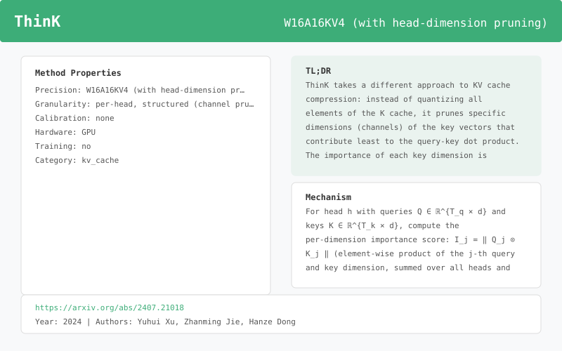

<em>Query-guided key-dimension pruning removes low-QK-correlation dimensions before quantization.</em>

```mermaid
flowchart LR
    A[Query Q and Key K\nfor head h] --> B[Q-K channel correlation:\nI_j = norm Q_j hadamard K_j]
    B --> C[Rank dimensions\nby importance I_j]
    C --> D[Prune low-importance\nK cache dimensions]
    D --> E[20-40% key cache\nreduction]
    E --> F[Orthogonal to\nquantization methods]
```

> ThinK takes a different approach to KV cache compression: instead of quantizing all elements of the K cache, it prunes specific dimensions (channels) of the key vectors that contribute least to the query-key dot product. The importance of each key dimension is estimated from the query vectors - dimensions where Q·K correlates poorly across queries are pruned. This "thinner K" approach is combined with quantization of the retained dimensions, compressing the K cache in two orthogonal ways: fewer dimensions (pruning) and fewer bits per dimension (quantization).

| Field | Value |
|-------|-------|
| Published at | arXiv (preprint) |
| Paper | [2407.21018](https://arxiv.org/abs/2407.21018) |
| Precision | W16A16KV4 (with head-dimension pruning) |
| Granularity | per-head, structured (channel pruning within head dimension) |
| Calibration | none |
| Symmetric? | asymmetric |
| Outlier handling | query-driven pruning removes low-attention key dimensions |
| Hardware target | GPU |
| Training needed? | no |
| Calibration data? | no |
| Typical degradation | < 0.5 ppl at 25% key cache reduction + INT4 quantization |
| Builds on | [kivi](#kivi) · [rtn](#rtn) |
| Related | [kivi](#kivi) · [kvquant](#kvquant) · [palu](#palu) |

**How it works:**

For head h with queries Q ∈ ℝ^{T_q × d} and keys K ∈ ℝ^{T_k × d}, compute the per-dimension importance score: I_j = ‖ Q_j ⊙ K_j ‖ (element-wise product of the j-th query and key dimension, summed over all heads and tokens). Low-importance dimensions (low I_j) contribute little to the attention score and can be pruned. Pruning removes the bottom-p% of key dimensions. The corresponding query dimensions are also zeroed to maintain attention correctness. Combined with INT4 quantization of the retained (d × (1-p)) key dimensions, ThinK achieves up to 25% fewer key cache bytes without quality degradation.

---

### Palu · W16A16KV reduced-rank · KV Quant · 2024-07

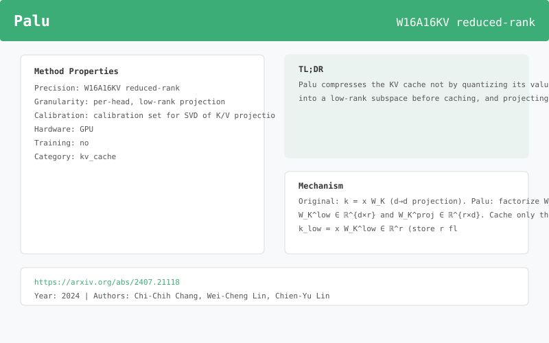

<em>Low-rank KV projection: cache r-dim k_low instead of d-dim k; reconstruct at attention.</em>

```mermaid
flowchart LR
    A[K proj weight W_K\nd to d] --> B[SVD: W_K approx U_r Sigma V_r^T]
    B --> C[W_K_low in R^d_times_r\nW_K_proj in R^r_times_d]
    C --> D[k_low = x W_K_low\nstore in R^r]
    D --> E[At attention:\ndecode k = k_low W_K_proj]
    E --> F[r over d ratio\n= compression factor]
    F --> G[Combinable with\nKV quantization]
```

> Palu compresses the KV cache not by quantizing its values but by projecting K and V into a low-rank subspace before caching, and projecting back at attention time. The low-rank projection is learned offline by truncated SVD of the K and V projection matrices (W_K and W_V). If W_K ≈ U Σ Vᵀ and we keep only the top-r singular values, keys can be stored as low-rank factors rather than full-rank vectors, reducing the cache size by factor d/r. This is a fundamentally different approach from bit-reduction quantization - it reduces the dimensionality of the cache rather than the precision.

| Field | Value |
|-------|-------|
| Published at | arXiv (preprint) |
| Paper | [2407.21118](https://arxiv.org/abs/2407.21118) |
| Precision | W16A16KV reduced-rank |
| Granularity | per-head, low-rank projection |
| Calibration | calibration set for SVD of K/V projection matrices |
| Symmetric? | n/a (low-rank) |
| Outlier handling | low-rank projection inherently compresses; less sensitive to individual outliers |
| Hardware target | GPU |
| Training needed? | no |
| Calibration data? | yes |
| Typical degradation | 50% K/V cache size reduction at < 1 ppl on LLaMA-2 |
| Builds on | [rtn](#rtn) |
| Related | [gear](#gear) · [think](#think) · [kvquant](#kvquant) |

**How it works:**

Original: k = x W_K (d→d projection). Palu: factorize W_K ≈ W_K^low W_K^proj where W_K^low ∈ ℝ^{d×r} and W_K^proj ∈ ℝ^{r×d}. Cache only the low-rank representation: k_low = x W_K^low ∈ ℝ^r (store r floats instead of d floats). At attention time, reconstruct: k = k_low W_K^proj for the dot product. The SVD of W_K is computed once offline from calibration data that tells which directions of k are most important. The rank r is the compression knob: r = d/2 gives 50% cache reduction. Palu also applies to V. The method can be combined with quantization of the low-rank k_low vectors.

---

### PQCache · W16A16KV2-4 (product quantization) · KV Quant · 2024-07

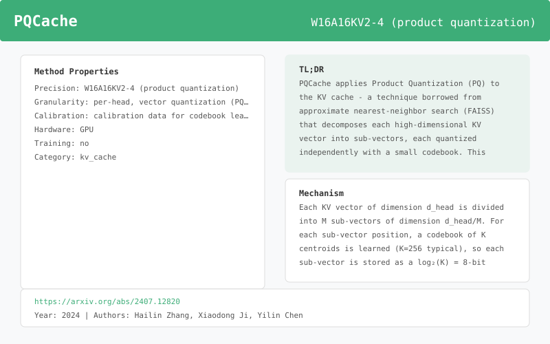

<em>PQCache: product quantization of KV vectors - each sub-vector maps to a codebook index.</em>

```mermaid
flowchart LR
    A[Key or Value vector v] --> B[Split into m sub-vectors\nof dimension d/m each]
    B --> C[Assign each sub-vec\nto nearest codebook centroid]
    C --> D[Store m indices\ninstead of full vector]
    D --> E[Asymmetric distance:\nscore without full decode]
    E --> F[Product Quant KV\neffective 2-4 bits]
    F --> G[Long-context inference\nlower memory footprint]
```

> PQCache applies Product Quantization (PQ) to the KV cache - a technique borrowed from approximate nearest-neighbor search (FAISS) that decomposes each high-dimensional KV vector into sub-vectors, each quantized independently with a small codebook. This allows very low effective bit-widths (sub-2-bit per dimension) while maintaining good approximation quality for the attention computation, as the approximate KV entries are sufficient for the attention softmax to produce accurate output probabilities.

| Field | Value |
|-------|-------|
| Published at | arXiv (preprint) |
| Paper | [2407.12820](https://arxiv.org/abs/2407.12820) |
| Precision | W16A16KV2-4 (product quantization) |
| Granularity | per-head, vector quantization (PQ codebook) |
| Calibration | calibration data for codebook learning |
| Symmetric? | n/a (codebook-based) |
| Outlier handling | product quantization codebook absorbs all magnitudes |
| Hardware target | GPU |
| Training needed? | no |
| Calibration data? | yes |
| Typical degradation | < 1 ppl at PQ-equivalent 2 bits on LLaMA-2; enables very long context at low memory |
| Builds on | [kivi](#kivi) · [rtn](#rtn) |
| Related | [kivi](#kivi) · [kvquant](#kvquant) · [aqlm](#aqlm) |

**How it works:**

Each KV vector of dimension d_head is divided into M sub-vectors of dimension d_head/M. For each sub-vector position, a codebook of K centroids is learned (K=256 typical), so each sub-vector is stored as a log₂(K) = 8-bit index. The effective bits per dimension: M × 8 / d_head - for M=8 and d_head=128: 0.5 bits/dim. At attention time, sub-vectors are reconstructed from codebooks for the dot product. Codebooks are shared across all tokens and learned from a representative set of KV activations. This approach is especially useful at context lengths >32K where KV memory dominates inference cost.

---

### ZipCache · W16A16KV4 (mixed: salient tokens higher) · KV Quant · 2024-05

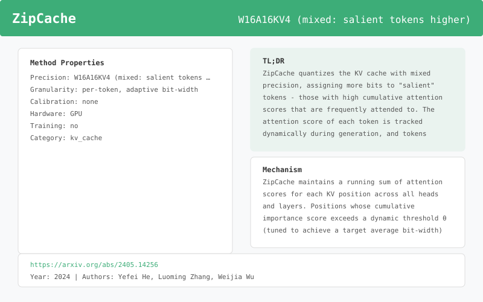

<em>ZipCache: dynamic attention-score tracking assigns higher bits to salient tokens.</em>

```mermaid
flowchart LR
    A[KV cache tokens] --> B[Accumulate attention\nscores online]
    B --> C{Salient token?}
    C -->|high attention| D[Keep in FP16 / INT8]
    C -->|low attention| E[Quantize to INT4\nor INT2]
    D --> F[Mixed-precision\nKV cache]
    E --> F
    F --> G[3x KV compression\nnear-lossless for salient]
```

> ZipCache quantizes the KV cache with mixed precision, assigning more bits to "salient" tokens - those with high cumulative attention scores that are frequently attended to. The attention score of each token is tracked dynamically during generation, and tokens whose cumulative attention score exceeds a threshold are assigned higher-precision quantization (or kept at FP16). The remaining low-attention tokens are compressed more aggressively. This adaptive allocation outperforms uniform KV quantization at the same average bit-width with no additional calibration.

| Field | Value |
|-------|-------|
| Published at | **NeurIPS 2024** |
| Paper | [2405.14256](https://arxiv.org/abs/2405.14256) |
| Precision | W16A16KV4 (mixed: salient tokens higher) |
| Granularity | per-token, adaptive bit-width |
| Calibration | none |
| Symmetric? | asymmetric |
| Outlier handling | salient token identification: tokens with high attention scores kept at higher precision |
| Hardware target | GPU |
| Training needed? | no |
| Calibration data? | no |
| Typical degradation | < 0.5 ppl at 4-bit average on LLaMA-2 family; outperforms uniform KV4 |
| Builds on | [kivi](#kivi) · [qaq](#qaq) |
| Related | [kivi](#kivi) · [qaq](#qaq) · [kvquant](#kvquant) · [skvq](#skvq) |

**How it works:**

ZipCache maintains a running sum of attention scores for each KV position across all heads and layers. Positions whose cumulative importance score exceeds a dynamic threshold θ (tuned to achieve a target average bit-width) are quantized at high precision (INT8 or FP16); others are quantized at INT4 or lower. The threshold is updated online as new tokens arrive. The approach is motivated by the "attention sink" phenomenon: early tokens and locally-important tokens receive disproportionate attention and must be preserved at high quality. Unlike KIVI or SKVQ, ZipCache's mixed precision is content-adaptive, not position-based.

---

### SKVQ · W16A16KV2/KV4 · KV Quant · 2024-05

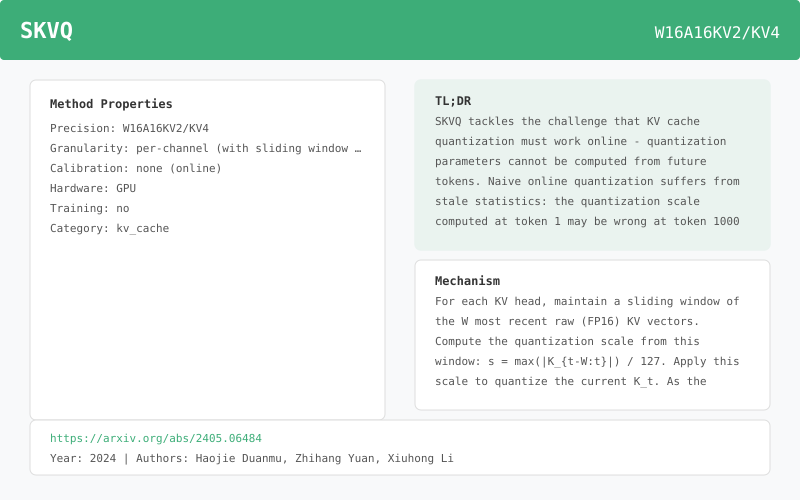

<em>Sliding window of recent KV tokens provides fresh scale statistics for online quantization.</em>

```mermaid
flowchart LR
    A[KV cache stream] --> B[Sliding window:\nrecent tokens full precision]
    B --> C[Older tokens:\nchannel reordering]
    C --> D[Similar-range channels\ngrouped together]
    D --> E[Group quantize\nKV2 to KV4]
    E --> F[Clipping migration\nat window boundary]
    F --> G[Efficient long-context\nwith sliding precision]
```

> SKVQ tackles the challenge that KV cache quantization must work online - quantization parameters cannot be computed from future tokens. Naive online quantization suffers from stale statistics: the quantization scale computed at token 1 may be wrong at token 1000 if the KV distribution drifts. SKVQ uses a sliding window of the most recent W tokens to maintain fresh, locally-relevant statistics for the quantization scale, balancing between always-fresh (expensive) and never-updated (stale) approaches.

| Field | Value |
|-------|-------|
| Published at | arXiv (preprint) |
| Paper | [2405.06484](https://arxiv.org/abs/2405.06484) |
| Precision | W16A16KV2/KV4 |
| Granularity | per-channel (with sliding window for online statistics) |
| Calibration | none (online) |
| Symmetric? | asymmetric |
| Outlier handling | clipped quantization; sliding window maintains fresh statistics for accurate scale computation |
| Hardware target | GPU |
| Training needed? | no |
| Calibration data? | no |
| Typical degradation | < 0.5 ppl at KV4; competitive with KIVI at KV2 without calibration |
| Builds on | [kivi](#kivi) · [rtn](#rtn) |
| Related | [kivi](#kivi) · [kvquant](#kvquant) · [wkvquant](#wkvquant) |

**How it works:**

For each KV head, maintain a sliding window of the W most recent raw (FP16) KV vectors. Compute the quantization scale from this window: s = max(|K_{t-W:t}|) / 127. Apply this scale to quantize the current K_t. As the window slides forward, the old quantized values are not re-quantized (too expensive), but new tokens use the fresh window scale. The window size W is a hyperparameter balancing freshness (smaller W) against scale stability (larger W). Additionally, SKVQ applies channel-aware clipping based on the long-run statistics of each K head channel to prevent outliers from inflating the window scale.

---

### SnapKV · KV selective eviction (variable effective bits) · KV Quant · 2024-04

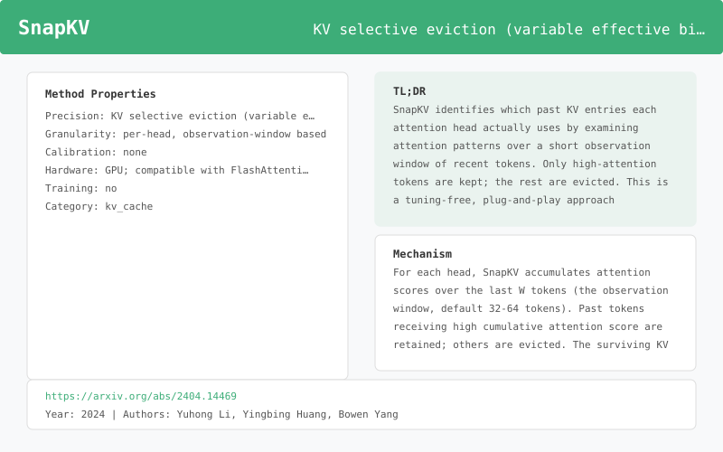

<em>SnapKV: observation-window attention selects which past KV entries to retain.</em>

```mermaid
flowchart LR
    A[Input prompt tokens] --> B[Observation window:\nlast W tokens]
    B --> C[Accumulate attention\nscores over window]
    C --> D{High cumulative\nattention?}
    D -->|yes| E[Retain KV pair\nin cache]
    D -->|no| F[Evict KV pair]
    E --> G[Compressed KV cache\n+ full window KV]
    F --> G
    G --> H[3.6x reduction\nat 16K context]
```

> SnapKV identifies which past KV entries each attention head actually uses by examining attention patterns over a short observation window of recent tokens. Only high-attention tokens are kept; the rest are evicted. This is a tuning-free, plug-and-play approach compatible with FlashAttention, achieving 3.6x KV cache reduction at 16K context with minimal accuracy loss and no model changes required.

| Field | Value |
|-------|-------|
| Published at | **NeurIPS 2024** |
| Paper | [2404.14469](https://arxiv.org/abs/2404.14469) |
| Code | [FasterDecoding/SnapKV](https://github.com/FasterDecoding/SnapKV) |
| Precision | KV selective eviction (variable effective bits) |
| Granularity | per-head, observation-window based |
| Calibration | none |
| Symmetric? | symmetric |
| Outlier handling | preserves high-attention tokens; evicts low-attention ones |
| Hardware target | GPU; compatible with FlashAttention |
| Training needed? | no |
| Calibration data? | no |
| Typical degradation | < 1% on long-context QA; 3.6x KV cache reduction at 16K context |
| Related | [kvquant](#kvquant) · [kivi](#kivi) · [think](#think) · [gear](#gear) · [zipcache](#zipcache) |

**How it works:**

For each head, SnapKV accumulates attention scores over the last W tokens (the observation window, default 32-64 tokens). Past tokens receiving high cumulative attention score are retained; others are evicted. The surviving KV cache is concatenated with the full observation-window KV cache (always preserved), ensuring recent context is never dropped. Unlike quantization methods, SnapKV reduces the number of stored tokens rather than their bit-width.

---

### GEAR · W16A16KV4 (with low-rank residual correction) · KV Quant · 2024-03

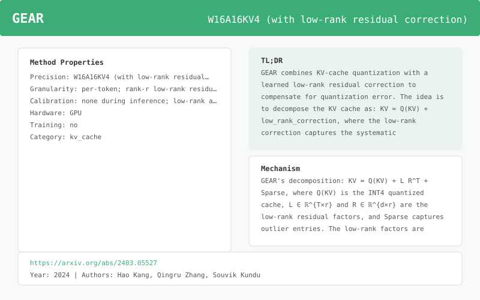

<em>GEAR = quantized KV + low-rank + sparse residual; error decomposition updated incrementally.</em>

```mermaid
flowchart LR
    A[KV cache] --> B[Quantize to INT4]
    B --> C[Quantization\nerror residual E]
    C --> D[SVD low-rank\napprox of E]
    D --> E[Store: INT4 KV\n+ low-rank E_hat]
    E --> F[Dequant + low-rank\ncorrection at runtime]
    F --> G[Near-lossless\nKV at 4-bit avg]
```

> GEAR combines KV-cache quantization with a learned low-rank residual correction to compensate for quantization error. The idea is to decompose the KV cache as: KV ≈ Q(KV) + low_rank_correction, where the low-rank correction captures the systematic (structured) part of the quantization error. The rank-r correction requires only 2 × r × d_head parameters per layer (instead of 2 × T × d_head for the full KV), providing significant compression with minimal accuracy loss.

| Field | Value |
|-------|-------|
| Published at | arXiv (preprint) |
| Paper | [2403.05527](https://arxiv.org/abs/2403.05527) |
| Precision | W16A16KV4 (with low-rank residual correction) |
| Granularity | per-token; rank-r low-rank residual |
| Calibration | none during inference; low-rank approximation computed online |
| Symmetric? | asymmetric |
| Outlier handling | low-rank + sparse residual decomposition of quantization error |
| Hardware target | GPU |
| Training needed? | no |
| Calibration data? | no |
| Typical degradation | near-lossless at KV4 with low-rank residual; outperforms KIVI at same bit-width |
| Builds on | [kivi](#kivi) · [rtn](#rtn) |
| Related | [kivi](#kivi) · [kvquant](#kvquant) · [palu](#palu) |

**How it works:**

GEAR's decomposition: KV = Q(KV) + L R^T + Sparse, where Q(KV) is the INT4 quantized cache, L ∈ ℝ^{T×r} and R ∈ ℝ^{d×r} are the low-rank residual factors, and Sparse captures outlier entries. The low-rank factors are computed online from the quantization error matrix E = KV − Q(KV) via a fast streaming SVD that is maintained incrementally as new tokens arrive. The sparse component captures the top-k% largest errors after the low-rank correction. At attention, Q(KV) + L R^T is used, with the sparse correction added for outlier positions only.

---

### QAQ · W16A16KV2–KV4 (mixed) · KV Quant · 2024-03

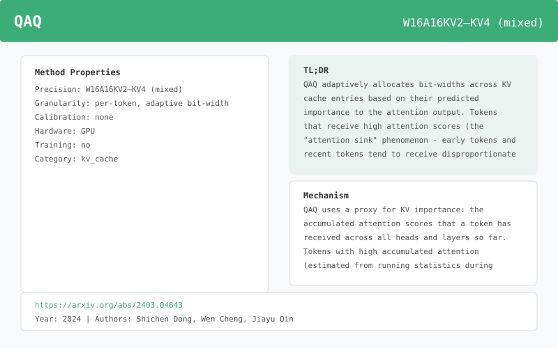

<em>Attention-score-based adaptive bit allocation: high-attention tokens get more KV bits.</em>

```mermaid
flowchart LR
    A[KV cache entry] --> B[Compute importance:\naccumulated attn score]
    B --> C{High attention?}
    C -->|yes| D[Assign high bit-width\n8-bit or FP16]
    C -->|no| E[Assign low bit-width\n2-4 bit]
    D --> F[Quality-adaptive\nmixed KV cache]
    E --> F
    F --> G[Dynamic precision\nper generation step]
```

> QAQ adaptively allocates bit-widths across KV cache entries based on their predicted importance to the attention output. Tokens that receive high attention scores (the "attention sink" phenomenon - early tokens and recent tokens tend to receive disproportionate attention) are assigned higher-precision quantization, while tokens with low attention scores can be safely compressed to very low bits (even 1–2 bits). This adaptive allocation achieves better quality per average bit than uniform quantization across all tokens.

| Field | Value |
|-------|-------|
| Published at | arXiv (preprint) |
| Paper | [2403.04643](https://arxiv.org/abs/2403.04643) |
| Precision | W16A16KV2–KV4 (mixed) |
| Granularity | per-token, adaptive bit-width |
| Calibration | none |
| Symmetric? | asymmetric |
| Outlier handling | importance-adaptive bit allocation: sink tokens and recent tokens get more bits |
| Hardware target | GPU |
| Training needed? | no |
| Calibration data? | no |
| Typical degradation | better than uniform KV4 at same average bit-width |
| Builds on | [kivi](#kivi) · [rtn](#rtn) |
| Related | [kivi](#kivi) · [kvquant](#kvquant) · [think](#think) |

**How it works:**

QAQ uses a proxy for KV importance: the accumulated attention scores that a token has received across all heads and layers so far. Tokens with high accumulated attention (estimated from running statistics during generation) are assigned more bits in the KV cache; tokens with low accumulated attention are compressed further. The allocation is updated dynamically as new tokens arrive: a token's assigned bit-width can increase if later layers find it important. The implementation uses a budget-constrained allocation that targets an average bit-width (e.g. 3.0 bpw) while minimizing peak allocation.

---

### WKVQuant · W4A16KV4 · KV Quant · 2024-02

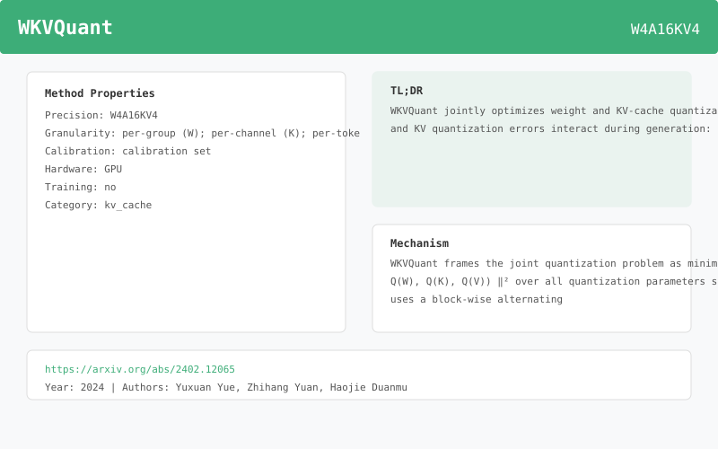

<em>Joint weight + KV quantization optimization minimizes compound error in the generation loop.</em>

```mermaid
flowchart LR
    A[Weights W] --> B[W4 past-only quant:\nonly prev-gen KV quantized]
    A2[KV Cache] --> C[Within-group clipping\nfor KV INT4]
    B --> D[Joint W4KV4\ncombined objective]
    C --> D
    D --> E[Better throughput\nthan W4A16 alone]
```

> WKVQuant jointly optimizes weight and KV-cache quantization, observing that weight and KV quantization errors interact during generation: a quantized weight produces quantization-corrupted hidden states, which then get quantized again in the KV cache, compounding errors. WKVQuant uses a calibration-based approach that optimizes both the weight quantization parameters and the KV scale/zero-point together to minimize the compound error. The key insight is that weight quantization errors are not independent of KV errors and should be co-optimized.

| Field | Value |
|-------|-------|
| Published at | arXiv (preprint) |
| Paper | [2402.12065](https://arxiv.org/abs/2402.12065) |
| Precision | W4A16KV4 |
| Granularity | per-group (W); per-channel (K); per-token (V) |
| Calibration | calibration set |
| Symmetric? | asymmetric |
| Outlier handling | joint weight + KV quantization optimization; NormalFloat for K |
| Hardware target | GPU |
| Training needed? | no |
| Calibration data? | yes |
| Typical degradation | < 0.5 ppl at W4A16KV4 on LLaMA-2 |
| Builds on | [gptq](#gptq) · [kivi](#kivi) |
| Related | [kivi](#kivi) · [kvquant](#kvquant) · [think](#think) |

**How it works:**

WKVQuant frames the joint quantization problem as minimizing ‖ f(x; W, K, V) − f(x; Q(W), Q(K), Q(V)) ‖² over all quantization parameters simultaneously. In practice, it uses a block-wise alternating optimization: fix KV quantization, optimize W (as in GPTQ); fix W quantization, optimize KV. The KV quantization uses a NormalFloat-inspired grid for K (which it observes is more Gaussian than V) and per-token asymmetric for V. The joint optimization gives 1–2% quality improvement over optimizing weight and KV independently.

---

### Coupled Quantization · W16A16KV1/KV2 · KV Quant · 2024-02

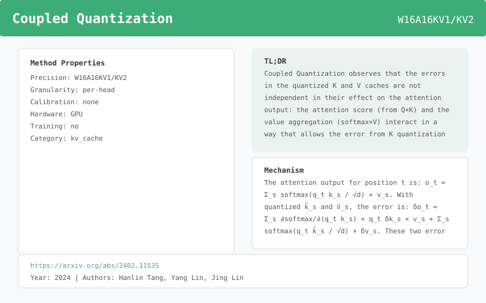

<em>Jointly optimize K and V quantization parameters to minimize attention output error via error cancellation.</em>

```mermaid
flowchart LR
    A[Key K and Value V\nfrom same token] --> B[Analyze correlation\nbetween K and V]
    B --> C[Joint codebook\nshared K-V pairs]
    C --> D[Quantize K and V\ncoupled, not independent]
    D --> E[Inter-vector correlation\nreduces joint error]
    E --> F[KV2 near-lossless\ncoupled representation]
```

> Coupled Quantization observes that the errors in the quantized K and V caches are not independent in their effect on the attention output: the attention score (from Q×K) and the value aggregation (softmax×V) interact in a way that allows the error from K quantization to partially cancel the error from V quantization. By jointly designing the K and V quantization to exploit this cancellation (selecting quantization parameters that minimize the total attention output error rather than minimizing K error and V error separately), Coupled Quantization achieves much better quality at 1-bit KV than either independent 1-bit K or 1-bit V quantization.

| Field | Value |
|-------|-------|
| Published at | arXiv (preprint) |
| Paper | [2402.11535](https://arxiv.org/abs/2402.11535) |
| Precision | W16A16KV1/KV2 |
| Granularity | per-head |
| Calibration | none |
| Symmetric? | asymmetric |
| Outlier handling | coupled K-V error cancellation: K and V quantization errors are designed to cancel in the attention output |
| Hardware target | GPU |
| Training needed? | no |
| Calibration data? | no |
| Typical degradation | enables 1-bit KV cache with acceptable quality loss; significantly better than independent 1-bit quantization |
| Builds on | [kivi](#kivi) · [rtn](#rtn) |
| Related | [kivi](#kivi) · [kvquant](#kvquant) · [qaq](#qaq) |

**How it works:**

The attention output for position t is: o_t = Σ_s softmax(q_t k_s / √d) × v_s. With quantized k̃_s and ṽ_s, the error is: δo_t = Σ_s ∂softmax/∂(q_t k_s) × q_t δk_s × v_s + Σ_s softmax(q_t k̃_s / √d) × δv_s. These two error terms have different signs and can partially cancel if chosen carefully. Coupled Quantization jointly optimizes (scale_K, zero_K, scale_V, zero_V) per head to minimize ‖ δo ‖ rather than ‖ δK ‖ and ‖ δV ‖ independently. The joint optimization is tractable and runs online.

---

### KIVI · W16A16KV2 · KV Quant · 2024-02

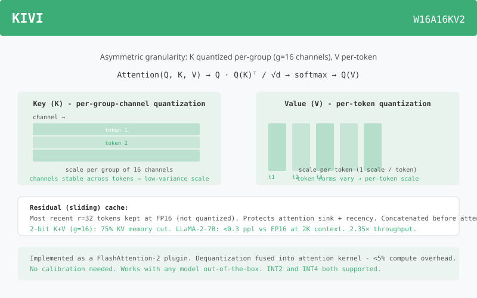

<em>K per-group (g=16) asymmetric + V per-token asymmetric + FP16 residual for recent tokens.</em>

```mermaid
flowchart LR
    A[Key cache K] --> B[Per-channel\nINT2 quantize]
    A2[Value cache V] --> C[Per-token\nINT2 quantize]
    B --> D[Sliding window:\nrecent tokens FP16]
    C --> D
    D --> E[2-bit KV cache\nno fine-tuning needed]
    E --> F[2x longer context\nsame GPU memory]
```

> KIVI proposes a simple but effective asymmetric quantization strategy for KV cache: keys are quantized per-channel (using groups of 16 consecutive elements in the channel dimension), and values are quantized per-token. This asymmetric choice is motivated by empirical observation: K vectors have consistent per-channel magnitude patterns across all tokens (stable per-channel statistics), while V vectors have consistent per-token patterns. The most recent r=32 tokens are kept in FP16 as a "residual cache" to avoid quantizing newly computed KV entries before they stabilize. Implemented as a FlashAttention plugin with no tuning needed.

| Field | Value |
|-------|-------|
| Published at | **ICML 2024** |
| Paper | [2402.02750](https://arxiv.org/abs/2402.02750) |
| Code | [jy-yuan/KIVI](https://github.com/jy-yuan/KIVI) |
| Precision | W16A16KV2 |
| Granularity | per-channel g=16 (K); per-token (V); residual cache at FP16 |
| Calibration | none |
| Symmetric? | asymmetric |
| Outlier handling | recent tokens kept at FP16 (residual); per-channel K grouping reduces outlier impact |
| Hardware target | GPU (custom FlashAttention-2 kernel) |
| Training needed? | no |
| Calibration data? | no |
| Typical degradation | < 0.3 ppl at KV2 on LLaMA-2-7B (WikiText-2); 2.35× throughput |
| Builds on | [rtn](#rtn) |
| Related | [kvquant](#kvquant) · [gear](#gear) · [wkvquant](#wkvquant) · [think](#think) |

**How it works:**

For the key cache K ∈ ℝ^{T × d_head}: divide d_head into groups of g=16. Per each group of each head, compute an asymmetric per-group scale and zero-point from the actual values across all T tokens in that group. Quantize to INT2. For the value cache V ∈ ℝ^{T × d_head}: compute per-token (per-row) scale and zero-point. Quantize to INT2. At attention time, dequantize K and V before computing attention - the dequantization is fused into the FlashAttention kernel so it adds < 5% overhead. Recent r tokens' KV are kept as FP16 and concatenated before attention computation.

---

### KVQuant · W16A16KV4 / KV3 · KV Quant · 2024-01

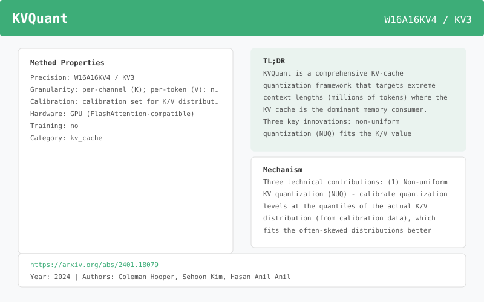

<em>KVQuant: non-uniform quantile grid for K/V + per-channel K + sparse FP16 residual.</em>

```mermaid
flowchart LR
    A[KV tensors] --> B{Token type}
    B -->|sink + outlier tokens| C[FP16 sparse]
    B -->|normal tokens ~95%| D[Per-channel\nnon-uniform quant]
    D --> E[NF4-style bins\nKV2/KV3/KV4]
    C --> F[Compressed KV cache]
    E --> F
    F --> G[10M-token context\non single GPU]
```

> KVQuant is a comprehensive KV-cache quantization framework that targets extreme context lengths (millions of tokens) where the KV cache is the dominant memory consumer. Three key innovations: non-uniform quantization (NUQ) fits the K/V value distributions (which are not Gaussian) with per-quantile codebooks; per-channel quantization for K and per-token for V to match their respective structure; and a sparse high-precision overlay for outlier KV entries. Together, KVQuant achieves 4-bit KV cache with < 0.1% perplexity increase and enables 10M+ context length inference.

| Field | Value |
|-------|-------|
| Published at | **NeurIPS 2024** |
| Paper | [2401.18079](https://arxiv.org/abs/2401.18079) |
| Code | [SqueezeAILab/KVQuant](https://github.com/SqueezeAILab/KVQuant) |
| Precision | W16A16KV4 / KV3 |
| Granularity | per-channel (K); per-token (V); non-uniform quantization grid |
| Calibration | calibration set for K/V distribution |
| Symmetric? | asymmetric |
| Outlier handling | non-uniform quantile-based (NUQ) quantization adapts grid to K/V distribution; per-channel K |
| Hardware target | GPU (FlashAttention-compatible) |
| Training needed? | no |
| Calibration data? | yes |
| Typical degradation | < 0.5 ppl at KV4; enables 10M context on single A100 by reducing KV cache memory |
| Builds on | [rtn](#rtn) |
| Related | [kivi](#kivi) · [gear](#gear) · [think](#think) · [skvq](#skvq) |

**How it works:**

Three technical contributions: (1) Non-uniform KV quantization (NUQ) - calibrate quantization levels at the quantiles of the actual K/V distribution (from calibration data), which fits the often-skewed distributions better than uniform grids. (2) Asymmetric per-channel quantization for K: each head's K channel has a fixed distribution across tokens, so per-channel scales computed from calibration are stable and low-error. Per-token quantization for V. (3) Sparse residual: for the ~1% of KV entries with largest quantization error (the "sink" tokens plus early positions), store the FP16 value and add it to the dequantized KV at attention time.

---

---

## Low-Precision Training & Numerical Formats

Hardware-oriented floating-point formats and training recipes for using them. FP8 and MX (Microscaling) formats are now standard in H100/Blackwell training. This category is adjacent to inference quantization - the formats overlap, but the use case is accelerating training rather than compressing inference.

### ScaleSweep · W4A4KV4 (NVFP4 / FP4) · LP Training · 2026-05

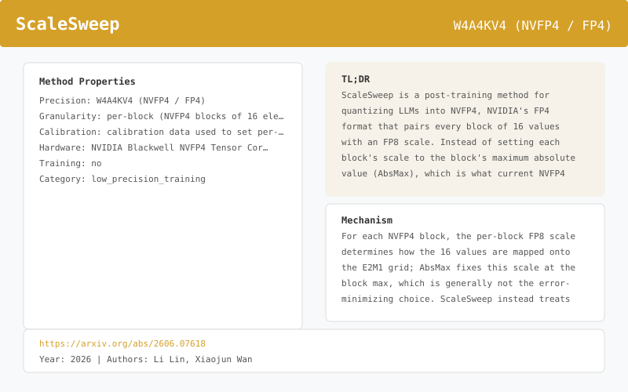

<em>ScaleSweep: per-block NVFP4 scale chosen by a bounded sweep that minimizes MSE/WMSE, vs. fixed AbsMax initialization.</em>

```mermaid
flowchart LR
    A[FP32 / BF16 model] --> B[Cast to\nW4A4KV4 NVFP4 / FP4]
    B --> C[Low-precision GEMM\non hardware tensor cores]
    C --> D[Cast back for\naccumulation]
    D --> E[FP32 master weights\noptimizer state]
    E --> F[Higher training\nthroughput]
```

> ScaleSweep is a post-training method for quantizing LLMs into NVFP4, NVIDIA's FP4 format that pairs every block of 16 values with an FP8 scale. Instead of setting each block's scale to the block's maximum absolute value (AbsMax), which is what current NVFP4 pipelines do, ScaleSweep tries a range of candidate scales for each block and keeps the one that minimizes the reconstruction error against the original block. To keep this cheap, the authors derive lower and upper bounds on where the best scale can possibly lie under mean-squared-error and weighted-mean-squared-error objectives, so only a small set of candidates needs to be checked. The result is a near-drop-in replacement for the quantization operator that adds little overhead and works when weights, activations, KV cache, and query states are all pushed to 4-bit.

| Field | Value |
|-------|-------|
| Published at | arXiv (preprint) |
| Paper | [2606.07618](https://arxiv.org/abs/2606.07618) |
| Precision | W4A4KV4 (NVFP4 / FP4) |
| Granularity | per-block (NVFP4 blocks of 16 elements with an FP8 block scale) |
| Calibration | calibration data used to set per-block scales; per-block scale selected by sweeping candidates that minimize MSE/WMSE reconstruction error |
| Symmetric? | symmetric |
| Outlier handling | fine-grained per-block FP8 scales whose values are searched (not just AbsMax) to better fit each block's range |
| Hardware target | NVIDIA Blackwell NVFP4 Tensor Cores |
| Training needed? | no |
| Calibration data? | yes |
| Typical degradation | preserves >93% of full-precision performance under end-to-end NVFP4 quantization of weights, activations, KV cache, and query states on Llama (3.1/3.2) and Qwen3 models (eval suite incl. WikiText-2, MMLU-Pro, GSM8K, HellaSwag, Winogrande, IFEval) |
| Builds on | [nvfp4](#nvfp4) |
| Related | [nvfp4](#nvfp4) · [mx-formats](#mx-formats) · [smoothquant](#smoothquant) · [quarot](#quarot) · [spinquant](#spinquant) |

**How it works:**

For each NVFP4 block, the per-block FP8 scale determines how the 16 values are mapped onto the E2M1 grid; AbsMax fixes this scale at the block max, which is generally not the error- minimizing choice. ScaleSweep instead treats the scale as a free parameter and sweeps over feasible candidates, selecting the one that minimizes MSE or WMSE between the original block and its quantized-then-dequantized reconstruction. A theoretical analysis of NVFP4 quantization yields provable lower and upper bounds on the optimal scale, which shrink the candidate set enough that the sweep cost is negligible relative to the baseline quantization operator while still containing the optimum. The scheme is applied end-to-end across weights, activations, KV cache, and query states.

---

### MixFP4 · W4A8 · LP Training · 2026-05

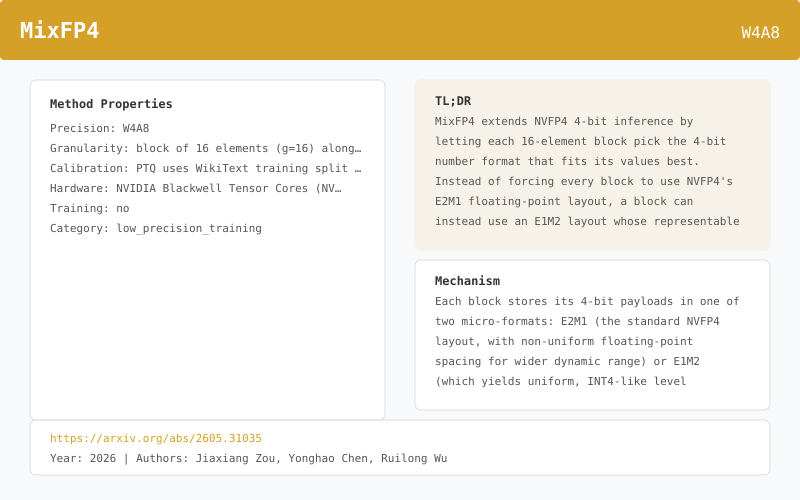

<em>MixFP4: per-16-block choice of E2M1 (FP4) vs E1M2 (INT4-like) micro-format, selector packed into the FP8 E4M3 scale sign bit; both decode to a shared E2M2 compute format on the NVFP4 Tensor Core path.</em>

```mermaid
flowchart LR
    A[FP32 / BF16 model] --> B[Cast to\nW4A8]
    B --> C[Low-precision GEMM\non hardware tensor cores]
    C --> D[Cast back for\naccumulation]
    D --> E[FP32 master weights\noptimizer state]
    E --> F[Higher training\nthroughput]
```

> MixFP4 extends NVFP4 4-bit inference by letting each 16-element block pick the 4-bit number format that fits its values best. Instead of forcing every block to use NVFP4's E2M1 floating-point layout, a block can instead use an E1M2 layout whose representable values are evenly spaced like INT4, which suits blocks whose statistics are more uniform. The choice for each block is made by comparing quantization error (MSE) between the two layouts during quantization, and the single bit recording that choice is tucked into the unused sign bit of the FP8 block scale, so no extra storage is needed. At inference both layouts are decoded into one shared internal representation, so the same matrix-multiply hardware path works for either, and the only cost is a small amount of extra tensor-core logic.

| Field | Value |
|-------|-------|
| Published at | arXiv (preprint) |
| Paper | [2605.31035](https://arxiv.org/abs/2605.31035) |
| Precision | W4A8 |
| Granularity | block of 16 elements (g=16) along the reduction dimension, each block shares one FP8 E4M3 scale |
| Calibration | PTQ uses WikiText training split (512-1024 samples) for calibration-based baselines; per-block format choice decided by MSE at quantization time |
| Symmetric? | symmetric |
| Outlier handling | per-block choice between E2M1 (wider dynamic range) and E1M2 (uniform spacing) plus FP8 E4M3 block scale capturing block dynamic range |
| Hardware target | NVIDIA Blackwell Tensor Cores (NVFP4-compatible MMA/GEMM path); overhead synthesized at TSMC 28nm 1GHz (3.1% area, 1.5% power) |
| Training needed? | no |
| Calibration data? | yes |
| Typical degradation | WikiText perplexity: Llama-3.1-8B 8.06 (vs NVFP4 8.26), Qwen3-8B 12.39 (vs 12.74), Llama-3.2-1B 13.48 (vs 13.90) |
| Builds on | [nvfp4](#nvfp4) · [mx-formats](#mx-formats) |
| Related | [nvfp4](#nvfp4) · [mx-formats](#mx-formats) · [fp8-training](#fp8-training) |

**How it works:**

Each block stores its 4-bit payloads in one of two micro-formats: E2M1 (the standard NVFP4 layout, with non-uniform floating-point spacing for wider dynamic range) or E1M2 (which yields uniform, INT4-like level spacing, mapping to a symmetric range under 2x scaling). The per-block format is selected by whichever minimizes MSE for that block. The 1-bit format selector is packed into the sign bit of the FP8 E4M3 first-level block scale, adding zero metadata overhead while reusing NVFP4's existing scale hierarchy. Both micro-formats are decoded into a unified internal E2M2 compute representation so the standard block-scaled MMA/GEMM execution path is unchanged and the datapath is not duplicated.

---

### MXFP4-RL Error Decomposition · MXFP4 (W4A4 microscaling, E2M1 + E8M0 block scale) · LP Training · 2026-05

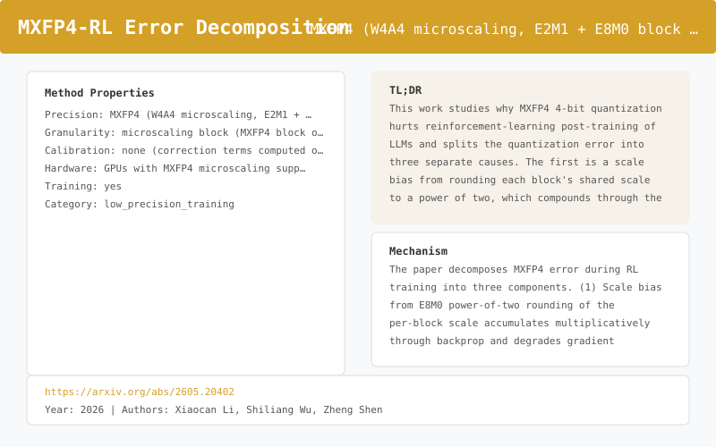

<em>MXFP4 RL error split into scale bias (gradients), deadzone (rollouts), and grid noise (entropy), each with a targeted correction; a residual irreducible floor remains.</em>

```mermaid
flowchart LR
    A[FP32 / BF16 model] --> B[Cast to\nMXFP4 W4A4 microscaling, E2M1 + E8M0 block scale]
    B --> C[Low-precision GEMM\non hardware tensor cores]
    C --> D[Cast back for\naccumulation]
    D --> E[FP32 master weights\noptimizer state]
    E --> F[Higher training\nthroughput]
```

> This work studies why MXFP4 4-bit quantization hurts reinforcement-learning post-training of LLMs and splits the quantization error into three separate causes. The first is a scale bias from rounding each block's shared scale to a power of two, which compounds through the backward pass and corrupts gradients. The second is a deadzone effect where small values get zeroed out, which lowers the quality of generated rollouts. The third is grid noise from snapping values to the nearest 4-bit level, which inflates the policy's entropy. For each cause the authors apply a matching fix (a finer macro-block scale, a fallback path that keeps a few important entries at higher precision, and an adaptive injected-noise term), and report that the combined recipe brings a quantized RL run back to BF16-level results on Qwen2.5-3B and slightly past it on a 30B MoE model.

| Field | Value |
|-------|-------|
| Published at | arXiv (preprint) |
| Paper | [2605.20402](https://arxiv.org/abs/2605.20402) |
| Precision | MXFP4 (W4A4 microscaling, E2M1 + E8M0 block scale) |
| Granularity | microscaling block (MXFP4 block of 32 elements share one E8M0 power-of-two scale) |
| Calibration | none (correction terms computed online during RL post-training; no offline calibration set) |
| Symmetric? | symmetric |
| Outlier handling | outlier fallback that keeps deadzone/large entries at higher precision, plus macro-block scaling to reduce power-of-two scale bias |
| Hardware target | GPUs with MXFP4 microscaling support (e.g. Blackwell-class FP4 Tensor Cores) |
| Training needed? | yes |
| Calibration data? | no |
| Typical degradation | recovers BF16 accuracy to within 0.7% on Qwen2.5-3B (dense) and exceeds BF16 by +1.0% on Qwen3-30B-A3B-Base (MoE) for RL post-training |
| Builds on | [mx-formats](#mx-formats) · [nvfp4](#nvfp4) |
| Related | [mx-formats](#mx-formats) · [nvfp4](#nvfp4) · [fp8-training](#fp8-training) · [ramp](#ramp) |

**How it works:**

The paper decomposes MXFP4 error during RL training into three components. (1) Scale bias from E8M0 power-of-two rounding of the per-block scale accumulates multiplicatively through backprop and degrades gradient accuracy; it is mitigated by macro-block scaling that uses a finer/higher-precision scaling factor across blocks. (2) Deadzone truncation zeros out small magnitudes and lowers rollout quality; it is recovered by an outlier-fallback path that retains the affected (and large) entries at higher precision, which also partially offsets the scale bias. (3) Grid noise from nearest-4-bit rounding raises policy entropy; it is controlled by adaptive quantization noise (AQN) that shapes the injected rounding noise. A residual 'irreducible floor' remains after all three corrections.

---

### MXFP4 Pretraining (Deterministic Hadamard) · MXFP4 (E2M1 elements, E8M0 block scale) for Fprop/Dgrad/Wgrad; FP32 master weights · LP Training · 2026-05

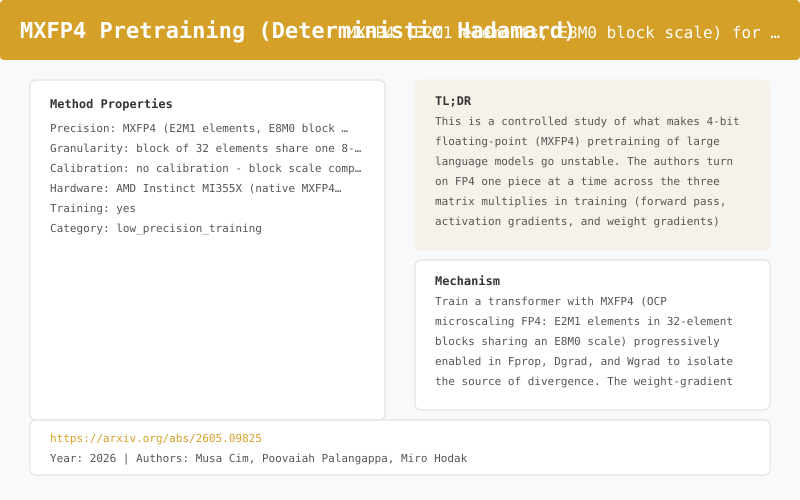

<em>MXFP4 pretraining: FP4 enabled across Fprop/Dgrad/Wgrad; Wgrad drives instability, fixed by a deterministic Hadamard rotation before quantization.</em>

```mermaid
flowchart LR
    A[FP32 / BF16 model] --> B[Cast to\nMXFP4 E2M1 elements, E8M0 block scale for Fprop/Dgrad/Wgrad; FP32 master weights]
    B --> C[Low-precision GEMM\non hardware tensor cores]
    C --> D[Cast back for\naccumulation]
    D --> E[FP32 master weights\noptimizer state]
    E --> F[Higher training\nthroughput]
```

> This is a controlled study of what makes 4-bit floating-point (MXFP4) pretraining of large language models go unstable. The authors turn on FP4 one piece at a time across the three matrix multiplies in training (forward pass, activation gradients, and weight gradients) while holding everything else fixed, and find that quantizing the weight gradient is the part that actually breaks convergence; the other two only slightly increase the number of tokens needed to reach a given loss. They then test ways to fix the weight-gradient problem and find that stochastic rounding and randomized Hadamard rotations do not help once the weight gradient is in FP4, but applying a fixed (deterministic) Hadamard rotation before quantization brings training back to stable convergence. Their conclusion is that the instability comes from structured errors introduced by block-level micro-scaling along sensitive gradient paths, not from a lack of randomness. All experiments use native MXFP4 on AMD Instinct MI355X GPUs, avoiding software emulation.

| Field | Value |
|-------|-------|
| Published at | arXiv (preprint) |
| Paper | [2605.09825](https://arxiv.org/abs/2605.09825) |
| Precision | MXFP4 (E2M1 elements, E8M0 block scale) for Fprop/Dgrad/Wgrad; FP32 master weights |
| Granularity | block of 32 elements share one 8-bit E8M0 exponent scale (OCP MX) |
| Calibration | no calibration - block scale computed from block max during training |
| Symmetric? | symmetric |
| Outlier handling | deterministic Hadamard rotations applied before quantization to redistribute structured micro-scaling errors along sensitive gradient paths |
| Hardware target | AMD Instinct MI355X (native MXFP4 Tensor Core support) |
| Training needed? | yes |
| Calibration data? | no |
| Typical degradation | Llama 3.1-8B pretrained on C4: full MXFP4 (incl. Wgrad) diverges with stochastic rounding or randomized Hadamard; deterministic Hadamard rotations restore stable convergence; FP4 in Fprop+Dgrad alone adds only modest extra token requirement vs BF16 |
| Builds on | [mx-formats](#mx-formats) · [fp8-training](#fp8-training) |
| Related | [mx-formats](#mx-formats) · [nvfp4](#nvfp4) · [fp8-training](#fp8-training) · [deepseek-fp8](#deepseek-fp8) · [quarot](#quarot) · [spinquant](#spinquant) |

**How it works:**

Train a transformer with MXFP4 (OCP microscaling FP4: E2M1 elements in 32-element blocks sharing an E8M0 scale) progressively enabled in Fprop, Dgrad, and Wgrad to isolate the source of divergence. The weight-gradient (Wgrad) GEMM is identified as the dominant driver of convergence degradation. Because the instability stems from structured micro-scaling quantization error rather than insufficient stochasticity, randomized interventions (stochastic rounding, randomized Hadamard) fail, while a deterministic Hadamard rotation applied before quantizing the gradient consistently decorrelates and spreads the error to restore stable optimization. Native MI355X FP4 hardware is used so the analysis reflects real hardware behavior rather than emulation.

---

### AGoQ · W16A4 (gradients 8-bit; weights BF16, activations ~4-bit, gradients INT8) · LP Training · 2026-05

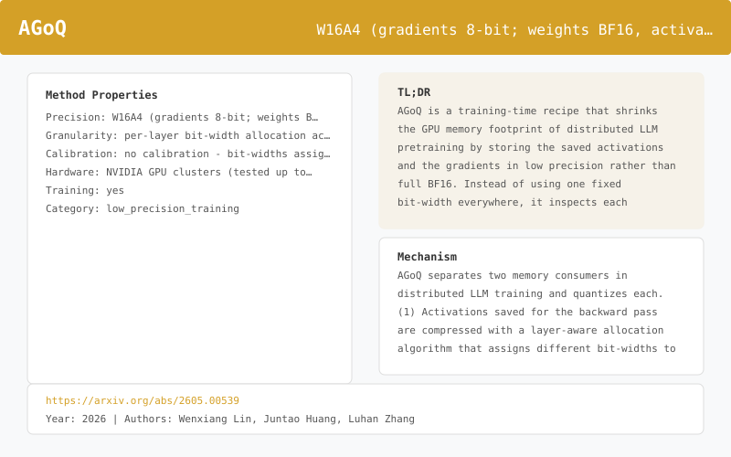

<em>AGoQ: layer-aware ~4-bit activation storage plus 8-bit gradient storage and 8-bit All-Reduce for memory-efficient distributed LLM training.</em>

```mermaid
flowchart LR
    A[FP32 / BF16 model] --> B[Cast to\nW16A4 gradients 8-bit; weights BF16, activations approx 4-bit, gradients INT8]
    B --> C[Low-precision GEMM\non hardware tensor cores]
    C --> D[Cast back for\naccumulation]
    D --> E[FP32 master weights\noptimizer state]
    E --> F[Higher training\nthroughput]
```

> AGoQ is a training-time recipe that shrinks the GPU memory footprint of distributed LLM pretraining by storing the saved activations and the gradients in low precision rather than full BF16. Instead of using one fixed bit-width everywhere, it inspects each transformer block and pipeline stage and hands out activation bits according to how much each layer can tolerate, pushing average activation storage down toward 4 bits. Gradients are kept in 8 bits and exchanged with an 8-bit All-Reduce that preserves precision, cutting both memory and inter-GPU communication time. Across LLaMA models from 8B to 32B parameters on clusters up to 64 GPUs, it reports up to 52% memory savings and up to 1.34x faster training versus Megatron-LM, COAT, and DeepSpeed with little convergence loss.

| Field | Value |
|-------|-------|
| Published at | arXiv (preprint) |
| Paper | [2605.00539](https://arxiv.org/abs/2605.00539) |
| Precision | W16A4 (gradients 8-bit; weights BF16, activations ~4-bit, gradients INT8) |
| Granularity | per-layer bit-width allocation across transformer blocks and pipeline stages |
| Calibration | no calibration - bit-widths assigned by layer type/sensitivity, scales computed dynamically during training |
| Symmetric? | symmetric |
| Outlier handling | layer-aware bit allocation: sensitive layers/pipeline stages keep more activation bits while tolerant ones drop toward 4-bit |
| Hardware target | NVIDIA GPU clusters (tested up to 64 GPUs), distributed training with pipeline/data parallelism |
| Training needed? | yes |
| Calibration data? | no |
| Typical degradation | negligible convergence/loss degradation pretraining LLaMA models (8B-32B); comparable downstream task accuracy vs BF16 |
| Builds on | [fp8-training](#fp8-training) |
| Related | [fp8-training](#fp8-training) · [mx-formats](#mx-formats) · [deepseek-fp8](#deepseek-fp8) |

**How it works:**

AGoQ separates two memory consumers in distributed LLM training and quantizes each. (1) Activations saved for the backward pass are compressed with a layer-aware allocation algorithm that assigns different bit-widths to different transformer blocks based on layer type and pipeline-stage sensitivity, yielding an average near 4-bit activation store while keeping accuracy. (2) Gradients are quantized to 8 bits for both storage and communication, using a precision-preserving 8-bit All-Reduce so that the reduced gradients remain accurate enough for stable convergence. Weights and the optimizer master copy remain in BF16; the quantization touches only the stored activations and exchanged gradients, so memory and communication shrink without changing the model math materially.

---

### DeepSeek FP8 Training · FP8 (E4M3 forward / E5M2 gradient) with fine-grained block scaling · LP Training · 2024-12

<em>Fine-grained FP8: 1×128 weight tiles + 128×128 activation tiles + FP32 accumulation.</em>

```mermaid
flowchart LR
    A[DeepSeek-V3 training\nBF16 baseline] --> B[Fine-grained FP8:\n1x128 weight tiles]
    B --> C[128x128 activation\ntiles E4M3]
    C --> D[E5M2 gradient tiles]
    D --> E[FP32 accumulators\nprevents drift]
    E --> F[FP8 GEMM on H800\ntensor cores]
    F --> G[671B MoE trained\nfull FP8 pipeline]
```

> DeepSeek-V3 (671B MoE model) was trained with FP8 mixed-precision throughout, making it one of the largest models trained with FP8. The key engineering contribution is a fine-grained block scaling scheme where weight scales are per 1×128 tile and activation scales are per 128×128 tile, with higher-precision accumulation in FP32 and careful clipping to prevent overflow. The training recipe demonstrates that FP8 is stable for very large MoE models with proper scale management, and achieves comparable quality to BF16 training at lower cost.

| Field | Value |
|-------|-------|
| Published at | arXiv (preprint) |
| Paper | [2412.19437](https://arxiv.org/abs/2412.19437) |
| Code | [deepseek-ai/DeepSeek-V3](https://github.com/deepseek-ai/DeepSeek-V3) |
| Precision | FP8 (E4M3 forward / E5M2 gradient) with fine-grained block scaling |
| Granularity | tile-level (1×128 rows, 128×128 columns) scale factors |
| Calibration | dynamic during training |
| Symmetric? | symmetric |
| Outlier handling | fine-grained tile-level scaling with high-precision accumulation and clipping |
| Hardware target | NVIDIA H800 (FP8 Tensor Cores) |
| Training needed? | yes |
| Calibration data? | no |
| Typical degradation | stable FP8 training for 671B MoE model with no performance degradation |
| Builds on | [fp8-training](#fp8-training) |
| Related | [fp8-training](#fp8-training) · [mx-formats](#mx-formats) · [moqe](#moqe) |

**How it works:**

DeepSeek's FP8 recipe uses "fine-grained quantization" - smaller tiles than the standard per-tensor approach. Weights: each 1×128 row segment has its own FP8 scale. Activations: each 128×128 block has its own FP8 scale. This finer granularity is critical for MoE models where different experts have very different activation magnitudes. Accumulation is done in FP32 before rescaling back to BF16/FP8. An "activation anomaly" issue (some activation channels becoming very large) is handled by clipping with a smooth clipping function rather than hard clipping, preventing scale explosion.

---

### NVFP4 · W4 A8/A16 (NVFP4 weights + FP8/FP16 activations) · LP Training · 2024-03

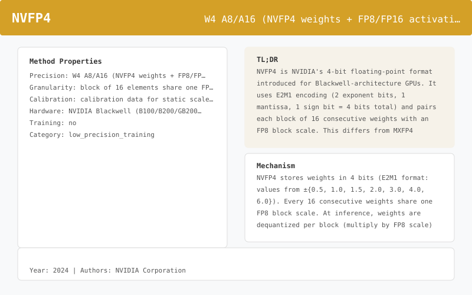

<em>NVFP4: E2M1 per-element + FP8 per-16-block scale; native Blackwell W4A8 Tensor Core support.</em>

```mermaid
flowchart LR
    A[FP16 weight tensor] --> B[Tile into 16-element\nblocks]
    B --> C[Shared E8 scale\nper block]
    C --> D[Each element:\nE2M1 FP4 value]
    D --> E[NVFP4 tensor\nBlackwell GB200 native]
    E --> F[approx 2x memory vs FP8\nhigher throughput density]
```

> NVFP4 is NVIDIA's 4-bit floating-point format introduced for Blackwell-architecture GPUs. It uses E2M1 encoding (2 exponent bits, 1 mantissa, 1 sign bit = 4 bits total) and pairs each block of 16 consecutive weights with an FP8 block scale. This differs from MXFP4 (blocks of 32, E8M0 scale) in having smaller blocks and a higher-precision (FP8) scale. NVFP4 with FP8 activation achieves very high throughput on Blackwell's native W4A8 Tensor Cores and is the primary quantization format for Blackwell inference.

| Field | Value |
|-------|-------|
| Published at | arXiv (preprint) |
| Paper | [2509.25149](https://arxiv.org/abs/2509.25149) |
| Code | [NVIDIA/TensorRT-LLM](https://github.com/NVIDIA/TensorRT-LLM) |
| Blog / post | [link](https://developer.nvidia.com/blog/nvidia-blackwell-gpu-architecture/) |
| Precision | W4 A8/A16 (NVFP4 weights + FP8/FP16 activations) |
| Granularity | block of 16 elements share one FP8 scale |
| Calibration | calibration data for static scale computation |
| Symmetric? | symmetric |
| Outlier handling | block-level FP8 scale captures block dynamic range |
| Hardware target | NVIDIA Blackwell (B100/B200/GB200/RTX 50xx) |
| Training needed? | no |
| Calibration data? | yes |
| Typical degradation | < 1 ppl at W4A8 vs FP16 on LLaMA-3 family |
| Builds on | [mx-formats](#mx-formats) · [fp8-training](#fp8-training) |
| Related | [mx-formats](#mx-formats) · [fp8-training](#fp8-training) · [marlin](#marlin) |

**How it works:**

NVFP4 stores weights in 4 bits (E2M1 format: values from ±{0.5, 1.0, 1.5, 2.0, 3.0, 4.0, 6.0}). Every 16 consecutive weights share one FP8 block scale. At inference, weights are dequantized per block (multiply by FP8 scale) and the matmul proceeds with FP8/FP16 activations. The combination of native Blackwell NVFP4 Tensor Cores and the compact 4-bit format yields roughly 2× the effective throughput of FP8 inference at comparable quality, enabling LLaMA-3 70B and similar models to run at very high batch throughput.

---

### MX Formats (MXFP8/MXFP6/MXFP4) · MXFP8 / MXFP6 / MXFP4 / MXINT8 · LP Training · 2023-10

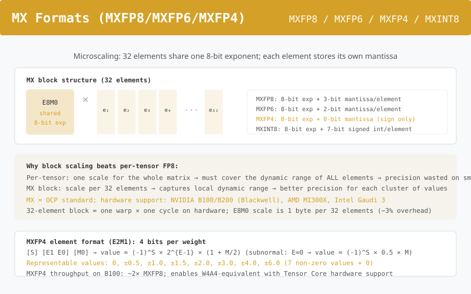

<em>MX block-float: 32 elements share one 8-bit exponent; elements store mantissa bits.</em>

```mermaid
flowchart LR
    A[Tensor block\n32 elements] --> B[Shared scale\nexponent E8]
    B --> C{MX format}
    C -->|MXFP8| D[E4M3 or E5M2\nper element]
    C -->|MXFP4| E[E2M1\nper element]
    C -->|MXINT8| F[INT8\nper element]
    D --> G[OCP standard\nBlackwell / MI300X]
    E --> G
    F --> G
```

> Microscaling (MX) is an industry standard for block floating-point formats, standardized by the Open Compute Project (OCP) with participation from AMD, ARM, Intel, Meta, Microsoft, NVIDIA, Qualcomm, and Samsung. Each MX format defines blocks of 32 elements that share a single 8-bit exponent scale (E8M0, i.e. just an 8-bit integer exponent with no mantissa). Within a block, each element has its own mantissa bits: MXFP8 (3 mantissa), MXFP6 (2), MXFP4 (0), MXINT8 (7-bit signed int). This block-scale approach provides more dynamic range than per-tensor quantization with lower overhead than per-element scales.

| Field | Value |
|-------|-------|
| Published at | **NeurIPS 2023** |
| Paper | [2310.10537](https://arxiv.org/abs/2310.10537) |
| Precision | MXFP8 / MXFP6 / MXFP4 / MXINT8 |
| Granularity | block of 32 elements share one 8-bit E8M0 exponent scale |
| Calibration | no calibration - block scale computed from block max |
| Symmetric? | symmetric |
| Outlier handling | block-level exponent covers the block's dynamic range; outliers within a block are captured by the block scale |
| Hardware target | NVIDIA Blackwell (B100/B200/GB200), AMD MI300X, Intel Gaudi, ARM |
| Training needed? | yes |
| Calibration data? | no |
| Typical degradation | MXFP8: comparable to FP8; MXFP4: slight quality reduction vs MXFP8 |
| Builds on | [fp8-training](#fp8-training) |
| Related | [fp8-training](#fp8-training) · [nvfp4](#nvfp4) · [deepseek-fp8](#deepseek-fp8) |

**How it works:**

An MX tensor is divided into contiguous blocks of 32 elements. For each block: (1) find the maximum absolute value, compute the E8M0 scale = floor(log₂(max)) as an 8-bit integer exponent; (2) scale each element by 2^{-scale} and round to the element format (e.g. FP4 E2M1 for MXFP4). Storage: 32 × b bits + 8 bits per block (where b is element bit-width). Compared to per-tensor FP8: block scaling captures local dynamic range variation (e.g. outlier channels) without per-element overhead. Compared to INT8: floating-point mantissa bits provide non-linear grid spacing. Supported natively in Blackwell GPU Tensor Cores.

---

### FP8 Training (Transformer Engine) · FP8 (E4M3 forward / E5M2 gradient) · LP Training · 2022-09

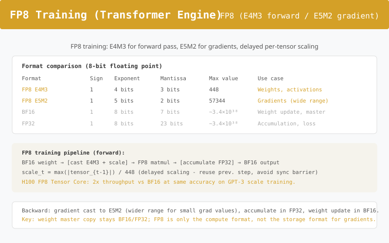

<em>FP8 training: E4M3 for forward pass, E5M2 for gradients, with delayed per-tensor scaling.</em>

```mermaid
flowchart LR
    A[BF16 training] --> B[Cast forward pass\nto E4M3 FP8]
    B --> C[FP8 GEMM\nH100 tensor cores]
    C --> D[Cast gradients\nto E5M2 FP8]
    D --> E[FP32 master weights\n+ optimizer state]
    E --> F[Loss scaling\nprevents underflow]
    F --> G[approx 2x throughput\nvs BF16]
```

> FP8 is a family of 8-bit floating-point formats designed to accelerate deep learning on NVIDIA H100 and later GPUs. Two variants are used in training: E4M3 (4 exponent bits, 3 mantissa, range up to 448) for activations and weights in the forward pass, and E5M2 (5 exponent, 2 mantissa, range up to 57344) for gradients in the backward pass. The Transformer Engine library automates the casting and scale management, using "delayed scaling" (scale from previous step's tensor max) to avoid a synchronization barrier. FP8 training achieves ~2× throughput vs BF16 at equivalent quality on GPT-3-scale models.

| Field | Value |
|-------|-------|
| Published at | arXiv (preprint) |
| Paper | [2209.05433](https://arxiv.org/abs/2209.05433) |
| Code | [NVIDIA/TransformerEngine](https://github.com/NVIDIA/TransformerEngine) |
| Precision | FP8 (E4M3 forward / E5M2 gradient) |
| Granularity | per-tensor with delayed scaling |
| Calibration | no calibration - scales computed dynamically during training |
| Symmetric? | symmetric |
| Outlier handling | delayed scaling: scale is computed from the max of the previous iteration's tensor |
| Hardware target | NVIDIA H100 / H800 / H20 (FP8 Tensor Cores) |
| Training needed? | yes |
| Calibration data? | no |
| Typical degradation | < 0.5% training loss degradation vs BF16 on most transformer models |
| Related | [mx-formats](#mx-formats) · [deepseek-fp8](#deepseek-fp8) · [nvfp4](#nvfp4) |

**How it works:**

FP8 training uses mixed-precision: weights, activations, and gradient computation are cast to FP8 E4M3/E5M2 for tensor core operations, while weight updates and accumulation happen in FP32 or BF16. A per-tensor scale s is maintained alongside each FP8 tensor; values are stored as FP8 × s. "Delayed scaling" reuses the previous iteration's scale (updated each step), avoiding an expensive all-reduce to find the current max. The Transformer Engine (NVIDIA's implementation) wraps PyTorch modules to automatically handle casting, scale management, and the custom FP8 GEMM kernels.

---

---

## MoE-Specific Quantization

Mixture-of-Experts models (Mixtral, DeepSeek-MoE, etc.) pose unique quantization challenges: the total parameter count is large (many experts), but only a few experts activate per token, so expert weights are rarely observed in calibration. Methods in this category exploit MoE structure for better compression.

### AlphaQ · W3.5A16 (per-expert mixed, ~3.5 avg weight bits) · MoE Quant · 2026-06

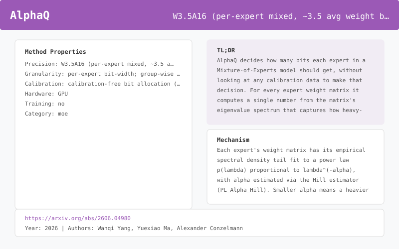

<em>AlphaQ: per-expert power-law alpha (Hill estimator) on the weight spectrum drives a budget-constrained mixed-precision bit allocation, then GPTQ per expert.</em>

```mermaid
flowchart LR
    A[MoE model\nmany experts] --> B[Analyze per-expert\nactivation frequency]
    B --> C[Assign bit-width\nby importance]
    C --> D[High-freq experts:\nhigher precision]
    D --> E[Low-freq experts:\nlower precision]
    E --> F[Mixed-precision\nMoE inference]
```

> AlphaQ decides how many bits each expert in a Mixture-of-Experts model should get, without looking at any calibration data to make that decision. For every expert weight matrix it computes a single number from the matrix's eigenvalue spectrum that captures how heavy- tailed that spectrum is, drawing on Heavy-Tailed Self-Regularization theory: experts whose spectra are more heavy-tailed are treated as better-trained and more important, so they keep more bits, while experts with lighter tails are pushed to lower precision. These per-expert scores feed a budget-constrained optimization that picks the bit assignment minimizing total quantization error under a target average bit-width. Each expert is then quantized with group-wise asymmetric GPTQ. The result is roughly 3.5 average bits per expert weight with accuracy close to the full-precision model and over 4x memory reduction.

| Field | Value |
|-------|-------|
| Published at | arXiv (preprint) |
| Paper | [2606.04980](https://arxiv.org/abs/2606.04980) |
| Code | [Superone77/AlphaQ](https://github.com/Superone77/AlphaQ) |
| Blog / post | [link](https://www.liquid.ai/research/alphaq-calibration-free-bit-allocation-for-mixture-of-experts-quantization) |
| Precision | W3.5A16 (per-expert mixed, ~3.5 avg weight bits) |
| Granularity | per-expert bit-width; group-wise weight quantization (group size 128) |
| Calibration | calibration-free bit allocation (HT-SR spectral statistic from weights only); the base per-expert GPTQ quantizer still uses 128 WikiText-2 samples |
| Symmetric? | asymmetric |
| Outlier handling | experts with heavier-tailed weight spectra (lower power-law alpha) get higher bit-widths; GPTQ error compensation within each expert |
| Hardware target | GPU |
| Training needed? | no |
| Calibration data? | no |
| Typical degradation | near-BF16 accuracy at ~3.5 avg bits: Qwen1.5-MoE WikiText-2 PPL 7.38 / 68.04% avg acc; DeepSeek-V2-Lite PPL 6.44 / 70.07%; Mixtral-8x7B PPL 4.23 / 74.29% |
| Builds on | [gptq](#gptq) · [moqe](#moqe) |
| Related | [moqe](#moqe) · [mc-moe](#mc-moe) · [gptq](#gptq) · [squeezellm](#squeezellm) |

**How it works:**

Each expert's weight matrix has its empirical spectral density tail fit to a power law p(lambda) proportional to lambda^(-alpha), with alpha estimated via the Hill estimator (PL_Alpha_Hill). Smaller alpha means a heavier tail, which HT-SR theory associates with a better-trained, higher-quality layer that should receive more bits; larger alpha (lighter tail) experts can be quantized more aggressively. Given a global average-bit budget, AlphaQ solves a budget-constrained allocation that assigns discrete bit-widths to experts to minimize total expected quantization error, and then applies group-wise asymmetric GPTQ at the chosen bit-width per expert. The allocation itself needs no forward passes or calibration data, only the weights, which lets it work when training data is unavailable.

---

### GEMQ · W1.5/W2/W2.5/W3 A16 (per-expert mixed, average bits-per-expert budget) · MoE Quant · 2026-05

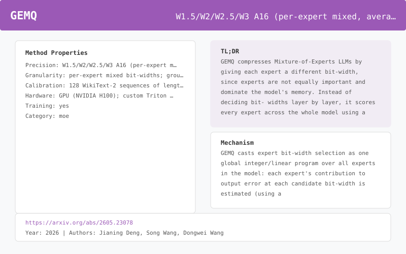

<em>GEMQ: a global linear program allocates per-expert bit-widths from model-wide quantization-error importance, followed by router fine-tuning, iterated progressively down to ~1.5 bits/expert.</em>

```mermaid
flowchart LR
    A[MoE model\nmany experts] --> B[Analyze per-expert\nactivation frequency]
    B --> C[Assign bit-width\nby importance]
    C --> D[High-freq experts:\nhigher precision]
    D --> E[Low-freq experts:\nlower precision]
    E --> F[Mixed-precision\nMoE inference]
```

> GEMQ compresses Mixture-of-Experts LLMs by giving each expert a different bit-width, since experts are not equally important and dominate the model's memory. Instead of deciding bit- widths layer by layer, it scores every expert across the whole model using a quantization- error estimate and then solves a single linear program that picks the bit assignment for all experts at once under a target average-bits-per-expert budget. Because quantizing experts shifts which experts the router picks, it also lightly fine-tunes the routers so they route well to the now-quantized experts. The whole thing runs as a progressive loop that re- estimates importance and re-allocates bits as it pushes down to very low budgets like 1.5 bits per expert, and ships with Triton kernels so the low-bit experts actually run faster and use less memory.

| Field | Value |
|-------|-------|
| Published at | **ICML 2026** |
| Paper | [2605.23078](https://arxiv.org/abs/2605.23078) |
| Code | [jndeng/GEMQ](https://github.com/jndeng/GEMQ) |
| Precision | W1.5/W2/W2.5/W3 A16 (per-expert mixed, average bits-per-expert budget) |
| Granularity | per-expert mixed bit-widths; group-wise (group size 128) within each expert |
| Calibration | 128 WikiText-2 sequences of length 2048 (optionally augmented with MATH/C4 for math tasks) |
| Symmetric? | asymmetric |
| Outlier handling | globally important experts receive higher bit-widths via the linear-programming allocation |
| Hardware target | GPU (NVIDIA H100); custom Triton kernels for real low-bit MoE inference |
| Training needed? | yes |
| Calibration data? | yes |
| Typical degradation | Mixtral-8x7B at 2.5 bits/expert: WikiText-2 5.03 ppl (FP 3.84), 65.13% avg 7-task 0-shot (FP 70.97, -8.2%); DeepSeekV2-Lite at 2.5 bits/expert: WikiText-2 6.65 ppl (FP 6.31) |
| Builds on | [gptq](#gptq) · [moqe](#moqe) |
| Related | [moqe](#moqe) · [mc-moe](#mc-moe) · [gptq](#gptq) · [awq](#awq) · [spqr](#spqr) |

**How it works:**

GEMQ casts expert bit-width selection as one global integer/linear program over all experts in the model: each expert's contribution to output error at each candidate bit-width is estimated (using a second-order/quantization-error proxy rather than per-layer activation- frequency heuristics), and the LP minimizes total error subject to a global average-bits- per-expert budget, capturing model-wide rather than layer-local importance. After allocation, each expert is quantized with group-wise asymmetric GPTQ (group size 128). To counter the routing distribution shift introduced by quantization, the gating routers are fine-tuned with AdamW (lr 1e-4, cross-entropy loss, one epoch) on the calibration set while all other weights stay fixed. These steps are wrapped in a progressive framework that steps the budget down (e.g. 2.5 to 2.0 to 1.5 bpe), re-estimating importance and re-solving the LP at each stage.

---

### TileQ · W2/W3 A16 · MoE Quant · 2026-05

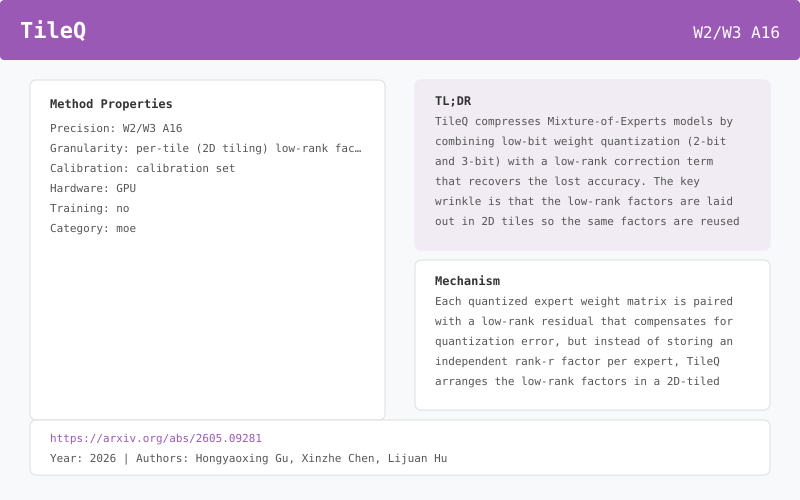

<em>TileQ: low-bit MoE experts plus 2D-tiled low-rank factors shared across input/output dims, with fused single-pass low-rank correction at inference.</em>

```mermaid
flowchart LR
    A[MoE model\nmany experts] --> B[Analyze per-expert\nactivation frequency]
    B --> C[Assign bit-width\nby importance]
    C --> D[High-freq experts:\nhigher precision]
    D --> E[Low-freq experts:\nlower precision]
    E --> F[Mixed-precision\nMoE inference]
```

> TileQ compresses Mixture-of-Experts models by combining low-bit weight quantization (2-bit and 3-bit) with a low-rank correction term that recovers the lost accuracy. The key wrinkle is that the low-rank factors are laid out in 2D tiles so the same factors are reused across both the input and output dimensions of the expert weight matrices, which keeps the extra low-rank memory small instead of growing with every expert. Because each expert otherwise needs its own low-rank pass, TileQ also fuses the low-rank computations of the activated experts into one batched operation so the correction adds little latency at inference. It is a post-training method that needs only a calibration set and no fine-tuning, and the low- rank factors are stored in FP8 with FP16 singular values to keep their footprint down.

| Field | Value |
|-------|-------|
| Published at | arXiv (preprint) |
| Paper | [2605.09281](https://arxiv.org/abs/2605.09281) |
| Code | [r/TileQ-BE20](https://anonymous.4open.science/r/TileQ-BE20) |
| Precision | W2/W3 A16 |
| Granularity | per-tile (2D tiling) low-rank factors + per-group residual quantization |
| Calibration | calibration set |
| Symmetric? | asymmetric |
| Outlier handling | LoPRo low-rank rotation (learned orthogonal transforms) before quantization |
| Hardware target | GPU |
| Training needed? | no |
| Calibration data? | yes |
| Typical degradation | WikiText-2 PPL 4.10 at 3-bit and 4.78 at 2-bit on Mixtral-8x7B (vs 3.87 FP16) |
| Builds on | [gptq](#gptq) · [aqlm](#aqlm) |
| Related | [moqe](#moqe) · [mc-moe](#mc-moe) · [gptq](#gptq) · [spqr](#spqr) |

**How it works:**

Each quantized expert weight matrix is paired with a low-rank residual that compensates for quantization error, but instead of storing an independent rank-r factor per expert, TileQ arranges the low-rank factors in a 2D-tiled structure so factors are shared across the input and output dimensions of the experts, cutting the added low-rank memory by up to ~10x. Before quantization it applies LoPRo's learned low-rank rotations to suppress outliers, and the residual weights are quantized with GPTQ/GPTVQ-style per-group quantization. At inference the multiple per-expert low-rank corrections of the activated experts are fused into a single-pass batched operation, so the extra latency over the plain quantized forward pass is held to roughly 5% rather than the 50%+ overhead of element-wise low-rank methods.

---

### MoBiE · W1A16 · MoE Quant · 2026-04

<em>MoBiE: cross-expert joint SVD strips shared redundancy, gradient-aware Hessian saliency guides 1-bit binarization, and null-space error constraint suppresses router shift in MoE LLMs.</em>

```mermaid
flowchart LR
    A[MoE model\nmany experts] --> B[Analyze per-expert\nactivation frequency]
    B --> C[Assign bit-width\nby importance]
    C --> D[High-freq experts:\nhigher precision]
    D --> E[Low-freq experts:\nlower precision]
    E --> F[Mixed-precision\nMoE inference]
```

> MoBiE is a post-training method for squeezing Mixture-of-Experts language models down to 1-bit weights. Plain binary methods built for dense models stumble on MoE models for three reasons: experts overlap a lot so binarizing each one separately wastes bits, the usual per- layer importance score ignores how a weight affects the overall loss, and crushing weights to one bit shifts which expert the router picks. MoBiE tackles each: it factorizes weights jointly across experts with SVD to strip shared redundancy before binarizing, blends global loss gradients into the local Hessian so salient weights are scored more accurately, and adds an error constraint tied to the input null space so the binarized weights perturb the router as little as possible. It does this without extra storage cost and reports large quality recovery over earlier binary baselines on Qwen3-30B-A3B.

| Field | Value |
|-------|-------|
| Published at | arXiv (preprint) |
| Paper | [2604.06798v3](https://arxiv.org/abs/2604.06798v3) |
| Precision | W1A16 |
| Granularity | per-expert (binary weights), with joint SVD across experts |
| Calibration | calibration set used for Hessian/gradient-based importance and null-space estimation |
| Symmetric? | asymmetric |
| Outlier handling | salient-weight importance estimation (global loss gradients combined with local Hessian) keeps important weights better represented during binarization |
| Hardware target | GPU |
| Training needed? | no |
| Calibration data? | yes |
| Typical degradation | On Qwen3-30B-A3B, reduces perplexity by 52.2% and improves average zero-shot accuracy by 43.4% versus prior binary methods, with >2x inference speedup (relative gains vs. SOTA binary baselines, not vs. FP16) |
| Builds on | [billm](#billm) · [gptq](#gptq) · [moqe](#moqe) |
| Related | [billm](#billm) · [pb-llm](#pb-llm) · [onebit](#onebit) · [moqe](#moqe) · [mc-moe](#mc-moe) · [gptq](#gptq) |

**How it works:**

Three components address MoE-specific binarization failures. (1) Joint SVD decomposition is applied across experts to remove cross-expert redundancy, so the shared low-rank structure is captured cheaply and only residual, expert-unique weights are binarized. (2) Importance estimation integrates global loss gradients into the local Hessian metric, giving a saliency score that reflects each weight's effect on the end task rather than just local reconstruction error, which guides which weights are preserved during binarization. (3) An error constraint guided by the input null space steers binarization error into directions that do not change router decisions, suppressing quantization-induced routing shifts. The design adds no extra storage overhead.

---

### Router-Norm MoE MPQ · W1/W2/W3 A16 (per-expert mixed, ~2.0-2.75 avg bits/expert) · MoE Quant · 2026-04

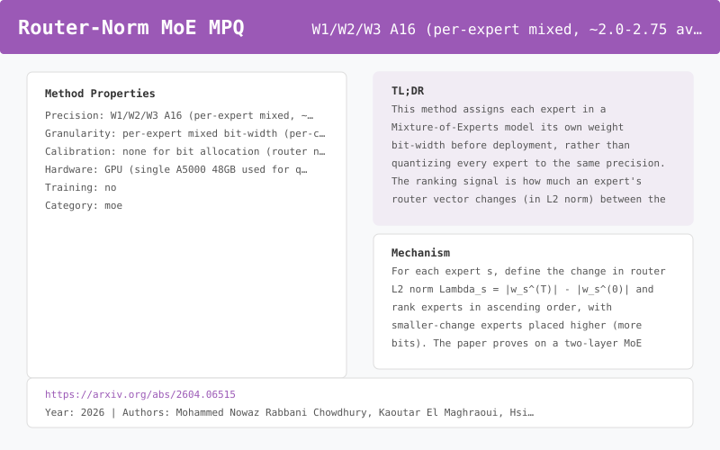

<em>Router-norm MoE MPQ: rank experts by router L2-norm change (small change -> more bits), reorder high-variance experts up, then assign two/three-level per-expert bit-widths.</em>

```mermaid
flowchart LR
    A[MoE model\nmany experts] --> B[Analyze per-expert\nactivation frequency]
    B --> C[Assign bit-width\nby importance]
    C --> D[High-freq experts:\nhigher precision]
    D --> E[Low-freq experts:\nlower precision]
    E --> F[Mixed-precision\nMoE inference]
```

> This method assigns each expert in a Mixture-of-Experts model its own weight bit-width before deployment, rather than quantizing every expert to the same precision. The ranking signal is how much an expert's router vector changes (in L2 norm) between the initial and fine-tuned model: experts whose routers barely move learn rare-but-important features and produce weak activations, so the model's output is most sensitive to quantizing them, and they get more bits. Experts whose routers shift a lot can be pushed to very low precision. A second pass promotes any expert with unusually large per-neuron weight variance to higher precision so it does not inject too much quantization noise. Because the allocation only requires sorting router norms, it adds almost no compute, and for pretrained models the final router norm can stand in for the change in norm so no fine-tuning is needed.

| Field | Value |
|-------|-------|
| Published at | **ICLR 2026** |
| Paper | [2604.06515](https://arxiv.org/abs/2604.06515) |
| Code | [nowazrabbani/moe_quantization](https://github.com/nowazrabbani/moe_quantization) |
| Precision | W1/W2/W3 A16 (per-expert mixed, ~2.0-2.75 avg bits/expert) |
| Granularity | per-expert mixed bit-width (per-column bin size within an expert) |
| Calibration | none for bit allocation (router norms only); underlying PTQ (HQQ/GPTQ) may use calibration |
| Symmetric? | asymmetric |
| Outlier handling | experts with large max intra-neuron variance promoted to higher precision (ζ=3 threshold) |
| Hardware target | GPU (single A5000 48GB used for quantized inference) |
| Training needed? | no |
| Calibration data? | no |
| Typical degradation | ~2.7 pt avg accuracy drop on Mixtral-8x7B at ~2.75 avg bits/expert (70.01% vs 72.72% FP, 8 zero-shot tasks); beats PMQ at equal bits |
| Builds on | [gptq](#gptq) · [hqq](#hqq) · [moqe](#moqe) |
| Related | [mc-moe](#mc-moe) · [awq](#awq) · [moqe](#moqe) |

**How it works:**

For each expert s, define the change in router L2 norm Lambda_s = |w_s^(T)| - |w_s^(0)| and rank experts in ascending order, with smaller-change experts placed higher (more bits). The paper proves on a two-layer MoE classification model that experts learning less-prevalent tokens undergo smaller router-norm changes, generate weaker activations, and dominate generalization sensitivity, so quantizing them to b_h while dropping others to b_l preserves full-precision generalization while saving log2((1-alpha)/alpha) bits per low-precision expert. The ordering is then adjusted by max intra-neuron variance MaxVar_s: any lower- ranked expert with variance at least zeta=3 times that of a higher-ranked one is promoted, fixing rare high-noise experts (about 11/256 on Mixtral). Bits are assigned two-level (top kappa fraction to b_h, rest to b_l) or three-level to hit a target average, and the actual quantization is performed with an off-the-shelf PTQ backend (HQQ for Switch Transformer, GPTQ for Mixtral); non-expert weights stay at 8 bits (Switch) or 3 bits (Mixtral).

---

### MC-MoE · W2/W4 A16 (per-expert mixed) · MoE Quant · 2024-08

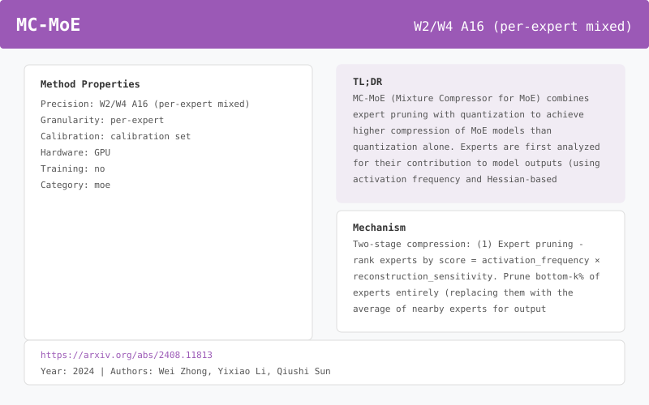

<em>MC-MoE: prune low-importance experts first, then mixed-precision quantize remaining experts.</em>

```mermaid
flowchart LR
    A[MoE experts] --> B[Compute per-expert\nquantization sensitivity]
    B --> C[Rank experts\nby sensitivity score]
    C --> D[High sensitivity:\nassign more bits]
    D --> E[Low sensitivity:\nassign fewer bits]
    E --> F[Mixed-precision\nbit allocation per expert]
    F --> G[Better accuracy\nthan uniform MoE quant]
```

> MC-MoE (Mixture Compressor for MoE) combines expert pruning with quantization to achieve higher compression of MoE models than quantization alone. Experts are first analyzed for their contribution to model outputs (using activation frequency and Hessian-based sensitivity). Low-importance experts are fully pruned (removed). The remaining experts are quantized with bit-widths proportional to their importance. This co-design of pruning and quantization gives a better quality-vs-size tradeoff than either technique alone for MoE models.

| Field | Value |
|-------|-------|
| Published at | arXiv (preprint) |
| Paper | [2408.11813](https://arxiv.org/abs/2408.11813) |
| Precision | W2/W4 A16 (per-expert mixed) |
| Granularity | per-expert |
| Calibration | calibration set |
| Symmetric? | asymmetric |
| Outlier handling | expert pruning + quantization co-design |
| Hardware target | GPU |
| Training needed? | no |
| Calibration data? | yes |
| Typical degradation | better than MoQE on Mixtral-8x7B at same compression ratio |
| Builds on | [moqe](#moqe) · [gptq](#gptq) |
| Related | [moqe](#moqe) · [gptq](#gptq) · [awq](#awq) |

**How it works:**

Two-stage compression: (1) Expert pruning - rank experts by score = activation_frequency × reconstruction_sensitivity. Prune bottom-k% of experts entirely (replacing them with the average of nearby experts for output stability). (2) Mixed-precision quantization - apply GPTQ or AWQ to remaining experts with bit-width proportional to importance rank. Shared experts (if present, as in DeepSeek-MoE) are always kept at higher precision. The pruning step reduces the total parameter count before quantization, allowing the remaining budget to be concentrated on the most important experts.

---

### MoQE · W2/W4 A16 (expert-specific) · MoE Quant · 2023-10

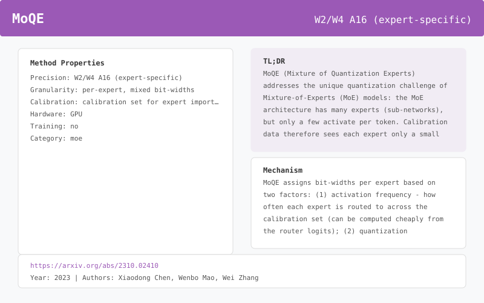

<em>MoQE: frequency × sensitivity score assigns bit-widths per expert in MoE models.</em>

```mermaid
flowchart LR
    A[MoE model] --> B[Profile expert\nactivation frequency]
    B --> C{Expert usage\nfrequency}
    C -->|high frequency| D[Keep in INT8\nor FP16]
    C -->|low frequency| E[Quantize to INT4\nor INT2]
    D --> F[Mixed-precision\nMoE inference]
    E --> F
    F --> G[Better than uniform\nquantization of all experts]
```

> MoQE (Mixture of Quantization Experts) addresses the unique quantization challenge of Mixture-of-Experts (MoE) models: the MoE architecture has many experts (sub-networks), but only a few activate per token. Calibration data therefore sees each expert only a small fraction of the time, making Hessian estimation unreliable. MoQE assigns different bit-widths to different experts based on their activation frequency and importance - frequently-activated experts get more bits, rarely-activated experts can tolerate lower precision. This expert-aware mixed-precision scheme beats uniform quantization of all experts at the same average bit-width.

| Field | Value |
|-------|-------|
| Published at | arXiv (preprint) |
| Paper | [2310.02410](https://arxiv.org/abs/2310.02410) |
| Precision | W2/W4 A16 (expert-specific) |
| Granularity | per-expert, mixed bit-widths |
| Calibration | calibration set for expert importance |
| Symmetric? | asymmetric |
| Outlier handling | more important experts get higher precision |
| Hardware target | GPU |
| Training needed? | no |
| Calibration data? | yes |
| Typical degradation | < 0.5 ppl vs uniform expert quantization at same average bits |
| Builds on | [gptq](#gptq) |
| Related | [gptq](#gptq) · [awq](#awq) · [deepseek-fp8](#deepseek-fp8) |

**How it works:**

MoQE assigns bit-widths per expert based on two factors: (1) activation frequency - how often each expert is routed to across the calibration set (can be computed cheaply from the router logits); (2) quantization sensitivity - the reconstruction error of each expert when quantized (requires a calibration forward pass through each expert). A budget-constrained allocation then assigns higher bits to experts with high frequency × sensitivity and lower bits to others, maintaining an average bit-width target. The router weights and non-expert transformer components (attention, LayerNorm) remain at FP16.

---

---

## Systems, Kernels & Runtimes

Software that implements quantization methods in practice: inference engines, CUDA kernels, quantization toolkits. These are not novel algorithms but are the infrastructure through which the algorithms ship. One card per runtime, listing which methods it supports.

### TileFuse · W4A16, W8A16 · Systems · 2026-06

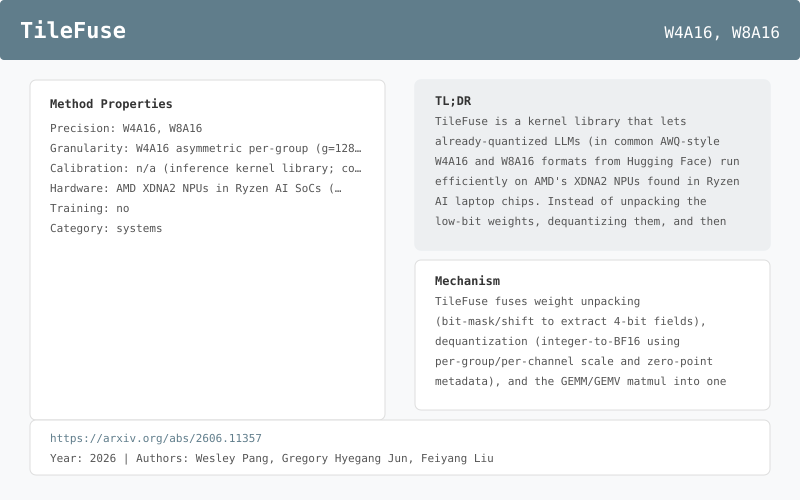

<em>TileFuse microkernel: pre-tiled INT4/INT8 weights + packed scales/zero-points stream into a fused unpack -> dequantize(BF16) -> GEMM/GEMV pipeline on the XDNA2 4x8 AIE array.</em>

```mermaid
flowchart LR
    A[Quantized model\nweights on disk] --> B[Load and parse\nquant metadata]
    B --> C[Select kernel\nfor target hardware]
    C --> D[Fused dequant +\nGEMM kernel]
    D --> E[Paged or continuous\nbatching]
    E --> F[Efficient serving\nW4A16, W8A16]
```

> TileFuse is a kernel library that lets already-quantized LLMs (in common AWQ-style W4A16 and W8A16 formats from Hugging Face) run efficiently on AMD's XDNA2 NPUs found in Ryzen AI laptop chips. Instead of unpacking the low-bit weights, dequantizing them, and then doing the matrix multiply as separate passes that bounce data through memory, TileFuse merges all three steps into a single on-chip kernel so the spatial AIE array stays busy. It also lays out the weight tiles ahead of time in an interleaved column-major order and packs the scales and zero-points alongside them, and it redesigns the GEMV dataflow to use the full 4x8 array for the memory-bound decode phase. The result is faster, lower-energy on-device inference without changing the quantized model itself.

| Field | Value |
|-------|-------|
| Published at | arXiv (preprint) |
| Paper | [2606.11357](https://arxiv.org/abs/2606.11357) |
| Code | [feature/update-mix-mm-int4-verification](https://github.com/glassescrab/mlir-aie/tree/feature/update-mix-mm-int4-verification) |
| Precision | W4A16, W8A16 |
| Granularity | W4A16 asymmetric per-group (g=128); W8A16 symmetric per-channel; dequantized to BF16 |
| Calibration | n/a (inference kernel library; consumes pre-quantized off-the-shelf models) |
| Symmetric? | mixed |
| Outlier handling | n/a (kernel/runtime; relies on the upstream AWQ-style quantization for accuracy) |
| Hardware target | AMD XDNA2 NPUs in Ryzen AI SoCs (Ryzen AI 7 350 Krackan Point, Ryzen AI 9 HX 370 Strix Point); uses the IRON/MLIR-AIE programming stack and the 4x8 AIE array |
| Training needed? | no |
| Calibration data? | no |
| Typical degradation | n/a - kernel/runtime, not a quantization algorithm; no accuracy change reported. Performance: up to 2.0x lower prefill latency and >64.6% lower energy vs the iGPU baseline; up to 121.6% (GEMM) and 281% (GEMV) kernel throughput gains over full-precision on AMD NPU, evaluated on Llama3-8B, Gemma-2B, and Qwen2.5-3B. |
| Builds on | [awq](#awq) · [marlin](#marlin) |
| Related | [awq](#awq) · [marlin](#marlin) · [fp6-llm](#fp6-llm) · [qserve](#qserve) |

**How it works:**

TileFuse fuses weight unpacking (bit-mask/shift to extract 4-bit fields), dequantization (integer-to-BF16 using per-group/per-channel scale and zero-point metadata), and the GEMM/GEMV matmul into one microkernel pipeline running on the XDNA2 spatial array, keeping dequantized weights in compute-core buffers for reuse. Weights are pre-tiled offline in an interleaved column-major layout (supporting dimensions up to 32K) with scales and zero- points pre-packed alongside the tiles, minimizing on-device data movement. A redesigned GEMV dataflow maps the memory-bound decode phase across the full 4x8 AIE array to maximize utilization. It targets standard AWQ-format models via AMD's open IRON/MLIR-AIE stack rather than requiring a proprietary NPU quantization scheme.

---

### LlamaWeb · W2/W4/W8 A16 (q2_k, q4_k_m, q8_0) and f16; supports 21 GGUF quantization formats · Systems · 2026-05

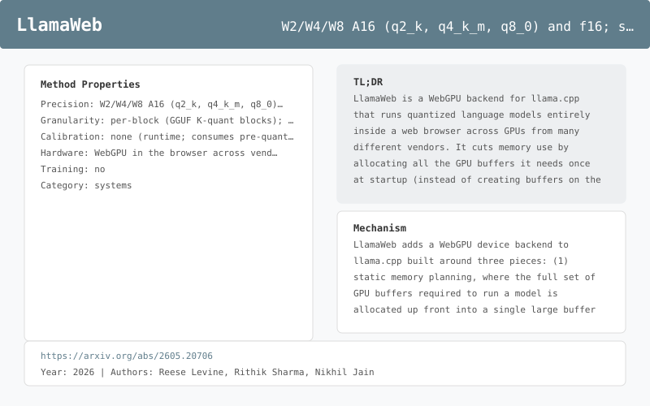

<em>LlamaWeb: WebGPU backend for llama.cpp with static memory planning, format-templated WGSL kernels, and per-device tunable kernel parameters.</em>

```mermaid
flowchart LR
    A[Quantized model\nweights on disk] --> B[Load and parse\nquant metadata]
    B --> C[Select kernel\nfor target hardware]
    C --> D[Fused dequant +\nGEMM kernel]
    D --> E[Paged or continuous\nbatching]
    E --> F[Efficient serving\nW2/W4/W8 A16 q2_k, q4_k_m, q8_0 and f16; supports 21 GGUF quantization formats]
```

> LlamaWeb is a WebGPU backend for llama.cpp that runs quantized language models entirely inside a web browser across GPUs from many different vendors. It cuts memory use by allocating all the GPU buffers it needs once at startup (instead of creating buffers on the fly) and by loading model weights efficiently, and it stays fast across very different hardware by generating its compute shaders from templates and auto-tuning parameters like workgroup and tile sizes per device. The same kernel templates are instantiated for each weight format, so the engine can read many GGUF quantization layouts (2-bit through 8-bit K-quants plus f16) and be extended to new ones without hand-writing a separate kernel each time. In browser benchmarks it decodes tokens faster and uses less memory than WebLLM and Transformers.js, though its prefill phase is slower than WebLLM's.

| Field | Value |
|-------|-------|
| Published at | arXiv (preprint) |
| Paper | [2605.20706](https://arxiv.org/abs/2605.20706) |
| Blog / post | [link](https://www.microsoft.com/en-us/research/publication/llamas-on-the-web-memory-efficient-performance-portable-and-multi-precision-llm-inference-with-webgpu/) |
| Precision | W2/W4/W8 A16 (q2_k, q4_k_m, q8_0) and f16; supports 21 GGUF quantization formats |
| Granularity | per-block (GGUF K-quant blocks); inherits llama.cpp/GGUF block layouts |
| Calibration | none (runtime; consumes pre-quantized GGUF weights) |
| Symmetric? | mixed (depends on GGUF format) |
| Outlier handling | n/a (runtime backend; relies on the chosen GGUF quantization format) |
| Hardware target | WebGPU in the browser across vendors (tested on 16 devices from 8 GPU vendors) |
| Training needed? | no |
| Calibration data? | no |
| Typical degradation | n/a (inference runtime, no extra accuracy loss); 54% higher decode throughput than WebLLM and 69% higher than Transformers.js, and ~49% lower memory than WebLLM, measured on 10 models including Llama3.2-1B, Qwen3-0.6B, Gemma3-270M, and SmolLM3-3B |
| Builds on | [llama-cpp](#llama-cpp) · [gguf-kquants](#gguf-kquants) |
| Related | [mlc-llm](#mlc-llm) · [gguf-iquants](#gguf-iquants) |

**How it works:**

LlamaWeb adds a WebGPU device backend to llama.cpp built around three pieces: (1) static memory planning, where the full set of GPU buffers required to run a model is allocated up front into a single large buffer with fixed parameter slots, avoiding costly dynamic WebGPU buffer creation and reducing peak memory; (2) templated WGSL compute kernels parameterized over the weight format, so dequantization-plus-matmul shaders for the 23 supported formats are generated from shared templates rather than written individually; and (3) a tunable kernel library that exposes device-specific knobs (workgroup sizes, shared-memory tile sizes) whose best values are found by exhaustively sweeping thousands of configurations across many GPUs, giving performance portability across heterogeneous browser hardware.

---

### SGLang (Quantization) · W4A16 (GPTQ/AWQ/Marlin), W8A8 (FP8), W4A8 (Marlin W4A8) · Systems · 2024-12

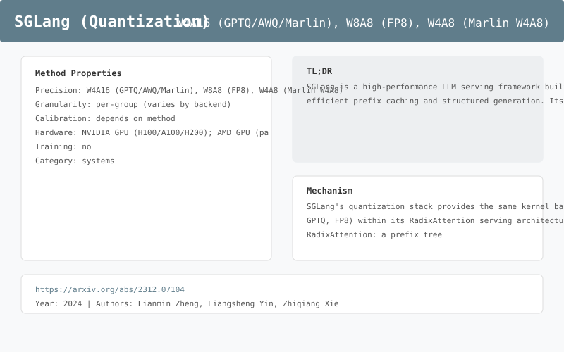

<em>SGLang: RadixAttention prefix KV cache reuse + Marlin/FP8/AWQ quantization backends.</em>

```mermaid
flowchart LR
    A[vLLM engine] --> B{Quant method}
    B -->|awq| C[AutoAWQ W4A16]
    B -->|gptq| D[ExLlamaV2 W4A16]
    B -->|fp8| E[Native FP8\nH100 tensor core]
    B -->|marlin| F[Marlin INT4\nhigh throughput]
    C --> G[PagedAttention\ncontinuous batching]
    D --> G
    E --> G
    F --> G
```

> SGLang is a high-performance LLM serving framework built around RadixAttention for efficient prefix caching and structured generation. Its quantization support mirrors vLLM: native GPTQ, AWQ, Marlin, FP8, and INT8 backends, selected automatically by model format. SGLang focuses on structured generation efficiency (JSON, regex, code) and achieves throughput competitive with or exceeding vLLM at comparable quantization quality. It integrates Marlin for W4A16 decoding and CUTLASS-based FP8 kernels for H100 prefill-dominated workloads.

| Field | Value |
|-------|-------|
| Published at | **OSDI 2024** |
| Paper | [2312.07104](https://arxiv.org/abs/2312.07104) |
| Code | [sgl-project/sglang](https://github.com/sgl-project/sglang) |
| Precision | W4A16 (GPTQ/AWQ/Marlin), W8A8 (FP8), W4A8 (Marlin W4A8) |
| Granularity | per-group (varies by backend) |
| Calibration | depends on method |
| Symmetric? | varies |
| Outlier handling | method-dependent |
| Hardware target | NVIDIA GPU (H100/A100/H200); AMD GPU (partial) |
| Training needed? | no |
| Calibration data? | no |
| Typical degradation | n/a (serving runtime) |
| Builds on | [marlin](#marlin) · [gptq](#gptq) · [awq](#awq) |
| Related | [vllm-quant](#vllm-quant) · [autogptq](#autogptq) · [marlin](#marlin) |

**How it works:**

SGLang's quantization stack provides the same kernel backends as vLLM (Marlin, AWQ, GPTQ, FP8) within its RadixAttention serving architecture. The key differentiation is RadixAttention: a prefix tree structure that reuses KV cache across requests with shared prefixes, dramatically reducing prefill cost for applications with common system prompts. Quantization interacts with RadixAttention by compressing the shared KV cache, multiplying the memory savings. SGLang also includes overlap scheduling (GPU/CPU computation overlap) and DP attention for multi-node serving.

---

### Marlin · W4A16 (INT4), W4A8 (INT4 weight, FP8 activation) · Systems · 2024-08

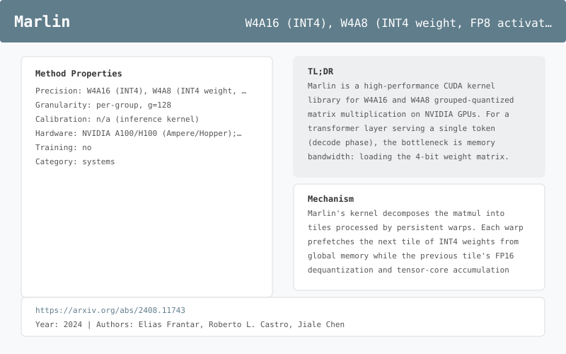

<em>Marlin warp layout: prefetch → dequantize → tensor-core accumulate, all pipelined.</em>

```mermaid
flowchart LR
    A[INT4 weights\nGPTQ format] --> B[Permute for\nmemory coalescing]
    B --> C[Marlin kernel:\nfuse dequant + GEMM]
    C --> D[128-thread warps\npipeline async loads]
    D --> E[FP16 GEMM throughput\nnear theoretical peak]
    E --> F[2.4x faster than\ntorch W4A16 baseline]
```

> Marlin is a high-performance CUDA kernel library for W4A16 and W4A8 grouped-quantized matrix multiplication on NVIDIA GPUs. For a transformer layer serving a single token (decode phase), the bottleneck is memory bandwidth: loading the 4-bit weight matrix. Marlin achieves close to the theoretical memory bandwidth limit of A100/H100 by carefully designing warp layouts, prefetching patterns, and the FP16 dequantization pipeline to overlap computation with memory loads. It is integrated into vLLM, TRT-LLM, and SGLang.

| Field | Value |
|-------|-------|
| Published at | arXiv (preprint) |
| Paper | [2408.11743](https://arxiv.org/abs/2408.11743) |
| Code | [IST-DASLab/marlin](https://github.com/IST-DASLab/marlin) |
| Precision | W4A16 (INT4), W4A8 (INT4 weight, FP8 activation) |
| Granularity | per-group, g=128 |
| Calibration | n/a (inference kernel) |
| Symmetric? | asymmetric |
| Outlier handling | n/a |
| Hardware target | NVIDIA A100/H100 (Ampere/Hopper); achieves near-theoretical memory bandwidth |
| Training needed? | no |
| Calibration data? | no |
| Typical degradation | n/a - kernel, not algorithm |
| Builds on | [gptq](#gptq) · [awq](#awq) |
| Related | [exl2](#exl2) · [awq](#awq) · [gptq](#gptq) |

**How it works:**

Marlin's kernel decomposes the matmul into tiles processed by persistent warps. Each warp prefetches the next tile of INT4 weights from global memory while the previous tile's FP16 dequantization and tensor-core accumulation runs in parallel. The dequantization (unpack INT4 → FP16 using the per-group scale) is fused into the memory pipeline so it adds no latency. A careful warp layout avoids shared-memory bank conflicts. The result is ~3.7× speedup over FP16 matmul for batch=1 decode on A100, matching the theoretical 4× reduction in memory traffic.

---

### FLUTE · W3/W4 A16 · Systems · 2024-07

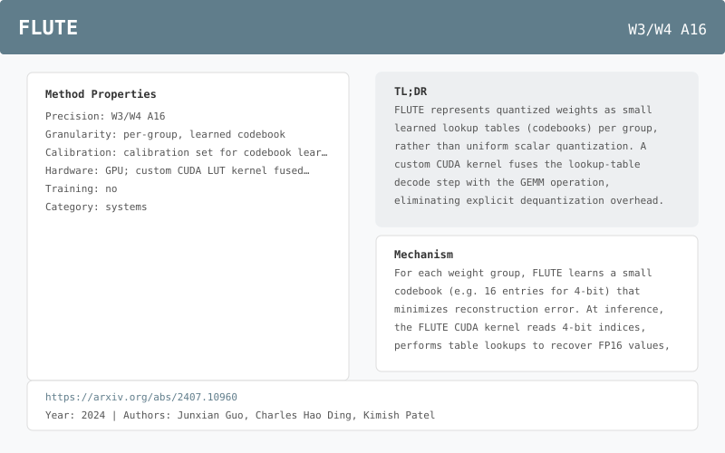

<em>FLUTE: learned per-group codebook with fused lookup-table decode inside the GEMM kernel.</em>

```mermaid
flowchart LR
    A[Weight group\ng elements] --> B[k-means cluster\ninto 2^b centroids]
    B --> C[Store b-bit indices\nper element]
    C --> D[FLUTE CUDA kernel:\nlookup indices → FP16]
    D --> E[Fuse decode +\nGEMM accumulation]
    E --> F[Single kernel\nno separate dequant]
    F --> G[W3/W4 throughput\nnear FP16 GEMM]
```

> FLUTE represents quantized weights as small learned lookup tables (codebooks) per group, rather than uniform scalar quantization. A custom CUDA kernel fuses the lookup-table decode step with the GEMM operation, eliminating explicit dequantization overhead. Supports 2-to-4-bit weight-only quantization, achieves accuracy competitive with GPTQ, and delivers faster inference through the fused kernel design.

| Field | Value |
|-------|-------|
| Published at | **NeurIPS 2024** |
| Paper | [2407.10960](https://arxiv.org/abs/2407.10960) |
| Code | [HanGuo97/flute](https://github.com/HanGuo97/flute) |
| Precision | W3/W4 A16 |
| Granularity | per-group, learned codebook |
| Calibration | calibration set for codebook learning |
| Symmetric? | asymmetric |
| Outlier handling | non-uniform codebook levels fit to weight distribution |
| Hardware target | GPU; custom CUDA LUT kernel fused with GEMM |
| Training needed? | no |
| Calibration data? | yes |
| Typical degradation | comparable to GPTQ; faster inference due to fused kernel |
| Builds on | [gptq](#gptq) · [gguf-kquants](#gguf-kquants) |
| Related | [gptq](#gptq) · [awq](#awq) · [marlin](#marlin) · [exl2](#exl2) |

**How it works:**

For each weight group, FLUTE learns a small codebook (e.g. 16 entries for 4-bit) that minimizes reconstruction error. At inference, the FLUTE CUDA kernel reads 4-bit indices, performs table lookups to recover FP16 values, and immediately feeds them into GEMM accumulation in a single fused kernel. This eliminates the separate dequant pass. Non-uniform codebook levels (like k-means or NF4 bins) are naturally supported without extra cost, giving better accuracy than uniform quantization at the same bit-width.

---

### ExLlamaV2 · W2–W8 A16 (EXL2 mixed per-row format) · Systems · 2023-10

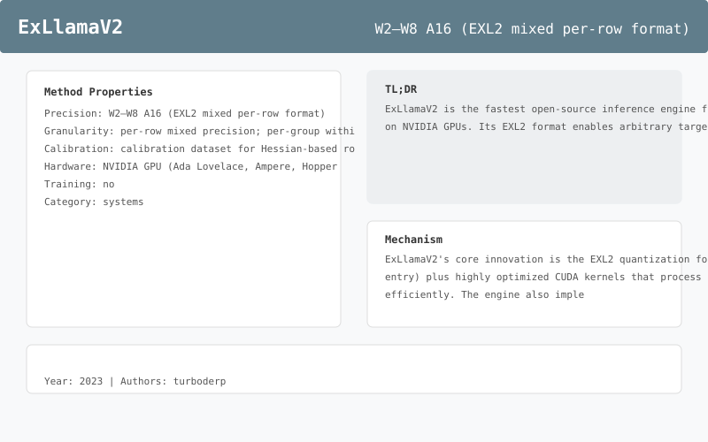

<em>ExLlamaV2: custom CUDA kernels for mixed-precision EXL2 format + paged KV + speculative decode.</em>

```mermaid
flowchart LR
    A[EXL2 quantized\nmodel file] --> B[Mixed-precision\nper-layer bit assignment]
    B --> C[ExLlamaV2 kernel:\nfused W4A16 decode]
    C --> D[Paged attention\ncache management]
    D --> E[Speculative decoding\noptional]
    E --> F[Highest single-GPU\ngeneration throughput]
```

> ExLlamaV2 is the fastest open-source inference engine for GPTQ/EXL2 quantized models on NVIDIA GPUs. Its EXL2 format enables arbitrary target bit-widths (e.g. 3.0, 4.25, 5.1 bpw) by assigning different quantization precisions per row of each weight matrix based on Hessian importance. Custom CUDA kernels handle heterogeneous row precisions in a single kernel call. ExLlamaV2 also supports paged KV cache, speculative decoding, and continuous batching, making it competitive with production inference engines for single-user local deployment.

| Field | Value |
|-------|-------|
| Published at | n/a (no paper) |
| Code | [turboderp/exllamav2](https://github.com/turboderp/exllamav2) |
| Precision | W2–W8 A16 (EXL2 mixed per-row format) |
| Granularity | per-row mixed precision; per-group within rows |
| Calibration | calibration dataset for Hessian-based row importance |
| Symmetric? | asymmetric |
| Outlier handling | EXL2: per-row bit allocation proportional to Hessian importance |
| Hardware target | NVIDIA GPU (Ada Lovelace, Ampere, Hopper); Llama-family models |
| Training needed? | no |
| Calibration data? | yes |
| Typical degradation | 3.0 bpw EXL2 outperforms GPTQ W4A16 on most benchmarks |
| Builds on | [exl2](#exl2) · [gptq](#gptq) |
| Related | [autogptq](#autogptq) · [llama-cpp](#llama-cpp) · [marlin](#marlin) |

**How it works:**

ExLlamaV2's core innovation is the EXL2 quantization format (detailed in the EXL2 entry) plus highly optimized CUDA kernels that process heterogeneous row precisions efficiently. The engine also implements: continuous batching for serving multiple users; paged attention for efficient KV cache management; speculative decoding with a small draft model for 2–3× throughput improvement; and a Python/C++ server mode. For GPTQ compatibility, ExLlamaV2 includes an ExLlama2 GPTQ backend that outperforms AutoGPTQ's default Triton backend by ~2× on A100 via better kernel design.

---

### AutoAWQ · W4A16 (AWQ) · Systems · 2023-10

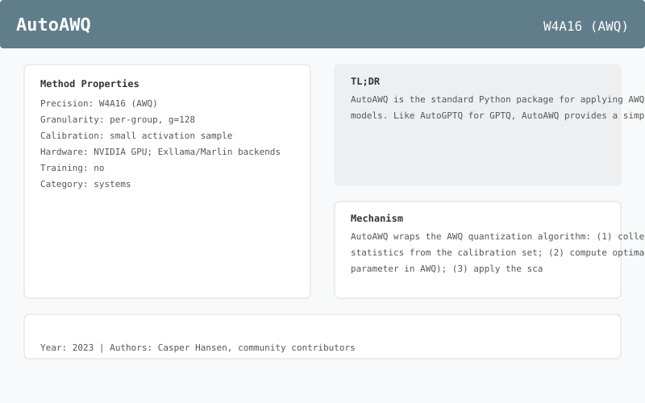

<em>AutoAWQ: calibrate → scale → quantize → save AWQ model; multi-backend inference.</em>

```mermaid
flowchart LR
    A[FP16 model] --> B[Collect activation\nmagnitude stats]
    B --> C[AWQ: per-channel\nscale optimization]
    C --> D[Apply scales, quantize\nweights to INT4]
    D --> E[Save AWQ weights\n+ metadata]
    E --> F[Fast inference:\ngemm_a16w4 or Marlin kernel]
```

> AutoAWQ is the standard Python package for applying AWQ quantization to Hugging Face models. Like AutoGPTQ for GPTQ, AutoAWQ provides a simple API for quantizing any supported LLM architecture to W4A16 AWQ format, which can then be uploaded to Hugging Face Hub or used directly for inference. AWQ-quantized models typically have slightly better quality than GPTQ at the same group size due to the activation-guided scaling. AutoAWQ is integrated with vLLM, TGI, and TRT-LLM for deployment.

| Field | Value |
|-------|-------|
| Published at | n/a (no paper) |
| Code | [casper-hansen/AutoAWQ](https://github.com/casper-hansen/AutoAWQ) |
| Precision | W4A16 (AWQ) |
| Granularity | per-group, g=128 |
| Calibration | small activation sample |
| Symmetric? | asymmetric |
| Outlier handling | AWQ activation-magnitude-guided scaling |
| Hardware target | NVIDIA GPU; Exllama/Marlin backends |
| Training needed? | no |
| Calibration data? | yes |
| Typical degradation | n/a (runtime wrapper for AWQ) |
| Builds on | [awq](#awq) |
| Related | [autogptq](#autogptq) · [llama-cpp](#llama-cpp) · [vllm-quant](#vllm-quant) |

**How it works:**

AutoAWQ wraps the AWQ quantization algorithm: (1) collect per-channel activation statistics from the calibration set; (2) compute optimal per-channel scales (the α parameter in AWQ); (3) apply the scale transformation to weights and absorb the inverse into preceding layers; (4) quantize scaled weights with RTN at group size 128. The resulting model is saved in AWQ format with per-group scale factors and zero points stored in FP16. At inference, AutoAWQ uses custom CUDA kernels (inherited from TinyChat) or the Marlin backend for maximum throughput.

---

### vLLM (Quantization) · W4A16 (GPTQ/AWQ/Marlin), W8A8 (FP8), W4A8 (Marlin) · Systems · 2023-06

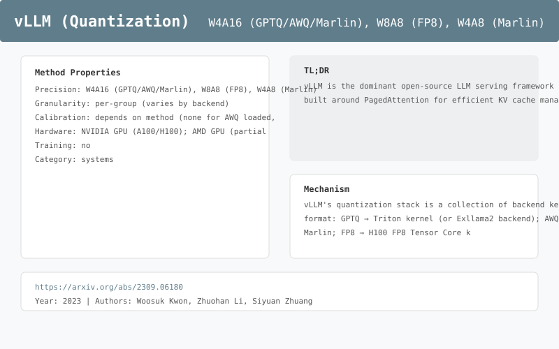

<em>vLLM quantization stack: PagedAttention + pluggable W4/W8/FP8 kernels for production serving.</em>

```mermaid
flowchart LR
    A[vLLM engine] --> B{Quant method}
    B -->|awq| C[AutoAWQ W4A16]
    B -->|gptq| D[ExLlamaV2 W4A16]
    B -->|fp8| E[Native FP8\nH100 tensor core]
    B -->|marlin| F[Marlin INT4\nhigh throughput]
    C --> G[PagedAttention\ncontinuous batching]
    D --> G
    E --> G
    F --> G
```

> vLLM is the dominant open-source LLM serving framework for production deployment, built around PagedAttention for efficient KV cache management. Its quantization support includes native GPTQ (Triton kernel), AWQ (custom CUDA), Marlin (high-throughput W4A16), FP8 (H100), GGUF (partial), and INT8. vLLM's quantization handling is transparent to the user - load a pre-quantized model and vLLM selects the appropriate kernel. The Marlin backend (IST-DASLab) gives near-theoretical memory bandwidth for W4A16 decoding at batch=1, while FP8 on H100 gives compute-bound throughput for large batches.

| Field | Value |
|-------|-------|
| Published at | **SOSP 2023** |
| Paper | [2309.06180](https://arxiv.org/abs/2309.06180) |
| Code | [vllm-project/vllm](https://github.com/vllm-project/vllm) |
| Precision | W4A16 (GPTQ/AWQ/Marlin), W8A8 (FP8), W4A8 (Marlin) |
| Granularity | per-group (varies by backend) |
| Calibration | depends on method (none for AWQ loaded, needed for GPTQ) |
| Symmetric? | varies |
| Outlier handling | method-dependent (Marlin/AWQ/GPTQ backends) |
| Hardware target | NVIDIA GPU (A100/H100); AMD GPU (partial); CPU (partial) |
| Training needed? | no |
| Calibration data? | no |
| Typical degradation | n/a (runtime - quality depends on quantization method used) |
| Builds on | [marlin](#marlin) · [gptq](#gptq) · [awq](#awq) · [smoothquant](#smoothquant) |
| Related | [autogptq](#autogptq) · [autoawq](#autoawq) · [marlin](#marlin) · [llama-cpp](#llama-cpp) |

**How it works:**

vLLM's quantization stack is a collection of backend kernels selected by model format: GPTQ → Triton kernel (or Exllama2 backend); AWQ → custom fused CUDA; W4A16 → Marlin; FP8 → H100 FP8 Tensor Core kernel; INT8 SmoothQuant → INT8 GEMM. PagedAttention manages KV cache in fixed-size 16-token blocks, enabling non-contiguous KV allocation and serving many concurrent requests without memory fragmentation. Continuous batching iterates over requests at the token level, maximizing GPU utilization. All quantization kernels plug into this serving infrastructure.

---

### MLC-LLM · W4A16 (AWQ-style), W8A8, FP16 · Systems · 2023-06

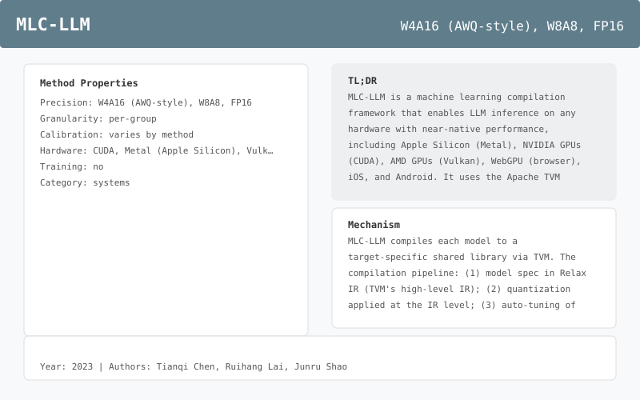

<em>MLC-LLM: TVM compilation to CUDA/Metal/Vulkan/WebGPU with fused W4A16 dequantization kernels.</em>

```mermaid
flowchart LR
    A[Model weights\nFP16 or quantized] --> B[TVM compilation\ntarget-specific tuning]
    B --> C{Target platform}
    C -->|CUDA| D[GPU GEMM kernel]
    C -->|Metal| E[Apple GPU kernel]
    C -->|WebGPU| F[Browser inference]
    C -->|x86| G[CPU SIMD kernel]
    D --> H[Universal LLM\nruntime MLC-LLM]
    E --> H
    F --> H
    G --> H
```

> MLC-LLM is a machine learning compilation framework that enables LLM inference on any hardware with near-native performance, including Apple Silicon (Metal), NVIDIA GPUs (CUDA), AMD GPUs (Vulkan), WebGPU (browser), iOS, and Android. It uses the Apache TVM compiler to generate optimized kernels for each target from a unified model specification. MLC-LLM supports AWQ-style W4A16 quantization, INT8, and FP16, with automatic kernel generation for each backend. This makes it the primary runtime for cross-platform quantized LLM deployment including mobile and browser environments.

| Field | Value |
|-------|-------|
| Published at | n/a (no paper) |
| Code | [mlc-ai/mlc-llm](https://github.com/mlc-ai/mlc-llm) |
| Precision | W4A16 (AWQ-style), W8A8, FP16 |
| Granularity | per-group |
| Calibration | varies by method |
| Symmetric? | varies |
| Outlier handling | method-dependent |
| Hardware target | CUDA, Metal (Apple Silicon), Vulkan, WebGPU, iOS, Android |
| Training needed? | no |
| Calibration data? | no |
| Typical degradation | n/a (cross-platform runtime) |
| Builds on | [awq](#awq) |
| Related | [llama-cpp](#llama-cpp) · [vllm-quant](#vllm-quant) · [autoawq](#autoawq) |

**How it works:**

MLC-LLM compiles each model to a target-specific shared library via TVM. The compilation pipeline: (1) model spec in Relax IR (TVM's high-level IR); (2) quantization applied at the IR level; (3) auto-tuning of kernel schedules per target hardware; (4) code generation to CUDA PTX / Metal Shading Language / GLSL (Vulkan) / JS (WebGPU). Quantized weights (W4A16 AWQ-compatible) are stored in a compact binary format and loaded at runtime. The dequantization is fused into the matmul kernel via TVM's operator fusion. The same model spec runs on all backends, with only the kernels differing per platform.

---

### llama.cpp (GGUF) · W2/W3/W4/W5/W6/W8 A16 (GGUF K-quants and I-quants) · Systems · 2023-03

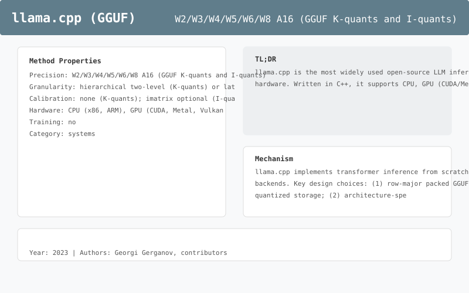

<em>llama.cpp: portable C++ runtime with GGUF quantization for CPU/GPU/any-hardware inference.</em>

```mermaid
flowchart LR
    A[GGUF file] --> B[Load quantized\nweights + metadata]
    B --> C{Quant type}
    C -->|Q4_K_M| D[K-quant:\nImportance-weighted\ngroup quant]
    C -->|IQ4_XS| E[I-quant:\nLattice codebook\nactivation-aware]
    D --> F[CPU or GPU\nmetal / CUDA / Vulkan]
    E --> F
    F --> G[Cross-platform\nLLM inference]
```

> llama.cpp is the most widely used open-source LLM inference engine for consumer hardware. Written in C++, it supports CPU, GPU (CUDA/Metal/Vulkan), and heterogeneous inference. Its GGUF quantization format (K-quants: Q2_K through Q6_K; I-quants: IQ1_S through IQ4_NL) covers 2–8 bit precision with hierarchical or lattice-based quantization. GGUF models are the standard format for local LLM deployment: most model releases on Hugging Face include GGUF variants. The engine handles all major model architectures (LLaMA, Mistral, Phi, Gemma, Qwen, etc.) through a unified C/C++ implementation.

| Field | Value |
|-------|-------|
| Published at | n/a (no paper) |
| Code | [ggerganov/llama.cpp](https://github.com/ggerganov/llama.cpp) |
| Precision | W2/W3/W4/W5/W6/W8 A16 (GGUF K-quants and I-quants) |
| Granularity | hierarchical two-level (K-quants) or lattice (I-quants) |
| Calibration | none (K-quants); imatrix optional (I-quants) |
| Symmetric? | mixed |
| Outlier handling | K-quants: hierarchical scaling; I-quants: importance-weighted lattice VQ |
| Hardware target | CPU (x86, ARM), GPU (CUDA, Metal, Vulkan), any hardware |
| Training needed? | no |
| Calibration data? | no |
| Typical degradation | Q4_K_M: best CPU quality/speed at 4-bit; IQ4_NL slightly better |
| Builds on | [gguf-kquants](#gguf-kquants) · [gguf-iquants](#gguf-iquants) |
| Related | [autogptq](#autogptq) · [exllamav2](#exllamav2) · [mlc-llm](#mlc-llm) |

**How it works:**

llama.cpp implements transformer inference from scratch in C++ with portable backends. Key design choices: (1) row-major packed GGUF format for memory-efficient quantized storage; (2) architecture-specific SIMD optimizations (AVX2, NEON, AMX) for CPU performance; (3) custom Metal/CUDA/Vulkan compute kernels for GPU acceleration; (4) split inference across CPU and GPU for models that don't fit in VRAM; (5) speculative decoding support. The GGUF quantization formats (K-quants, I-quants) are designed specifically for CPU inference where memory bandwidth is the bottleneck.

---

### AutoGPTQ · W4/W3/W2 A16 (GPTQ) · Systems · 2023-01

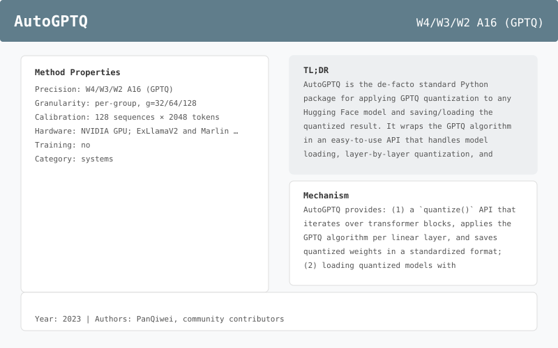

<em>AutoGPTQ: one-API GPTQ quantization pipeline with multi-backend inference support.</em>

```mermaid
flowchart LR
    A[FP16 model] --> B[Load calibration\ndataset]
    B --> C[Run GPTQ per layer:\nHessian + error comp]
    C --> D[Save GPTQ weights\n+ scales to disk]
    D --> E[Load quantized model]
    E --> F{Backend}
    F -->|ExLlamaV2| G[W4A16 fast decode]
    F -->|Marlin| H[W4A16 throughput]
    F -->|CUDA| I[Standard W4A16]
```

> AutoGPTQ is the de-facto standard Python package for applying GPTQ quantization to any Hugging Face model and saving/loading the quantized result. It wraps the GPTQ algorithm in an easy-to-use API that handles model loading, layer-by-layer quantization, and saving in a standardized format compatible with Hugging Face Hub. AutoGPTQ supports multiple inference backends (Triton, CUDA, Exllama, Marlin) and handles the model architecture discovery automatically. The vast majority of GPTQ-quantized open models on Hugging Face Hub were created with AutoGPTQ.

| Field | Value |
|-------|-------|
| Published at | n/a (no paper) |
| Code | [AutoGPTQ/AutoGPTQ](https://github.com/AutoGPTQ/AutoGPTQ) |
| Precision | W4/W3/W2 A16 (GPTQ) |
| Granularity | per-group, g=32/64/128 |
| Calibration | 128 sequences × 2048 tokens |
| Symmetric? | asymmetric |
| Outlier handling | GPTQ second-order error compensation |
| Hardware target | NVIDIA GPU; ExLlamaV2 and Marlin kernels optional |
| Training needed? | no |
| Calibration data? | yes |
| Typical degradation | n/a (runtime wrapper for GPTQ) |
| Builds on | [gptq](#gptq) |
| Related | [autoawq](#autoawq) · [llama-cpp](#llama-cpp) · [exllamav2](#exllamav2) |

**How it works:**

AutoGPTQ provides: (1) a `quantize()` API that iterates over transformer blocks, applies the GPTQ algorithm per linear layer, and saves quantized weights in a standardized format; (2) loading quantized models with `from_quantized()` which reconstructs the quantized model for inference; (3) inference backend selection (Triton for flexibility, ExLlama for speed, Marlin for maximum A100/H100 throughput); (4) compatibility with Hugging Face Transformers `AutoModelForCausalLM` API. Supported formats: W4, W3, W2 with variable group sizes. Supported architectures: LLaMA, Mistral, Falcon, GPT-J, and most major open-source LLM families.

---

### bitsandbytes · W8A8 (LLM.int8()); W4A16 (NF4/FP4) · Systems · 2022-08

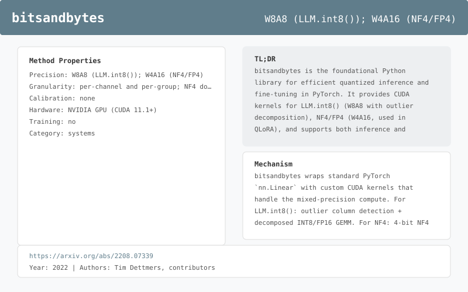

<em>bitsandbytes: LLM.int8() and NF4 CUDA kernels for PyTorch quantized inference and fine-tuning.</em>

```mermaid
flowchart LR
    A[Model load] --> B{dtype param}
    B -->|load_in_8bit| C[LLM.int8\nmixed-precision]
    B -->|load_in_4bit| D[NF4 or FP4\nquant_type]
    D --> E[QLoRA-ready\ncompute_dtype BF16]
    C --> F[8-bit optimizer states]
    E --> G[paged_adamw_32bit]
    F --> G
```

> bitsandbytes is the foundational Python library for efficient quantized inference and fine-tuning in PyTorch. It provides CUDA kernels for LLM.int8() (W8A8 with outlier decomposition), NF4/FP4 (W4A16, used in QLoRA), and supports both inference and quantization-aware fine-tuning. The library is installed by default with Hugging Face Transformers and enables loading any AutoModelForCausalLM in 4-bit or 8-bit with a single `load_in_4bit=True` flag. It is the most widely deployed quantization runtime in the open-source LLM ecosystem.

| Field | Value |
|-------|-------|
| Published at | arXiv (preprint) |
| Paper | [2208.07339](https://arxiv.org/abs/2208.07339) |
| Code | [bitsandbytes-foundation/bitsandbytes](https://github.com/bitsandbytes-foundation/bitsandbytes) |
| Precision | W8A8 (LLM.int8()); W4A16 (NF4/FP4) |
| Granularity | per-channel and per-group; NF4 double-quantization |
| Calibration | none |
| Symmetric? | mixed |
| Outlier handling | LLM.int8() decomposition for 8-bit; NF4 quantile grid for 4-bit |
| Hardware target | NVIDIA GPU (CUDA 11.1+) |
| Training needed? | no |
| Calibration data? | no |
| Typical degradation | n/a (library, quality depends on method used) |
| Builds on | [llm-int8](#llm-int8) · [bitsandbytes-nf4](#bitsandbytes-nf4) |
| Related | [autogptq](#autogptq) · [autoawq](#autoawq) · [llama-cpp](#llama-cpp) |

**How it works:**

bitsandbytes wraps standard PyTorch `nn.Linear` with custom CUDA kernels that handle the mixed-precision compute. For LLM.int8(): outlier column detection + decomposed INT8/FP16 GEMM. For NF4: 4-bit NF4 weight storage with dequantization to BF16 before multiplication (W4→BF16→GEMM, not INT4×FP16 Tensor Core). The library implements per-tensor and per-group quantization, double-quantization of scales, and paged optimizer support for memory-efficient training. Methods supported: LLM.int8(), NF4, FP4, and linear quantization.

---

## Chronological Overview

Methods published 2022–2025, ordered by date. See [docs/timeline.md](docs/timeline.md) for the full table.

| Date | Method | Category | Precision |
|------|--------|----------|-----------|
| 2022-06 | [ZeroQuant](#zeroquant) | PTQ W+A | W8A8 |
| 2022-08 | [bitsandbytes](#bitsandbytes) | Systems | W8A8 (LLM.int8()); W4A16 (NF4/FP4) |
| 2022-08 | [LLM.int8()](#llm-int8) | PTQ W+A | W8A8 (with FP16 outlier decomposition) |
| 2022-08 | [OBQ](#obq) | PTQ W-only | W3/W4 A16 |
| 2022-09 | [FP8 Training (Transformer Engine)](#fp8-training) | LP Training | FP8 (E4M3 forward / E5M2 gradient) |
| 2022-09 | [Outlier Suppression](#outlier-suppression) | PTQ W+A | W8A8 |
| 2022-10 | [GPTQ](#gptq) | PTQ W-only | W3/W4 A16 |
| 2022-11 | [SmoothQuant](#smoothquant) | PTQ W+A | W8A8 |
| 2023-01 | [AutoGPTQ](#autogptq) | Systems | W4/W3/W2 A16 (GPTQ) |
| 2023-03 | [llama.cpp (GGUF)](#llama-cpp) | Systems | W2/W3/W4/W5/W6/W8 A16 (GGUF K-quants and I-quants) |
| 2023-03 | [ZeroQuant-V2](#zeroquant-v2) | PTQ W+A | W4/W8 A8 |
| 2023-04 | [RPTQ](#rptq) | PTQ W+A | W4A8 |
| 2023-04 | [PEQA](#peqa) | QAT / QFT | W4A16 (INT4 weight) |
| 2023-04 | [Outlier Suppression+](#outlier-suppression-plus) | PTQ W+A | W8A8, W6A6 |
| 2023-05 | [NF4 / QLoRA](#bitsandbytes-nf4) | PTQ W-only | W4A16 (NF4) |
| 2023-05 | [QLoRA](#qlora) | QAT / QFT | W4A16 (NF4 base) + BF16 LoRA adapters |
| 2023-05 | [LLM-QAT](#llm-qat) | QAT / QFT | W4A8KV4 / W4A8 |
| 2023-06 | [AWQ](#awq) | PTQ W-only | W4A16 |
| 2023-06 | [OWQ](#owq) | PTQ W-only | W3/W4 A16 (mixed) |
| 2023-06 | [SpQR](#spqr) | PTQ W-only | W3/W4 A16 (sparse overlay) |
| 2023-06 | [MLC-LLM](#mlc-llm) | Systems | W4A16 (AWQ-style), W8A8, FP16 |
| 2023-06 | [SqueezeLLM](#squeezellm) | PTQ W-only | W4 A16 (sparse overlay) |
| 2023-06 | [vLLM (Quantization)](#vllm-quant) | Systems | W4A16 (GPTQ/AWQ/Marlin), W8A8 (FP8), W4A8 (Marlin) |
| 2023-07 | [ZeroQuant-FP](#zeroquant-fp) | PTQ W+A | W4A8 (FP4 weights, FP8 activations) |
| 2023-07 | [QuIP](#quip) | PTQ W-only | W2/W4 A16 |
| 2023-08 | [GGUF K-quants](#gguf-kquants) | PTQ W-only | W2/W3/W4/W5/W6 A16 |
| 2023-08 | [OmniQuant](#omniquant) | PTQ W+A | W4A16 (weight-only mode); W4A8, W6A6 (W+A mode) |
| 2023-09 | [AutoRound](#autoround) | PTQ W-only | W4A16 |
| 2023-09 | [PB-LLM](#pb-llm) | Sub-2-bit | W1/W16 A16 (binary weights + FP16 for salient subset) |
| 2023-09 | [QA-LoRA](#qa-lora) | QAT / QFT | W4A16 (group-wise) |
| 2023-10 | [MoQE](#moqe) | MoE Quant | W2/W4 A16 (expert-specific) |
| 2023-10 | [LoftQ](#loftq) | QAT / QFT | W4A16 (quantized base) + BF16 LoRA |
| 2023-10 | [QLLM](#qllm) | PTQ W+A | W4A8 |
| 2023-10 | [BitNet](#bitnet) | Sub-2-bit | W1A8 |
| 2023-10 | [MX Formats (MXFP8/MXFP6/MXFP4)](#mx-formats) | LP Training | MXFP8 / MXFP6 / MXFP4 / MXINT8 |
| 2023-10 | [AutoAWQ](#autoawq) | Systems | W4A16 (AWQ) |
| 2023-10 | [EXL2](#exl2) | PTQ W-only | W2–W8 A16 (mixed per-row, target average bit-width) |
| 2023-10 | [ExLlamaV2](#exllamav2) | Systems | W2–W8 A16 (EXL2 mixed per-row format) |
| 2023-10 | [ZeroQuant(4+2)](#zeroquant-4plus2) | PTQ W+A | W4+W6 A8 (mixed: sensitive layers at FP6, rest at W4A8) |
| 2023-10 | [Atom](#atom) | PTQ W+A | W4A4 (mixed with W8 for sensitive layers) |
| 2023-11 | [HQQ](#hqq) | PTQ W-only | W2/W3/W4/W8 A16 |
| 2024-01 | [GGUF I-quants](#gguf-iquants) | PTQ W-only | W1/W2/W3/W4 A16 (fractional effective bits) |
| 2024-01 | [AQLM](#aqlm) | PTQ W-only | W2 A16 (avg ~2 bits) |
| 2024-01 | [FP6-LLM](#fp6-llm) | PTQ W-only | W6A16 |
| 2024-01 | [KVQuant](#kvquant) | KV Quant | W16A16KV4 / KV3 |
| 2024-02 | [KIVI](#kivi) | KV Quant | W16A16KV2 |
| 2024-02 | [BiLLM](#billm) | Sub-2-bit | W1 A16 (post-training) |
| 2024-02 | [QuIP#](#quip-sharp) | PTQ W-only | W2/W3/W4 A16 |
| 2024-02 | [ApiQ](#apiq) | QAT / QFT | W2A16 (base) + BF16 LoRA |
| 2024-02 | [IR-QLoRA](#ir-qlora) | QAT / QFT | W4A16 (NF4 base) + BF16 LoRA |
| 2024-02 | [OneBit](#onebit) | Sub-2-bit | W1A16 (sign + magnitude decomposition) |
| 2024-02 | [BitDistiller](#bitdistiller) | QAT / QFT | W2/W3 A16 |
| 2024-02 | [Coupled Quantization](#coupled-quant) | KV Quant | W16A16KV1/KV2 |
| 2024-02 | [WKVQuant](#wkvquant) | KV Quant | W4A16KV4 |
| 2024-02 | [BitNet b1.58](#bitnet-b158) | Sub-2-bit | W1.58A8 |
| 2024-03 | [QAQ](#qaq) | KV Quant | W16A16KV2–KV4 (mixed) |
| 2024-03 | [GEAR](#gear) | KV Quant | W16A16KV4 (with low-rank residual correction) |
| 2024-03 | [NVFP4](#nvfp4) | LP Training | W4 A8/A16 (NVFP4 weights + FP8/FP16 activations) |
| 2024-03 | [AffineQuant](#affine-quant) | PTQ W+A | W4A8 / W4A4 |
| 2024-04 | [QuaRot](#quarot) | PTQ W+A | W4A4 (with optional KV4) |
| 2024-04 | [SnapKV](#snapkv) | KV Quant | KV selective eviction (variable effective bits) |
| 2024-05 | [QServe](#qserve) | PTQ W+A | W4A8KV4 |
| 2024-05 | [SKVQ](#skvq) | KV Quant | W16A16KV2/KV4 |
| 2024-05 | [QuaRot / Quant-LLM (FP6)](#quant-llm) | PTQ W-only | W4/W6 A16 |
| 2024-05 | [ZipCache](#zipcache) | KV Quant | W16A16KV4 (mixed: salient tokens higher) |
| 2024-05 | [PV-Tuning](#pv-tuning) | QAT / QFT | W2 A16 |
| 2024-05 | [SpinQuant](#spinquant) | PTQ W+A | W4A8 / W4A4 |
| 2024-06 | [DuQuant](#duquant) | PTQ W+A | W4A4 |
| 2024-06 | [MatMul-free LM](#matmul-free) | Sub-2-bit | W1.58A8 (ternary weights, similar to BitNet b1.58) |
| 2024-06 | [QTIP](#qtip) | PTQ W-only | W2 A16 |
| 2024-07 | [EfficientQAT](#efficientqat) | QAT / QFT | W2/W4 A16 |
| 2024-07 | [FLUTE](#flute) | Systems | W3/W4 A16 |
| 2024-07 | [PQCache](#pqcache) | KV Quant | W16A16KV2-4 (product quantization) |
| 2024-07 | [Spectra](#spectra) | Sub-2-bit | W1.58A8 (ternary), W4A16, FP16 |
| 2024-07 | [Palu](#palu) | KV Quant | W16A16KV reduced-rank |
| 2024-07 | [ThinK](#think) | KV Quant | W16A16KV4 (with head-dimension pruning) |
| 2024-08 | [Marlin](#marlin) | Systems | W4A16 (INT4), W4A8 (INT4 weight, FP8 activation) |
| 2024-08 | [MC-MoE](#mc-moe) | MoE Quant | W2/W4 A16 (per-expert mixed) |
| 2024-10 | [SageAttention](#sageattention) | KV Quant | Q8K8V16 (INT8 Q and K for QK^T, FP16 V) |
| 2024-10 | [FlatQuant](#flatquant) | PTQ W+A | W4A4 |
| 2024-12 | [SGLang (Quantization)](#sglang-quant) | Systems | W4A16 (GPTQ/AWQ/Marlin), W8A8 (FP8), W4A8 (Marlin W4A8) |
| 2024-12 | [DeepSeek FP8 Training](#deepseek-fp8) | LP Training | FP8 (E4M3 forward / E5M2 gradient) with fine-grained block scaling |
| 2025-01 | [ResQ](#resq) | PTQ W+A | W4A8 with FP16 low-rank residual for outlier subspace |
| 2025-02 | [RotateKV](#rotatekv) | KV Quant | KV2 (2-bit keys and values) |
| 2025-04 | [BitNet b1.58 2B4T](#bitnet-2b4t) | Sub-2-bit | W1.58A8 |
| 2025-04 | [TurboQuant](#turboqu) | KV Quant | W16A16KV2.5/KV3.5 (vector quantization) |
| 2025-05 | [PM-KVQ](#pmkvq) | KV Quant | KV2-KV8 mixed progressive |
| 2025-09 | [LittleBit](#littlebit) | Sub-2-bit | sub-1-bit (effective ~0.1 bits per weight) |
| 2025-09 | [Tequila](#tequila) | Sub-2-bit | W1.58 A16 (ternary {-1, 0, +1} PTQ) |
| 2025-11 | [ParoQuant](#paroquant) | PTQ W+A | W4A8 (reasoning-model optimized) |

---

*Generated 2026-06-20 from 156 entries across 8 categories.*