# Chronological Timeline

> Auto-generated by `scripts/build_readme.py`. Do not edit directly.

```mermaid
gantt
    dateFormat  YYYY-MM-DD
    axisFormat  %Y
    tickInterval 1year
    section PTQ W-only
        RTN :milestone, 1993-01-01, 0d
        OBS :milestone, 1993-01-01, 0d
        OBQ :milestone, 2022-08-15, 0d
        GPTQ :milestone, 2022-10-31, 0d
        NF4 / QLoRA :milestone, 2023-05-23, 0d
        AWQ :milestone, 2023-06-01, 0d
        OWQ :milestone, 2023-06-02, 0d
        SpQR :milestone, 2023-06-05, 0d
        SqueezeLLM :milestone, 2023-06-13, 0d
        QuIP :milestone, 2023-07-25, 0d
        GGUF K-quants :milestone, 2023-08-21, 0d
        OmniQuant :milestone, 2023-08-25, 0d
        AutoRound :milestone, 2023-09-11, 0d
        EXL2 :milestone, 2023-10-22, 0d
        HQQ :milestone, 2023-11-19, 0d
        GGUF I-quants :milestone, 2024-01-08, 0d
        AQLM :milestone, 2024-01-11, 0d
        FP6-LLM :milestone, 2024-01-25, 0d
        QuIP# :milestone, 2024-02-07, 0d
        QuaRot / Quant-LLM (FP6) :milestone, 2024-05-14, 0d
        QTIP :milestone, 2024-06-17, 0d
        FLUTE :milestone, 2024-07-15, 0d
        Marlin :milestone, 2024-08-21, 0d
        TurboQuant :milestone, 2025-04-28, 0d
        LittleBit :milestone, 2025-09-15, 0d
        RAMP :milestone, 2026-03-31, 0d
    section PTQ W+A
        ZeroQuant :milestone, 2022-06-06, 0d
        LLM.int8() :milestone, 2022-08-15, 0d
        Outlier Suppression :milestone, 2022-09-27, 0d
        SmoothQuant :milestone, 2022-11-17, 0d
        ZeroQuant-V2 :milestone, 2023-03-15, 0d
        RPTQ :milestone, 2023-04-03, 0d
        Outlier Suppression+ :milestone, 2023-04-18, 0d
        ZeroQuant-FP :milestone, 2023-07-20, 0d
        QLLM :milestone, 2023-10-12, 0d
        ZeroQuant(4+2) :milestone, 2023-10-26, 0d
        Atom :milestone, 2023-10-31, 0d
        AffineQuant :milestone, 2024-03-25, 0d
        QuaRot :milestone, 2024-04-01, 0d
        QServe :milestone, 2024-05-07, 0d
        SpinQuant :milestone, 2024-05-25, 0d
        DuQuant :milestone, 2024-06-03, 0d
        FlatQuant :milestone, 2024-10-11, 0d
        ResQ :milestone, 2025-01-20, 0d
        ParoQuant :milestone, 2025-11-14, 0d
    section QAT / QFT
        PEQA :milestone, 2023-04-05, 0d
        QLoRA :milestone, 2023-05-23, 0d
        LLM-QAT :milestone, 2023-05-30, 0d
        QA-LoRA :milestone, 2023-09-25, 0d
        LoftQ :milestone, 2023-10-12, 0d
        ApiQ :milestone, 2024-02-08, 0d
        IR-QLoRA :milestone, 2024-02-08, 0d
        BitDistiller :milestone, 2024-02-16, 0d
        PV-Tuning :milestone, 2024-05-23, 0d
        EfficientQAT :milestone, 2024-07-15, 0d
    section Sub-2-bit
        PB-LLM :milestone, 2023-09-12, 0d
        BitNet :milestone, 2023-10-17, 0d
        BiLLM :milestone, 2024-02-06, 0d
        OneBit :milestone, 2024-02-15, 0d
        BitNet b1.58 :milestone, 2024-02-27, 0d
        MatMul-free LM :milestone, 2024-06-05, 0d
        Spectra :milestone, 2024-07-17, 0d
        BitNet b1.58 2B4T :milestone, 2025-04-01, 0d
        Tequila :milestone, 2025-09-30, 0d
    section KV Quant
        KVQuant :milestone, 2024-01-31, 0d
        KIVI :milestone, 2024-02-04, 0d
        Coupled Quantization :milestone, 2024-02-18, 0d
        WKVQuant :milestone, 2024-02-19, 0d
        QAQ :milestone, 2024-03-07, 0d
        GEAR :milestone, 2024-03-08, 0d
        SnapKV :milestone, 2024-04-18, 0d
        SKVQ :milestone, 2024-05-10, 0d
        ZipCache :milestone, 2024-05-22, 0d
        PQCache :milestone, 2024-07-17, 0d
        Palu :milestone, 2024-07-30, 0d
        ThinK :milestone, 2024-07-30, 0d
        SageAttention :milestone, 2024-10-03, 0d
        RotateKV :milestone, 2025-02-10, 0d
        PM-KVQ :milestone, 2025-05-28, 0d
    section LP Training
        FP8 Training (Transformer En :milestone, 2022-09-12, 0d
        MX Formats (MXFP8/MXFP6/MXFP :milestone, 2023-10-17, 0d
        NVFP4 :milestone, 2024-03-18, 0d
        DeepSeek FP8 Training :milestone, 2024-12-26, 0d
    section MoE Quant
        MoQE :milestone, 2023-10-03, 0d
        MC-MoE :milestone, 2024-08-28, 0d
    section Systems
        bitsandbytes :milestone, 2022-08-15, 0d
        AutoGPTQ :milestone, 2023-01-30, 0d
        llama.cpp (GGUF) :milestone, 2023-03-11, 0d
        MLC-LLM :milestone, 2023-06-10, 0d
        vLLM (Quantization) :milestone, 2023-06-20, 0d
        AutoAWQ :milestone, 2023-10-20, 0d
        ExLlamaV2 :milestone, 2023-10-22, 0d
        SGLang (Quantization) :milestone, 2024-12-01, 0d
```

| Date | Method | Category | Precision | Paper |
|------|--------|----------|-----------|-------|
| unknown | RTN | PTQ W-only | W4A16 | — |
| 1993-01-01 | OBS | PTQ W-only | n/a (pruning framework; later adapted to quantization) | [paper](https://authors.library.caltech.edu/55952/1/Optimal%20Brain%20Surgeon.pdf) |
| 2022-06-06 | ZeroQuant | PTQ W+A | W8A8 | [paper](https://arxiv.org/abs/2206.01861) |
| 2022-08-15 | bitsandbytes | Systems | W8A8 (LLM.int8()); W4A16 (NF4/FP4) | [paper](https://arxiv.org/abs/2208.07339) |
| 2022-08-15 | LLM.int8() | PTQ W+A | W8A8 (with FP16 outlier decomposition) | [paper](https://arxiv.org/abs/2208.07339) |
| 2022-08-15 | OBQ | PTQ W-only | W3/W4 A16 | [paper](https://arxiv.org/abs/2208.11580) |
| 2022-09-12 | FP8 Training (Transformer Engine) | LP Training | FP8 (E4M3 forward / E5M2 gradient) | [paper](https://arxiv.org/abs/2209.05433) |
| 2022-09-27 | Outlier Suppression | PTQ W+A | W8A8 | [paper](https://arxiv.org/abs/2209.13325) |
| 2022-10-31 | GPTQ | PTQ W-only | W3/W4 A16 | [paper](https://arxiv.org/abs/2210.17323) |
| 2022-11-17 | SmoothQuant | PTQ W+A | W8A8 | [paper](https://arxiv.org/abs/2211.10438) |
| 2023-01-30 | AutoGPTQ | Systems | W4/W3/W2 A16 (GPTQ) | — |
| 2023-03-11 | llama.cpp (GGUF) | Systems | W2/W3/W4/W5/W6/W8 A16 (GGUF K-quants and I-quants) | — |
| 2023-03-15 | ZeroQuant-V2 | PTQ W+A | W4/W8 A8 | [paper](https://arxiv.org/abs/2303.08302) |
| 2023-04-03 | RPTQ | PTQ W+A | W4A8 | [paper](https://arxiv.org/abs/2304.01089) |
| 2023-04-05 | PEQA | QAT / QFT | W4A16 (INT4 weight) | [paper](https://arxiv.org/abs/2304.02384) |
| 2023-04-18 | Outlier Suppression+ | PTQ W+A | W8A8, W6A6 | [paper](https://arxiv.org/abs/2304.09145) |
| 2023-05-23 | NF4 / QLoRA | PTQ W-only | W4A16 (NF4) | [paper](https://arxiv.org/abs/2305.14314) |
| 2023-05-23 | QLoRA | QAT / QFT | W4A16 (NF4 base) + BF16 LoRA adapters | [paper](https://arxiv.org/abs/2305.14314) |
| 2023-05-30 | LLM-QAT | QAT / QFT | W4A8KV4 / W4A8 | [paper](https://arxiv.org/abs/2305.17888) |
| 2023-06-01 | AWQ | PTQ W-only | W4A16 | [paper](https://arxiv.org/abs/2306.00978) |
| 2023-06-02 | OWQ | PTQ W-only | W3/W4 A16 (mixed) | [paper](https://arxiv.org/abs/2306.02272) |
| 2023-06-05 | SpQR | PTQ W-only | W3/W4 A16 (sparse overlay) | [paper](https://arxiv.org/abs/2306.03078) |
| 2023-06-10 | MLC-LLM | Systems | W4A16 (AWQ-style), W8A8, FP16 | — |
| 2023-06-13 | SqueezeLLM | PTQ W-only | W4 A16 (sparse overlay) | [paper](https://arxiv.org/abs/2306.07629) |
| 2023-06-20 | vLLM (Quantization) | Systems | W4A16 (GPTQ/AWQ/Marlin), W8A8 (FP8), W4A8 (Marlin) | [paper](https://arxiv.org/abs/2309.06180) |
| 2023-07-20 | ZeroQuant-FP | PTQ W+A | W4A8 (FP4 weights, FP8 activations) | [paper](https://arxiv.org/abs/2307.09782) |
| 2023-07-25 | QuIP | PTQ W-only | W2/W4 A16 | [paper](https://arxiv.org/abs/2307.13304) |
| 2023-08-21 | GGUF K-quants | PTQ W-only | W2/W3/W4/W5/W6 A16 | — |
| 2023-08-25 | OmniQuant | PTQ W-only | W4A16 (weight-only mode); W4A8, W6A6 (W+A mode) | [paper](https://arxiv.org/abs/2308.13137) |
| 2023-09-11 | AutoRound | PTQ W-only | W4A16 | [paper](https://arxiv.org/abs/2309.05516) |
| 2023-09-12 | PB-LLM | Sub-2-bit | W~1–2 A16 (mixed: binary + high-precision for salient weights) | [paper](https://arxiv.org/abs/2309.06085) |
| 2023-09-25 | QA-LoRA | QAT / QFT | W4A16 (group-wise) | [paper](https://arxiv.org/abs/2309.14717) |
| 2023-10-03 | MoQE | MoE Quant | W2/W4 A16 (expert-specific) | [paper](https://arxiv.org/abs/2310.02410) |
| 2023-10-12 | LoftQ | QAT / QFT | W4A16 (quantized base) + BF16 LoRA | [paper](https://arxiv.org/abs/2310.08659) |
| 2023-10-12 | QLLM | PTQ W+A | W4A8 | [paper](https://arxiv.org/abs/2310.08041) |
| 2023-10-17 | BitNet | Sub-2-bit | W1A8 | [paper](https://arxiv.org/abs/2310.11453) |
| 2023-10-17 | MX Formats (MXFP8/MXFP6/MXFP4) | LP Training | MXFP8 / MXFP6 / MXFP4 / MXINT8 | [paper](https://arxiv.org/abs/2310.10537) |
| 2023-10-20 | AutoAWQ | Systems | W4A16 (AWQ) | — |
| 2023-10-22 | EXL2 | PTQ W-only | W2–W8 A16 (mixed per-row, target average bit-width) | — |
| 2023-10-22 | ExLlamaV2 | Systems | W2–W8 A16 (EXL2 mixed per-row format) | — |
| 2023-10-26 | ZeroQuant(4+2) | PTQ W+A | W4+W6 A8 (mixed: sensitive layers at FP6, rest at W4A8) | [paper](https://arxiv.org/abs/2312.08583) |
| 2023-10-31 | Atom | PTQ W+A | W4A4 (mixed with W8 for sensitive layers) | [paper](https://arxiv.org/abs/2310.19102) |
| 2023-11-19 | HQQ | PTQ W-only | W2/W3/W4/W8 A16 | — |
| 2024-01-08 | GGUF I-quants | PTQ W-only | W1/W2/W3/W4 A16 (fractional effective bits) | — |
| 2024-01-11 | AQLM | PTQ W-only | W2 A16 (avg ~2 bits) | [paper](https://arxiv.org/abs/2401.06118) |
| 2024-01-25 | FP6-LLM | PTQ W-only | W6A16 | [paper](https://arxiv.org/abs/2401.14112) |
| 2024-01-31 | KVQuant | KV Quant | W16A16KV4 / KV3 | [paper](https://arxiv.org/abs/2401.18079) |
| 2024-02-04 | KIVI | KV Quant | W16A16KV2 | [paper](https://arxiv.org/abs/2402.02750) |
| 2024-02-06 | BiLLM | Sub-2-bit | W1 A16 (post-training) | [paper](https://arxiv.org/abs/2402.04291) |
| 2024-02-07 | QuIP# | PTQ W-only | W2/W3/W4 A16 | [paper](https://arxiv.org/abs/2402.04396) |
| 2024-02-08 | ApiQ | QAT / QFT | W2A16 (base) + BF16 LoRA | [paper](https://arxiv.org/abs/2402.05898) |
| 2024-02-08 | IR-QLoRA | QAT / QFT | W4A16 (NF4 base) + BF16 LoRA | [paper](https://arxiv.org/abs/2402.05445) |
| 2024-02-15 | OneBit | Sub-2-bit | W1A16 (sign + magnitude decomposition) | [paper](https://arxiv.org/abs/2402.11295) |
| 2024-02-16 | BitDistiller | QAT / QFT | W2/W3 A16 | [paper](https://arxiv.org/abs/2402.10631) |
| 2024-02-18 | Coupled Quantization | KV Quant | W16A16KV1/KV2 | [paper](https://arxiv.org/abs/2402.11535) |
| 2024-02-19 | WKVQuant | KV Quant | W4A16KV4 | [paper](https://arxiv.org/abs/2402.12065) |
| 2024-02-27 | BitNet b1.58 | Sub-2-bit | W1.58A8 | [paper](https://arxiv.org/abs/2402.17764) |
| 2024-03-07 | QAQ | KV Quant | W16A16KV2–KV4 (mixed) | [paper](https://arxiv.org/abs/2403.04643) |
| 2024-03-08 | GEAR | KV Quant | W16A16KV4 (with low-rank residual correction) | [paper](https://arxiv.org/abs/2403.05527) |
| 2024-03-18 | NVFP4 | LP Training | NVFP4 weights + FP8/FP16 activations | — |
| 2024-03-25 | AffineQuant | PTQ W+A | W4A8 / W4A4 | [paper](https://arxiv.org/abs/2403.16379) |
| 2024-04-01 | QuaRot | PTQ W+A | W4A4 (with optional KV4) | [paper](https://arxiv.org/abs/2404.00456) |
| 2024-04-18 | SnapKV | KV Quant | KV selective eviction (variable effective bits) | [paper](https://arxiv.org/abs/2404.14469) |
| 2024-05-07 | QServe | PTQ W+A | W4A8KV4 | [paper](https://arxiv.org/abs/2405.04532) |
| 2024-05-10 | SKVQ | KV Quant | W16A16KV2/KV4 | [paper](https://arxiv.org/abs/2405.06484) |
| 2024-05-14 | QuaRot / Quant-LLM (FP6) | PTQ W-only | W4/W6 A16 | [paper](https://arxiv.org/abs/2405.08925) |
| 2024-05-22 | ZipCache | KV Quant | W16A16KV4 (mixed: salient tokens higher) | [paper](https://arxiv.org/abs/2405.14256) |
| 2024-05-23 | PV-Tuning | QAT / QFT | W2 A16 | [paper](https://arxiv.org/abs/2405.14852) |
| 2024-05-25 | SpinQuant | PTQ W+A | W4A8 / W4A4 | [paper](https://arxiv.org/abs/2405.16406) |
| 2024-06-03 | DuQuant | PTQ W+A | W4A4 | [paper](https://arxiv.org/abs/2406.01721) |
| 2024-06-05 | MatMul-free LM | Sub-2-bit | W1.58A8 (ternary weights, similar to BitNet b1.58) | [paper](https://arxiv.org/abs/2406.02528) |
| 2024-06-17 | QTIP | PTQ W-only | W2 A16 | [paper](https://arxiv.org/abs/2406.11811) |
| 2024-07-15 | EfficientQAT | QAT / QFT | W2/W4 A16 | [paper](https://arxiv.org/abs/2407.11062) |
| 2024-07-15 | FLUTE | PTQ W-only | W3/W4 A16 | [paper](https://arxiv.org/abs/2407.10960) |
| 2024-07-17 | PQCache | KV Quant | W16A16KV2-4 (product quantization) | [paper](https://arxiv.org/abs/2407.12820) |
| 2024-07-17 | Spectra | Sub-2-bit | W1.58A8 (ternary), W4A16, FP16 | [paper](https://arxiv.org/abs/2407.12327) |
| 2024-07-30 | Palu | KV Quant | W16A16KV reduced-rank | [paper](https://arxiv.org/abs/2407.21118) |
| 2024-07-30 | ThinK | KV Quant | W16A16KV4 (with head-dimension pruning) | [paper](https://arxiv.org/abs/2407.21018) |
| 2024-08-21 | Marlin | PTQ W-only | W4A16 (INT4), W4A8 (INT4 weight, FP8 activation) | [paper](https://arxiv.org/abs/2408.11743) |
| 2024-08-28 | MC-MoE | MoE Quant | W2/W4 A16 (per-expert mixed) | [paper](https://arxiv.org/abs/2408.11813) |
| 2024-10-03 | SageAttention | KV Quant | Q8K8V16 (INT8 Q and K for QK^T, FP16 V) | [paper](https://arxiv.org/abs/2410.02367) |
| 2024-10-11 | FlatQuant | PTQ W+A | W4A4 | [paper](https://arxiv.org/abs/2410.09426) |
| 2024-12-01 | SGLang (Quantization) | Systems | W4A16 (GPTQ/AWQ/Marlin), W8A8 (FP8), W4A8 (Marlin W4A8) | [paper](https://arxiv.org/abs/2312.07104) |
| 2024-12-26 | DeepSeek FP8 Training | LP Training | FP8 (E4M3 forward / E5M2 gradient) with fine-grained block scaling | [paper](https://arxiv.org/abs/2412.19437) |
| 2025-01-20 | ResQ | PTQ W+A | W4A8 with FP16 low-rank residual for outlier subspace | [paper](https://arxiv.org/abs/2407.08563) |
| 2025-02-10 | RotateKV | KV Quant | KV2 (2-bit keys and values) | [paper](https://www.ijcai.org/proceedings/2025/0690.pdf) |
| 2025-04-01 | BitNet b1.58 2B4T | Sub-2-bit | W1.58A8 | [paper](https://arxiv.org/abs/2504.01234) |
| 2025-04-28 | TurboQuant | PTQ W-only | W2/W3 A16 (vector quantization) | [paper](https://arxiv.org/abs/2504.19874) |
| 2025-05-28 | PM-KVQ | KV Quant | KV2-KV8 mixed progressive | [paper](https://arxiv.org/abs/2505.18610) |
| 2025-09-15 | LittleBit | PTQ W-only | sub-1-bit (effective ~0.1 bits per weight) | [paper](https://neurips.cc/virtual/2025/poster/115061) |
| 2025-09-30 | Tequila | Sub-2-bit | W1.58 A16 (ternary {-1, 0, +1} PTQ) | [paper](https://arxiv.org/abs/2509.23809) |
| 2025-11-14 | ParoQuant | PTQ W+A | W4A8 (reasoning-model optimized) | [paper](https://arxiv.org/abs/2511.10645) |
| 2026-03-31 | RAMP | PTQ W-only | W2-W8 A16 mixed (per-layer) | [paper](https://arxiv.org/abs/2603.17891) |